# Einleitung

Erinnert Sie sich noch an die frühen Tage des *personal computing*? Ein BASIC-Interpreter war immer dabei, wenn er nicht sogar das Betriebssystem bildete. Und spätestens mit Turbo Pascals `uses graph` hatte man auch in besseren Prgrammiersprachen die Möglichkeit, einfach ein paar Bilder und graphische Simulationen auf den Monitor zu zaubern. Und die Zeitschriften (von ST Computer bis c’t) waren voll mit Programmierbeispielen, die Spaß machten. Das änderte sich mit dem Aufkommen der Fenstersysteme, die das einfache Erstellen von Programmen furchtbar erschwerten. Sicher, es gab HyperCard auf dem Mac, aber das war kein richtiger Ersatz. Unter Windows konnte man sich mit dem DOS-Fenster behelfen, aber richtig Freude hatte man daran auch nicht.

Und meine Begeisterung für Modula-2 beruhte nicht nur auf der Tatsache, daß ich Software-Engineering studierte, sondern auch darauf, daß Niklaus Wirth dieser Sprache ein Graphik-Fenster spendiert hatte, mit dem man einfach in einer prozeduralen Umgebung (ohne dieses ganze Event-Gedöns) ein paar Bilder ausgeben konnte. Metroworks Modula-2 für den Mac (68000er Architektur) war dafür wunderbar geeignet und ich habe es geliebt.

Okay, spätestens mit dem Aufkommen von Java glaubte man, alle an die Notwendigkeit von Fenstersystemen und *event driven programming* überzeugt zu haben, Oberon änderte daran leider nichts mehr. Im Gegenteil, obwohl die fensterlose Nutzerführung von Oberon Teil des Wirthschen Konzepts war, wurde dies schnell verwässert und Oberon V3 hatte schon wieder Fenster.

Nur die Chance, eher computerferne Personen (zum Beispiel Wissenschaftler und Künstler) an die Programmierung heranzuführen oder auch eine einfache Programmierumgebung für Schüler und Hobby-Programmierer zu haben, war damit vertan. Doch dafür gibt es jetzt Processing.

## Was ist Processing?

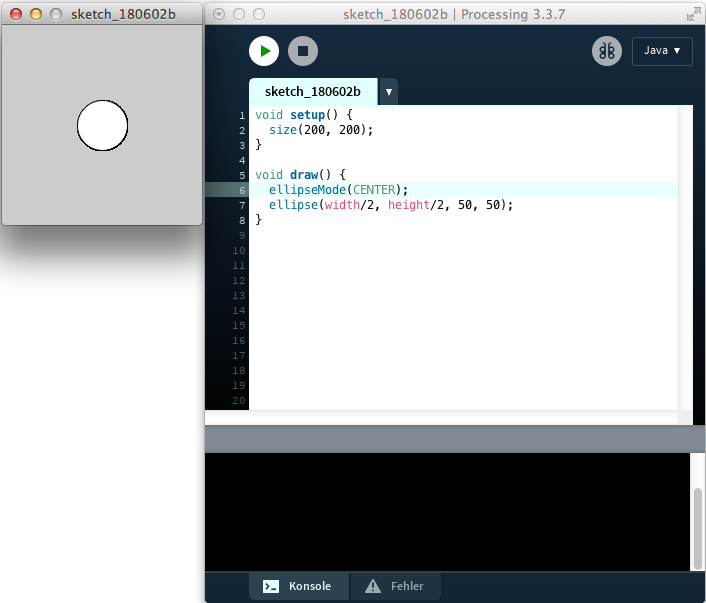

In erster Näherung ist Processing ein stark vereinfachter Dialekt der Programmiersprache Java. Das bedeutet, daß Processing die Java-Syntax nutzt. Processing ist aber auch eine Entwicklungsumgebung mit einer eigenen Philosophie: Programmieren in Prozessing soll ähnlich sein, wie das Skizzieren in einem Skizzenbuch. Die Programmiererin oder der Programmierer soll so schnell wie möglich (am Besten ab der ersten Zeile Code) die Möglichkeit haben, ein visuelles Feedback zu bekommen. Die ursprüngliche Zielgruppe von Processing waren nämlich Designer und Künstler.

Processing wurde ursprüunglich am *Massachusetts Institute of Technology* (MIT) in Boston von Ben Fry (Broad Institute) und Casey Reas (UCLA Design|Media Arts) initiiert und basierte auf dem Experiment *Design by Numbers* von John Maeda, das ebenfalls am MIT entwickelt wurde und Anfängern den Einsteig in die Programmierung erleichtern sollte.

Processing ist für die Einsatzbereiche Graphik, Simulation und Animation spezialisiert, es gibt aber mittlerweile auch Bibliotheken und Erweiterungen für viele andere Bereiche, zum Beispiel für die Ansteuerung externer Hardware. Folgt man den [Links dieser Bibliotheken](https://processing.org/reference/libraries/) entdeckt man schnell viele neue Möglichkeiten, die die Phantasie beflügeln.

Folgerichtig besteht die Processing-IDE daher nur aus wenigen Komponenten. Auf den ersten Blick fällt das Hauptfenster auf, in dem der Programmiercode eingegeben wird und darunter das Ausgabefenster (eine Konsole) für Textausgaben und Fehlermeldungen. Wichtig ist aber, daß Processing bei jeder Ausführung ein graphisches Fenster öffnet, in dem die Graphikausgabe erfolgt.

Die Abbildung zeigt die IDE mit einem kleinen, sofort ausführbaren Processing (Java) Sketch. Links ist das Fenster mit der Graphikausgabe, daneben das Hauptfenster der IDE mit dem eigentlichen Programmtext. Ein Klick auf den Knopf links oben mit dem Pfeil nach rechts startet einen Sketch, ein Klick auf den Knopf danaben mit dem Quadrat stoppt es wieder. Es gibt natürlich -- je nach Betriebssystem leicht unterschiedliche -- Tastatur-Kurz-Befehle dafür: `CTRL-R` (Windows/Linux) oder `CMD-R` (Apple) starten einen Sketch und `ESC` beendet ihn wieder.

Dadurch wird aber auch klar: Processing ist betriebssystemübergreifend und läuft im Prinzip auf allem, das eine Java Virtuelle Masschine (JVM) beherbergen kann, also mindestens unter Windows, Linux und MacOS X.

Processing soll also in erster Linie den Menschen wieder die Freude am Programmieren zurückbringen, die sie früher mit ihrem BASIC-Interpreter hatten

## Was ist Processing.py?

Processing.py eröffent die Möglichkeit, Processing-Sketche in der Programmiersprache Python zu entwickeln. Python ist eine universelle Programmersprache, die nicht nur in der Lehre, sondern auch in vielen Bereichen von Wissenschaft und Forschung sehr populär ist. Python wurde Anfang der 1990er Jahre von Guido van Rossum am *Centrum Wiskunde & Informatica* in Amsterdam als Programmier-Lehrsprache entwickelt und hat den Anspruch, einen gut lesbaren, knappen Programmierstil zu fördern. o werden beispielsweise Blöcke nicht durch geschweifte Klammern, sondern durch Einrückungen strukturiert. Wegen ihrer klaren und übersichtlichen Syntax gilt Python als einfach zu erlernen.Außerdem ist in der Regel die Python-Syntax so klar und verständlich, daß man Python-Programme oft auch scherzhaft als »lauffähigen Pseudocode« bezeichnet.

Processing.py ist der Versuch, die Einfachheit und Klarheit der Programmiersprache Python mit der Einfachheit der rocessing-IDE zu vermählen. Dazu bedient man sich eines kleinen Tricks. Das eigentliche Python ist in der Programmiersprache C geschrieben und daher kein wirklicher Kandidat für das in Java geschriebene Processing. Aber es gibt eine Python-Version die in Java geschrieben wurde, Jython genannt. Jython ist eine reine Java-Implementierung der Programmiersprache Python und ermöglicht somit die Ausführung von Python-Programmen auf jeder Java-Plattform und damit -- im Prinzip -- auch in Processing. Genau das wurde für die Entwicklung von Processing.py genutzt.

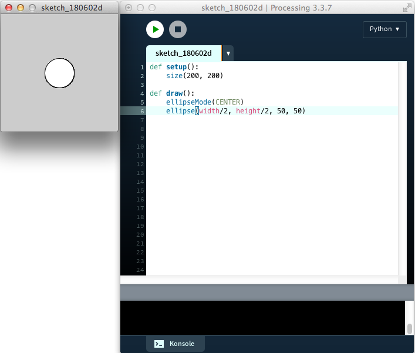

Der Screenshot zeigt das einführende Programm aus dem letzten Abschnitt -- dieses Mal jedoch in der Python-Syntax. Die Ähnlichkeit ist groß, aber auch einige Unterschiede fallen sofort auf:

- Python besitzt im Gegensatz zu Java eine dynamische Typisierung, das sogenannte *Duck Typing*[^1_1], die in Java notwendige Typenvereinbarung entfällt in Python.

[^1_1]: Wenn es quackt wie eine Ente, watschelt wie eine Ente und schwimmt wie eine Ente, dann ist es eine Ente.

- Python verzichtet auf die geschweiften Klammern, um Blöcke zu begrenzen. Blöcke werden ausschließlich durch Einrückungen gekennzeichnet. Diese Einrückungen sind zwingend, andernfalls gibt es eine Fehlermeldung

Ansonsten sind die Processing-eigenen Befehle -- bis auf wenige Ausnahmen (wo sie in Konflikt mit Python eigenen Befehlen geraten) eins zu eins übernommen worden. Das macht die Übertragung von Processing (Java) Sketchen nach Processing.py ziemlich einfach, bei einigen Sprachkosntrukten (zum Beispiel Listen und Objekten existieren dennoch Unterschiede, die aus der unterschiedlichen Philosophe von Java und Python herrühren).

Python hat den Anspruch, komplett mit »Batterien« ausgeliefert zu werden (*batteries included*). Zu Python gehört eine umfangreiche Standard-Bibliothek und alle Befehle aus der Standard-Bibliothek funktionieren auch in Processing.py.

Daneben gibt es noch viele Python-Module und -Bibliotheken, die in »reinem« Python *(pure Python)* geschrieben sind. Wenn in ihnen nicht gerade Seltsames passiert, sollten auch diese in Processing.py laufen. Das heißt, der Entwickler kann auf einen riesigen Fundus von Modulen zurückgreifen.

Umgekehrt funktionieren auch die meisten Processing-(Java)-Bibliotheken mit Processing.py. Das heißt, Python- und Java-Welt wachsen in Processing.py zusammen (das war übrigens auch schon die Motivation für Jython).

Einen Wermutstropfen gibt es allerdings: Jython ist (bis heute) nur »weitestgehend« kompatibel mit Python 2.7, das heißt, alle Neuerungen von Python 3 -- speziell der viel einfachere Umgang mit Umlauten und fremdsprachlichen Schriften (UTF-8 als Default-Codierung)-- stehen in Processing.py nicht zur Verfügung.

Während es in Python 3 einfach genügt

~~~python
print("Jörg")
~~~

in ein Programm zu schreiben und Python druckt freudig meinen Vornamen aus, muß in Processing.py diese Zeichenkette maskiert und damit als UTF-8-String gekennzeichnet werden:

~~~python
print(u"Jörg")
~~~

Dann gibt auch Processing.py den Umlaut in meinem Vornamen korrekt wieder.

Natürlich stehen auch alle in C oder gar FORTRAN geschriebenen Erweiterungen systembedingt in Jython und damit auch in Processing.py nicht zur Verfügung. Das heißt insbesondere, daß die im wissenschaftlichen Bereich so belibeten Python Pakete für numerische Mathematik, Statistik und *Data Science* wie zum Beispiel `numpy`, `scipy` oder `pandas` mit Processing.py nicht zusammenarbeiten. Aber im Regelfalle will man mit Processing.py auch nicht solche schwergewichtigen Aufgaben lösen und wenn doch: Es gibt fast immer Alternativen[^1_2].

[^1_2]: Und wenn man doch keine findet: Karsten Wolfs Fork der [NodeBox 1](http://cognitiones.kantel-chaos-team.de/programmierung/creativecoding/nodebox/nodebox.html) ist zumindestens für Mac-Nutzer dann eine Alternative. Zwar auch nur Python 2.7, aber er hat in einer *extended Version* all diese numerischen Schwergewichte hineinkompiliert, so daß man sie *out of the box* nutzen kann. Und IDE und Syntax der NodeBox sind der von Processing -- und damit auch von Processing.py -- sehr ähnlich.

Processing.py bietet also die Möglichkeit, all die netten Dinge (und noch vieles mehr), die Processing kann, in Python zu programmieren. Das ist zum einen natürlich nett für Menschen, die sowieso schon in Python zu Hause sind, bietet aber auch ein großes Potential für Programmier-Anfänger, die bei ihren ersten Schritten ein schnelles, visuelles Feedback bekommen, dabei aber in einer Programmier- (genauer: Skript-) Sprache programmieren, die es ihnen erlaubt, das Gelernte auch später in anderen Umgebungen einzusetzen.

Und umgekehrt gilt natürlich auch: Wer schon erste Erfahrungen mit Python gemacht hat, findet hier für seine weiteren Fortschritte eine Umgebung, die es ihm erlaubt, in der Sprache seines Vertrauens viel Spaß bei der Programmierung zu haben. Denn dafür wurde Processing und Processing.py in erster Linie konzipiert: Programmieren soll wieder Spaß machen.

Ich hoffe, Sie als Leser haben damit genau so viel Spaß wie ich es bisher hatte und auch weiterhin haben werde.

**Noch eine Warnung**: Dieses Buch ist keine Einführung in Python. Davon gibt es -- im Netz wie auf dem Buchmarkt -- so viele, daß ich mir dies geschenkt habe. Wer des Englischen mächtig ist, dem empfehle ich »[Think Python](http://greenteapress.com/wp/think-python/)« von *Allen B. Downey*[^1_3], das es nicht nur gedruckt im Buchhandel gibt, sondern das auch kostenlos als PDF heruntergeladen werden kann. Es gibt unter dem Titel »Programmieren lernen mit Python« in der Übersetzung von Stefan Fröhlich auch eine deutsche Fassung (Köln 2012), diese allerdings nur im Buchhandel. Das Buch kann ich vor allem deshalb empfehlen, weil es die Grundlage war für alle Python-Kurse, die ich in den letzten Jahren gegeben hatte, ich also eine große Erfahrung mit diesem Lehrbuch habe. Und mit der darin beschriebenen *Turtle Graphic* lernen Sie auch gleich noch eine weitere Möglichkeit kennen, mit Python graphische Ergebnisse auf den Monitor zu zaubern.

[^1_3]:  Der Link führt auf die Version für Python 2.7, es gibt auch eine neuere Auflage für Python 3, aber da Processing.py ja kompatibel zu Python 2.7 ist, schien mir diese Fassung geeigneter.


# Download und Installation


# Start: Rotkäppchen und die drei Tanten

Rotkäppchen hat nicht nur eine Großmutter, sondern -- was weniger bekannt ist -- auch drei Tanten, Agathe, Beatrice und Cynthia. Diese wohnen in drei Häusern, die zusammen ein Dreieck bilden. Wenn Rotkäppchen nicht ihre Großmutter besucht, dann besucht sie eine der drei Tanten. Letzten Sonntag jedoch war sie sehr unschlüssig, welche sie besuchen sollte. Sie startete, um Agathe einen Besuch abzustatten. Jedoch genau auf dem halben Weg zu Agathe wurde sie unsicher und überlegte es sich noch einmal. Sie beschloß, eine ihrer drei Tanten aufzusuchen, es könnte auch wieder Agathe gewesen sein. Doch es war wie verhext: Jedesmal, wenn sie genau den halben Weg zurückgelegt hatte, wurde sie wieder unsicher und entschloß sich neu, einer ihrer drei Tanten aufzusuchen, möglicherweise die gleiche, möglicherweise eine andere. Und das wieder, und wieder, und wieder …

[](https://www.flickr.com/photos/schockwellenreiter/32442344526/)

*William P. Beuamont* [Beaum1996] nannte es das »Tantenspiel«. Ziel ist es nicht, herauszufinden, welche Tante gewinnt (es kann gar keine gewinnen), sondern welche Figur entsteht, wenn man Rotkäppchens Irrweg visualisiert. Ich habe das einmal mit Processing.py nachprogrammiert und herausgekommen ist obige Figur, in der Fachliteratur auch als [Sierpinski Dreieck][3_1] bekannt, benannt nach dem polnischen Mathematiker *Wacław Sierpiński*, der das Fraktal schon 1915 als erster beschrieb.

[3_1]: https://de.wikipedia.org/wiki/Sierpinski-Dreieck


## Der Quellcode

Normalerweise wird dieses Fraktal mit einem rekursiven Algorithmus erzeugt, aber es geht eben auch mithilfe dieses »Chaos-Spiels« [Herrm1994]

~~~python
import random as r

i = 0
x = y = 0

def setup():
    size(640, 480)
    background(0)
    colorMode(HSB, 360, 100, 100)
    frameRate(1200)

def draw():
    global i, x, y
    p = r.randint(0, 2)
    if (p == 0):
        x /= 2
        y = (y + 480)/2
    elif (p == 1):
        x = (x + 320)/2
        y /= 2
    else:
        x = (x + 640)/2
        y = (y + 480)/2
    stroke(i%360, 100, 100)
    point(x, y)
    i += 1
    if (i > 120000):
        print("I did it, Babe!")
        noLoop()
~~~

Die Schleife wird 120.000 mal durchlaufen, bevor sie stoppt. Damit ich nicht ewig auf das Ergebnis warten muß, habe ich die Framerate auf 1.200 FPS gesetzt. Das ist vermutlich etwas übertrieben, in diversen Foren habe ich Vermutung gefunden, daß Processing kaum eine Framerate von 1.000 FPS überschreiten kann. Das habe ich experimentell bestätigt, obiger Sketch lief auf meinem schnellsten Rechner, einem Mac Pro mit 3,5 GHz 6-Core Intel Xeon E5, 2 Minuten und 20 Sekunden. Wären genau 1.000 FPS erreicht worden, hätte er exakt 2 Minuten laufen müssen.

Aber man sieht sehr schön, wie sich das Dreieck zufällig, aber dennoch erkennbar, zusammensetzt. Je nach zufälligem Startwert liegen die ersten drei bis vier Punkte noch außerhalb des Fraktals, danach geht aber alles seinen geordneten Gang. Und an den Farben erkennt man, daß auch die Reihenfolge, in der die einzelnen Punkte des Fraktals von Rotkäppchen angelaufen werden, ebenfalls zufällig sind.


## Literatur

- *[Beaum1996]* William P. Beaumont: *Conquering the Math Bogeyman*, in Clifford A. Pickover (Ed.): *Fractal Horizons -- The Future Use of Fractals*, New York (St. Martin's Press) 1996, Seiten 3 - 15
- *[Herrm1994]* Dietmar Herrmann: *Algorithmen für Chaos und Fraktale*, Bonn (Addison-Wesley) 1994, Seiten 132ff.

# Punkte und Pixel

## Turmite

Turmiten sind quadratische, 1x1 Pixel große, kybernetische Kreaturen mit einer höchst kümmerlichen Andeutung eines Gehirns. Sie können die Farben des Pixels oder der Zelle, auf der sie gerade stehen, erkennen und danach handeln. Ist die Zelle schwarz, färben sie sie rot und bewegen sich um ein Feld nach links. Ist die Farbe rot, färben sie die Zelle schwarz und bewegen sich um ein Feld nach rechts.


Wird solch eine Turmite auf eine schwarze, unendlichen Ebene gesetzt, erzeugt sie zuerst ein chaotisches Muster. Doch nach ungefähr 10.000 Schritten bildet sie auf einmal eine Turmiten-Autobahn, eine regelmäßige Struktur, die immer nach 104 Schritten in denselben Zustand zurückkehrt, nur jeweils um 2 Felder verschoben.

### Die Turmite programmieren

Ich habe eine dieser Turmiten in einem Processing.py-Sketch zum Leben erweckt. Damit sie nicht in der Unendlichkeit der Ebene entfleucht, habe ich die Ecken des Fensters miteinander verklebt und sie so in eine [Torus](https://de.wikipedia.org/wiki/Torus)-Welt verwandelt. Wenn die Turmite am unteren Ende des Fensters verschwindet, taucht sie am oberen Ende wieder auf, verschwindet sie am rechten Rand erscheint sie wieder am linken Rand. Für beide Ränder gilt das natürlich auch umgekehrt, die Welt der Turmite ist also ein fett aufgeblasener Fahrradschlauch, auf dem sie sich entlang bewegt.

Den Farbsensor der Turmite habe ich mit dem Processing-Befehl `get(x, y)` simuliert. Er liest die Farbe des Pixels. Analog dazu gibt es die Funktion `set(x, y, color)`, die die Farbe `color` an die Stelle `x, y` schreibt. Die beiden Farben habe ich im Sketch `on` für schwarz und `off` für rot genannt. Ich bin von der Metapher ausgegangen, daß die Turmite auf der schwarzen Ebene ein Feld entweder einschaltet (also rot färbt) oder es wieder ausschaltet (es wird wieder schwarz).

Als ich damals auf meinem Atari-ST mein erstes Turmitenprogramm schrieb, dauerte es ewig, bis die Turmite mit ihrer Autobahn im Unendlichen verschwunden war (sie das Bildschirmfenster verlassen hatte). An eine Rückkehr via Torus wagte ich nicht zu denken, dafür reichte meine Geduld nicht aus. Nun in Processing.py habe ich die Framerate auf 600 gesetzt und so geht es doch recht schnell voran.

Interessant ist, daß die Turmite, wenn sie auf eine von ihr geschaffene Autobahn trifft, zwar erst einmal wieder ein chaotisches Verhalten an den Tag legt, aber über kurz oder lang wieder eine Autobahn baut. Diese Turmiten-Autobahnen kennen nur zwei Orientierungen, sie verlaufen entweder parallel oder stehen senkrecht aufeinander.

### Quellcode

Nach dem oben Beschriebenen dürfte der Quellcode leicht verständlich sein. In der `setup()`-Funktion wird die Hintergrundfarbe auf schwarz und die Turmite in die Mitte des Fensters mit der Ausrichtung nach Norden gesetzt.

Im ersten Abschnitt der `draw()`-Funktion wird die Turmite gemäß Ihrer aktuellen Orientierung bewegt und die Behandlung der Fensterränder berücksichtigt. Dann wird die Farbe der aktuellen Zelle gelesen (mit `get(x, y)`) und je nach Zustand eine neue Farbe gesetzt und die Orientierung der Turmite den Regeln entsprechend geändert. Das ist alles.

~~~python
south = 0
east  = 1
north = 2
west  = 3

on  = color(188, 0, 0)   # rot
off = color(0)           # schwarz

def setup():
    global x, y, dir
    size(600, 200)
    x = width/2
    y = height/2
    dir = north
    background(0)
    frameRate(600)

def draw():
    global x, y, dir
    if (dir == south):
        y += 1
        if (y == height):
            y = 0
    elif (dir == east):
        x += 1
        if (x == width):
            x = 0
    elif (dir == north):
        if (y == 0):
            y = height - 1
        else:
            y -= 1
    elif (dir == west):
        if (x == 0):
            x = width - 1
        else:
            x -= 1
    
    if (get(x, y) == on):
        set(x, y, off)
        if (dir == south):
            dir = west
        else:
            dir -= 1
    else:
        set(x, y, on)
        if (dir == west):
            dir = south
        else:
            dir += 1
~~~

### Weitere mögliche Experimente

Die Turmiten gehen auf *Greg Turk* zurück, der damals Doktorand an der Universität von North Carolina in Chapel Hill war. Er zeigte, daß sie eine zweidimensionale [Turingmaschine](https://de.wikipedia.org/wiki/Turingmaschine) sind. Später hat sie *Christopher Langton* weiterentwickelt und beschrieben -- daher ist sie auch unter dem Namen »Langtons Ameise« *(Lanton's Ant)* bekannt. Die hier vorgestellte ist die einfachste Form solch einer Ameise. Ein nächster Schritt wäre beispielsweise, die Welt mit zwei Turmiten zu bevölkern, die eine färbt die Ebene rot, wenn sie auf ein schwarzes Feld trifft, die andere färbt sie blau. Natürlich müßten dann beide Ameisen auch Regeln implementiert bekommen, wie sie zu verfahren haben, wenn sie auf ein blaues respektive ein rotes Feld treffen.

Von Turk selber gibt es zum Beispiel eine Turmite mit zwei Zuständen, nennen wir diese `A` und `B` und mit folgendem Regelsatz:

Zustand  | A                   | B
:--------|:--------------------|:--------------
grün     | schwarz, vorwärs, B | grün, rechts, A
schwarz  | grün, links, A      | grün, rechts, A

Sie erzeugt ein Spiralmuster, »immer größer werdende strukturierte Gebiete, die sich in regelmäßiger Anordnung um einen Startpunkt winden«.

Eine weitere Turmite, die mit vier Farben hantiert, braucht nur einen Zustand, um ebenfalls ein interessantes, symmetrisches Muster zu bilden. Hier ihr Regelsatz:

Zustand | A
:-------|:---------
blau    | rot, rechts, A
rot     | gelb, rechts, A
gelb    | grün, links, A
grün    | blau, links, A

Es gibt also noch viel zu entdecken in der Welt der Turmiten und Ameisen.

### Literatur

- A.K. Dewdney: *Turmiten*, in: Immo Diener (Hg.): *Computer-Kurzweil 2, Spektrum Akademischer Verlag: Verständliche Forschung*, Heidelberg 1992, Seiten 156-160
- [Ameise (Turingmaschine)](https://de.wikipedia.org/wiki/Ameise_(Turingmaschine)) in der Wikipedia.

## Barnsleys Farn mit Processing.py

*Michael Barnsley* hatte 1985 auf der SIGGRAPH ein von *John Hutchinson* schon 1981 erfundenes Verfahren vorgestellt, mit dem er ein Bild eines Farnkrauts mit nur vier affinen Abbildungen erzeugen konnte. Dieses Verfahren nannte er »[Iteriertes Funktionssystem](https://de.wikipedia.org/wiki/Iteriertes_Funktionensystem)« (IFS). Es erregte recht goßes Aufsehen, weil man mit diesem Verfahren nicht nur andere Blätter und Bäume, sondern auch viele der klassischen Fraktale nachbilden konnte (wobei die stochastische IFS-Version streng genommen nur eine Abwandlung des Chaos-Spiels zu Anfang dieses Kapitels ist).

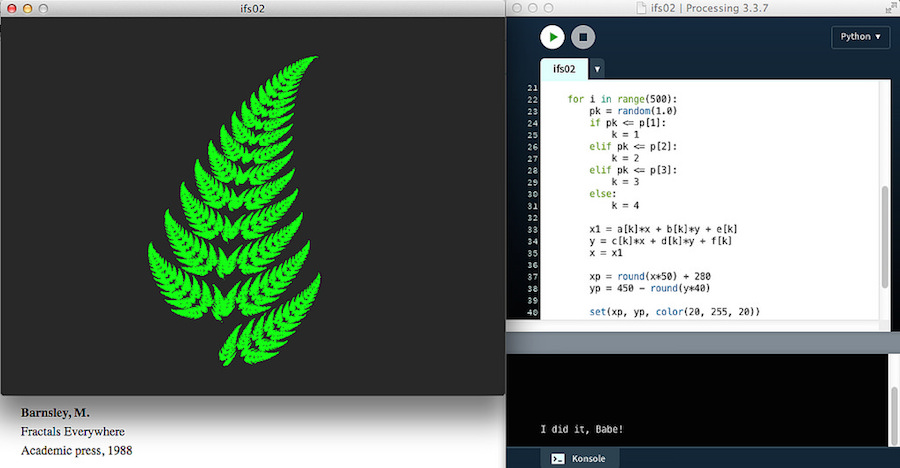

Ich habe aus nostalgischen Gründen diesen stochastischen Algorithmus auch einmal in Processing.py nachimplementiert:

~~~python
# Parameter
a = [0.0, 0.197, -0.155, 0.849]
b = [0.0, -0.226, 0.283, 0.037]
c = [0.0, 0.226, 0.26, -0.037]
d = [0.16, 0.197, 0.237, 0.849]
e = [0.0, 0.0, 0.0, 0.0]
f = [0.0, 1.6, 0.14, 1.6]

# Zufallsverteilung
p = [0.03, 0.14, 0.27, 1.0]
# p = [0.074, 0.08, 0.09, 1.0]
def setup():
    global x, y
    x, y = 0.0, 0.0
    size(640, 480)
    background(40, 40, 40)

def draw():
    global x, y
    
    for i in range(500):
        pk = random(1.0)
        if pk <= p[1]:
            k = 1
        elif pk <= p[2]:
            k = 2
        elif pk <= p[3]:
            k = 3
        else:
            k = 4
    
        x1 = a[k]*x + b[k]*y + e[k]
        y = c[k]*x + d[k]*y + f[k]
        x = x1
    
        xp = round(x*50) + 280
        yp = 450 - round(y*40)
    
        set(xp, yp, color(20, 255, 20))
        
    if frameCount >= 500:
        print("I did it, Babe!")
        noLoop()
~~~

Eine Besonderheit in diesem Sketch ist dabei die Schleife `for in range(500)` in der `draw()`-Funktion. Denn läßt man bei jedem Durchlauf nur einen Punkt zeichnen, dauert es ganz schön lange, bis so etwas wie ein Farnblatt sichtbar wird. Denn man braucht mindestens 75.000 Punkte, um auch nur schwach etwas erkennen zu können. Mithilfe dieser Schleife aber lasse ich bei jedem Durchlauf 500 Punkte berechnen und zeichnen. Das beschleunigt das Verfahren doch enorm, so daß man in endlicher Zeit zu einem vorzeigbanren Ergebnis kommt.

Die Parameter für diesen Farn habe ich dem hier schon mehrfach erwähnten Buch »[Algorithmen für Chaos und Fraktale][a1]« von *Dietmar Herrmann* (S. 177ff.) entnommen, das 1994 bei Addison-Wesley erschienen ist. Dort findet Ihr auch noch weitere Beispiele.


## Wir backen uns ein Mandelbrötchen


Die [Mandelbrot-Menge](https://de.wikipedia.org/wiki/Mandelbrot-Menge) ist die zentrale Ikone der Chaos-Theorie und das Urbild aller Fraktale. Sie ist die Menge aller komplexen Zahlen *c*, für welche die durch


\begin{align}
z_{0} & = 0\\
z_{n+1} & = z_{n}^{2}+c
\end{align}


rekursiv definierte Folge beschränkt ist. Bilder der Mandelbrot-Menge können erzeugt werden, indem für jeden Wert des Parameters *c*, der gemäß obiger Rekursion endlich bleibt, ein Farbwert in der komplexen Ebene zugeordnet wird.

Die komplexe Ebene wird in der Regel so dargestellt, daß in der Horizontalen (in der kartesisschen Ebene die *x-Achse*) der Realteil der komplexen Zahl und in der Vertikalen (in der kartesischen Ebene die *y-Achse*) der imaginäre Teil aufgetragen wird. Jede komplexe Zahl entspricht also einen Punkt in der komplexen Ebene. Die zur Mandelbrotmenge gehörenden Zahlen werden im Allgemeinen schwarz dargestellt, die übrigen Farbwerte werden der Anzahl von Iterationen (`maxiter`) zugeordnet, nach der der gewählte Punkt der Ebene einen Grenzwert (`maxlimit`) verläßt. Der theoretische Grenzwert ist *2.0*, doch können besonders bei Ausschnitten aus der Menge, um andere Farbkombinationen zu erreichen, auch höhere Grenzwerte verwendet werden. Bei Ausschnitten muß auch die Anzahl der Iterationen massiv erhöht werden, um eine hinreichende Genauigkeit der Darstellung zu erreichen.

### Das Programm

Python kennt den Datentyp `complex` und kann mit komplexen Zahlen rechnen. Daher drängt sich die Sprache für Experimente mit komplexen Zahlen geradezu auf. Zuert werden mit `cr` und `ci` Real- und Imaginärteil definiert und dann mit

~~~python
c = complex(cr, ci)
~~~

die komplexe Zahl erzeugt. Für die eigentliche Iteration wird dann -- nachdem der Startwert `z = 0.0` festgelegt wurde -- nur eine Zeile benötigt:

~~~python
z = (z**2) + c
~~~

Wie schon in anderen Beispielen habe ich für die Farbdarstellung den HSB-Raum verwendet und über den *Hue*-Wert iteriert. Das macht alles schön bunt, aber es gibt natürlich viele Möglichkeiten, ansprechendere Farben zu bekommen, beliebt sind zum Beispiel selbsterstellte Paletten mit 256 ausgesuchten Farbwerten, die entweder harmonisch ineinander übergehen oder bestimmte Kontraste betonen.

### Der komplette Quellcode

~~~python
left   = -2.25
right  = 0.75
bottom = -1.5
top    = 1.5
maxlimit = 2.0
maxiter = 20

def setup():
    size(400, 400)
    background("#ffffff")
    colorMode(HSB, 255, 100, 100)
    noLoop()

def draw():
    for x in range(width):
        cr = left + x*(right - left)/width
        for y in range(height):
            ci = bottom + y*(top - bottom)/height
            c = complex(cr, ci)
            z = 0.0
            i = 0
            for i in range(maxiter):
                if abs(z) > maxlimit:
                    break
                z = (z**2) + c
                if i == (maxiter - 1):
                    set(x, y, color(0, 0, 0))
                else:
                    set(x, y, color((i*48)%255, 100, 100))
~~~

Um zu sehen, wie sich die Farben ändern, kann man durchaus mal mit den Werten von `maxlimit` spielen und diesen zum Beispiel auf `3.0` oder `4.0` setzen. Auch die Erhöhung der Anzahl der Iterationen `maxiter` verändert die Farbzuordnung, verlängert aber auch die Rechhenzeit drastisch, so daß man speziell bei Ausschnitten aus der Mandelbrotmenge schon einige Zeit auf das Ergebnis warten muß.

## Pixel-Array versus set()

Will man einzelne Pixel im Ausgabefenster oder in einem Bild manipulieren, bietet Processing(.py) grundsätzlich zwei Möglichkeiten: Zum einen kann man mit

~~~python
set(x, y, color)
~~~

direkt einen Farbpunkt an eine bestimmte Position `x, y` setzen, oder aber man lädt mit

~~~python
loadPixels()
~~~

das gesamte Ausgabe-Fenster in ein eindimensionales Pixel-Array, um dann mit

~~~python
pixels[x + y*width] = color()
~~~

die Farbe an die gewünschte Stelle `x, y` zu setzen. Anschließend darf man nicht vergessen, mit

~~~python
updatePixels()
~~~

Processing dazu zu bewegen, die geänderten Pixel auch anzuzeigen. Dadurch, daß das Pixel-Array eindimensional ist und so die gewünschte Position mit `x + y*width` angesprochen werden muß, ist die erste Version (für die es übrigens auch noch ein entsprechendes `get(x, y)` gibt, mit dem man die Farbe an der gewünschten Stelle abfragen kann) einfacher handzuhaben, aber die [Reference zu Processing](https://processing.org/reference/set_.html) zu bedenken:

>Setting the color of a single pixel with set(x, y) is easy, but not as fast as putting the data directly into pixels[].

Das gilt aber nicht immer, mit dem im [letzten Abschnitt gebackenen Mandelbrötchen](mandelbrot.md) habe ich die Probe aufs Exempel gemacht. Zwei nahezu identische Programme habe ich gegeneinander antreten lassen.

### Programm 1: Mandelbrot-Menge mit set()

~~~python
left   = -2.25
right  = 0.75
bottom = -1.5
top    = 1.5
maxlimit = 4.0
maxiter = 100

def setup():
    size(600, 600)
    background("#ffffff")
    colorMode(HSB, 255, 100, 100)
    noLoop()

def draw():
    for x in range(width):
        cr = left + x*(right - left)/width
        for y in range(height):
            ci = bottom + y*(top - bottom)/height
            c = complex(cr, ci)
            z = complex(0.0, 0.0)
            i = 0
            for i in range(maxiter):
                if abs(z) > maxlimit:
                    break
                z = (z**2) + c
                if i == (maxiter - 1):
                    set(x, y, color(0, 0, 0))
                else:
                    set(x, y, color((i*48)%255, 100, 100))
    println(millis())
~~~

### Programm 2: Mandelbrot-Menge mit Pixel-Array

~~~python
left   = -2.25
right  = 0.75
bottom = -1.5
top    = 1.5
maxlimit = 4.0
maxiter = 100

def setup():
    size(600, 600)
    background("#ffffff")
    colorMode(HSB, 255, 100, 100)
    noLoop()

def draw():
    loadPixels()
    for x in range(width):
        cr = left + x*(right - left)/width
        for y in range(height):
            ci = bottom + y*(top - bottom)/height
            c = complex(cr, ci)
            z = complex(0.0, 0.0)
            i = 0
            for i in range(maxiter):
                if abs(z) > maxlimit:
                    break
                z = (z**2) + c
                if i == (maxiter - 1):
                    pixels[x + y*width] = color(0, 0, 0)
                else:
                    pixels[x + y*width] = color((i*48)%255, 100, 100)
    updatePixels()
    println(millis())
~~~

Und -- Überraschung! -- das Programm mit `set()` war fast immer geringfügig schneller als das Programm mit den Pixel-Arrays. Auf meinem betagten MacBook Pro benötigte das erste Programm rund 15.000 bis 16.000 Millisekunden, während das zweite Programm um die 18.000 Millisekunden benötigte. Der Unterschied ist nicht groß, aber dennoch bemerkenswert. Es liegt zum einen sicher daran, daß die benötigte Zeit für die Berechnung des Apfelmännchens im Vergleich zu der benötigten Zeit, dieses zu zeichnen, riesig ist. Zum anderen wird die `draw()`-Schleife ja auch nur einmal durchlaufen und so kann das Pixel-Array seine Fähigkeit der schnellen Pixelmanipulation nicht richtig ausspielen.

Die Erkenntnis daraus: Es kann sich durchaus lohnen, auch mal das Handbuch zu hinterfragen. 😈

## Julia-Menge


Die [Julia-Menge](https://de.wikipedia.org/wiki/Julia-Menge) wurde 1918 von den beiden französischen Mathematikern *Gaston Maurice Julia* (nachdem sie benannt wurde) und *Pierre Fatou* (dessen Zugang heute die meisten Lehrbücher folgen) unabhängig voneinander beschrieben. Sie steht im engen Zusammenhang zur im letzten Abschnitt beschriebenen [Mandelbrot-Menge](mandelbrot.md). Während die Mandelbrot-Menge, die Menge aller komplexen Zahlen *c* ist, die der iterierten Gleichung


\begin{align}
z_{0} & = 0\\
z_{n+1} & = z_{n}^{2}+c
\end{align}

folgen, ist bei der Julia-Menge *c* konstant:


\begin{align}
z_{n}^{2}+c
\end{align}


Die Mandelbrot-Menge ist also eine Beschreibungsmenge aller Julia-Mengen. Jedem Punkt *c* der komplexen Zahlenebene entspricht eine Julia-Menge. Eigenschaften der Julia-Menge lassen sich an der Lage von *c* relativ zur Mandelbrot-Menge beurteilen: Wenn der Punkt *c* Element der Mandelbrot-Menge ist, dann ist die Julia-Menge zusammenhängend. Andernfalls ist sie eine Cantormenge unzusammenhängender Punkte. Ist der Imaginärteil *c<sub>i</sub> = 0*, dann ist die Julia-Menge symmetrisch (vlg. Abbildung links oben), ansonsten kann sie alle möglichen Formen annehmen.

### Julia-Menge interaktiv

Ich habe die obigen Bilder mit diesem Programm erzeugt, daß den Parameter *c* in Abhängigkeit von der Mausposition setzt:

~~~python
left   = -2.0
right  = 2.0
bottom = 2.0
top    = -2.0
maxlimit = 3.0
maxiter = 25

def setup():
    size(400, 400)
    background("#555ddd")
    colorMode(HSB, 1)

def draw():
    cr = map(mouseX, 0, width, left, right)
    ci = 0
    # ci = map(mouseY, 0, height, top, bottom)
    c = complex(cr, ci)
    for x in range(width):
        zr = left + x*(right - left)/width
        for y in range(height):
            zi = bottom + y*(top - bottom)/height
            z = complex(zr, zi)
            i = 0
            for i in range(maxiter):
                if abs(z) > maxlimit:
                    break
                z = (z**2) + c
                if i == (maxiter-1):
                    set(x, y, color(0))
                else:
                    set(x, y, color(sqrt(float(i)/maxiter), 100, 100))
    println("cr = " + str(cr))
    println("ci = " + str(ci))
~~~

Kommentiert man die Zeile `ci = 0` aus und aktiviert stattdessen die auskommentierte Zeile darunter, erhält man (theoretisch) alle Julia-Mengen, sonst erzeugt das Programm nur die symmetrischen. Richtig flüssig ist die Animation allerdings nicht, Processing.py gerät -- zumindest auf meinem betagten MacBook Pro -- schon ganz schön ins Stottern.

### Julia-Menge animiert

Das gilt auch für das zweite Programm, das die Parameter der Julia-Menge anhand zweier Sinus- (wahlweise auch Cosinus-) Funktionen periodisch durchläuft:

~~~python
left   = -2.0
right  = 2.0
bottom = 2.0
top    = -2.0
maxlimit = 3.0
maxiter = 25

def setup():
    size(400, 400)
    background("#555ddd")
    colorMode(HSB, 1)

def draw():
    # cr = 0
    cr = 2*sin(frameCount)
    ci = 0
    # ci = 2*cos(frameCount)
    c = complex(cr, ci)
    for x in range(width):
        zr = left + x*(right - left)/width
        for y in range(height):
            zi = bottom + y*(top - bottom)/height
            z = complex(zr, zi)
            i = 0
            for i in range(maxiter):
                if abs(z) > maxlimit:
                    break
                z = (z**2) + c
                if i == (maxiter-1):
                    set(x, y, color(0))
                else:
                    set(x, y, color(sqrt(float(i)/maxiter), 100, 100))
    println("cr = " + str(cr))
    println("ci = " + str(ci))
~~~

Auch hier kommt das Programm ganz schön ins Schwitzen. Das läßt allerdings dem Betrachter Zeit, die Schönheit der Julia-Menge zu bewundern. 

## Schnelle Bildmanipulation: Das Pixel-Array

In den letzten beiden Abschnitt habe ich gezeigt, daß Processing.py zwar relativ schnell ist, aber 120.000 Operationen in einem Bildfenster doch eine gewisse Zeit benötigen. Falls man jedoch auf die Animation verzichten kann (und damit auf `point()` oder `get()` und `set()`), geht es auch wesentlich schneller: Jedes Bild in Processing(.py) -- und das schließt das Graphikfenster ein -- wird intern als eine eindimensionale Liste der Farbwerte gespeichert. Die erste Position der Liste ist das erste Pixel links oben, die letzte Position folgerichtig das letzte Pixel rechts unten.

Ein `pixels[]`-Array in Processing speichert in dieser Form die Farbwerte für jedes Pixels des Ausgabefensters. Um es zu initialisieren, muß vor der ersten Nutzung die Funktion `loadPixels()` aufgerufen werden. Manipulationen im Pixel-Array werden erst sichtbar, wenn die Funktion `updatePixels()` aufgerufen wird. `loadPixels()` und `updatePixels()` bilden so ein ähnliches Geschwisterpaar von Funktionen, wie zum Beispiel `beginShape()` und `endShape()`. Doch einen Unterschied gibt es: Wird das Pixel-Array nur zum Lesen der Farbwerte genutzt, muß `updatePixels()` natürlich nicht aufgerufen werden. Da die Manipulationen eines Pixel-Arrays nur im Hauptspeicher des Rechners stattfinden, sind sie natürlich viel schneller als jede andere Processing-Funktion, die Bildinformationen manipuliert.

Da das Pixel-Array ein eindimensionales Array ist, muß auf die Zeilen und Spalten mit einem kleinen Trick zugegriffen werden. Jeder Punkt `(x, y)` steht im Pixelarray an der Position `x + (y*width)`. An die Farbwerte eines Pixels kommt man mit dem Aufruf

~~~python
i = x + (y*width)
color(c) = pixels[i]
~~~

Die einzelnen Farbwerte im RGB-Raum kann man danach so auslesen:

~~~python
r = red(c)
g = green(c)
b = blue(c)
~~~

Das Setzen eines Pixels erfolgt genau umgekehrt:

~~~python
pixel[i] = color(r, g, b)
~~~

Natürlich kann man auch jeden anderen Farbraum (Graustufen, HSV), den Processing kennt, nutzen.


### Fantastic Feather Fractal

Um zu zeigen, wie schnell die Manipulationen eines Pixel-Arrays sind, möchte ich wieder eine Iteration über 120.000 Schritte durchführen. Als Demonstrationsobjekt habe ich das *Fantastic Feather Fractal* gewählt, das *Clifford A. Pickover* in seinem Buch »Mazes for the Mind« vorgestellt hat. Wenn Ihr untenstehenden Quellcode laufen laßt, werdet Ihr feststellen, daß das fertige Fraktal fast unmittelbar nach dem Aufruf im Graphikfenster erscheint.[^4_1]

[^4_1]: Ich habe das Bild testweise auch mal erst nach 240.000 Schritten herausschreiben lassen. Die Verzögerung war kaum merkbar. Allerdings gab es auch nur noch einen geringen Unterschied zu dem Bild im Screenshot. Hier setzt die Auflösung des Ausgabefensters weiterem Erkenntnisgewinn Grenzen.

[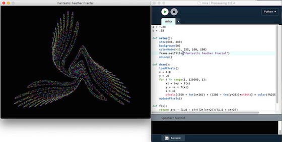](https://www.flickr.com/photos/schockwellenreiter/32766476595/)

Das *Feather Fractal* ist ein »[seltsamer Attraktor](https://de.wikipedia.org/wiki/Seltsamer_Attraktor)«, ein [Attraktor](http://www.spektrum.de/lexikon/physik/attraktor/926) eines dynamischen Systems, das sich zwar chaotisch verhält, aber dennoch eine *kompakte Menge* ist, die es nie verläßt. Die Parameter des Sketches entstammen der oben genannten Quelle von *Pickover*, die Faktoren um das Ergebnis dem Bildfenster anzupassen habe ich durch wildes Herumexperimentieren gefunden[^4_2].

[^4_2]: Und das schon vor langer Zeit, als der Monitor meines Rechners noch eine Auflösung von 640 x 480 Pixeln hatte. 😜

### Der Quellcode

~~~python
a = -.48
b = .93

def setup():
    size(640, 480)
    background(0)
    colorMode(HSB, 255, 100, 100)
    frame.setTitle("Fantastic Feather Fractal")
    noLoop()

def draw():
    loadPixels()
    x = 4.0
    y = .0
    for i in range(1, 120000, 1):
        x1 = b*y + f(x)
        y = -x + f(x1)
        x = x1
        pixels[(350 + int(x*26)) + ((280 - int(y*26))*width)] = color(i%255, 100, 100)
    updatePixels()

def f(x):
    return a*x - (1.0 - a)*((2*(x**2))/(1.0 + x**2))
~~~

Wenn ich später noch auf Bildmanipulationen in Processing zurückkomme, werden die Pixel-Arrays noch einmal ausführlich behandelt werden.

### Literatur

- Clifford A. Pickover: *Mazes for the Mind. Computer s and the Unexpected*, New York (St. Martin's Press) 1992. Das Buch gehört zu den Besten des umtriebigen Autors und da es aufgrund seines Alters antiquarisch für ein paar Cent zu bekommen ist, solltet Ihr zuschlagen. Das Feder-Fraktal ist auf den Seiten 33f. beschrieben, die über 400 anderen Seiten erfüllen fast jeden Traum eines an Computer-Experimenten interessierten Menschen.
- Florian Freistetter: *[Best of Chaos: Der seltsame Attraktor](http://scienceblogs.de/astrodicticum-simplex/2015/02/04/best-of-chaos-der-seltsame-attraktor/)*, Science Blogs (Astrodicticum Simplex) vom 4. Februar 2015 (Ich bin ein Fan von *Florian Freistetter*, er ist einer der wenigen guten deutschsprachigen Erklärbären für Naturwissenschaften)

# Linien

## Anschauliche Mathematik: Die Schmetterlingskurve

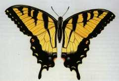

Seit ich Ende der 1980er Jahre mit meinem damals hochmodernen [Atari Mega&nbsp;ST](https://de.wikipedia.org/wiki/Atari_ST) erste Schritte mit einem graphikfähigen Personalcomputer unternommen hatte, habe ich die Schmetterlingskurve immer wieder als Test für die Graphikfähigkeit und Schnelligkeit von Programmiersprachen und Rechnern benutzt. Sie wird in [Polarkoordinaten](https://de.wikipedia.org/wiki/Polarkoordinaten) beschrieben und ihre Formel ist

\begin{align}
\rho=e^{\cos(\theta)}-2\cdot \cos(4\cdot \theta)+\sin(\tfrac{\theta}{12})^5
\end{align}


oder in Python-Code:

~~~python
r = exp(cos(theta)) - 2*cos(4*theta) + (sin(theta/12))**5
~~~

Die Gleichung ist hinreichend kompliziert um selbst in C geschriebene Routinen auf meinen damals unglaubliche 8 MegaBit schnellen Atari alt aussehen zu lassen. Rechenzeiten von 10 - 20 Minuten waren keine Seltenheit. Heute dagegen muß man den Rechner schon künstlich verlangsamen, damit man sieht, wie sich die Kurve aufbaut. Denn sonst erscheint sofort die fertige Kurve, um die sinnliche Erfahrung, wie diese entsteht, wird man betrogen. Daher habe ich sie in *Processing.py* innerhalb der `draw()`-Schleife zeichnen lassen, wobei die Schleifenvariable `theta` bei jedem Durchlauf um `0.02` erhöht wurde.

Der Code ist -- dank Processing.py -- wieder von erfrischender Einfachheit und Kürze:

~~~python
def setup():
    global theta, xOld, yOld
    theta = xOld = yOld = 0.0
    size(600, 600)
    background(100, 100, 100)
    colorMode(HSB, 100)
    
def draw():
    global theta, xOld, yOld
    strokeWeight(2)
    stroke(theta, 100 - theta, 100)
    r = exp(cos(theta)) - 2*cos(4*theta) + (sin(theta/12))**5
    # aus Polarkoordinaten konvertieren
    x = r*cos(theta)
    y = r*sin(theta)
    # auf Fenstergröße skalieren
    xx = (x*60) + 300
    yy = (y*60) + 300
    if (theta == 0.0):
        point(xx, yy)
    else:
        line(xOld, yOld, xx, yy)
    xOld = xx
    yOld = yy
    theta += 0.02
    if (theta > 75.39):
        print("I did it, Babe!")
        noLoop()
~~~

In `setup()` ist eigentlich nur bemerkenswert, daß ich nach der Festlegung des grauen Hintergrunds (noch als RGB), den `colorMode` auf HSB geändert habe. Damit lassen sich nämlich recht einfach diverse Farbeffekte erzielen. Ich habe dabei den *Hue*-Wert in Abhängigkeit von `theta` gesetzt, die Sättigung auf `100 - theta` und die *Brightness* konstant bei 100 belassen. Da `theta` nie größer als $75,39$ wird, wird es also auch nie größer als 100 und damit sind diese Umrechnungen gefahrlos.

Damit erreicht man, daß zu Beginn, wo die Sättigung noch ziemlich voll ist, die Zeichnung mit einem satten rot beginnt, während im Laufe der Iteration die weiteren Farben immer blasser werden. Ich fand dies das ästhetisch anspruchvollste Ergebnis, aber um das selber nachvollziehen zu können, solltet Ihr ruhig damit experimentieren, zum Beispiel mit `stroke(theta, 100, 100)` oder `stroke(100-theta, theta, 100)` oder was immer Ihr wollt.

Ihr bekommt so diesen wunderschönen Schmetterling auf den Monitor gezeichnet:

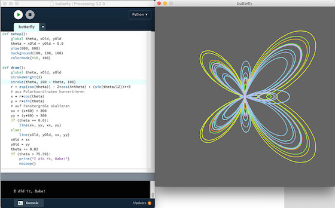

Um die Entstehung der Kurve zu verstehen, empfiehlt *Stan Wagon*[^wagon93], nacheinander folgende Formlen plotten zu lassen:

[^wagon93]: Stan Wagon: *Mathematica® in Aktion*, Heidelberg (Spektrum Akademischer Verlag) 1993

In Polarkoordinaten:

~~~python
r = exp(cos(theta))  # ergibt eine Art Kreis
r = -2*cos(4*theta)  # ergibt eine Art Blume
r = exp(cos(theta)) - 2*cos(4*theta)  # ergibt einen sehr einfachen Schmetterling
~~~

Dann in kartesischen Koordinaten:

~~~python
x = -2*cos(4*theta)
y = -sin(theta/12)**5
~~~

Und dann ruhig auch noch einmal (wieder in Polarkoordinaten):

~~~python
r = exp(cos(theta)) - 2*cos(4*theta) - (sin(theta/12))**5
~~~

Ihr seht dann, daß es eigentlich unerheblich ist, ob Ihr den Störungsgteil der Formel addiert oder subtrahiert: Der Schmetterling ist nahezu identisch, lediglich an der anderen Farbgebung erkennt Ihr, daß es zwei verschiedene Formeln sind.

Die Schmetterlingskurve und ähnliche Kurven wurden von *Temple Fay*[^fay89] an der Universität von Southern Mississpi entwickelt. Sie eignen sich vorzüglich zum Experimentieren. So weist Pickover[^pick92] darauf hin, daß die Kurve

[^fay89]: Temple Fay: *The Butterfly Curve*, American Math. Monthly, 96(5); 442-443
[^pick92]: Clifford A. Pickover: *Mit den Augen des Computers. Phantastische Welten aus dem Geist der Maschine*, München (Markt&Technik) 1992, S. 41ff.

~~~python
r = exp(cos(theta)) - 2.1*cos(6*theta) + sin(theta/30)**7
~~~

eine bedeutend größere Wiederholungsperiode besitzt. Ihr solltet Euch auch das ruhig einmal ansehen. Interessante Vergleiche mit der Originalschmetterlingskurve können Ihr auch ziehen, wenn Ihr mit

~~~python
r = exp(cos(2*theta)) - 1.5*cos(4*theta)
~~~

eine ganz simple Form des Schmetterlings zeichnen lasst. Denn die heutigen Rechner sind schließlich hinreichend schnell, daß Ihr nicht mehr minuten- oder gar stundenlang auf ein Ergebnis warten müßt und zum anderen lädt die Möglichkeit des schnellen Skizzierens mit der Processing-IDE geradezu zu eigenen Experimenten ein.


## Der Lorenz-Attraktor, eine Ikone der Chaos-Theorie

Nachdem ich im letzten Abschnitt die Schmetterlingskurve mit Processing.py gezeichnet hatte, wollte ich nun darauf aufbauen und eine Ikone der Chaos-Forschung, den [Lorenz-Attraktor](https://de.wikipedia.org/wiki/Lorenz-Attraktor) damit zeichnen. Ich hatte das ja auch schon einmal [mit R getan](http://blog.schockwellenreiter.de/essays/lorenzr.html) -- dort findet Ihr auch weitere Hintergrundinformationen zu diesem Attraktor --, aber mit R wurde nur das fertige Ergebnis visualisiert. Hier kommt es mir aber wieder darauf an, die Entstehung der Kurve verfolgen zu können und dafür ist, wie schon bei der Schmetterlingskurve, Processing gut geeignet:

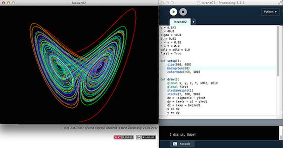

Als einer der ersten hatte  1961 [Edward N. Lorenz](http://de.wikipedia.org/wiki/Edward%20N.%20Lorenz), ein Meteorologe am [Massachusetts Institute of Technology](http://de.wikipedia.org/wiki/Massachusetts%20Institute%20of%20Technology) (MIT), erkannt, daß Iteration Chaos erzeugt. Er benutzte dort einen Computer, um ein einfaches nichtlineares Gleichungssystem zu lösen, das ein simples Modell der Luftströmungen in der Erdatmosphäre simulieren sollte. Dazu benutzte er ein System von sieben Differentialgleichungen, das [Barry Saltzman](http://www.yale.edu/opa/arc-ybc/v29.n18/story18.html) im gleichen Jahr aus den [Navier-Stokes-Gleichungen](http://de.wikipedia.org/wiki/Navier-Stokes-Gleichungen) [^5_4] hergeleitet hatte. Für dieses System existierte keine analytische Lösung, also mußte es numerisch (d.h. wie damals und auch heute noch vielfach üblich in FORTRAN) gelöst werden. Lorenz hatte entdeckt, daß bei nichtperiodischen Lösungen der Gleichungen vier der sieben Variablen gegen Null strebten. Daher konnte er das System auf drei Gleichungen reduzieren:

[^5_4]: Eine sehr schöne Einführung in [das ungelöste Problem der Navier-Stokes-Gleichungen](http://scienceblogs.de/astrodicticum-simplex/2017/01/20/sternengeschichten-folge-217-das-ungeloeste-problem-der-navier-stokes-gleichungen/) gibt es von *Florian Freistetter* in der 217. Folge seiner *Sternengeschichten*


\begin{align}
\frac{dx}{dt} & = -\sigma (y - z) \\
\frac{dy}{dt} & = (\rho - z)x - y \\
\frac{dz}{dt} & = xy - \gamma z
\end{align}


Dabei sind $\sigma = -10$, $\rho = 40$ und $\gamma = - \frac{8}{3}$. Die Parameter der Gleichung habe ich *[Herm1994]* entnommen, *[Stew1993]* gibt $\rho = 28$ an, aber der Wert ändert nichts an dem Verhalten der Kurve und $\rho = 40$ füllt das Fenster einfach besser aus. 😜

Processing.py besitzt im Gegensatz zu R oder [NumPy](http://cognitiones.kantel-chaos-team.de/programmierung/python/numpy.html) kein Modul zur numerischen Lösung von Differentialgleichungen und so habe ich das einfache [Eulersche Poligonzugverfahren](https://de.wikipedia.org/wiki/Explizites_Euler-Verfahren) zur numerischen Berechnung benutzt

~~~python
    dx = -sigma*(x - y)*dt
    dy = (x*(r - z) - y)*dt
    dz = (x*y - b*z)*dt
    x += dx
    y += dy
    z += dz
~~~

und dabei konstant `dt = 0.01` gesetzt. Das benötigt natürlich mehr Rechenkapazität, als sie Lorenz je zur Verfügung standen, aber trotz der größeren Genauigkeit ändert sich nichts am chaotischen Verhalten der Kurve. Für die Farbberechnugn habe ich dieses mal nur den Farbwert (*Hue*) bei jeder Iteration geändert, Sättigung (*Saturation*) und Helligkeit (*Brightness*) bleiben konstant auf dem höchsten Wert. Das ergibt kräftige Farben, die von Rot über Orange nach Gelb und dann nach Grün, Blau und Violett wandern. So kann man schön erkennen, daß die beiden »Flügel« des Attraktors immer wieder, aber für uns unvorhersehbar, durchlaufen werden.

### Der Quellcode

Hier nun der vollständige Quellcode des Skripts. Er ist kurz und selbsterklärend und folgt weitestgehend dem Pascal-Programm aus *[Herm1994]*, Seiten 80ff.

~~~python
b = 8.0/3
r = 40.0
sigma = 10.0
dt = 0.01
x = y = 0.01
z = t = 0.0
xOld = zOld = 0.0
first = True

def setup():
    size(640, 480)
    background(0)
    colorMode(HSB, 100)

def draw():
    global x, y, z, t, xOld, zOld
    global first
    strokeWeight(1)
    stroke(t, 100, 100)
    dx = -sigma*(x - y)*dt
    dy = (x*(r - z) - y)*dt
    dz = (x*y - b*z)*dt
    x += dx
    y += dy
    z += dz
    # auf Fenstergröße skalieren
    xx = (x*8) + 320
    zz = 470 - (z*5.5)
    if first:
        point(xx, zz)
    else:
       line(xOld, zOld, xx, zz)
    xOld = xx
    zOld = zz
    first = False 
    t = t + dt
    if ( t >= 75.0):
       print("I did it, Babe!")
       noLoop()
~~~

### Links

  * Der *[Lorenz Attractor](http://mathworld.wolfram.com/LorenzAttractor.html)* auf Wolfram MathWorld

### Literatur

  * *[Herm1994]* Dieter Hermann: *Algorithmen für Chaos und Fraktale*, Bonn (Addison-Wesley) 1994, S. 80ff.
  * *[Pief1991]* Frank Piefke: *Simulationen mit dem Personalcomputer*, Heidelberg (Hüthig) 1991
  * *[Stew1993]* Ian Stewart: *Spielt Gott Roulette?*, Frankfurt (Insel TB) 1993

# Shapes

## For Your Eyes Only – Processing.py zieht Kreise

Nachdem ich in den vorherigen Tutorials zu Processing.py, dem Python-Mode von Processing, schon mit Punkten und Linien hantiert habe, wird es nun Zeit, etwas mit Kreisen und Ellipsen anzustellen (sie werden in Processing mit dem gleichen Befehl erzeugt).

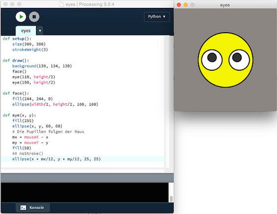

Ein einfacher Kreis ist schnell erzeugt. Mit diesem kleinen *Sketch* malt Ihr einen grellroten Kreis auf schwarzem Grund:

~~~python
def setup():
    size(500, 500)

def draw():
    background(0)
    fill(255, 0, 0)
    ellipse(width/2, height/2, 450, 450)
~~~

Die Funktion `ellipse()` besitzt vier Parameter, die ersten beiden sind die x- und y-Koordinaten, die per Default die Mitte des Kreises oder der Ellipse bezeichnen, die beiden anderen sind der Durchmesser des Kreises oder der Ellipse (auch wenn sie in der Literatur oft mit `r` bezeichnet werden, nicht der Radius). Bei einem Kreis müssen die letzten beiden Parameter immer den gleichen Wert besitzen. Wenn Ihr aber zum Beispiel die Funktion mit

~~~python
    ellipse(width/2, height/2, 350, 450)
~~~

oder

~~~python
    ellipse(width/2, height/2, 450, 350)
~~~

aufruft, dann seht Ihr, wie aus den Kreisen Ellipsen werden.

Nun steht Processing aber für Interaktivität. Daher möchte ich aus fünf Kreisen ein Gesicht zaubern, dessen Pupillen dem Mauszeiger folgen. Auch dieser *Sketch* ist hübsch kurz geraten:

~~~python
def setup():
    size(300, 300)
    strokeWeight(3)

def draw():
    background(139, 134, 130)
    face()
    eye(110, height/2)
    eye(190, height/2)

def face():
    fill(244, 244, 0)
    ellipse(width/2, height/2, 160, 160)

def eye(x, y):
    fill(255)
    ellipse(x, y, 60, 60)
    # Die Pupillen folgen der Maus
    mx = mouseX - x
    my = mouseY - y
    fill(50)
    ellipse(x + mx/12, y + my/12, 25, 25)
~~~

Es wäre nicht wirklich notwendig gewesen, aber der Modularität willen habe ich das Zeichnen des Gesichtes in die Funktion `face()` und das Zeichnen der Augen in die Funtion `eye()` ausgelagert. Mit den Werten in dem `ellipse()`-Aufruf bei den Augen habe ich solange experimentiert, bis sie meinen Vorstellungen entsprachen. Nun sieht aber alles aus wie in dem obigen Screenshot.

### Credits

Die Idee zu den Augen habe ich einem [(Java-) Processing-Tutorial](https://lernprocessing.wordpress.com/2010/01/10/funktionen/) von *Thomas Koberger* entnommen, das ich variiert und nach Processing.py übertragen habe. Auf [seinen Seiten](https://lernprocessing.wordpress.com/2010/01/18/processing-links/) findet man übrigens noch viele weitere, interessante und lehrreiche Tutorials, so daß ich Euch einen Besuch dort empfehle.

Für die Farben habe ich mal wieder wild nach einer [Seite mit Farbpaletten](http://www.farb-tabelle.de/de/farbtabelle.htm) gegoogelt und fand die gefundene dann zwar nicht unbedingt schön, aber ungemein praktisch.

## Spaß mit Kreisen: Konfetti

Der folgende kleine Sketch ist nicht mehr als eine Fingerübung. Er soll Euch zeigen, wie man schon mit wenigen Zeilen Code und Processings-Zufallsfunktion `random()` viele bunte Konfetti-Schnipsel auf den Bildschirm zaubern kann:


Und hier der Quellcode des Sketches in Processing.py:

~~~python
def setup():
    size(400, 400)
    frame.setTitle("Konfetti!")
    background(0)

def draw():
    x = random(width)
    y = random(height)
    dia = random(5, 25)
    r = random(255)
    g = random(255)
    b = random(255)
    fill(r, g, b)
    ellipse(x, y, dia, dia)
~~~

Für so wenige Programmzeilen ist das Ergebnis doch recht ansprechend, oder?

## Syntaktischer Zucker: »with« in Processing.py

Wenn man in Processing.py irgendetwas zum Beispiel zwischen `beginShape()` und `endShape()` klammert, fühlt sich das nicht sehr »pythonisch« an. Ich denke dann die ganze Zeit: Das gehört doch eingerückt! In Processings Java-Mode kann man das auch machen, weil man in Java Leerzeichen einsetzen kann, wie man will -- sie haben dort keine Bedeutung. Doch Python reagiert ja sehr sensibel auf Einrückungen, da hier Leerzeichen Teil der Syntax sind. Aber die Macher von Processing.py haben dies bedacht und uns einen Ausweg aus diesem Dilemma geboten: Das `with`-Statement.


In seiner einfachsten Form sieht das so aus. Statt zum Beispiel

~~~python
def setup():
    size(400, 400)
    background(255)

def draw():
    fill(color(255,  153,  0))
    strokeWeight(1)
    ellipse(100, 100, 50, 50)
    fill(color(255,  51,  51))
    strokeWeight(5)
    ellipse(200, 200, 50, 50)
    fill(color(255,  153,  0))
    strokeWeight(1)
    ellipse(300, 300, 50, 50)
~~~

zu schreiben, schreibt man einfach:

~~~python
def setup():
    size(400, 400)
    background(255)
    

def draw():
    fill(color(255,  153,  0))
    ellipse(100, 100, 50, 50)
    
    with pushStyle():
        fill(color(255,  51,  51))
        strokeWeight(5)
        ellipse(200, 200, 50, 50)
    ellipse(300, 300, 50, 50)
~~~

Die Ausgabe ist in beiden Fällen identisch, aber der zweite Sketch ist in meinen Augen bedeutend eleganter und fühlt sich viel pythonischer an. Außerdem erspart man sich viel Tipparbeit. 😜

Da ich die Verwendung des `with`-Statements auch erst durch eines der mitgelieferten Beispielprogramme herausbekommen habe, hier eine (hoffentlich) komplette Liste der Möglichkeiten:

~~~python
    with pushMatrix():          pushMatrix()
        translate(10, 10)       translate(10, 10)
        rotate(PI/3)            rotate(PI/3)
        rect(0, 0, 10, 10)      rect(0, 0, 10, 10)
    rect(0, 0, 10, 10)          popMatrix()
                                rect(0, 0, 10, 10)

with beginContour():             beginContour()
    doSomething()                doSomething()
                                 endContour()


with beginCamera():              beginCamera()
    doSomething()                doSomething()
                                 endCamera()

with beginPGL():                 beginPGL()
    doSomething()                doSomething()
                                 endPGL()

with beginShape():               beginShape()
    vertex(x, y)                 vertex(x, y)
    vertex(j, k)                 vertex(j,k)
                                 endShape()
    
    
with beginShape(TRIANGLES):      beginShape(TRIANGLES)
    vertex(x, y)                 vertex(x, y)
    vertex(j, k)                 vertex(x, y)
                                 endShape()

with beginClosedShape():         beginShape()
    vertex(x, y)                 vertex(x, y)
    vertex(j, k)                 vertex(j, k)
                                 endShape(CLOSED)
~~~

Links steht die Schreibweise mit dem `with()-Statement`, rechts die traditionelle Form. Abgesehen davon, daß die `with`-Schreibweise immer mindestens eine Zeile kürzer ist, sorgt sie durch die Einrückungen auch für eine bessere Übersicht und eine bessere Lesbarkeit.


## Spaß mit Kreisen (2) in Processing.py: Cantor-Käse und mehr


Wie im letzten Beitrag gezeigt, ist es in Processing (und damit auch in Processing.py, dem Python-Mode für Processing) recht einfach, einfache Kreise oder Ellipsen zu zeichnen. Aber das ist auf die Dauer natürlich ein wenig langweilig, daher wende ich mich nun einer rekursiven Figur zu, die zwar ebenfalls nur aus Kreisen besteht, aber dennoch einige interessante Eigenschaften aufweist, dem **Cantor-Käse**, einer Figur, die der [Cantor-Menge](https://de.wikipedia.org/wiki/Cantor-Menge) topologisch ähnlich ist. Sie wird konstruiert, in dem aus einem Kreis bis auf zwei kleinere Kreise alles entfernt wird. Aus diesen zwei kleineren Kreisen wird wiederum bis auf zwei kleinere Kreise alles entfernt. Nun hat man schon vier Kreise, aus denen man jeweils bis auf zwei kleinere Kreise alles entfernt. Und so weiter und so fort …

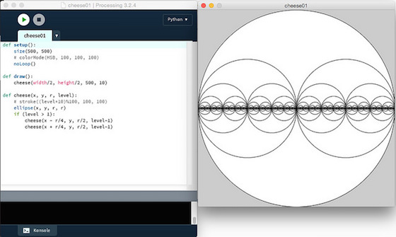

Das schreit natürlich nach einer rekursiven Funktion und die ist in Python (genauer: in Processings Python-Mode) recht schnell erstellt:

~~~python
def setup():
    size(500, 500)
    # colorMode(HSB, 100, 100, 100)
    noLoop()

def draw():
    cheese(width/2, height/2, 500, 10)

def cheese(x, y, r, level):
    ellipse(x, y, r, r)
    if (level > 1):
        cheese(x - r/4, y, r/2, level-1)
        cheese(x + r/4, y, r/2, level-1)
~~~

Das Ergebnis könnt Ihr in obenstehenden Screenshot bewundern. Im Screenshot sieht man noch, daß ich auch versucht habe, mit Farbe zu experimentieren, aber ein wirklich befriedigendes Ergebnis war dabei nicht herausgekommen

Ich hatte diese Figur auch schon mal in [Shoes zeichnen lassen](http://blog.schockwellenreiter.de/2016/05/2016050302.html) und dabei Porbleme mit der Rekursiontiefe festgestellt (ab einer Rekursionstiefe von 15 stürzte Shoes gnadenlos ab). Hier scheint Processing robuster zu sein, eine Rekursionstiefe von 15 nahm die Software gelassen hin, ließ sich dann natürlich Zeit mit der Ausgabe. Das muß schließlich alles berechnet werden.

Weil der Durchmesser der Kreise in der Literatur oft mit `r` bezeichnet wird, neige ich dazu, Radius und Durchmesser zu verwechseln. Setzt man dann den Algorithmus 1:1 um, zum Beispiel wie in diesem Sketch

~~~python
def setup():
    size(1000, 500)
    noLoop()

def draw():
    cheese(width/2, height/2, 500, 10)

def cheese(x, y, r, level):
    ellipse(x, y, r, r)
    if (level > 1):
        cheese(x - r/2, y, r/2, level-1)
        cheese(x + r/2, y, r/2, level-1)
~~~

kommt die Figur heraus, die den Kopf dieses Beitrages ziert. Das ist zwar streng genommen kein Cantor-Käse mehr, aber dennoch ein interessantes Ergebnis. Das macht den Vorteil des schnellen Skizzierens in Processing aus: Selbst Fehler können unerwartete und notierenswerte Ergebnisse liefern. Man hebt dann den Sketch einfach auf.

### Cantors Doppelkäse

Schon bei meinen Experimenten mit Shoes [hatte ich mich gefragt](http://blog.schockwellenreiter.de/2016/09/2016091601.html), wie es denn aussähe, wenn man diese Figur sich nicht nur in der Horizontalen, sondern auch in der Vertikalen ausbreiten läßt?


Dabei habe ich auch gleich ein interaktives Element eingeführt: Startet man das Programm, zeigt es zuerst nur ein weißes Fenster, nach dem ersten Mausklick sieht man die erste Rekursionstiefe, einen einfachen Kreis, der nächste Mausklick zeigt vier darin eingeschriebene Kreise, der nächste Mausklick zeigt dann in jedem der kleinen Kreise wiederum vier eingeschriebene Kreise und so weiter und so fort …

~~~python
maxlevel = 7

def setup():
    global i
    i = 1
    size(500, 500)
    # colorMode(HSB, 100, 100, 100)
    background(255)
    noFill()

def draw():
    pass

def cheese(x, y, r, level):
    ellipse(x, y, r, r)
    if (level > 1):
        cheese(x - r/4, y, r/2, level-1)
        cheese(x, y - r/4, r/2, level-1)
        cheese(x + r/4, y, r/2, level-1)
        cheese(x, y + r/4, r/2, level-1)

def mousePressed():
    global i
    cheese(width/2, height/2, 500, i)
    i += 1
    if (i >= maxlevel):
        noLoop()
~~~

Das Programm stoppt dann bei einer Rekursionstiefe von sieben. Auch hier ist Processing robuster als Shoes, höhere Rekursionstiefen waren kein Problem, nur man sah dann nicht viel mehr als ein auf der Spitze stehendes Quadrat mit ein paar Ausbuchtungen -- die Auflösung des Bildschirms setzt hier neuem Erkenntnisgewinn Grenzen.

Interessant und neu für mich war, daß man -- um überhaupt ein Zeichenfenster zu bekommen, in das man mit der Maus klicken konnte -- eine leere `draw()`-Funktion benötigte. Eigentlich logisch, aber ich hatte vorher nie darüber nachgedacht.

### Literatur

- Clifford A. Pickover: *Mit den Augen des Computers. Phantastische Welten aus dem Geist der Maschine*, München (Markt und Technik) 1992. Diese deutsche Übersetzung von *Computers and the Imagination* ist eine geniale Fundgrube für alle, die Simulationen und mathematische Spielereien mit dem Computer lieben. Es ist eines der besten Bücher [Pickovers](http://cognitiones.kantel-chaos-team.de/personen/pickover.html). Dem Cantor-Käse ist auf den Seiten 171-181 ein eigenes Kapitel gewidmet.
- Chris Robart: *[Programming Ideas: For Teaching High School Computer Programming](http://mmhs.ca/compsci/ideas2.pdf)*, (PDF 260 KB, 2nd Edition) 2001. Ebenfalls eine Fundgrube voller Ideen, deren Download sich in jedem Fall lohnt.

## Weitere geometrische Grundformen

Processing besitzt ein kleines Set von geometrischen Primitiven in 2D (im Englischen *Shapes* genannt) mit denen sich so einiges anstellen läßt. Neben den schon bekannten Punkten und Kreisen und Ellipsen, gibt es noch einige andere, die ich der Reihe nach vorstellen möchte:

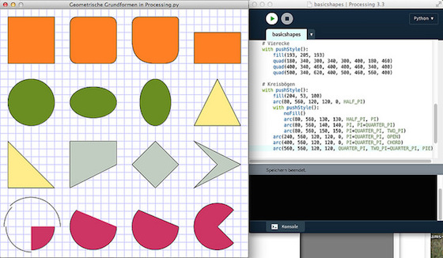

### Rechtecke

Rechtecke (`rect()`) sind die einfachste Grundform. Dennoch besitzen auch sie einige Besonderheiten. Es gibt sie nämlich in der Form

~~~python
rect(x, y, w, h)
rect(x, y, w, h, r)
rect(x, y, w, h, tl, tr, br, bl)
~~~

Bei vier Parametern sind die ersten beiden Parameter, die x- und y-Koordinate der linken, oberen Ecke des Rechtecks und die beiden anderen Parameter geben die Breite und Höhe des Rechtecks an. Gilt `w == h`, dann ist das Rechteck natürlich ein Quadrat.

Wird `rect()` mit fünf Parametern aufgerufen, dann ist der fünfte Parameter als Radius für die Abrundung der Ecken verantwortlich. Mit acht Paramtern bekommt jede Ecke einen eigenen Radius für die abgerundeten Ecken einen eigenen Radius zugeschrieben. Dabei wird von *links oben* über *rechts oben* und *rechts unten* nach *links unten* vorgegangen.

Rechtecke besitzen per Default den `rectMode(CORNER)`. Wird ein anderer `rectMode()` eingegeben, dann ändert sich die Bedeutung des dritten und vierten Parameters. Ist er `CORNERS`, dann bennen die ersten beiden Paramter weiterhin die linke, obere Ecke, der dritte und vierte Parameter aber die x- und y-Koordinaten der rechten, unteren Ecke.

Ist der `rectMode(CENTER)`, dann bennen die ersten beiden Parameter den Mittelpunkt des Rechteckes, der dritte und vierte Parameter gibt aber weiterhin die Breite und Höhe des Rechtecks an.

Dahingegen sind beim `rectMode(RADIUS)` die ersten beiden Paramter die x- und y-Koordinaten des Mittelpunkts des Rechtecks, während die dritte und vierte Koordinate jeweils die Hälfte der Breite und die Hälfte der Höhe angeben.

Der `rectMode(CENTER)` ist vor allen Dingen dann vom Vorteil, wenn Rechtecke mit Kreisen oder Ellipsen koordiniert werden, da bei diesen per Default `ellipseMode(CENTER)` gilt. Zu diesen kommen ich daher im Anschluß [noch einmal](http://py.kantel-chaos-team.de/foryoureyesonly/).

### Kreise und Ellipsen

Ellipsen und Kreise (als Spezialform der Ellipse) werden in Processing mit dem Befehl

~~~python
ellipse(x, y, w, h)
~~~

erzeugt. Dabei sind `x` und `y` der Mittelpunkt der Ellipse und `w` und `h` per Default die Breite und Höhe der Ellipse. Sind `w == h`, dann bildet die Ellipse einen Kreis.

Ändert man jedoch den Default-Mode `CENTER`, dann ergeben sich folgende Bedeutungsänderungen der vier Parameter.

Beim `ellipseMode(RADIUS)` bilden die ersten beiden Parameter weiterhin den Mittelpunkt der Ellipse oder des Kreises, der dritte und vierte Parameter gibt jedoch die Hälfte der Höhe und die Hälfte der Breite der Ellipse oder des Kreises an.

Ist der `ellipseMode(CORNER)`, dann benennen die x- und y-Koordinaten die linke, obere Ecke der Ellipse oder des Kreises, die beiden anderen Parameter geben weiterhin die Breite und Höhe an.

Heißt es jedoch `ellipseMode(CORNERS)`, dann bennenen die x- und y-Koordinaten die linke, obere Ecke des die Ellipse oder den Kreis umschließenden Rechtecks, der dritte und vierte Parameter die rechte untere Ecke dieses Rechtecks.

!!! tip "Achtung"
    Die Modes `CORNER`, `CORNERS`, `CENTER` und `RADIUS` müssen immer in Großbuchstaben eingegeben werden, da Processing und Python streng zwischen Groß- und Kleinschreibung unterscheiden.

### Dreieck

Das Dreieick ist eines der einfachsten geometrischen Grundformen in Processing. Es existiert nur in der Form

~~~python
triangle(x1, y1, x2, y2, x3, y3)
~~~

und hat auch keinen besonderen Mode. Die jeweiligen x- und y-Koordinagen sind die Koordinaten des ersten, zweiten und dritten Punktes. Bei der Reihenfolge wird -- oben beginnend -- immer im Uhrzeigersinn vorgegangen. Das ist alles.

### Unregelmäßige Vierecke

Ähnlich einfach verhält es sich mit den unregelmäßigen Vierecken. Sie werden mit

~~~python
quad(x1, y1, x2, y2, x3, y3, x4, y4)
~~~

erzeugt und auch hier sind es absolute Koordinaten und das Gebilde besitzt ebenfalls keinen besonderen Mode. Auch hier wird bei der Zählung links oben begonnen und dann werden die Ecken ebenfalls im Uhrzeigersinn abgearbeitet.

### Kreisbögen

Kreisbögen sind mit der Ellipse (genauer: dem Kreis verwandt) und besitzen die gleichen Modi wie diese (mit dem gleichen Default `CENTER`). Sie werden wie folgt aufgerufen:

~~~python
arc(x, y, w, h, start, stop)
arc(x, y, w, h, start, stop, mode)
~~~

Die x- und y-Koordinaten sind im Default-Mode der Mittelpunkt des Kreises, während `w` und `h` im Default-Mode die Breite und Höhe des Kreisen angeben. `start` und `stop` sind die Winkel (in *radians*) für die Länge des Kreisbogens.

Dann gibt es hier noch einen besonderen `mode`. Der kann `OPEN` (das ist der Default), `CHORD` oder `PIE` heißen. Im Default `OPEN` bleibt der Kreisbogen offen, falls es jedoch ein `fill()` gibt, wird er dennoch gefüllt. Bei `CHORD` wird der Kreisbogen geschlossen und bei `PIE` bildet er ein Kuchenstück, wie man es von Tortengraphiken kennt.


### Der Quelltext

In diesem Beispielprogramm habe ich alle angesprochenen geometrischen Primitive in ihren diversen Erscheinungsformen zeichnen lassen. Mit dem oben geschriebenen dürfte es einfach nachzuvollziehen ein.

~~~python
def setup():
    size(640, 640)
    frame.setTitle("Geometrische Grundformen in Processing.py")
    # noLoop()

def draw():
    background(255)
    drawGrid()
    stroke(0)
    
    # Rechtecke
    with pushStyle():
        fill(255,127,36)
        rect(20, 20, 120, 120)
        rect(180, 20, 120, 120, 20)
        rect(340, 20, 120, 120, 20, 10, 40, 80)
        rect(500, 60, 120, 80)
    
    # Kreise und Ellipsen
    with pushStyle():
        fill(107, 142, 35)
        ellipse(80, 240, 120, 120)
        ellipse(240, 240, 120, 80)
        ellipse(400, 240, 80, 120)
    
    # Dreiecke
    with pushStyle():
        fill(255, 236, 139)
        triangle(560, 180, 620, 300, 500, 300)
        triangle(20, 340, 140, 460, 20, 460)
        
    # Vierecke
    with pushStyle():
        fill(193, 205, 193)
        quad(180, 340, 300, 340, 300, 400, 180, 460)
        quad(400, 340, 460, 400, 400, 460, 340, 400)
        quad(500, 340, 620, 400, 500, 460, 560, 400)
    
    # Kreisbögen
    with pushStyle():
        fill(204, 53, 100)
        arc(80, 560, 120, 120, 0, HALF_PI)
        with pushStyle():
            noFill()
            arc(80, 560, 130, 130, HALF_PI, PI)
            arc(80, 560, 140, 140, PI, PI+QUARTER_PI)
            arc(80, 560, 150, 150, PI+QUARTER_PI, TWO_PI)
        arc(240, 560, 120, 120, 0, PI+QUARTER_PI, OPEN)
        arc(400, 560, 120, 120, 0, PI+QUARTER_PI, CHORD)
        arc(560, 560, 120, 120, QUARTER_PI, TWO_PI-QUARTER_PI, PIE)
    

def drawGrid():
    stroke(200, 200, 255)
    for i in range(0, width, 20):
        line(i, 0, i, height)
    for i in range(0, height, 20):
        line(0, i, width, i)
~~~

Ich habe das Fenster mit einem 20 x 20 Pixel großen Raster wie auf kariertem Schulpapier versehen, damit Ihr die Eckpunkte der einzelnen Shapes auszählen könnt, falls Euch die Koordinaten nicht sofort klar werden.

### Credits

Teilweise folgt dieser Sketch einer Idee von *Jan Vantomme* aus seinem Buch »Processing 2: Creative Coding Programming Cookbook« (Seiten 31 ff.). Ich habe sie abgewandelt, die Beispiele für die Kreisbögen hinzugefügt und vom Java-Mode in den Python-Mode übertragen.


## Eine analoge Uhr aus Kreisbögen

In seiner 74. Coding-Challenge auf YouTube zeigte *Daniel Shiffman*, wie man mit P5.js, dem JavaScript-Mode von Processing eine analoge Uhr aus Kreisbögen programmiert. Inspiriert wurde er von *John Maedas* [12 o'Clocks](http://cmuems.com/2016/60212/lectures/lecture-09-09b-clocks/maedas-clocks/)-Projekt und ich unterlag der Versuchung, *Shiffmans* JavaScript-Programm nach Processing.py zu portieren:

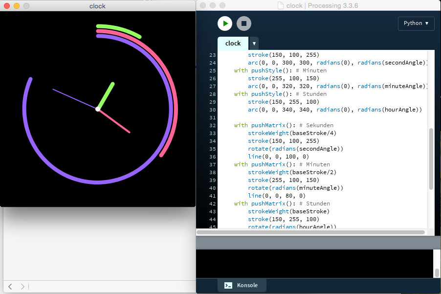

Dabei habe ich gegenüber dem Original-Script nur einige kleine Veränderungen vorgenommen.Ich habe die Stunden in den äußeren Kreisbogen gelegt und dadurch die Sekunden in den inneren Kreisbogen. Und ich habe die Zeiger der Uhr nicht nur in unterschiedlichen Längen, sondern auch in unterschiedliche Dicken zeichnen lassen, wie man es von analogen Uhren gewohnt ist. Außertdem habe ich heftigen Gebrauch vom `with`-Statement gemacht, das in Processing.py in vielen Fällen nicht nur das `push` und `pop` ersetzen, sondern auch ungterschiedliche Statii klasmmern kann.

### Der Quellcode

Meiner Meinung nach ist der Quellcode gegenüber der JavaScript-Version übersichtlicher geworden und leichter zu durchschauen. Das liegt aber sicher nicht an meinen genialen Programmierkenntnissen (die sind eher bescheiden), sondern ist der Klarheit von Python geschuldet:

~~~python
baseStroke = 8

def setup():
    size(400, 400)
    frameRate(30)
    
def draw():
    background(0)
    translate(width/2, height/2)
    rotate(radians(-90))
    
    hr = hour()
    mn = minute()
    sc = second()
    
    secondAngle = map(sc, 0, 60, 0, 360)
    minuteAngle = map(mn, 0, 60, 0, 360)
    hourAngle = map(hr%12, 0, 12, 0, 360)
    noFill()
    strokeWeight(baseStroke)
    
    # Kreisbögen
    with pushStyle(): # Sekunden
        stroke(150, 100, 255)
        arc(0, 0, 300, 300, radians(0), radians(secondAngle))
    with pushStyle(): # Minuten
        stroke(255, 100, 150)
        arc(0, 0, 320, 320, radians(0), radians(minuteAngle))
    with pushStyle(): # Stunden
        stroke(150, 255, 100)
        arc(0, 0, 340, 340, radians(0), radians(hourAngle))

    # Zeiger
    with pushMatrix(): # Sekunden
        strokeWeight(baseStroke/4)
        stroke(150, 100, 255)
        rotate(radians(secondAngle))
        line(0, 0, 100, 0)
    with pushMatrix(): # Minuten
        strokeWeight(baseStroke/2)
        stroke(255, 100, 150)
        rotate(radians(minuteAngle))
        line(0, 0, 80, 0)
    with pushMatrix(): # Stunden
        strokeWeight(baseStroke)
        stroke(150, 255, 100)
        rotate(radians(hourAngle))
        line(0, 0, 60, 0)

    noStroke()
    fill(255, 255, 255)
    ellipse(0, 0, 10, 10)
~~~

### Links

- *Golan Levins* [Notizen](http://cmuems.com/2016/60212/lectures/lecture-09-09b-clocks/maedas-clocks/) zu Maedas 12 o’Clocks nebst [Anhang](http://cmuems.com/2016/60212/lectures/lecture-09-09b-clocks/)
- [Alca's Clock Collection](https://codepen.io/collection/DqRNLQ/) auf CodePen

## Visualisierung: Die Sonntagsfrage

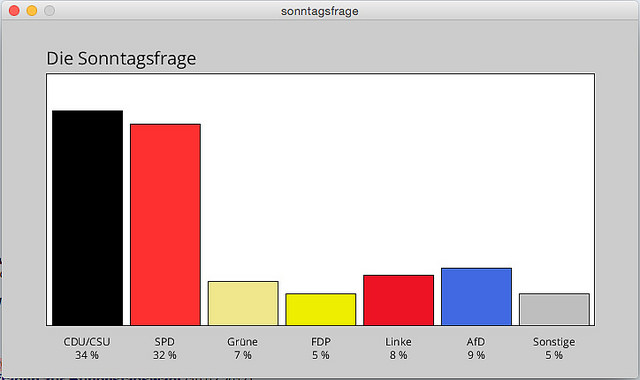

Man kann sich durchaus zu Recht fragen, ob es überhaupt sinnvoll ist, so etwas wie den obigen Barchart in Processing.py per Fuß zu erstellen. Schließlich gibt es (auch in Python) Bibliotheken wie etwa die [Matplotlib](http://cognitiones.kantel-chaos-team.de/programmierung/python/matplotlib.html), die für diese Aufgabe spezialisiert sind und mit wenigen Zeilen Code wunderbarer Graphiken auf den Monitor zaubern und sie auch gleichzeitig publikationsreif in einer Datei ablegen können.

Aber auf der anderen Seite schadet es nichts, wenn man selber genau weiß, wie man so etwas anstellen kann. Denn zum einem hat man vielleicht Gründe, die Umgebung von Processing.py nicht verlassen zu wollen. Und zum anderen gibt es doch auch immer wieder Spezialfälle, die von den spezialisierten Bibliotheken nicht abgedeckt werden.

Daher habe ich hier einmal die Ergebnisse der Sonntagsfrage (»Wenn am nächsten Sonntag Bundestagswahl wäre …«), die die *Forschungsgruppe Wahlen* regelmäßig veröffentlicht, nur mit den Hausmitteln von Processing.py in einem einfachen Barchart dargestellt.

Für die Daten, Namen und Farben habe ich drei Listen erstellt. Das hat den Vorteil, daß man bei einer neuen Umfrage nur die Ergebnisse in der Liste `prozente[]` ändern muß -- an den anderen Listen ändert sich zumindest bis zur Bundestagswahl im nächsten Jahr nichts.

Normalerweise werden Rechtecke in Processing ja mit dem Befehl `rect(x, y, w, h)` erzeugt, setzt man jedoch `rectMode(CORNERS)`, dann werden die realen Eckpunkte als Parameter erwartet, also `rect(x1, y1, x2, y2)`.

Für die Anpassung der Balken an den Bildschirmausschnitt habe ich auf Processings `map(value, dataMin, dataMax, targetMin, targetMax)`-Funktion zurückgegriffen, die einen Datenwert von einem Bereich in einen anderen überträgt. Nun hat Python selber aber auch noch eine eingebaute `map(function, iterable, …)`-Funktion, die mit der Processing-Funktion in Konflikt steht. Aber die Macher von Processing.py haben sich viel Mühe gegeben, diesen Konflikt aufzulösen. Erfüllt `map()` die Signatur der Python-Funktion, wird diese aufgerufen, ansonsten die Processing-Funktion.

### Der Quellcode

~~~python
parteien = ["CDU/CSU", "SPD", u"Grüne", "FDP", "Linke", "AfD", "Sonstige"]
prozente = [34, 32, 7, 5, 8, 9, 5]
farben = [color(0, 0, 0), color(255, 48, 48), color(240, 230, 140),
          color(238, 238, 0), color(238, 18, 37),
          color(65, 105, 225), color(190, 190, 190)]

titel = "Die Sonntagsfrage"

def setup():
    global X1, X2, Y1, Y2
    size(720, 405)
    X1 = 50
    X2 = width - X1
    Y1 = 60
    Y2 = height - Y1
    font1 = createFont("OpenSans-Regular.ttf", 20)
    textFont(font1)
    noLoop()

def draw():
    global X1, X2, Y1, Y2
    fill(255)
    rectMode(CORNERS)
    rect(X1, Y1, X2, Y2)
    fill(0)
    textSize(20)
    text(titel, X1, Y1 - 10)
    delta = (X2 - X1)/(len(prozente))
    w = delta*0.9
    x = w*1.22
    textSize(12)
    for i in range(len(prozente)):
        # Balken zeichnen
        h = map(prozente[i], 0, 40, Y2, Y1)
        fill(farben[i])
        rect(x - w/2, h, x + w/2, Y2)
        # Parteinamen und Prozente unter der X-Achse
        textAlign(CENTER, TOP)
        fill(0)
        text(parteien[i], x, Y2 + 10)
        text(str(prozente[i]) + " %", x, Y2 + 25)
        x += delta
~~~

Ansonsten ist der Quellcode leicht nachzuvollziehen. Die Abstands- und Längenwerte für `w` und `delta` habe ich durch Experimentieren herausgefunden, ebenso die Startposition von `x`.

### Quellen

Die Zahlen der *Forschungsgruppe Wahlen* habe ich auf der Seite [wahlrecht.de](http://www.wahlrecht.de/umfragen/index.htm) entnommen, dort sind viele weitere Umfrageergebnisse zu Bundes- und Landtagswahlen zu finden. Und den verwendeten Font [Open Sans](https://fonts.google.com/specimen/Open+Sans) habe ich bei Google Fonts gefunden. Er steht unter der [Apache-Lizenz, Version 2](http://www.apache.org/licenses/LICENSE-2.0). Ihr solltet nicht vergessen, die entsprechende Datei `OpenSans-Regular.ttf` in den `data`-Folder Eures Sketches zu schieben, damit Processing.py den Font auch finden kann.

## Rosetten-Kurven

Die [Rosetten-Kurven](https://de.wikipedia.org/wiki/Rosette_(Kurve)), die *Daniel Shiffman* so munter in seiner [55. Code-Challenge](http://blog.schockwellenreiter.de/2017/02/2017021003.html) in [P5.js](http://cognitiones.kantel-chaos-team.de/programmierung/creativecoding/processing/p5js.html), dem JavaScript-Mode von Processing, programmiert hatte, haben mir keine Ruhe gelassen. Ich wollte so etwas auch unbedingt in Processing.py implementieren.


Der Anfang war einfach. Ich bin stur *Daniel Shiffman* gefolgt und hatte innerhalb kürzester Zeit seinen Code in einen Python-Code verwandelt:

~~~python
d = 8.0
n = 5.0

def setup():
    size(400, 400)
    frame.setTitle("Rosetten")
    noFill()

def draw():
    k = n/d
    background(51)
    translate(width/2, height/2)
    with beginClosedShape():
        stroke(255)
        strokeWeight(1)
        a = 0
        while (a < d*TWO_PI):
            r = 200*cos(k*a)
            x = r*cos(a)
            y = r*sin(a)
            vertex(x, y)
            a += 0.02
~~~

Die einzigen Änderungen sind einmal, daß ich das `with`-[Statement](with.md) ausgenutzt und daß ich statt der `for`-Schleife eine `while`-Schleife verwendet habe, da in Pythons `for`-Schleifen das Inkrement oder Dekrement ganzzahlig sein müssen.

Doch bin ich zwar durchaus ein Freund des Sketchens, aber jedesmal, wenn ich eine andere Rosette haben will, den Quelltext zu ändern, war dann doch nicht mein Ding. Daher habe ich dann die `d`- und `n`- Werte, wie sie in dem oben und im Literaturverzeichnis verlinkten Wikipedia-Artikel genannt sind, in eine Liste gepackt

~~~python
dList = [1.0, 2.0, 3.0, 4.0, 5.0, 6.0, 7.0]
nList = [1.0, 2.0, 3.0, 4.0, 5.0, 6.0, 7.0, 8.0, 9.0]
~~~

und aus dieser Liste dann bei jedem Mausklick zufällig je einen Wert für `d` und `n` auswählen lassen:

~~~python
def mousePressed():
    global n, d
    n = r.choice(nList)
    d = r.choice(dList)
~~~

Pythons [Random-Bibliothek](https://docs.python.org/2/library/random.html) stellt dafür dankenswerterweise den Befehl `choice()` zur Verfügung, der diese Listenmanipulation sehr einfach macht.

Der Rest war dann nur noch Kosmetik: In nostalgischer Erinnerung an meine frühen Computerjahre habe ich die Kurve in Grün zeichnen und damit ich weiß, welche Werte der Zufallszahlengenerator mir für `d` und `n` ausgewählt hat, habe ich diese unten rechts ausgeben lassen.

### Der Quelltext

Für die, die diesen Sketch nachprogrammieren wollen, hier nun auch der vollständige Quelltext meines Experiments:

~~~python
import random as r

font = None
dList = [1.0, 2.0, 3.0, 4.0, 5.0, 6.0, 7.0]
nList = [1.0, 2.0, 3.0, 4.0, 5.0, 6.0, 7.0, 8.0, 9.0]
d = 5.0 # Startwert
n = 8.0 # Startwert

def setup():
    size(400, 400)
    frame.setTitle("Rosetten")
    font = createFont("American Typewriter", 12)
    textFont(font)
    noFill()

def draw():
    global n, d
    k = n/d
    background(51)
    translate(width/2, height/2)
    with beginClosedShape():
        stroke(0, 188, 0)
        strokeWeight(1)
        a = 0
        while (a < d*TWO_PI):
            r = 200*cos(k*a)
            x = r*cos(a)
            y = r*sin(a)
            vertex(x, y)
            a += 0.02
        text("n = " + str(n) + ", d = " + str(d), 100, 190)

def mousePressed():
    global n, d
    n = r.choice(nList)
    d = r.choice(dList)
~~~

### Caveat

Als Font für die Textausgabe habe ich mir den Systemfont *»American Typewriter«* ausgesucht (ich mag ihn einfach). Dieser steht sicher nicht auf allen Betriebssystemen zur Verfügung, Ihr müßt Euch daher gegebenenfalls einen anderen Systemfont aussuchen.

### Literatur

- [Rosettenkurven](https://de.wikipedia.org/wiki/Rosette_(Kurve)) in der deutschsprachigen Wikipedia

## Der Baum des Pythagoras

Eine weitere Ikone der fraktalen Geometrie ist der [Pythagoras-Baum](https://de.wikipedia.org/wiki/Pythagoras-Baum). Er geht zurück auf den niederländischen Ingenieur und späteren Mathematiklehrer *Albert E. Bosman* (1891–1961). Er entwarf während des 2. Weltkrieges in seiner Freizeit an einem Zeichenbrett, an dem er sonst U-Boot-Pläne zeichnete, geometrische Muster. Seine Graphiken wurden 1957 in dem Buch *»Het wondere onderzoekingsveld der vlakke meetkunde«* veröffentlicht.

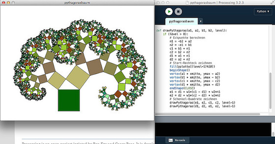

Der Pythagoras-Baum beruht auf einer rekursiven Abbildung des Pythagoras-Lehrsatzes: Die beiden Quadrate auf den Katheten des rechtwinkligen Dreiecks dienen als Verzweigung, auf dem jedes Kathetenquadrat sich wiederum verzweigt.

### Die Funktion drawPythagoras

Um die Funktion rekursiv aufrufen zu können, mußte ich sie aus der `draw()`-Funktion auslagern und sie in einen eigenen Aufruf packen:

~~~python
def drawPythagoras(a1, a2, b1, b2, level):
    if (level > 0):
        # Eckpunkte berechnen
        n1 = -b2 + a2
        n2 = -a1 + b1
        c1 = b1 + n1
        c2 = b2 + n2
        d1 = a1 + n1
        d2 = a2 + n2
        # Start-Rechteck zeichnen
        fill(palette[(level-1)%10])
        with beginClosedShape():
            vertex(a1 + xmitte, ymax - a2)
            vertex(b1 + xmitte, ymax - b2)
            vertex(c1 + xmitte, ymax - c2)
            vertex(d1 + xmitte, ymax - d2)
        e1 = d1 + w1*(c1 - d1) + w2*n1
        e2 = d2 + w1*(c2 - d2) + w2*n2
        # Schenkel-Quadrate zeichnen
        drawPythagoras(e1, e2, c1, c2, level-1)
        drawPythagoras(d1, d2, e1, e2, level-1)
~~~

Zum Zeichnen der einzelnen Quadrate habe ich nicht die `rect()`-Funktion genutzt, sondern *Shapes*, mit denen sich Punkte zu einem beliebigen Gebilde oder Polygon zusammefassen lassen. Hierzu müssen sie erst einmal mit `with beginClosedShape()` geklammert werden. Darin werden dann mit `vertex(x, y)` nacheinander die einzelnen Punkt aufgerufen, die (im einfachten Fall) durch Linien miteinander verbunden werden sollen. Mit `beginClosedShape` teile ich dem Sketch auch mit, daß das entstehende Polygon auf jeden Fall geschlossen werden soll, ein einfaches `with beginShape()` würde es offen lassen.

Der Aufruf ist rekursiv: Nachdem zuerst das Grundquadrat gezeichnet wurde, werden die rechten und die linken Schenkelquadrate gezeichnet, die dann wieder als Grundquadrate für den nächsten Rekursionslevel fungieren.

Processing (und damit auch der Python-Mode von Processing) ist gegenüber Rekursionstiefen realtiv robust. Die benutzte Rekursionstiefe von 12 wird klaglos abgearbeitet, auch Rekursionstiefen bis 20 sind -- genügend Geduld vorausgesetzt -- kein Problem. Bei einer Rekursionstiefe von 22 verließ mich aber auf meinem betagten MacBook Pro die Geduld.

### Die Farben

Für die Farben habe ich eine Palette in einer Liste zusammengestellt, die der Reihe nach die Quadrate einfärbt. Da die Liste nur 10 Elemente enthält, habe ich mit `fill(palette[(level-1)%10])` dafür gesorgt, daß nach 10 Leveln die Palette wieder von vorne durchlaufen wird.

### Der Quellcode

Da die eigentliche Aufgabe des Programms in die Funktion `drawPythagoras()` ausgelagert wurde, ist der restlich Quellcode von erfrischender Kürze:

~~~python
palette = [color(189,183,110), color(0,100,0), color(34,139,105),
           color(152,251,152), color(85,107,47), color(139,69,19),
           color(154,205,50), color(107,142,35), color(139,134,78),
           color(139, 115, 85)]

xmax = 600
xmitte = 300
ymax = 440

level = 12
w1 = 0.36   # Winkel 1
w2 = 0.48   # Winkel 2

def setup():
    size(640, 480)
    background(255)
    strokeWeight(1)
    noLoop()

def draw():
    drawPythagoras(-(xmax/10), 0, xmax/20, 0, level)

def drawPythagoras(a1, a2, b1, b2, level):
    if (level > 0):
        # Eckpunkte berechnen
        n1 = -b2 + a2
        n2 = -a1 + b1
        c1 = b1 + n1
        c2 = b2 + n2
        d1 = a1 + n1
        d2 = a2 + n2
        # Start-Rechteck zeichnen
        fill(palette[(level-1)%10])
        with beginClosedShape():
            vertex(a1 + xmitte, ymax - a2)
            vertex(b1 + xmitte, ymax - b2)
            vertex(c1 + xmitte, ymax - c2)
            vertex(d1 + xmitte, ymax - d2)
        e1 = d1 + w1*(c1 - d1) + w2*n1
        e2 = d2 + w1*(c2 - d2) + w2*n2
        # Schenkel-Quadrate zeichnen
        drawPythagoras(e1, e2, c1, c2, level-1)
        drawPythagoras(d1, d2, e1, e2, level-1)
~~~

Auch wenn es nicht nötig gewesen wäre, ich mag es einfach (und es dient der Übersichtlichkeit), wenn ich meine Processing.py-Sketche mit `def setup()` und `def draw()` gliedere. Mit `noLoop()` habe ich dann dafür gesorgt, daß die `draw()`-Schleife nur einmal abgearbeitet wird.

### Erweiterungen und Änderungen

Einen »symmetrischen« Pythagoras-Baum erhält man übrigens, wenn man die beiden Winkel-Konstanten `w1` und `w2` jeweils auf `0.5` setzt.

### Credits

Den rekursiven Algorithmus habe ich einem Pascal-Programm aus Jürgen Plate: *Computergrafik: Einführung – Algorithmen – Programmentwicklung*, München (Franzis) 2. Auflage 1988, Seiten 460-462 entnommen. Und die Geschichte des Baumes steht in dem schon mehrfach erwähnten Buch von Dieter Hermann, *Algorithmen für Chaos und Fraktale*, Bonn (Addison-Wesley) 1944 auf den Seiten 170f.


# Text(verarbeitung) in Processing.py

Mit `print()` oder `println()` kann man in Processing.py jede Ausgabe in das Konsolenfenster bringen, aber was ist, wenn der Text im Graphikfenster ausgegeben werden soll? Ich gehe erst einmal ganz naiv daran:

~~~python
font = None
tt = "Zwölf Boxkämpfer jagen Eva quer über den großen Sylter Deich."

def setup():
    size(800, 100)
    font = createFont("American Typewriter", 20)
    textFont(font)

def draw():
    background(255)
    fill(0)
    text(tt, 25, 50)
~~~

In der ersten Zeile teile ich Processing.py mit, daß ich die Variable `font` verwenden will und belege sie erst einmal mit dem Wert `none`. Das erspart mir ein oder sogar zwei Global-Statements. Die Stringvariable `tt` bekommt meinen Text zugewiesen. In `setup()` mache ich ein langes, schamles Fenster auf (mein Text ist ja ziemlich lang) und dann teile ich mit `createFont()` Processing.py mit, daß ich den Font *American Typewriter* in der Größe von 20 Pixeln verwenden will und weise ihn der Variablen `font` zu. Zu guter Letzt lege ich noch fest, daß eben mein textFont `font` ist.

In `draw()` lege ich einen weißen Hintergrund und eine schwarze Füllfarbe fest und lasse dann mit der Funktion `text()` den Text in das Fenster zeichnen. `text()` besitzt drei Parameter, zuerst den zu schreibenden (oder besser: zeichnenden) Text, dann die x- und die y-Koordinate des Textbeginns.

Das sieht eigentlich alles ganz einfach aus, aber wenn Ihr den Sketch ausführen lasst, erlebt Ihr Euer blaues Wunder:


So verstümmelt habt Ihr Euch das sicher nicht vorgestellt. Die Ursache ist einfach und ärgerlich. Das Processing.py zugrundeliegende Python ist ein Jython (also die Java-Version von Python) und entspricht der Python-Version 2.7. Diese ist leider nicht *out of the box* UTF-8 fähig, ein Umstand, der in der (meist englischsprachigen) Literatur geflissentlich verschwiegen wird[^7_1]. Dabei ist er so leicht zu beheben. Ein vor einem String vorangestelltes `u` teilt Python 2.7 mit, daß dieser String ein UTF-8-String ist. Im Sketch ist also lediglich die Zeile

~~~python
tt = "Zwölf Boxkämpfer jagen Eva quer über den großen Sylter Deich."
~~~

in

~~~python
tt = u"Zwölf Boxkämpfer jagen Eva quer über den großen Sylter Deich."
~~~

und schon wird der Text wie gewünscht ausgegeben:


Es gibt eine weitere, kleine Ungereimtheit im Umgang mit UTF-8 in Processing.py Im Haupt-Tab, in dem das ausführbare Programm steht (das ist der Tab, der die Endung `.pyde` bekommt), kann man -- wie gezeigt -- ohne große Probleme im Programmtext Umlaute unterbringen, während der Code in den anderen Tabs (die unter `.py` gespeichert werden) strenger mit dem Programmierer umgeht: Wenn nicht in der ersten Zeile

~~~python
# coding=utf-8
~~~

steht, meckert die IDE gnadenlos, selbst wenn Umlaute nur in den Kommentaren vorkommen.

[^7_1]: Ich weiß nicht, ob je und wann Jython den Sprung auf Python 3 wagt. Dort ist jedenfalls von Hause aus (per Default) jeder String ein UTF-8-String, in meinen Augen ein wichtiger, aber auch der einzige Grund, auf Python 3 umzusteigen.

>Der Text mit den zwölf Boxern ist übrigens ein [Pangramm](https://de.wikipedia.org/wiki/Pangramm), ein Satz, der alle Buchstaben des (in diesem Falle deutschen) Alphabets enthält. Früher wurden sie benutzt, um zum Beispiel Schreibmaschinen nach einer Reparatur zu testen. Heute nutze ich ihn, um festzustellen, ob ein Font auch alle Umlaute des deutschen Alphabets enthält. Das bekannteste englische Pangramm ist der Satz »The quick brown fox jumps over the lazy dog«.

### Als die Pangramme laufen lernten

Während in der Funktion `text()` die y-Koordinate immer die Grundlinie des Textes ist, kann man mit `textAlign()` festlegen, ob die x-Koordinate die rechte Kante (`RIGHT`), die linke Kante (`LEFT`) oder die Mitte (`CENTER`) des Textes betrifft. Das möchte ich ausnutzen, um eine Parade der Pangramme zu programmieren. Als erstes lege ich eine Liste mit Pangrammen an (der oben verlinkte Wikipedia-Artikel ist voll von ihnen). Und damit es auch ein wenig bunt wird, habe ich eine gleichlange Liste mit Farben zusammengestellt. Im Endeffekt soll das dann so aussehen:


Der Sketch selber ist dadurch ein wenig länger geworden, aber das betrifft in der Hauptsache nur die beiden Listen:

~~~python
font = None
pangramme =
  [u"Zwölf Boxkämpfer jagen Eva quer über den großen Sylter Deich.",
   u"Jörg bäckt quasi zwei Haxenfüße vom Wildpony.",
   u"Falsches Üben von Xylophonmusik quält jeden größeren Zwerg.",
   u"Schweißgequält zündet Typograph Jakob verflixt öde Pangramme an.",
   u"Vom Ödipuskomplex maßlos gequält, übt Wilfried zyklisches Jodeln.",
   u"Asynchrone Bassklänge vom Jazzquintett sind nix für spießige Löwen."]
             
colors = ["#cd0000", "#008b00", "#ffff00", "#a52a2a", "#ff00ff", "#00ffff"]

def setup():
    global x, index
    frame.setTitle("Parade der Pangramme")
    size(800, 100)
    font = createFont("American Typewriter", 24)
    textFont(font)
    x = width
    index = 0

def draw():
    global x, index
    background(0)
    fill(colors[index])
    textAlign(LEFT)
    text(pangramme[index], x, 60)
    x -= 3
    w = textWidth(pangramme[index])
    if (x < -w):
        x = width
        index = (index+1) % len(pangramme)
~~~

Mit `textAlign(LEFT)` und `x = width` habe ich festgelegt, daß der Text im ersten Schritt am rechten Fensterrand beginnt und quasi ins Leere geschrieben wird. Bei jedem Durchlauf wird `x` umd drei dekrementiert und so beginnt das erste Pangramm von rechts nach links durch das Fenster zu scrollen. Ist der Text aus dem sichtbaren Bereich des Fenster verschwunden (`x < -w`), dann wird `index` um einen erhöht und das nächste Pangramm beginnt seine Parade. Damit der Index nicht irgendwann überläuft wird er Modulo der Länge der Liste der Pangramme berechnet. Und da ich in weiser Voraussicht die Länge der Farbliste gleich der Länge der Liste der Pangramme entworfen habe, passiert auch bei den Farben nichts.

### Font, Font, Font

Jetzt bleibt nur noch eins zu tun. Auf meinem Rechner läuft der Sketch ohne Probleme, da ich weiß, daß auf meinen Rechner der Font *American Typewriter* vorhanden ist. Dies muß aber nicht auf jedem anderen Rechner der Fall sein (falls also bei Euch die Sketche nicht laufen, tauscht einfach *American Typewriter* mit einem anderen Font, der auf Eurem Rechner vorhanden ist, aus). Wenn ich die `.ttf`-Datei des Fonts in den `data`-Ordner des Sketches kopiere (das geht am einfachsten, wenn ich die Datei auf das Editor-Fenster der IDE schiebe), würde der Sketch -- wenn ich ihn weitergebe -- überall funktionieren. Aber *American Typewriter* unterliegt mit Sicherheit dem Urheberrecht und eine Weitergabe ist vermutlich verboten oder mit hohen Kosten verbunden.

Aber es gibt ja eine Menge freier Fonts im Web und die größte Quelle dieser freien Fonts ist [Google Fonts](https://fonts.google.com/). Dort habe ich mir den Font [Barrio](https://fonts.google.com/specimen/Barrio) heruntergeladen, der unter der [Open Font Licence](http://scripts.sil.org/cms/scripts/page.php?site_id=nrsi&id=OFL_web) zu nutzen ist.


Selbstverständlich habe ich mich vorher vergewissert, daß der Font auch die von mir gewünschten deutschen Umlaute enthält. Nachdem ich die Fontdatei dem Sketch hinzugefügt hatte, war eigentlich nur noch eine Zeile im Programm zu ändern:

~~~python
    font = createFont("Barrio-Regular.ttf", 64)
~~~

*Barrio* ist ein Display-Font, der nur ab einer gewissen Größe wirkt. Daher habe ich ihn auf `64` gesetzt und dann die y-Koordinate etwas weiter nach unten geschoben. Der vollständige und endgültige Sketch der Pangramm-Parade sieht daher nun so aus:

~~~python
font = None
pangramme =
 [u"Zwölf Boxkämpfer jagen Eva quer über den großen Sylter Deich.",
  u"Jörg bäckt quasi zwei Haxenfüße vom Wildpony.",
  u"Falsches Üben von Xylophonmusik quält jeden größeren Zwerg.",
  u"Schweißgequält zündet Typograph Jakob verflixt öde Pangramme an.",
  u"Vom Ödipuskomplex maßlos gequält, übt Wilfried zyklisches Jodeln.",
  u"Asynchrone Bassklänge vom Jazzquintett sind nix für spießige Löwen."]
             
colors = ["#cd0000", "#008b00", "#ffff00", "#a52a2a", "#ff00ff", "#00ffff"]

def setup():
    global x, index
    frame.setTitle("Parade der Pangramme")
    size(800, 100)
    font = createFont("Barrio-Regular.ttf", 64)
    textFont(font)
    x = width
    index = 0

def draw():
    global x, index
    background(0)
    fill(colors[index])
    textAlign(LEFT)
    text(pangramme[index], x, 80)
    x -= 3
    w = textWidth(pangramme[index])
    if (x < -w):
        x = width
        index = (index+1) % len(pangramme)
~~~

Wenn Ihr noch mehr über Strings, Text und Fonts in Processing.py wissen wollt, *Daniel Shiffman* hat dazu ein [nettes Tutorial](http://py.processing.org/tutorials/text/) verfaßt, daß auch mir bei meinen Erkundungen sehr geholfen hat.

## UTF-8-Text aus Dateien lesen

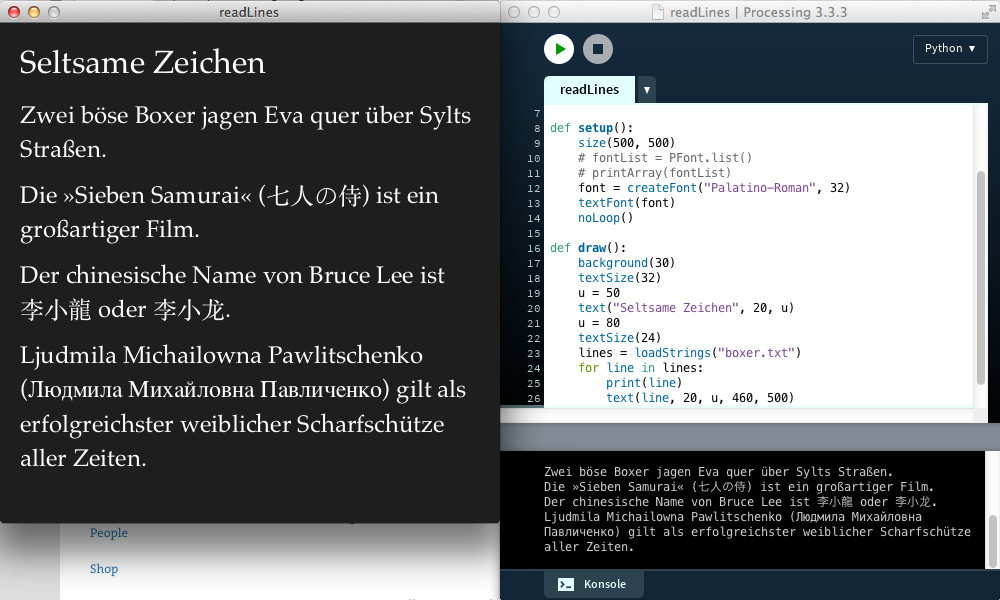

In der Reference für Processing 3 steht bei allen Datei-Operationen, [so auch bei `loadStrings()`](https://processing.org/reference/loadStrings_.html):

>*Starting with Processing release 0134, all files loaded and saved by the Processing API use UTF-8 encoding. In previous releases, the default encoding for your platform was used, which causes problems when files are moved to other platforms.*

Das ließ hoffen, daß man in Processing.py wenigstens an dieser Stelle ohne das (von mir) ungeliebte `u"utf-8-string"` auskommen kann. Das wollte ich ausprobieren, also legte ich mir als erstes eine (UTF-8-) Textdatei mit diesem Inhalt an:


Das sieht doch schon sehr gefährlich aus, in der ersten Zeile die bösen deutschen Umlaute, die zweite Zeile mit japanischen Schriftzeichen, die dritte enthält chinesische Glyphen und die letzte Zeile kyrillische (russische) Zeichen. Noch vor wenigen Jahren hätte das jeden Programmierer an den Rand des Wahnsinns gebracht, aber nun: Selbst dieser simple Dreizeiler

~~~python
lines = loadStrings("boxer.txt")
for line in lines:
    print(line)
~~~

gibt den Text mit allen Sonderzeichen auf der Konsole aus. Und auch der Befehl `text(line, x, y, w, h)` hat keine Schwierigkeiten (einen UTF-8-fähigen Font vorausgesetzt) diesen Text in das Processing-Fenster zu zaubern. Hier das Progrämmchen, das obigen Screenshot produziert:

~~~python
font = None

def setup():
    size(500, 500)
    # fontList = PFont.list()
    # printArray(fontList)
    font = createFont("Palatino-Roman", 32)
    textFont(font)
    noLoop()

def draw():
    background(30)
    textSize(32)
    u = 50
    text("Seltsame Zeichen", 20, u)
    u = 80
    textSize(24)
    lines = loadStrings("boxer.txt")
    for line in lines:
        print(line)
        text(line, 20, u, 460, 500)
        u += 80
~~~

Die beiden auskommentierten Zeilen listen in der Konsole alle auf dem System verfügbaren Fonts auf, mit dem Namen, in dem sie mit `createFont()` in Processing angesprochen werden können. Wenn man einen dieser Fonts verwendet, erspart das zwar einerseits die Installation eines Fonts im `data`-Ordner, macht aber auf der anderen Seite solch ein Skript weniger portabel, denn was ist, wenn der Empfänger diesen Font nicht installiert hat.

### Keine Emojis

In einer ersten Version des Textes hatte ich auch noch ein paar Emojis hineingeschmuggelt. Hier wurde aber eine Grenze überschritten, Emojis wurden weder in der Konsole noch auf dem Canvas angezeigt (man kann sie auch nicht per *Copy & Paste*) in den Editor schmuggeln`. Das gilt aber auch für den Java-Mode von Processing, Emojis sind erst ab P5.js in der Welt von Processing vorgesehen.

### Caveat

Auch wenn ich es natürlich schön finde, daß das ungeliebte `u"utf-8-string"` bei den Dateioperationen mit Processing-Befehlen wegfällt, ist es natürlich inkonsistent. Denn Dateioperationen mit Python-Befehlen arbeiten natürlich weiterhin mit der besonderen UTF-8-Kodierung von Python 2.7, so zum Beispiel die Befehle um CSV- oder JSON-Dateien zu lesen und zu schreiben. Daher ist eine gewisse Vorsicht angebracht.


## Spaß mit Processing.py: Rentenuhr

Was für Gründe sprechen eigentlich dafür, Processing.py statt des »normalen« Processings zu nutzen? Nun, zum einen können es persönliche Gründe sein: Ich mag zum Beispiel keine Programmiersprachen, die Blöcke mit geschweiften Klammern (`{}`) trennen und vermeide sie, wo es nur geht. Zum anderen komme ich aus der [Pascal](http://cognitiones.kantel-chaos-team.de/programmierung/pascal.html)-Ecke (Pascal und Algol 68 waren meine ersten Programmiersprachen überhaupt) und mag daher Programme, die so etwas sind wie »ausführbarer Pseudocode«. Aber der wichtigste Grund ist, Processing.py ist eben nicht nur Processing, sondern auch Python. Und Python kommt *»batteries included«*, es bringt eine große Anzahl von Standard-Bibliotheken mit, die man auch in Processing.py nutzen kann. Ich möchte das am Beispiel des Python-Moduls `datetime` einmal zeigen:


Als erstes habe ich den freien ([Open Font Licence](http://scripts.sil.org/cms/scripts/page.php?site_id=nrsi&id=OFL_web)) Font [Coda Heavy](https://fonts.google.com/specimen/Coda) von Googles Seiten heruntergeladen, entpackt und ihn dem Skript zugänglich gemacht, indem ich die `.ttf`-Datei einfach auf das IDE-Fenster geschoben habe. Processing legt dann automatisch im Skriptordner ein `data`-Vertzeichnis an und kopiert die Datei -- wie auch alle Bild- oder Audio-Datein dorthin. Die Skripte finden sie dann, zum Beispiel mit

~~~python
	font = createFont("Coda-Heavy.ttf", 96)
~~~

ohne eine spezielle Pfadangabe. Der zweite Parameter gibt die maximale Fontgröße vor. Am Anfang des Skriptes habe ich mit

~~~python
	import datetime as dt
~~~

das Python-Modul `datetime` aus der Standardbibliothek geladen und dann als erstes eine einfache Uhr gebastelt

~~~python
	myNow = dt.datetime.now()
	myHour = str(myNow.hour)
	myMinute = str(myNow.minute)
	mySecond = str(myNow.second)
~~~

und dann die `datetime`-Objekte in Strings verwandelt. Im eigentlichen Programm habe ich sie sogar noch ein wenig aufgehübscht und den einstelligen Sekunden und Minute eine führende Null verpaßt. Das könnt Ihr weiter unten im kompletten Quellcode nachlesen.

Jetzt kommt aber der eigentliche Gag: Mit den `datetime`-Objekten kann man nämlich rechnen! Und da ich am 31. Dezember 2018 in Rente gehe, wollte ich wissen, wieviele Tage ich noch ausharren muß

~~~python
    rente = dt.date(2018, 12, 31)
    heute = dt.date.today()
    differenz = rente - heute
    myDays = str(differenz.days)
    workingDays = float(myDays)/7.0 * 5
    workingDays = str(int(workingDays - 80))
~~~

und wieviele Tage davon Arbeitstage sind. Dazu habe ich einfach die Anzahl der Tage durch sieben geteilt und mit fünf multipliziert, was grob die Anzahl der Werktage ergibt. Und da ich noch 20 Tage Resturlaub in dieses Jahr mitgeschleppt habe und mir pro Jahr auch noch je 30 Tage regulärer Urlaub zusteht, habe ich diese 80 Tage auch noch abgezogen. Die Feiertage habe ich nicht berücksichtigt, mir reicht diese grobe Schätzung.

Da die Differenz zweier `datetime`-Objekte wieder ein `datetime`-Objekt ist, muß die Umwandlung in einen *String* explizit mittels *Typecasting* vorgenommen werden und bei der Division durch sieben ist zu beachten, daß das Processing.py zugrundelegende Jython ein Python 2.7 ist und deshalb bei einer Integer-Division alle Nachkommastellen abschneidet (zum Beispiel ergibt `13/7` eine `1`, dieses -- dokumentierte -- Verhalten wurde in Python 3 geändert). Um das zu vermeiden, habe ich durch `7.0` geteilt und so eine Float-Division erzwungen und durch ein anschließendes Runden das Ergebnis doch wieder in eine Integer-Zahl verwandelt.

Jetzt das komplette Skript zum Nachlesen und Nachprogrammieren:

~~~python
import datetime as dt

def setup():
    size(640, 480)
    font = createFont("Coda-Heavy.ttf", 96)
    textFont(font)

def draw():
    background("#000000")
    myNow = dt.datetime.now()
    myHour = str(myNow.hour)
    myMinute = str(myNow.minute).rjust(2, "0")
    mySecond = str(myNow.second).rjust(2, "0")
    myTime = myHour + " : " + myMinute + " : " + mySecond
    textSize(96)
    text(myTime, 60, 150)
    rente = dt.date(2018, 12, 31)
    heute = dt.date.today()
    differenz = rente - heute
    myDays = str(differenz.days)
    workingDays = float(myDays)/7.0 * 5
    workingDays = str(int(workingDays - 80))
    myText = u"Lieber Jörg, es sind nur noch " + myDays + \
    u" Tage bis zu Deiner Rente!\nDas sind etwa " + \
    workingDays + " Arbeits- tage. Das schaffst Du!"
    textSize(32)
    text(myText, 60, 200, 540, 300)
~~~

Wegen des Umlautes in meinem Vornamen, mußte ich mit `u"…"` die Umwandlung des Strings in einen UTF-8-String erzwingen (auch das ist Python 3 nicht mehr nötig), aber wie der obige Screenshot zeigt, wird dann der Umlaut auch brav angezeigt.

Die Funktion `text()` kann man in Processing einmal mit drei und einmal mit fünf Parametern aufrufen. Im ersten Fall übergibt man den Text und die x- und y-Koordinaten der linken Grundlinie des Textes. Im zweiten Fall kommen noch die Weite und die Höhe der Textbox hinzu. Damit erreicht man, daß ein langer String an den Textbox-Grenzen umgebrochen wird und der Text nicht aus dem Fenster herausläuft. Die Parameter habe ich durch einfaches Ausprobieren bekommen.


# Bildverarbeitung mit Processing.py

### Jeder sein kleiner Warhol

Processing und damit auch Processing.py besitzt ein ganzes Arsenal von Filtern zur Bildmanipulation. Davon möchte ich zu Beginn zwei heraussuchen und damit ein kleines Programm erstellen, dessen Ergebnis ein wenig an die berühmten Siebdrucke des Pop-Art-Künstlers [Andy Warhol](https://de.wikipedia.org/wiki/Andy_Warhol) erinnern soll.


Ich habe dazu ein Photo von unserem Sheltie Joey und mir genommen, das *Stefanie Radon* vor etwa vier Jahren von uns geschossen hatte, und das mein Facebook-Profil ziert und mit dem `filter(THRESHOLD, 0.55)` in eine reine schwarz-weiß-Zeichnung umgewandelt. `THRESHOLD` akzeptiert Parameter zwischen `0.0` und `1.0` -- je kleiner der Wert, desto weniger wird angezeigt. Nach einigen Experimenten habe ich mich dann auf `0.55` festgelegt, das brachte in meinen Augen das brauchbarste Ergebnis für dieses Photo.

In der `draw()`-Funktion habe ich dann das Bild acht mal hintereinander in zwei Reihen gezeichnet und mit dem filter `tint(color)` jeweils in einer anderen Farbe eingefärbt. Ich habe einige Zeit mit den Farben experimentieren müssen, bis ich das oben angezeigt Ergebnis bekam, mit dem ich nun zufrieden bin.

### Der Quellcode

Der Quellcode ist einfach und leicht zu verstehen. Im `setup()` habe ich das Bild geladen und in eine schwarz-weiß-Version umgewandelt, in `draw()` habe ich dann die acht unterschiedlich eingefärbten Versionen erstellt. Dabei habe ich eine Schleife über die Liste `palette[]` der von mir ausgewählten Farben laufen lassen:

~~~python
palette = [color(205, 133, 63), color(124, 205, 124),
           color(255, 140, 0), color(255, 20, 147),
           color(238, 238, 0), color(224, 102, 255),
           color(151, 255, 255), color(205, 200, 177)]

def setup():
    global jojo
    size(640, 320)
    jojo = loadImage("jojo.jpg")
    jojo.filter(THRESHOLD, 0.55)
    noLoop()

def draw():
    global jojo
    background(51)
    for i in range(len(palette)):
        if (i < 4):
            row = 0
            j = i
        else:
            row = 160
            j = i - 4
        tint(palette[i])
        image(jojo, j*160, row)
~~~

### Ressourcen

Natürlich könnt Ihr für Eure eigenen Experimente auch das Photo von [Joey und mir](https://www.flickr.com/photos/schockwellenreiter/7780799276/) nutzen -- es steht schließlich auf Flickr und im Fratzenbuch, aber es wäre sicher mehr im Sinne von Andy Warhol, wenn Ihr Euch Eure eigene Bilder (aus-) sucht, die Ihr einfärben und serialisieren wollt.


## Filter für die Bildverarbeitung

Processing und damit auch Processing.py bringen eine kleine Sammlung vorgefertigter Filter für die Bildmanipulation mit, die auf jedes Bild angewandt werden können. Die Filter haben folgende Syntax: Entweder

~~~python
filter(MODE)
~~~

oder

~~~python
filter(MODE, param)
~~~

Ob ein Filter einen zusätzlichen Paramter mitbekommen kann, hängt vom Filter ab. Wie die Filter wirken und ob und wie sie einen Paramter mitbekommen, könnt Ihr der folgenden Tabelle entnehmen:

----------------------------------------------------------------------------------
Ergebnis                   Filter
-------------------------- -------------------------------------------------------
 Originalbild (keinen Filter)

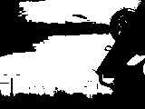 `THRESHOLD`, Parameter (optional) zwischen 0 und 1, Default 0.5

 `GRAY`, keinen Parameter

 `INVERT`, photographisch gesprochen das Negativ, keinen Parameter

 `POSTERIZE`, zwischen 2 und 255, aber einen richtigen Effekt hat man nur mit niedrigen Werten

 `BLUR`, je größer der Wert, desto verschwommener wird das Bild. Der Parameter ist optional, der Default ist 1

 `ERODE`, keinen Parameter

 `DILATE` (das Gegenteil von `ERODE`), keinen Parameter

 Filter können auch kombiniert werden, hier erst `GRAY` und dann `POSTERIZE`

-----------------------------------------------------------------------------------

Table: Filter in Processing

Mit folgendem kleinen Sketch könnt Ihr mit den diversen Filtern spielen (die auskommentierten Teile habe ich für die *Thumbnails* in obiger Tabelle benötigt):

~~~python
selectFilter = 8

def setup():
    global img
    # Thumbnails
    # size(160, 120)
    # img = loadImage("abendrot-s.jpg")
    # Volle Größe
    size(640, 480)
    img = loadImage("abendrot.jpg")
    noLoop()

def draw():
    global img
    background(255, 127, 36)
    image(img, 0, 0)
    if (selectFilter == 1):
        filter(THRESHOLD, 0.55)
    elif (selectFilter == 2):
        filter(GRAY)
    elif (selectFilter == 3):
        filter(INVERT)
    elif (selectFilter == 4):
        filter(POSTERIZE, 4)
    elif (selectFilter == 5):
        filter(BLUR, 6)
    elif (selectFilter == 6):
        filter(ERODE)
    elif (selectFilter == 7):
        filter(DILATE)
    elif (selectFilter == 8):
        filter(GRAY)
        filter(POSTERIZE, 4)
    # save("filter020" + str(selectFilter) + ".jpg")
~~~

Einfach bei `selectFilter` den gewünschten Wert (zwischen `0` und `8`) eingeben und dann den Sketch laufen lassen. Ihr seid natürlich eingeladen, bei den Filtern, die Parameter zulassen, mit diesen zu spielen.

Die letzte (auskommentierte) Zeile zeigt Euch, wie Ihr das Ergebnis abspeichern könnt. Das Format des Bildes erkennt Processing an der Endung.

### Filter interaktiv


Noch besser könnt Ihr natürlich die Wirkung der diversen Filterparameter interaktiv mit der Maus erkunden. Ich habe als Beispiel dafür zwei kleine Sketche geschrieben, die einmal `POSTERIZE` und zum anderen `THRESHOLD` erkunden.

~~~python
def setup():
    global img
    size(640, 480)
    frame.setTitle("Posterize interaktiv")
    img = loadImage("abendrot.jpg")

def draw():
    v = map(mouseX, 0, width, 2, 64)
    image(img, 0, 0)
    filter(POSTERIZE, v)
~~~

Da die hohen Werte bei `POSTERIZE` keinen interessanten Effekte mehr liefern, habe ich hier mithilfe der `map()`-Funktion den Parameter auf die Werte zwischen `2` und `64` begrenzt.

~~~python
def setup():
    global img
    size(640, 480)
    frame.setTitle("Threshold interaktiv")
    img = loadImage("abendrot.jpg")

def draw():
    v = float(mouseX)/width
    image(img, 0, 0)
    filter(THRESHOLD, v)
~~~

`THRESHOLD` erwartet Werte zwischen `0.0` und `1.0`. Daher habe ich einfach den `mouseX`-Wert durch die Breite des Fensters geteilt. Wegen der Integer-Division von Python 2.7 mußte ich einen der Werte explizit zu einem `float` konvertieren, um das gewünschte Ergebnis zu erhalten (denn sonst bekommt man nur den Wert Null). So aber wird das Bild, wenn die Maus ganz weit links ist, nur weiß, während es bei einer Mausposition ganz rechts im Fenster fast vollständig schwarz wird. Irgendwo dazwischen liegen die interessanten Ergebnisse. Ihr solltet dies mit diversen Bildern ausprobieren, um ein Gefühl für die zu erwartenden Effekte zu bekommen.

## Pointillismus

[Pointillismus](https://de.wikipedia.org/wiki/Pointillismus) bezeichnet eine Stilrichtung der Malerei, die zwsichen 1889 und 1910 ihre Blütezeit hatte. Pointillistische Bilder bestehen aus kleinen regelmäßigen Farbtupfern in reinen Farben. Der Gesamt-Farbeindruck einer Fläche ergibt sich erst im Auge des Betrachters und aus einer gewissen Entfernung. So etwas in der Art kann man natürlich auch leicht in Processing.py nachbilden (wobei die möglichst reinen Farben in dem Beispielprogramm nur annähernd getroffen werden, weil es sich bei dem Ausgangsbild um eine handkolorierte Photographie vermutlich ebenfalls aus dem 19. Jahrhundert handelt[^8_1]).

[^8-1]: Fragt nicht, wo ich diese Photographie gefunden habe. Ich habe sie einfach aus den unendlichen Tiefen des WWW gefischt.


Das Programmfenster zeigt links das Ausgangsbild. Rechts entsteht so langsam das aus Kreisen zufälliger Größe zusammengesetzte Zielbild. Dabei besitzen die Punkte einen Ausganswert (`radius`) von sechs, der mit einem Zufallsfaktor zwischen 0.2 und 1.5 multipliziert wird. (Ich benutze im Programm die `randint()`-Funktion von Python und nicht die eingebaute `random()`-Funktion von Processing. Mir ist die Python-Funktion irgendwie sympathischer, aber das ist vermutlich Geschmackssache.)

Bei jedem Durchlauf der `draw()`-Schleife wird der Farbwert eines zufälligen Punktes im Ursprungsbild ermittelt und dann als Kreis (Punkt) im Zielbild eingezeichnet. Das Ergebnis gleicht dem Ursprungsbild, nur das es den Anschein erweckt, als würde man es durch eine Scheibe Strukturglas, wie sie manchmal Duschen- oder Badezimmertüren zieren, betrachten.

### Der Quellcode

~~~python
import random as r
radius = 6

def setup():
    global akt
    size(800, 640)
    akt = loadImage("akt.jpg")
    background(0)
    frameRate(600)

def draw():
    global akt
    image(akt, 0, 0)
    x = r.randint(0, akt.width - 1)
    y = r.randint(0, akt.height - 1)
    c = akt.pixels[x + y*akt.width]
    zufall = r.randint(2, 15)/10.0
    noStroke()
    fill(c)
    ellipse(x + 400, y, radius*zufall, radius*zufall)
~~~

Der Quellcode ist wieder schön kurz und lädt zum Experimentieren ein. Setzt man zum Beispiel die Konstante `radius = 3`, dann wirkt das Zielbild bedeutend realistischer. Und ein sehr seltsames Ergebnis bekommt man, wenn man die Zeile mit dem `noStroke()` auskommentiert.

Man muß natürlich nicht unbedingt Kreise zeichnen. Ein Quadrat oder ein Dreieck ergibt noch ganz andere Effekte. Spielt einfach mal ein wenig damit herum. Processing(.py) ist zum Spielen entworfen worden.

## Noch mehr Pointillismus

Wenn ich ehrlich bin, kann das Ergebnis des Programms aus dem letzten Abschnitt weder ästhetisch noch im Sinne des Pointillismus wirklich überzeugen. Das liegt daran, daß im Programm jedes einzelne Pixel befragt und dann als vergrößerter Punkt wiedergegeben wird. So entsteht im Endeffekt so etwas wie ein verwaschenes Original, aber kein Raster. Daher habe ich -- nach einer Idee aus dem wunderbaren Buch »Generative Gestaltung« (derzeit leider nur auf englisch verfügbar) -- tatsächlich eine Rasterversion des Aktbildes programmiert und das Ergebnis überzeugt mich mehr:

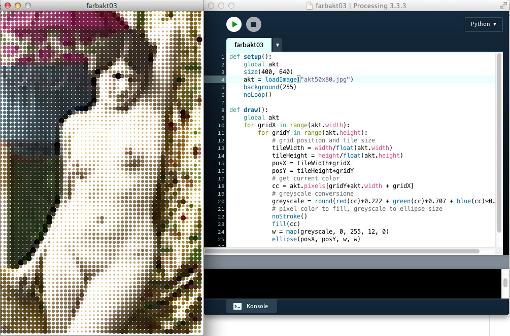

Dafür habe ich zuerst das Bild, das im Original 400 x 640 Pixel groß war, auf 50 x 80 Pixel verkleinert um dann mit

~~~python
tileWidth = width/float(akt.width)
tileHeight = height/float(akt.height)
posX = tileWidth*gridX
posY = tileHeight*gridY
~~~

ein entsprechendes Raster für das immer noch 400 x 640 Pixel große Ausgabefenster zu schaffen. Mit der Formel

~~~python
greyscale = round(red(cc)*0.222 + green(cc)*0.707 + blue(cc)*0.071)
~~~

habe ich danach die abgetasteten Farben in Graustufen gewandelt, die Gewichtungen habe ich dem oben erwähnten Buch »Generative Gestaltung« entnommen, die [Wikipedia](https://de.wikipedia.org/wiki/Grauwert) zum Beispiel nennt andere Gewichtungen, aber auch gleichverteilte Gewichtungen sind möglich und üblich. Hier gibt es also noch Raum für Experimente.

Mit

~~~python
w = map(greyscale, 0, 255, 12, 0)
~~~

habe ich dann den Radius der Kreise in Abhängigkeit von der Graustufe bestimmt: Je dunkler die Graustufe, desto größer der Kreis. Den Wert `12` habe ich experimentell herausgefunden, auch hier ist ebenfalls noch Raum für Experimente. So bekommt man zum Beispiel auch ein nettes Ergebnis, wenn man die Zeile

~~~python
fill(cc)
~~~

durch

~~~python
fill(greyscale)
~~~

ersetzt. Der [Processing-Quellcode](https://github.com/generative-design/Code-Package-Processing-3.x/blob/master/01_P/P_4_3_1_01/P_4_3_1_01.pde) aus »Generative Gestaltung« zeigt ebenfalls noch ein paar wirklich nette Möglichkeiten, was man mit so einem Grid alles anstellen kann.

### Der Quellcode

Hier nun der vollständige Quellcode, er ist -- wie fast immer -- erfrischend kurz:

~~~python
def setup():
    global akt
    size(400, 640)
    akt = loadImage("akt50x80.jpg")
    background(255)
    noLoop()

def draw():
    global akt
    for gridX in range(akt.width):
        for gridY in range(akt.height):
            # grid position and tile size
            tileWidth = width/float(akt.width)
            tileHeight = height/float(akt.height)
            posX = tileWidth*gridX
            posY = tileHeight*gridY
            # get current color
            cc = akt.pixels[gridY*akt.width + gridX]
            # greyscale conversion
            greyscale = round(red(cc)*0.222 + green(cc)*0.707 + blue(cc)*0.071)
            # pixel color to fill, greyscale to ellipse size
            noStroke()
            fill(cc)
            w = map(greyscale, 0, 255, 12, 0)
            ellipse(posX, posY, w, w)
~~~

## Videos sind auch Bilder

Bisher habe ich wenig bis gar nichts zu den Video-Fähigkeiten von Processing geschrieben. Vermutlich lag es daran, daß bei den aktuellen Versionen von Processing die Video-Bibliothek nicht mehr Bestandteil der Standard-Distribution ist, sondern daß man diese gesondert herunterladen muß. Und hier lag auch schon der erste Hase im Pfeffer.


Denn meine Versuche, die Bibliothek über das `Tools`-Menü zu installieren, endeten jedesmal mit einem Timeout: Gefühlt einhundert Mal hatte ich es probiert und jedesmal endete der Versuch mit der Fehlermeldung: »Verbindungs-Wartezeit beim Download von Video überschritten«, also einem Timeout. Nachdem ich es beinahe aufgegeben hatte, klappte es beim Versuch 101 dann doch -- die Bibliothek war endlich installiert.

Der Rest war einfach (dabei half mir auch eine schöne [Video-Tutorial-Reihe](https://www.youtube.com/playlist?list=PLRqwX-V7Uu6bw0bVn4M63p8TMJf3OhGy8) von *Daniel Shiffman*):

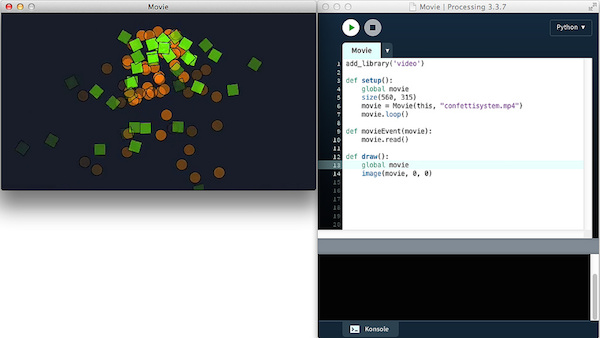

Wie [hier schon einmal beschrieben](ProcessingPy und eine Java-Bibliothek – 20170408), bindet man die Bibliothek in seinen Sketch ein und kann dann einfach loslegen:

~~~python
add_library('video')

def setup():
    global movie
    size(560, 315)
    movie = Movie(this, "confettisystem.mp4")
    movie.loop()

def movieEvent(movie):
    movie.read()

def draw():
    global movie
    image(movie, 0, 0)
~~~

Diese paar Zeilen reichen wirklich aus, um einen Video-Player in Processing.py zu schreiben. Natürlich hat die [Video-Bibliothek noch ein paar weitere Methoden](https://processing.org/reference/libraries/video/index.html), die am häufigsten benötigten sind (in meinen Augen):

- `play()` -- spielt das Video nur einmal ab (statt `loop()`)
- `pause()` -- stoppt das Video an der aktuellen Stelle
- `jump()` -- springt zu einer bestimmten Stelle im Video (Angaben in Sekunden (als Fließkommazahl -- also auch 3,57 Sekunden geht))
- `duration()` -- gibt die Länge des Films zurück (ebenfalls in Sekunden).

Wichtig ist auch noch die Funktion `movieEvent()` im obigen Sketch. Sie setzt erst die Event-Schleife in Gang, mit der das Video jedesmal, wenn ein neuer Frame bereit ist, diesenim Processing-Fenster anzeigt. Ohne diese seht Ihr nichts. 

Aber am Interessantesten ist: Ist der Frame einmal geladen, ist er ein Bild (`image`). Alle [Filter und Bildverarbeitungsfuntkionen](Filter für die Bildverarbeitung – 20170322), die es in Processing gibt, könnt Ihr daher auch auf Videos anwenden. Ich werde -- sobald ich auf Archive.org ein nettes Video gefunden habe -- in den nächsten Tagen damit ein wenig experimentieren und dann hier berichten. *Still digging!*

Die Video-Bibliothek besitzt zusätzlich noch Klassen und Methoden, um auch Live-Videos von einer Kamera direkt zu verarbeiten (`Capture()`). Aber da die integrierte Kamera meines betagten MacBook Pro nicht funktioniert (sie hatte nie wirklich funktioniert, aber ich hatte sie auch nie benötigt (ich skype aus Datenschutzgründen nie)), konnte ich diese nicht testen. Aber sie funktionieren im Prinzip genauso wie die Video-Funktionen mit gespeicherten Videos. Was die Unterschiede sind, kann man auch in der oben verlinkten Video-Playlist von *Daniel Shiffman* sehen, der intensiv damit experimentierte.

## OpenCV und Processing.py

[OpenCV](https://de.wikipedia.org/wiki/OpenCV) ist eine freie Programmbibliothek mit Algorithmen für die Bildverarbeitung und maschinelles Sehen. Sie ist für die Programmiersprachen C, C++, Python und Java geschrieben und steht als freie Software unter den Bedingungen der BSD-Lizenz. Das »CV« im Namen steht für englisch »Computer Vision«. Und nachdem ich mir kürzlich einige [Videos angesehen hatte](https://www.youtube.com/watch?v=WH31daSj4nc&list=PLRqwX-V7Uu6bw0bVn4M63p8TMJf3OhGy8), in denen *Daniel Shiffman* Computer-Vision-Algorithmen in Processing (Java) per Fuß implementiert hatte, dachte ich mir, dies müßte doch auch einfacher gehen. Denn immerhin steht OpenCV als [Bibliothek für Processing](https://github.com/atduskgreg/opencv-processing) zur Verfügung und diese basiert auf der »offiziellen« OpenCV-Java-API.

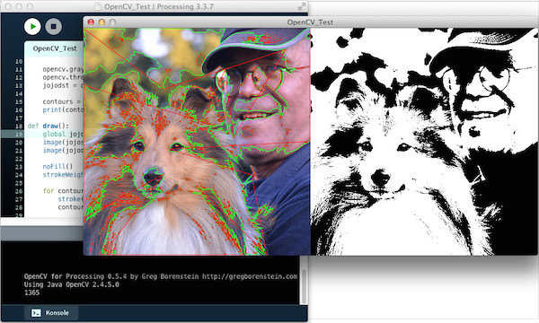

Und wirklich, das Schwierigste an dem ganzen Unterfangen war die Installation der Bibliothek. [Wie schon hier](Videos abspielen mit ProcessingPy – 20180528) war das Repositorium für die Processing-Libraries wohl zu stark beansprucht und so bekam ich die Bibliothek erst nach mehrmaligen Versuchen, die jeweils mit einem *Timeout* abbrachen, heruntergeladen.

Der Rest war dann einfach: Ich habe mich an [dieses Beispielprogramm](https://github.com/atduskgreg/opencv-processing/blob/master/examples/FindContours/FindContours.pde) in Processing (Java) von der GitHub-Seite des Projekts gehalten und es nach Python portiert. Das sah dann so aus:

~~~python
add_library('opencv_processing')

contours = []

def setup():
    global jojosrc, jojodst, contours
    size(840, 420)
    jojosrc = loadImage("jojo2.jpg")
    opencv = OpenCV(this, jojosrc)
    
    opencv.gray()
    opencv.threshold(120)
    jojodst = opencv.getOutput()
    
    contours = opencv.findContours()
    print(contours.size())

def draw():
    global jojosrc, jojodst, contours
    image(jojosrc, 0, 0)
    image(jojodst, jojosrc.width, 0)
    
    noFill()
    strokeWeight(1)
    
    for contour in contours:
        stroke(0, 255, 0)
        contour.draw()
    
        stroke(255, 0, 0)
        point = PVector()
        beginShape()
        for point in contour.getPolygonApproximation().getPoints():
            vertex(point.x, point.y)
        endShape()
~~~

Das Programm konvertiert ein Farbphoto zu einem Schwarz-Weiß-Bild und zeigt, wo die Konturlinien liegen, nach denen OpenCV entscheidet, was schwarz und was weiß dargestellt wird. Ihr könnt (und sollt -- vor allem, wenn Ihr ein anderes Photo verwendet) mit dem `threshold`-Wert herumspielen, damit Ihr seht, was da genau passiert.

Das von [mir verwendete Photo](https://www.flickr.com/photos/schockwellenreiter/7780799276/) (&copy; 2012 by *Stefanie Radon*) hatte ich auf 420 x 420 Pixel zurechtgeschnitten. Wenn ihr ein anderes Photo mit einer anderen Größe verwendet, müßt Ihr natürlich die Größe des Ausgabefensters an dieses Photo anpassen.

## Gesichtserkennung mit OpenCV und Processing.py

Eine der meist zitierten Anwendungen von OpenCV ist ja die Gesichtserkennung und da wollte ich mal testen, wie gut dies mit Processing.py und OpenCV funktioniert:

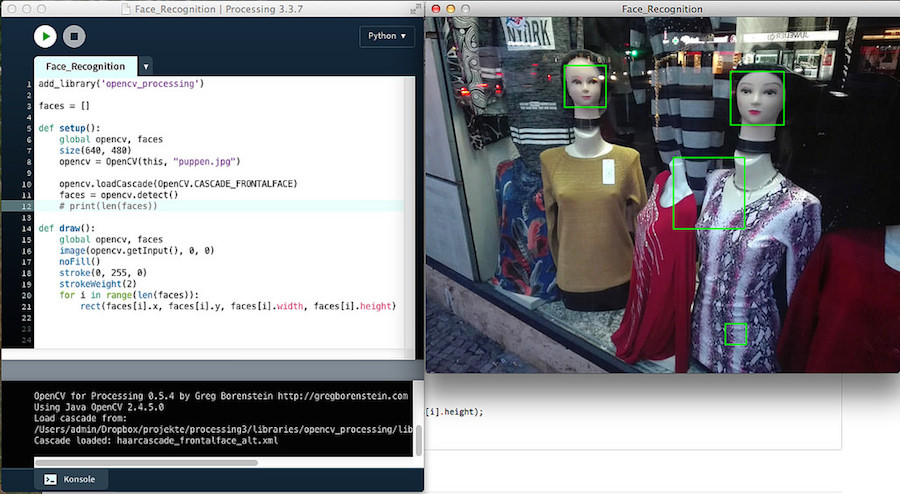

OpenCV besitzt mehrere Bibliotheken zur Gesichtserkennung, eine davon ist der *Haar Cascade Classifier*, der auf ein *Paper* von Viola und Jones aus dem Jahr 2000 zurückgeht. OpenCV bringt bereits einige vortrainierte *Haar Cascade Classifier* mit – unter anderem um Gesichter von Menschen oder Katzen zu erkennen. Der Algorothmus ist ziemlich schnell, allerdings -- wie wir sehen werden -- nicht ganz fehlerfrei.

In der `setup()`-Funktion habe ich diesen Classifier initialisiert,

~~~python
add_library('opencv_processing')

faces = []

def setup():
    global opencv, faces
    size(640, 480)
    opencv = OpenCV(this, "puppen.jpg")
    
    opencv.loadCascade(OpenCV.CASCADE_FRONTALFACE)
    faces = opencv.detect()
	# print(len(faces))
~~~

und zwar den, der Gesichter von vorne erkennen soll. Als Testbild habe ich [dieses Photo mit Schaufensterpuppen](https://www.flickr.com/photos/schockwellenreiter/28373719489/) genommen, denn Schaufensterpuppen sind vermutlich die einzige Möglichkeit, Gesichtserkennungsalgorithmen zu testen, ohne Probleme mit dem Datenschutz zu bekommen. (Das Photo hat *Gabi* geschossen, ein paar [andere Photos](https://www.flickr.com/search/?user_id=14539247%40N00&page=&view_all=1&text=Schaufenster) mit Schaufensterpuppen habe ich ebenfalls für Tests genutzt -- siehe unten)

Der Rest ist *straightforward*, zuerst wird die OpenCV-Bibliothek geladen und das Array mit den Gesichtern (`faces[]`) initialisiert. In der `setup()`-Funktion werden dann alle Gesichter, die der *Haar Cascade Classifier* erkennt, abgespeichert.

Wenn man kontrollieren will, ob überhaupt Gesichter erkannt wurden, kann man sich die Anzahl der erkannten Gesichter mit der auskommentierten `print()`-Anweisung anzeigen lassen.

Die `draw()`-Funktion zeigt das Photo und platziert um jedes erkannte Gesicht ein lindgrünes Viereck:

~~~python
def draw():
    global opencv, faces
    image(opencv.getInput(), 0, 0)
    noFill()
    stroke(0, 255, 0)
    strokeWeight(2)
    for i in range(len(faces)):
        rect(faces[i].x, faces[i].y, faces[i].width, faces[i].height)
~~~

Das ist schon alles. Wie man dem Screenshot entnehmen kann, werden zwar die beiden Gesichter der Schaufensterpuppen erkannt, aber mit dem Batik-Muster der Puppe rechts hat der Classifier so seine Probleme. Und das ist kein Einzelfall: Wie *Olver Moser* in seiner schönen »[Einführung in Computer Vision mit OpenCV und Python](https://blog.codecentric.de/2017/06/einfuehrung-in-computer-vision-mit-opencv-und-python/)« berichtet, erkennt der Classifier auch regelmäßig die Rückenlehne seines Stuhls als Gesicht. Hier muß man also entweder einen anderen, rechenintensiveren Classifier, wie zum Beispiel den »HOG Detector« verwenden, oder versuchen, den *Haar Cascade Classifier* weiter trainiern. Beides ist sehr rechenaufwendig, daher habe ich mich mit dem Ergebnis erst einmal abgefunden.

Hier sind noch ein paar Bilder aus Neuköllner Schaufenstern, mit denen sich der Classifier mal mehr und mal weniger gut geschlagen hat:

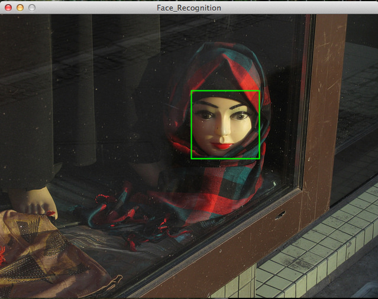

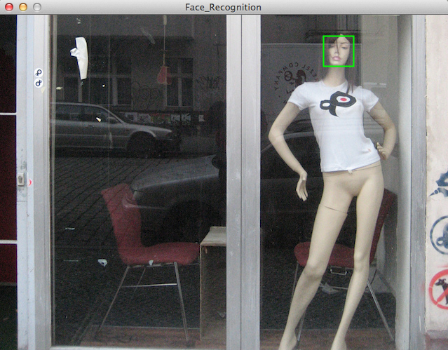

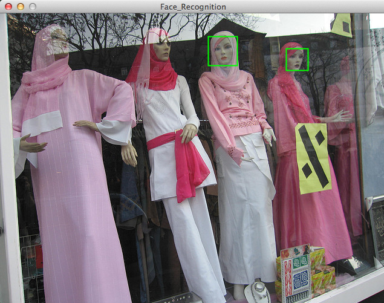

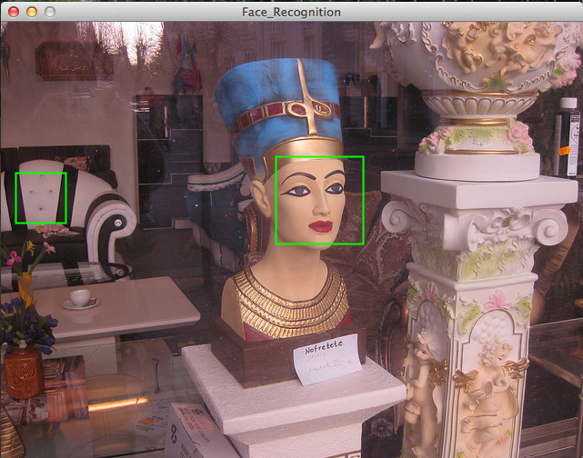

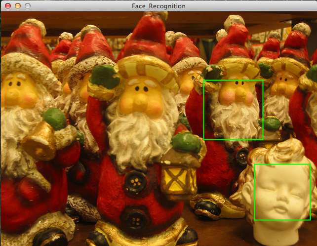

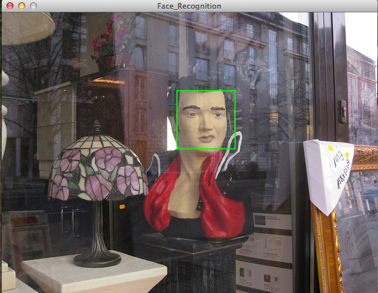

### Der Quellcode

Hier noch einmal für Neugierige der komplette Quellcode zum Nachprogrammieren:

~~~python
add_library('opencv_processing')

faces = []

def setup():
    global opencv, faces
    size(640, 480)
    opencv = OpenCV(this, "elvis.jpg")
    
    opencv.loadCascade(OpenCV.CASCADE_FRONTALFACE)
    faces = opencv.detect()
    # print(len(faces))
    
def draw():
    global opencv, faces
    image(opencv.getInput(), 0, 0)
    noFill()
    stroke(0, 255, 0)
    strokeWeight(2)
    for i in range(len(faces)):
        rect(faces[i].x, faces[i].y, faces[i].width, faces[i].height)
~~~


# Animationen

## Ein Bouncing-Ball-Simulator in Processing.py

Angeregt durch [diese vierteilige Videoserie](https://www.youtube.com/watch?v=HHQV3ifJopo&list=PLlEgNdBJEO-mRsbxRND_Cu805SCrXoOZB) auf YouTube, in der *Christian Thompson* zeigt, wie man einen Bouncing-Ball-Simulator mit dem Turtle-Modul in Python realisiert, wollte ich so etwas auch in Processing.py implementieren. Ähnlich wie Thompson wollte ich dabei Schritt für Schritt vorgehen, den Sketch also tatsächlich *bottom up* entwickeln. Auch bei mir kamen dabei vier *»Stages«* heraus, wobei diese aber nicht identisch mit den vier Videos von Thompson sind. Aber hier erst einmal ein Screenshot des Endproduktes (Stage 4):

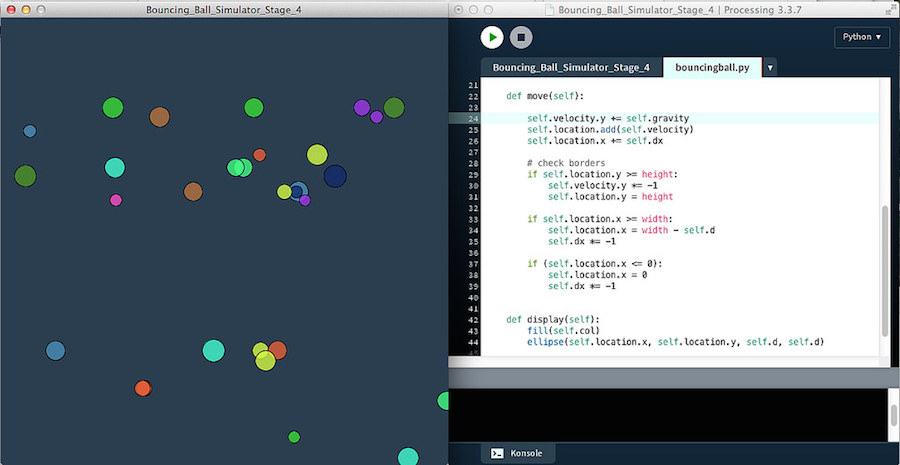

### Stage 1: Ein Ball

Doch ich beginne einfach. Zuerst einmal soll nur ein Ball im Fenster auf- und ab hüpfen. Daher habe ich einen Reiter `bouncingball` angelegt und dort die Klasse `BouncingBall` impelmentiert:

~~~python
class BouncingBall(object):
    
    def __init__(self, x, y, dia, col):
        self.x = x
        self.y = y
        self.d = dia
        self.col = col
        self.dy = 0
        self.gravity = 0.1
        
    def move(self):
        self.dy += self.gravity
        self.y += self.dy
        
        # check borders
        if self.y >= height:
            self.dy *= -1
            self.y = height
    
    def display(self):
        fill(self.col)
        ellipse(self.x, self.y, self.d, self.d)

~~~

Der Konstruktor ist zu Beginn noch ein wenig überfrachtet, weil er bekommt neben den Startkoordinaten des Balls noch den Durchmesser (`dia`) und die Farbe (`col`) mitgegeben. Zu Beginn wird die Geschwindigkeit des Balls mit Null (`dy = 0`) vorbelegt und und die Gravitätskonstante beträgt `0.1` (dieser Wert brachte experimentell das für mich beste Ergebnis).

Der Ball soll sich bewegen, das erledigt die Methode `move()` und er soll natürlich angezeigt werden, dafür ist die Methode `display()` zuständig.

In der Methode `move()` wird die Gravitätskonstante zu `dy` und dies dann zur y-Position des Balls hinzuaddiert. Dadurch fällt der Ball zu Beginn erst einmal immer schneller nach unten. Damit er nicht im Nirwana entschwindet, wird abgeprüft, ob er den unteren Bildschirmrand erreicht hat. Ist dies der Fall, wird `dy` negativ und damit steigt der Ballimmer langsamer werdend wieder nach oben, bis er den Scheitelpunkt erreicht hat und wieder schneller werdend nach unten fällt. Die Zeile

~~~python
            self.y = height
~~~

ist notwendig, da unter Umständen die Abfrage nicht genau am Fensterrand greift und der Ball sonst zitternd da unten verharrt.

Der Hauptsketch ist nur sehr kruz und wird es während der ganzen Entwicklung auch bleiben:

~~~python
from bouncingball import BouncingBall

def setup():
    global ball
    size(600, 600)
    col = color(150, 255, 100)
    ball = BouncingBall(width/2, 10, 20, col)

def draw():
    global ball
    background(0, 0, 0)
    ball.move()
    ball.display()
~~~

### Stage 2: Vektoren

Jeder, der hier aufschreit, daß das nach Vektoren schreit, hat recht. Daher habe ich in der zweiten Fassung den hüpfenden Ball vektorisiert, daß heißt, `location` und `velocity` zu Mitgliedern der Klasse `PVector` erklärt. Dafür mußte ich in der Klassenfunktion nur den Konstruktor und die Methoden `move()` und `display()` verändern, alles andere (auch der Hauptsketch) bleiben wie gehabt:

~~~python
    def __init__(self, x, y, dia, col):
        self.location = PVector(x, y)
        self.velocity = PVector(0, 0)
        self.d = dia
        self.col = col
        self.gravity = 0.1
        
    def move(self):
        self.velocity.y += self.gravity
        self.location.add(self.velocity)
        
        # check borders
        if self.location.y >= height:
            self.velocity.y *= -1
            self.location.y = height

   def display(self):
        fill(self.col)
        ellipse(self.location.x, self.location.y, self.d, self.d)
~~~

Außer das der Code nun verständlicher ist (die Gravitation wird zur Geschwindigkeit hinzuaddiert und der neue Ortsvektor wird dadurch bestimmt, daß ihm die Geschwindigkeit aufaddiert wird), ändert sich nichts -- das Programm verhält sich wie der Sketch von Stage 1.

### Stage 3: Bewegung nach rechts und links

Nun soll der Ball (respektive später die Bälle) nicht nur stur auf und ab hüpfen, sondern sich auch nach rechts oder links bewegen. Auch hierzu waren nur wenige Änderungen in der Klasse `BouncingBall` notwendig. Dem Konstruktor wurde am Ende nur eine einzige Zeile hinzugefügt:

~~~python
        self.dx = 2
~~~

Etwas aufwändiger waren die Änderungen in der Methode `move()`, aber eigentlich auch nur, weil nun die Kollisionsabfragen für den rechten und den linken Rand des Fensters hinzukamen:

~~~python
   def move(self):
        
        # self.location.x += self.dx
        self.velocity.y += self.gravity
        self.location.add(self.velocity)
        self.location.x += self.dx
        
        # check borders
        if self.location.y >= height:
            self.velocity.y *= -1
            self.location.y = height
            
        if self.location.x >= width:
            self.location.x = width - self.d
            self.dx *= -1
        
        if (self.location.x <= 0):
            self.location.x = 0
            self.dx *= -1
~~~

Die eigentliche Änderung ist nur die Zeile:

~~~python
        self.location.x += self.dx
~~~

Der Rest ist tatsächlich nur die Randabfrage, bei der die Bewegungsrichtung der x-Koordinate mit 

~~~python
            self.dx *= -1
~~~
einfach umgekehrt wird. Auch hier bleibt sonst alles andere wie gehabt, nur daß sich jetzt der Ball etwas interessanter bewegt.

### Stage 4: Viele Bälle und ein paar Verschönerungen

Im letzten Stage sollen nun viele bunte Bälle in verschiedenen Farben und Größen durch das Fenster hüpfen. Dabei hat sich erst einmal der Hauptsketch deutlich verschlankt:

~~~python
from bouncingball import BouncingBall

balls = []

def setup():
    size(600, 600)
    for _ in range(30):
        balls.append(BouncingBall())

def draw():
    background("#2b3e50")
    for ball in balls:
        ball.move()
        ball.display()
~~~

Global wurde erst einmal eine Liste `balls[]` angelegt, die die Bälle aufnehmen soll. Dafür mußten dann in den Funktionen `setup()` und `draw()` keine Variable `ball` mehr als gloabl deklariert werden.

In `setup()` werden dann 30 Bälle an die Liste angehängt. Wie man sieht, benötigt der Konstruktor keine Parameter mehr, diese werden nun alle in der Klasse `BouncingBall` erzeugt.

In der Funktion `draw()` habe ich erst einmal dem Fenster meine Lieblingshintergrundfarbe verpaßt, die -- wie man dem obigen Screenshot entnehmen kann -- leicht transparenten Bälle wirken da besser als vor einem satten schwarz.

Ja und dann werden die beiden Methoden `move()` und `display()` eben für **alle** Bälle und nicht nur für einen aufgerufen.

Es wird aber sicher niemanden wundern, daß in der Reiter `bouncingball` mit der Klasse `BouncingBall` massiven Änderungen unterworfen war. Er sieht nun so aus (die Methoden `move()` und `display()` blieben unverändert:

~~~python
import random as r

class BouncingBall(object):

    def __init__(self):
        self.x = r.randint(20, width - 20)
        self.y = r.randint(20, 200)
        self.location = PVector(self.x, self.y)
        self.velocity = PVector(0, 0)
        self.d = r.randint(15, 30)
        a = 200
        colors = [color(230, 96, 55, a), color(17, 42, 106, a),
                  color(183, 116, 64, a), color(212, 251, 69, a),
                  color(252, 75, 200, a), color(159, 53, 233, a),
                  color(57, 218, 56, a), color(67, 253, 133, a),
                  color(78, 148, 42, a), color(67, 254, 211, a),
                  color(74, 143, 186, a), color(52, 99, 234, a)] 
        self.col = r.choice(colors)
        self.gravity = 0.1
        self.dx = r.randint(-3, 3)        
~~~

Da ich mit Pythons `random`-Funktionen aus der Standardbibliothek vertrauter bin (insbesondere `randint()` und `choice()`) als mit den Processing-eigenen, habe ich diese zu Beginn importiert Und dann wird im Konstrukotr eigentlich alles, was ihm vorher als Parameter übergeben wurde, per Zufallsgenerator erzeugt. Das betrifft wowohl die Startposition wie auch der ruchmesser jedes einzelnen Balls.

Für die Farben habe ich eine Liste mit zwölf Farben angelegt, denen ich auch noch einen Transparenz- (Alpha-) Faktor von 200 zugewiesen habe.

Bekanntlich kann man in Processings-`color()`Funktion Farben im RGB-Raum wie folgt definieren:

- `color(c)` legt eine Graustufenfarbe fest,
- `color(c, a)` ergibt eine Graustufenfarbe mit der Transparenz `a`,
- `color(r, g, b)` ergibt eine RGB-Farbe, und
- `color(r, g, b, a)` analog eine RGB-Farbe mit der Transparenz `a`.

Zum Schluß habe ich auch noch die Bewegung in x-Richtung zufällig bestimmen lassen.

Das war schon alles. Wenn Ihr den Sketch nun startet, hüpfen 30 Bälle in verschiednen Farben und Größen fröhlich durch das Fenster.

### Der komplette Quellcode

Wie immer bei allen meinen Tutorien gibt es zum Schluß den kompletten Quellcode, damit Ihr alles nachprogrammieren und nachvollziehen könnt. Zuerst den Reiter `bouncingball`:

~~~python
import random as r

class BouncingBall(object):

    def __init__(self):
        self.x = r.randint(20, width - 20)
        self.y = r.randint(20, 200)
        self.location = PVector(self.x, self.y)
        self.velocity = PVector(0, 0)
        self.d = r.randint(15, 30)
        a = 200
        colors = [color(230, 96, 55, a), color(17, 42, 106, a),
                  color(183, 116, 64, a), color(212, 251, 69, a),
                  color(252, 75, 200, a), color(159, 53, 233, a),
                  color(57, 218, 56, a), color(67, 253, 133, a),
                  color(78, 148, 42, a), color(67, 254, 211, a),
                  color(74, 143, 186, a), color(52, 99, 234, a)] 
        self.col = r.choice(colors)
        self.gravity = 0.1
        self.dx = r.randint(-3, 3)
        
    def move(self):
        
        self.velocity.y += self.gravity
        self.location.add(self.velocity)
        self.location.x += self.dx
        
        # check borders
        if self.location.y >= height:
            self.velocity.y *= -1
            self.location.y = height
            
        if self.location.x >= width:
            self.location.x = width - self.d
            self.dx *= -1
        
        if (self.location.x <= 0):
            self.location.x = 0
            self.dx *= -1


    def display(self):
        fill(self.col)
        ellipse(self.location.x, self.location.y, self.d, self.d)
~~~

Und dann noch einmal den immer noch sehr kurzen Hauptsketch:

~~~python
from bouncingball import BouncingBall

balls = []

def setup():
    size(600, 600)
    for _ in range(30):
        balls.append(BouncingBall())

def draw():
    background("#2b3e50")
    for ball in balls:
        ball.move()
        ball.display()
~~~

Als nächsten Schritt könnte man natürlich noch die Reibung berücksichtigen, die die Simualtion wirklichkeitsnäher macht und dafür sorgen würde, daß die Bewegungen immer schlaffer werden und irgendwann alle Bälle ermattet am Boden liegen.


## Ein kleiner roter Luftballon

*Ein roter Luftballon am Himmel.   
Ich habe nie einen gekriegt.   
Ich bin ein Kind reeller Leute,   
bei denen alles etwas wiegt.   
(Michael Heltau)*

Die Idee zu diesem Tutorial kam mir, nachdem ich [ein Video](https://www.youtube.com/watch?v=DPFJROWdkQ8) von *Daniel Shiffman* gesehen hatte, in dem er Pflanzen wie Blasen aufsteigen ließ. Dieser Sketch war eine Erweiterung eines anderen Sketches *Bubbles* ([Quellcode](https://github.com/CodingRainbow/Rainbow-Code/tree/master/Processing/11_video/sketch_15_2_array_images)), in dem er die dort verwendeten Kreise durch die Bilder von Blüten ersetzte. Ich dachte mir, so etwas ähnliches möchte ich auch einmal mit Processing.py programmieren und es sollte auch noch schöner aussehen. Zwar hatte ich zumindest eine der Blüten auch als PNG-Datei -- es ist nämlich das Logo von *TextMate 2*, meines bevorzugten Texteditors --, aber ich dachte schon beim Anschauen des Videos sofort an Ballons und die bekommt man als Emoji geliefert. Nun ist aber Python 2.7 und damit auch Jython, das den Python-Mode von Processing antreibt, nicht gerade wirklich UTF-8-fest und Emoji-freundlich, also mußten Bilder her. Die Lösung sind die [Twemojis](https://github.com/twitter/twemoji) von Twitter, ein vollständiger Emoji-Bilder-Satz in diversen Auflösungen und auch als SVG, der unter der unter der [CC-BY-4.0](https://creativecommons.org/licenses/by/4.0/) Lizenz steht und frei verwendet werden kann. Dort habe ich mir erst einmal den Ballon als 72x72 Pixel großes, transparentes PNG herausgesucht (`1f388.png`) und dann zum Warmwerden damit diesen kleinen Sketch geschrieben:

~~~python
speed = 1.5

def setup():
    global balloon, x, y
    size(400, 200)
    balloon = loadImage("1f388.png")
    x = random(0, width-72)
    y = height

def draw():
    global balloon, x, y
    background(51)
    image(balloon, x, y)
    y -= speed
    if (y < -72):
        y = height
        x = random(0, width-72)
~~~

Damit zieht ein einsamer kleiner, roter Luftballon durch das Sketch-Fenster, der -- wenn er oben am Fesnterrand verschwindet -- unten an einer anderen, zufälligen Position wieder auftaucht.

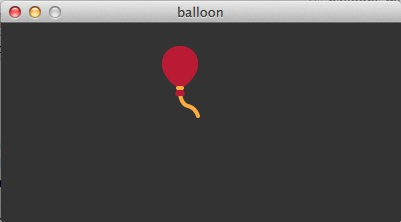

### Viele, viele rote Luftballons

Doch da geht natürlich mehr. Ich wollte mehrere Ballons aufsteigen lassen und sie sollten sich auch ein wenig zufälliger bewegen. Und was macht man, wenn man mehrere ähnliche Objekt hat? Richtig, man erstellt eine Klasse für diese Objekte:

~~~python
class Balloon():
    
    def __init__(self, dia, img):
        self.diameter = dia
        self.x = random(0, width - self.diameter)
        self.y = height
        self.diameter = dia
        self.img = img
        self.yspeed = random(0.5, 2)
        
    def move(self):
        self.y -= self.yspeed
        self.x = self.x + random(-2, 2)
        
    def display(self):
        image(self.img, self.x, self.y, self.diameter, self.diameter)
        
    def top(self):
        if (self.y <= 0):
            self.y = 0
~~~

Bilder in Processing funktionieren im Prinzip wie Rechtecke. Wird die Funktion `image(x, y)` nur mit zwei Parametern aufgerufen, wird das Bild an dieser Stelle in seiner vollen Größe gezeigt. Ruft man hingegen `image(x, y, w, h)` auf, dann wird das Bild an dieser Stelle mit den Seitenlängen `w` und `h` gezeigt. Dabei wird das Bild im Zweifelsfalle auch proportional gestaucht oder gestreckt. Ihr könnt es einfach mal ausprobieren, indem Ihr ein Bild in `draw()` mit `image(0, 0, mouseX, mouseY)` aufruft.

Ich habe aber einfach dem Konstruktor der Klasse den Durchmesser des Bildes mitgegeben und eine Referenz auf das Bild, das zu laden ist. Dann wird mit `move()` das Bild bewegt und mit `display()` wird es in das Sketchfenster gezeichnet. Diese Konstruktion wird Euch in vielen Klassen in Processing begegnen.

Eine Besonderheit ist die Methode ` top()`. Hier wird abgefragt, ob der Luftballon das obere Fenster erreicht hat und bleibt dann zitternd dort kleben.

Hier dann das Hauptprogramm,

~~~python
from balloon import Balloon

numBalloons = 15
balloons = []

def setup():
    size(640, 320)
    i = 0
    balloon = loadImage("1f388.png")
    while (i < numBalloons):
        dia = random(24, 72)
        balloons.append(Balloon(dia, balloon))
        i += 1

def draw():
    background(51)
    for i in range(len(balloons)):
        balloons[i].move()
        balloons[i].display()
        balloons[i].top()
~~~

das dann dieses Bild erzeugt, das ich in diesem Screenshot zu Beginn festgehalten habe:

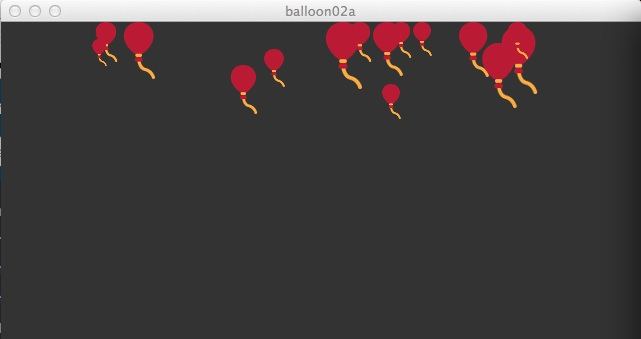

Ein wenig habe ich dabei gemogelt. Denn um überhaupt noch ein paar Ballons zu erwischen, die nicht an der Decke kleben, hatte ich die Geschwindigkeit drastisch reduziert.

### Es kann nicht nur einen geben

Meine Idee war es aber, daß die Ballons vollständig den oberen Fensterrand passieren und dann an einer zufälligen Position und in einer zufälligen Größe unten wieder auftauchte, so daß die Illusion eines kontinuierlichen Ballonaufstiegs entsteht. Daher habe ich die Methode `top()` in der Klasse `Ballon` umgeschrieben:

~~~python
    def top(self):
        if (self.y <= -self.diameter):
            self.y = height + self.diameter
            self.x = random(0, width - self.diameter)
            self.diameter = random(24, 72)
            self.yspeed = random(0.5, 2)
~~~

Außerdem fand ich nur einen Ballon langweilig. *Dan Shiffman* hat in seinem oben erwähnten Video ja auch drei unterschiedliche Blüten genützt. Also habe ich die Twemojis weiter geplündert und mir diese drei Vertreter ausgesucht:

  

Neben dem schon bekannten Ballon (`1f388.png`) ist es noch ein Halloween-Kürbis (`1f383.png`) und ein japanisches Windspiel (`1f390.png`), das zum Himmel aufsteigen soll:


Die Klasse `Balloon` mußte dafür nicht weiter geändert werden, aber im Hauptprogramm habe ich einige Erweiterungen durchgeführt.

~~~python
from balloon import Balloon

numBalloons = 100
balloons = []

def setup():
    size(640, 320)
    i = 0
    balloon = loadImage("1f388.png")
    jackolantern = loadImage("1f383.png")
    windchime = loadImage("1f390.png")
    while (i < numBalloons):
        rand = random(10)
        if (rand < 1):
            img = jackolantern
        elif (rand < 8):
            img = balloon
        else:
            img = windchime
        dia = random(24, 72)
        balloons.append(Balloon(dia, img))
        i += 1

def draw():
    background(51)
    for i in range(len(balloons)):
        balloons[i].move()
        balloons[i].display()
        balloons[i].top()
~~~

Die Anzahl der »Ballons« habe ich großzügig auf 100 erhöht -- man hat's ja. In `setup()` habe ich dann die Bilder der einzelnen Objekte geladen und in der `while`-Schleife sie erst einmal zufällig verteilt und dann die 100 Objekte in einer Liste erzeugt.

### In Lorenzkirch ist Jahrmarkt


Zu guter Letzt habe ich noch den Hintergrund aufgehübscht und ihn mit einem Bild des [Jahrmarkts von Lorenzkirch](https://de.wikipedia.org/wiki/Lorenzkirch#Gr.C3.BCndung_des_Ortes_Lorenzkirch.2C_der_Sankt_Laurentiuskirche_und_des_Laurentiusmarktes) um 1900 versehen. Der vollständige Sketch sieht nun so aus:

~~~python
from balloon import Balloon

numBalloons = 100
balloons = []

def setup():
    global jahrmarkt
    size(640, 320)
    jahrmarkt = loadImage("jahrmarkt.jpg")
    i = 0
    balloon = loadImage("1f388.png")
    jackolantern = loadImage("1f383.png")
    windchime = loadImage("1f390.png")
    while (i < numBalloons):
        rand = random(10)
        if (rand < 1):
            img = jackolantern
        elif (rand < 8):
            img = balloon
        else:
            img = windchime
        dia = random(24, 72)
        balloons.append(Balloon(dia, img))
        i += 1

def draw():
    global jahrmarkt
    background(jahrmarkt)
    # background(51)
    for i in range(len(balloons)):
        balloons[i].move()
        balloons[i].display()
        balloons[i].top()
~~~

An der Klasse `Balloon` wurde nichts mehr geändert.

### Credits

Neben den oben schon erwähnten Twemojis, für die ich Twitter danke, habe ich das [Bild des Lorenzmarktes um 1900](https://commons.wikimedia.org/wiki/File:Jahrmarkt_in_Lorenzkirch_im_Jahr_1900.jpg) den Wikimedia Commons entnommen. Es ist alt genug, daß es gemeinfrei ist und frei verwendet werden darf.

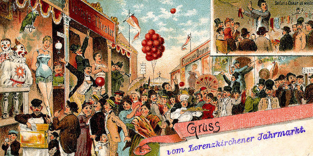

# Exkurs: Spaß mit (SVG-) Shapes oder Pinguine im Eismeer

Neben Bildern kann Processing (und damit auch Processing.py) auch SVG-Dateien laden und darstellen. Wie alle anderen Assets auch, müssen diese sich im `data`-Verzeichnis des Sketches befinden, damit Processing sie auch finden kann. Doch woher soll solch ein absoluter Kunstbanause wie ich SVG-Dateien finden, wenn er sie nicht stehlen will? Hier haben mir wieder die [Twemojis](https://github.com/twitter/twemoji) geholfen, der vollständige Emoji-Bilder-Satz von Twitter, der nicht nur in diversen Auflösungen, sondern auch als SVG-Dateien unter der [CC-BY-4.0 Lizenz](https://creativecommons.org/licenses/by/4.0/) zur Verfügung steht und frei verwendet werden kann. Eines dieser Emojis (mit der Dateibezeichnung `1f427.svg`) ist ein Pinguin und mit dem möchte ich nun ein wenig herumspielen.

SVG-Dateien sind Vektorgraphiken und sie können verlustlos vergrößert und verkleinert werden. Das möchte ich im ersten Sketch vorführen:

~~~python
def setup():
    global penguin
    size(400, 400)
    penguin = loadShape("1f427.svg")
    shapeMode(CENTER)

def draw():
    background(155)
    shape(penguin, width/2, height/2,
          map(mouseX, 0, width, 0, 800),
          map(mouseX, 0, width, 0, 800))
~~~

Die Größe des Pinguins ist nun von der Mauskoordinate-x abhängig und variiert von winzig klein bis riesengroß. Zu beachten ist, daß auch ein SVG-Shape diverse `shapeModes()` besitzen kann, der Default ist `CORNER`, bei dem die linke obere Ecke der Ankerpunkt ist, aber es gibt, wie bei anderen Shapes auch, die Modes `CENTER` und `CORNERS`.

Ein SVG-Shape wird mit `loadShape("dateiname.svg")` geladen und mit

~~~python
shape(dateihandle, x, y)
~~~

oder

~~~python
shape(dateihandle, x, y, w, h)
~~~

in das Sketch-Fenster gezeichnet. Im ersten Fall wird das SVG-Shape an den Punkten `x, y` in der Originalgröße gezeichnet, im zweiten Fall wird das SVG-Shape mit den Paramtern für die Weite und Höhe verkleinert oder vergrößert dargestellt.


Wenn Ihr diesen Sketch laufen lasst, seht Ihr, daß die Verkleinerung oder Vergrößerung tatsächlich absolut verlustfrei erfolgt.

## Und nun das Eismeer

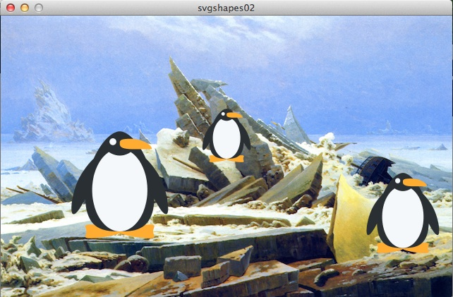

Wenn man den obige Sketch ein wenig erweitert, kann man etwas mehr Aktion in die Angelegenheit bringen. Ich habe dazu drei Pinguine in ein Eismeer gestellt, die, je nach Interpretation, ein wenig die Gegend erkunden oder sich einfach nur die Füße vertreten.

~~~python
easing = 0.05
offset = 0

def setup():
    global penguin, landscape
    size(640, 400)
    penguin = loadShape("1f427.svg")
    landscape = loadImage("eismeer.jpg")
    

def draw():
    global offset
    background(landscape)
    
    targetOffset = map(mouseX, 0, width, -100, 100)
    offset += (targetOffset - offset)*easing
    smallerOffset = offset*0.7
    smallestOffset = smallerOffset * -0.5
    shape(penguin, 60 + offset, 160, 160, 160)
    shape(penguin, 260 + smallerOffset, 130, 80, 80)
    shape(penguin, 520 + smallestOffset, 220, 120, 120)
~~~

Es passiert eigentlich immer noch nicht viel, aber wenn man etwas mehr Aktion wünscht, dann kommt man wohl nicht darum herum, eine Pinguin-Klasse anzulegen und die einzelnen Pinguin-Objekte in einer Liste zu verwalten, so wie ich es zum Beispiel im letzten Tutorial mit den Ballons gemacht hatte.

## Wartet, da ist noch mehr

Die Funktion `shape()` kann nicht nur SVG-Dateien darstellen, sondern auch dreidimensionale OBJ-Dateien. Dafür muß natürlich der Sketch im `P3D`-Mode laufen.

## Credits

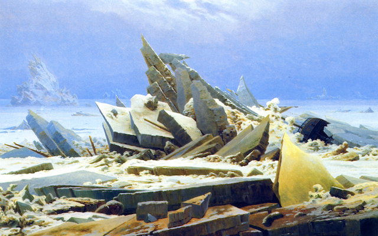

Das Hintergrundbild des zweiten Sketches ist ein Gemälde des deutschen, romantischen Malers [Caspar David Friedrich](https://de.wikipedia.org/wiki/Caspar_David_Friedrich). Dieser ist 1840 gestorben, also hinreichend lange tot, so daß das Bild gemeinfrei ist und ohne Lizenzkosten verwendet werden kann.

# Objekte und Klassen mit Kitty

## Hallo Hörnchen – Hallo Kitty revisited

Ich hatte vor einiger Zeit mal ein PyGame-Tutorial geschrieben. Doch da PyGame aus irgendwelchen Gründen nicht mit Python 3 spielt und auch sonst ziemlich buggy geworden ist, habe ich beschlossen,  mein vierteiliges PyGame-Tutorial in Processing.py zu implementieren. Erfreulich war, daß ich mir den ersten Teil gleich schenken konnte, denn

~~~python
def setup():
    size(640, 480)

def draw():
    background(0, 80, 125)
~~~

erzeugt bereits ein leeres, blaues Fenster. Also habe ich gleich den zweiten Teil in Angriff genommen und das *»Horn Girl«* aus dem von *Daniel Cook (Danc)* in seinem Blog *[Lost Garden](http://www.lostgarden.com/search/label/free%20game%20graphics)* unter einer [freien Lizenz](http://www.lostgarden.com/2007/03/lost-garden-license.html) ([CC BY 3.0 US](http://creativecommons.org/licenses/by/3.0/us/)) zu Verfügung gestellten Tileset [Planet Cute](http://www.lostgarden.com/2007/05/dancs-miraculously-flexible-game.html) in das Fenster gezaubert:


Zur Vorbereitung habe ich erst einmal das Bild der jungen Dame auf das Editorfenster der Processing-IDE geschoben. Falls noch nicht vorhanden, erzeugt Processing dann automatisch ein `data`-Verzeichnis und legt das Bild (aber auch Schriften oder andere Dateien) darin ab. Processing und damit auch Processing.py finden alles in diesem Verzeichnis ohne daß eine genauere Pfadangabe nötig ist. Und so ist auch das fertige Programm von erfrischender Kürze:

~~~python
font = None
greetings = u'Hallo Hörnchen!'

def setup():
    global img
    size(640, 480)
    img = loadImage("horngirl.png")
    font = createFont("Verdana-Bold", 64)
    textFont(font)

def draw():
    background(0, 80, 125)
    image(img, 275, 100)
    text(greetings, 25, 350)
~~~

Mehr ist nicht nötig, um obigen Screenshot zu bekommen. Vergleiche ich diese 14 Zeilen mit den 34 Zeilen der PyGame-Version, dann frage ich mich schon, warum ich nicht früher zu Processing.py gewechselt bin[^11_1].

[^11_1]: Ich will ehrlich sein: Die »Geschwätzigkeit« von PyGame ist nicht nur dem hohen Alter der Bibliothek geschuldet, sie erlaubt eine große Vielseitigkeit und erspart dem Programmierer dann wieder bei komplizierten Dingen viel Schreibarbeit. So ist zum Beispiel die eingebaute `Sprite`-Klasse und die Kollisionsprüfung etwas, was ich in Processing.py von Hand programmieren muß.

An der zweiten Zeile kann man es erkennen: Processing.py basiert auf Jython und ist damit kompatibel zu Python 2.7.5, aber nicht zu Python 3. Daher muß man Unicode-Strings (zum Beispiel mit deutschen Umlauten) explizit mit dem vorangestellten `u` markieren, sonst bekommt man seltsame Zeichen im Programmfenster angezeigt.

Processing(.py) kann mit Fonts im TrueType- (`.ttf`), OpenType- (`.otf`) und in einem eigenen Bitmap-Format, genannt VLW, umgehen. Natürlich findet es alle auf dem eigenen Rechner installierte Fonts, mit

~~~python
fontList = PFont.list()
print(fontList)
~~~

kann man sich diese in der Konsole anzeigen lassen. Wenn man den Sketch allerdings weitergeben will, ist es sinnvoll, einen Font mitzugeben[^11_2], da man nicht sicher sein kann, ob der gewählte Systemfont auf dem anderen Rechner vorhanden ist. Dafür schiebt man eine entsprechende Font-Datei einfach ebenfalls auf das Editorfenster der IDE, damit sie dem `data`-Ordner hinzugefügt wird. Ich habe testweise mal die Datei `OpenSans-Semibold-webfont.ttf` installiert, die entsprechende Zeile im Programm hieße dann:

[^11_2]: Natürlich sollte man sicherstellen, daß man diese Fonts auch verwerten darf, aber im Netz findet man viele Fonts zur freien Verwendung. Gute Anlaufstellen dafür sind zum Beispiel [Google Fonts](https://fonts.google.com/), die [(Open) Font Library](https://fontlibrary.org/de/homepage) oder [The League of Moveable Type](https://www.theleagueofmoveabletype.com/).

~~~python
font = createFont("OpenSans-Semibold-webfont.ttf", 64)
~~~

Der zweite Parameter der Funktion `createFont()` benennt die gewünschte Größe des Fonts. Mehr ist zu diesem ersten Sketch in Processing.py eigentlich nciht zu sagen. Im nächsten Schritt wird es darum gehen, die junge Dame über das Fenster zu bewegen. Nach meinen Erfahrungen mit PyGame werde ich sie nicht nur mit der Maus, sondern auch mit der Tastatur steuern. *Still digging!*


## Moving Kitty

Im zweiten Teil möchte ich die im letzten Abschnitt auf den Monitor gezauberte *Kitty* mithilfe der Pfeiltasten der Tastatur sich über den Monitor bewegen lassen.


In Processing gehören die Pfeiltasten wie einige andere auch zu den `coded keys`, weil sie sich nicht einem Buchstaben zuordnen lassen und haben daher einen speziellen Namen. Die Pfeiltastten heißen `LEFT`, `RIGHT`, `UP` und `DOWN`, andere `coded keys` sind zum Beispiel `ALT`, `CONTROL` oder `SHIFT`. Diese müssen in Processing wie in Processing.py gesondert abgefragt werden, und zwar so:

~~~python
    if keyPressed and key == CODED:
        if keyCode == LEFT:
~~~

während die »normalen« Tasten so abgefragt werden können:

~~~python
    if keyPressed:
        if key == 'b' or key == 'B':
~~~

Das ist eigentlich alles, was man wissen muß, um das Progrämmchen zu verstehen. Wenn Kitty den linken Rand des Fensters erreicht hat, taucht sie am rechten Rand wieder auf und umgekehrt. Genauso habe ich mit oben unten verfahren. Die Variabeln `radius_x` und `radius_y` sorgen dafür, daß *Kitty* vollständig vom Bildschirm verschwunden ist, bevor sie am anderen Ende wieder auftaucht (ich mag keine halben Kittys 😜 ) und mit `STEP` bestimmt Ihr die Geschwindigkeit, mit der Kitty über den Bildschirm wuselt. Hier der vollständige Quellcode zum nachprogrammieren:

~~~python
pos_x = 275
pos_y = 100
radius_x = 50  # Bildbreite/2
radius_y = 85  # Bildhöhe/2
STEP = 5       # Geschwindigkeit

def setup():
    global horngirl
    size(640, 480)
    horngirl = loadImage("horngirl.png")

def draw():
    global pos_x, pos_y
    background(0, 80, 125)
    image(horngirl, pos_x, pos_y)
    if keyPressed and key == CODED:
        if keyCode == LEFT:
            pos_x -= STEP
        elif keyCode == RIGHT:
            pos_x += STEP
        elif keyCode == UP:
            pos_y -= STEP
        elif keyCode == DOWN:
            pos_y += STEP
        if pos_x > width + radius_x:
            pos_x = -radius_x
        elif pos_x < -2*radius_x:
            pos_x = width + radius_x
        if pos_y < -2*radius_y:
            pos_y = height
        elif pos_y > height:
            pos_y = -radius_y
~~~

*Kitty* alias *»Horn Girl«* stammt wieder aus dem von *Daniel Cook (Danc)* in seinem Blog *Lost Garden* unter einer freien Lizenz (CC BY 3.0 US) zu Verfügung gestellten Tileset Planet Cute. Aber Ihr könnt natürlich auch jedes andere Bild nehmen, das gerade auf Eurer Festplatte herumliegt.


## Klasse Kitty!

Nach den ersten beiden Abschnitten möchte ich erst einmal ein wenig aufräumen und daran erinnern, daß Akteure eines Computerspiels programmiertechnisch am besten in Klassen aufgehoben sind. Daher habe ich auch *Kitty* eine eigene Klasse spendiert:

~~~python
# coding=utf-8

class Kitty(object):
    def __init__(self, tempX, tempY):
        self.x = tempX
        self.y = tempY
        self.radiusX = 50  # Bildbreite/2
        self.radiusY = 85  # Bildhöhe/2
        
    def loadPic(self):
        self.img = loadImage("horngirl.png")
    
    def move(self):
        self.x = mouseX - self.radiusX
        self.y = mouseY - self.radiusY
        
    def display(self):
        image(self.img, self.x, self.y)
~~~

Klassen kann man in Processing der Übersicht halber in separaten Dateien unterbringen, die in der IDE jeweils einen eigenen Reiter bekommen (siehe Screenshot).


Hierbei ist jedoch zu beachten, daß im Gegensatz zu Processing und P5.js (jeweils aus anderen Gründen) die Klasse nicht automatisch dem Quelltext der Applikation bei der Ausführung hinzugefügt wird. Sie ist wenn sie nicht im Quelltext der Applikation steht -- wie in Python üblich -- ein Modul und muß gesondert mit

~~~python
from kitty import Kitty
~~~

importiert werden. Und da sie ein reines Python2- (oder genauer Jython-) Modul ist, sollte man auch nicht vergessen `# coding=utf-8` in die erste Zeile der Datei schreiben, denn sonst bekommt man Probleme mit dem *ö* im Kommentar (*Bildhöhe*).

Den Konventionen folgend, habe ich dem Objekt *Kitty* neben der eigentlichen Initialisierung drei Funktionen spendiert, nämlich `loadPic()`, `move()` und `display()`. Die beiden letzeren hätte man auch in einer Funktion zusammenfassen können (beispielsweise `update()` wie bei PyGame üblich), aber da die Philosophie sein sollte, jeder Aktivität eine eigene Funktion zu spendieren, bin ich der Konvention gefolgt[^11_3].

[^11_3]: Ein bei Processing.py durchgehend zu beobachtender Konventionsbruch macht mich allerdings wuschig. Während die PEP8 für Variablennamen die Trennung durch Unterstriche empfiehlt (z.B. `mouse_x`) folgen die Programmierer der Beispielprogramme durchgehend der Java-Konvention des *camelCase* (`mouseX`). Ich habe mich erst einmal entschlossen, ebenfalls den *camelCase* zu nutzen, ob ich dabei aber bleiben werde, weiß ich noch nicht.

Ansonsten ist zu dem Programm nichts weiter zu sagen. Es zeigt einfach eine *Kitty* die der Maus hinterherrennt. Und dadruch, daß fast die gesamte Logik in die Klasse `Kitty` ausgelagert wurde, ist das Hauptprogramm von erfrischender Kürze:

~~~python
from kitty import Kitty

kitty = Kitty(275, 100)

def setup():
    size(640, 480)
    kitty.loadPic()

def draw():
    background(0, 80, 125)
    kitty.move()
    kitty.display()
~~~

So muß es ja auch sein.


## »Cute Planet«

Im letzten Abschnitt hatte ich ja eine Klasse erstellt. Auf den ersten Blick erschien sie nicht besonders nützlich, da ich im eigentlichen Sketch ja nur eine Instanz der Klasse erzeugt hatte. So sah das schon ein wenig nach mehr Schreibaufwand ohne großen Nutzen aus. Um die Skeptiker zu überzeugen, werde ich in diesem Tutorial wieder eine Klasse erstellen, von der es im Sketch dann aber vier Instanzen geben wird. Vier Raumschiffe werden im Anschluß über den Bildschirm wuseln.


Also erst einmal die Klasse selber, ich habe sie aus naheliegenden Gründen `Spaceship` genannt (auch wenn ein Planet ja im eigentlichen Sinne des Wortes kein Raumschiff ist, aber wie Ihr später sehen werdet, in »Space Cute« schon 😜 ):

~~~python
class Spaceship():
    
    def __init__(self, pic, posX, posY):
        self.pic = pic
        self.x = posX
        self.y = posY
        self.dx = 0
        
    def loadPic(self):
        self.img = loadImage(self.pic)
    
    def move(self):
        self.x += self.dx
        if self.x >= width + 120:
            self.x = -120
            self.y = random(height-120)
        elif self.x < -120:
            self.x = width + 120
            self.y = random(height-120)
    
    def display(self):
        image(self.img, self.x, self.y)
~~~

Der Konstruktor der Klasse verlangt die URL eines Bildes, das das Raumschiff (oder den Planeten) auf dem Monitor darstellt und eine initiale Position, auf der es im Fenster erscheinen soll.

Dann gibt es die Funktion `loadPic()`, die dieses Bild dann lädt. Die Bilder stammen wieder aus dem von *Daniel Cook (Danc)* in seinem Blog *Lost Garden* unter einer freien Lizenz (CC BY 3.0 US) zu Verfügung gestellten Tileset *Planet Cute*. Ich habe sie mit dem [Bildverarbeitungsprogramm meiner Wahl](http://cognitiones.kantel-chaos-team.de/multimedia/computergraphik/gimp.html) zurechtgeschnitten und auf eine Größe von 120x120 Pixeln heruntergerechnet und sie dann wie immer durch einfaches Schieben auf das Editor-Fenster der Processing IDE in den `data`-Ordner des Sketches transportiert. So findet Processing (und damit auch Processing.py) sie ohne zusätzliche Pfadangabe.

   

Dann folgt die Funktion `move()`, die das Herzstück der Klasse darstellt. Hier werden die einzelnen Raumschiffe bewegt und wenn sie die Grenzen des Fenster verlassen haben, von der gegenüberliegenden Seite von einer zufällig gewählten Position wieder zurück ins Fenster geschickt. Die Funktion `display()` kümmert sich dann um die Darstellung des Raumschiffs.

Nun das Hauptprogramm: Dank der Klasse `Spaceship` ist es kurz und übersichtlich geblieben.

~~~python
from spaceship import Spaceship

planet = Spaceship("planet.png", 500, 350)
rocket = Spaceship("rocketship.png", 300, 300)
octopussy = Spaceship("octopussy.png", 400, 150)
beetle = Spaceship("beetleship.png", 200, 100)

ships = [planet, rocket, octopussy, beetle]

def setup():
    size(640, 480)
    planet.loadPic()
    planet.dx = 1
    rocket.loadPic()
    rocket.dx = 10
    octopussy.loadPic()
    octopussy.dx = -5
    beetle.loadPic()
    beetle.dx = 5

def draw():
    background(0, 80, 125)
    for i in range(len(ships)):
        ships[i].move()
        ships[i].display()
~~~

Als erstes wird die Klasse `Spaceship` importiert und der Variablen `spaceship` zugewiesen. Dann werden vier *Spaceships«* erzeugt und einer Variablen zugewiesen, die den Konstruktor der Klasse aufruft. Dann wird noch eine Liste erstellt, die alle vier »Raumschiffe« enthält. Im `setup()` laden dann alle vier ihre Bilder und bekommen (mit `dx`) eine Geschwindigkeit verpaßt.

Das war es dann scho fast: In `draw()` wird dann nur noch eine Schleife durchlaufen, die für jedes der »Raumschiffe« die Funktionen `move()` und `display()` aufruft. Wenn Ihr nun den Sketch laufen laßt, werdet Ihr sehen, daß im Weltall rund um den Planeten »Space Cute« ein Verkehr wie auf dem Kudamm herrscht. Stellt Euch mal vor, ich hätte noch mehr Instanzen der Klasse `Spaceship` erzeugt.


## Fluffy Fish - ein Flappy-Bird-Klon in Processing.py

In seiner [100. Coding-Challenge](http://blog.schockwellenreiter.de/2018/04/2018041902.html) (mit [Fortsetzung](http://blog.schockwellenreiter.de/2018/04/2018042601.html)) hatte *Daniel Shiffman* gezeigt, wie man mit Hilfe eines [Neuronalen Netzwerkes](http://blog.schockwellenreiter.de/2018/01/2018012303.html) und [genetischen Algorithmen](https://de.wikipedia.org/wiki/Evolution%C3%A4rer_Algorithmus) seinem Rechner beibringen kann, erfolgreich [Flappy Bird](https://de.wikipedia.org/wiki/Flappy_Bird) zu spielen. Grundlage war sein eigener [Flappy-Bird-Klon](http://blog.schockwellenreiter.de/2016/08/2016081103.html), den er in P5.js, dem JavaScript-Mode von *Processing*, implementiert hatte. Natürlich reizt das zur Nachahmung in Python, doch bevor ich mich an [neuroevolutionäre Algorithmen](https://de.wikipedia.org/wiki/NeuroEvolution_of_Augmented_Topologies) (NEAT) wage, möchte ich zur Übung in der Programmiersprache meines Vertrauens doch erst einmal selber einen Flappy-Bird-Klon bauen. Damit ich nicht zu weit von *Shiffmans* Vorgaben abweiche, programmierte ich das in Processing.py, dem Python-Mode von Processing.


Um das Ganze aufzuhübschen, habe ich statt des Vogels einen Fisch gewählt, dessen Bild ich Twitters [Twemojis](https://github.com/twitter/twemoji), einer freien (MIT-Lizenz für den Code und [CC-BY 4.0](https://creativecommons.org/licenses/by/4.0/) für die Graphiken) Emoji-Implementierung entnommen habe. Ich habe den Fisch in der Bildverarbeitung meines Vertrauens gespiegelt und auf eine Größe von 32x32 Pixeln zurechtgestutzt. Natürlich heißt das Programm nun auch nicht *Flappy Bird*, sondern *Fluffy Fish*.


Zuerst habe ich im Hauptsketch die Grundlagen gelegt:

```python
from fish import Fish

fluffyFish = Fish()

def setup():
    size(640, 320)
    fluffyFish.loadPic()

def draw():
    background(0, 153, 204)

    fluffyFish.update()
    fluffyFish.display()

def keyPressed():
    if (key == " "):
        # print("SPACE")
        fluffyFish.up()
```

Wie man leicht sieht, wird ein Modul `fish.py` benötigt. Also habe ich dieses Modul erst einmal angelegt,

```python
class Fish():
    
    def __init__(self):
        self.x = 50
        self.y = 240
        self.r = 32
        
        self.gravity = 0.6
        self.lift = -12
        self.velocity = 0
        
    def loadPic(self):
        self.pic = loadImage("fisch2.png")
        
    def up(self):
        self.velocity += self.lift
        
    def display(self):
        image(self.pic, self.x, self.y)
    
    def update(self):
        self.velocity += self.gravity
        self.velocity *= 0.9
        self.y += self.velocity
        if (self.y >= height - self.r):
            self.y = height - self.r
            self.velocity = 0
        elif (self.y <= 0):
            self.y = 0
            self.velocity = 0
```

damit es importiert werden kann. Neben dem Konstruktor hat die Klasse `Fish` drei Methoden: Die Methode `loadPic()` lädt einfach nur das Bild des Fisches und die Methode `display()` zeigt den Fisch an der aktuellen x- und y-Position. In der Methode `update()` fällt der Fisch, falls der Spieler nicht eingreift, einfach nach unten. Die Geschwindigkeit wird durch eine Gravitationskonstante erhöht und durch eine leichte Reibungskonstante etwas gebremst. Bei den Werten dieser Konstanten habe ich mich an *Shiffmans* Beispiel orientiert, doch sind diese durchaus noch optimierungsfähig. Der experimentierfreudige Leser ist aufgefordert, hier selber mit anderen Werten zu spielen. Wenn der Spieler die Leertaste drückt, wird die Methode `up()` aufgerufen, die den Fisch nach oben hüpfen läßt.

Damit der Fisch dabei nicht oben oder unten über den Fensterrand hinausschießt, sorgen die sechs letzten Zeilen der `update()`- Methode dafür, daß der Bewegungsraum des Fisches oben und unten begrenzt ist.

Damit ist die eigentliche Spielmechanik implementiert. Der Fisch fällt, falls der Spieler nicht eingreift, nach unten, der Spieler kann ihn durch Betätigen der Leertaste nach oben katapultieren. Jetzt müssen dem Fisch nur noch die Säulen entgegenkommen, die er auf gar keinen Fall berühren darf. Dafür habe ich eine Datei `pipes.py` angelegt, die die Klasse `Pipe` beherbergt:

```python
class Pipe():
    
    def __init__(self):
        self.top = random(height) - 60
        if self.top < 60:
            self.top = 60
        if self.top > height - 180:
            self.top = height - 180
        self.bottom = height - self.top - 120
        # self.bottom = random(height/2)
        self.x = width
        self.w = 40
        self.speed = 2
        self.hilite = False
    
    def display(self):
        fill(0, 125, 0)
        if self.hilite:
            fill(255, 0, 0)
        rect(self.x, 0, self.w, self.top)
        rect(self.x, height - self.bottom, self.w, self.bottom)
    
    def update(self):
        self.x -= self.speed
    
    def offscreen(self):
        if (self.x < -self.w):
            return True
        else:
            return False
    
    def collidesWith(self, otherObject):
        if ((otherObject.y < self.top)
		    or (otherObject.y + otherObject.r > height - self.bottom)):
            if ((otherObject.x + otherObject.r > self.x) and
			   (otherObject.x < self.x + self.w)):
                return True
        else:
            return False
```

Im Gegensatz zu *Shiffman*, der die Höhe beider Säulen komplett vom Zufall abhängig machte und dadurch riskierte, daß der Abstand zwischen zwei Säulen so klein wurde, daß sein Vogel dort nicht durchfliegen konnte, hatte ich mir ein paar andere Flappy-Bird-Implementierungen angeschaut und gesehen, daß dort der Abstand zwischen den beiden Säulen immer konstant war. Daher brauchte ich nur die obere Säule per Zufall zu generieren, die untere Säule wurde einfach mit 120 Pixel Abstand zum Ende der oberen Säule konstruiert. Damit auch beide Säulen immer zu sehen sind, habe ich mit den Werten `60` und `180` Mindesthöhen festgelegt. Diese Werte habe ich experimentell herausgefunden.

Die Methode `display()` zeigt einfach die beiden Säulen an der aktuellen Position, und zwar im Normalfall in Lindgrün, falls aber der Fisch mit einer der Säulen kollidiert (`hilite = True`) in Knallrot. Die Methode `update()` bewegt die Säulen mit der Geschwindigkeit `speed` auf den Fisch zu.

Die Methode `offscreen()` ist eine Hilfsfunktion, die benötigt wird, um im Hauptprogramm die Säulen, die das Fenster links verlassn haben, auch zu löschen. Und mit der Methode `collidesWith()` wird überprüft, ob Fisch und Säule zusammenstoßen. Diese Methode kann man sicher noch optimieren, aber für die Zwecke des Spiels reicht sie völlig aus.

Natürlich ist jetzt auch das Hauptprogramm ein wenig angeschwollen. Es sieht in der Endfassung nun so aus:

```python
from fish import Fish
from pipes import Pipe

fluffyFish = Fish()
pipes = []

def setup():
    size(640, 320)
    fluffyFish.loadPic()
    pipe = Pipe()
    pipes.append(pipe)
    
def draw():
    background(0, 153, 204)
    
    for i in range(len(pipes) - 1, -1, -1):
        if pipes[i].offscreen():
            pipes.pop(i)
    # print(str(len(pipes)))
        if pipes[i].collidesWith(fluffyFish):
            pipes[i].hilite = True
        else:
            pipes[i].hilite = False
        pipes[i].update()
        pipes[i].display()

    fluffyFish.update()
    fluffyFish.display()
    
    if (frameCount % 100 == 0):
        pipe = Pipe()
        pipes.append(pipe)
    
def keyPressed():
    if (key == " "):
        # print("SPACE")
        fluffyFish.up()
```

Neben dem Fisch wird nun auch die Liste `pipes[]` initialisiert, die im `setup()` mit einer einzigen Säule gefüllt wird. Alle weiteren Säulen kommen in der `draw()`-Funktion jeweils dann hinzu, wenn der `frameCount` modulo 100 Null ergiebt, also bei jedem hundertsten Durchlauf.

Wichtig ist, daß, wenn man Elemente aus einer Liste entfernt, man diese Liste **rückwärts** durchlaufen läßt. Andernfalls werden nicht nur einzelne Elemente der Liste übersprungen, sondern man erhält auch den berüchtigten `index out of range`-Fehler. Daher wurde dies mit

```python
    for i in range(len(pipes) - 1, -1, -1):
        if pipes[i].offscreen():
            pipes.pop(i)
```

implementiert. Der erste Parameter in der `range()`-Funktion ist der Startwert, der zweite Parameter der Endwert und der dritte Parameter die Schrittlänge. Hier gilt es nun aufzupassen, denn der Endwert ist exklusive (mathematisch gesprochen wird das halboffen Intervall `[startwert, endwert[` aufgerufen). Würde man also als zweiten Parameter `0` eingeben, würde die Schleife nicht bei `0`, sondern bei `1` ende, das erste Element der Liste würde also nie abgefragt.

Anschließend wird überprüft, ob der Fisch mit einer der beiden Säulen kollidiert. Hier wird momentan nur `hilite` auf `True` oder `False` gesetzt, aber das wäre der Ort, an dem Punkte vergeben werden können oder der Fisch stirbt und damit das Spiel beendet ist.

Nun funktioniert das Spiel wie gewünscht. Wie gesagt, an den Parametern kann und muß sicher noch geschraubt werden, aber es entspricht im Großen und Ganzen der Implementierung von *Daniel Shiffman* und steht nun für weitere Experimente bereit.


# Zelluläre Automaten

## Das Demokratie-Spiel

Spätestens seit der Wahl von Donald Trump zum Präsidenten der USA fragen sich ja einige, wie es dort mit der Demokratie bestellt sei. Dazu passend ein Spiel, das *Peter Donelly* vom *University College of Swansea* in Wales und *Domenic Welsh* von der *Oxford University* schon in den 80er Jahren des letzten Jahrhunderts untersucht hatten. Populär wurde es dann durch eine Veröffentlichung von *Alexander K. Dewdney* in der *Scientific American* und in der deutschen Schwesterzeitschrift *Spektrum der Wissenschaft*. Er nannte das Spiel »WAEHLER«:

[](https://www.flickr.com/photos/schockwellenreiter/35034616836/)

In diesem Spiel werden die Felder eines rechteckigen Feldes (hier 20 x 20 Felder) zuerst wahllos mit den Symbolen der Republikaner (Elephant) oder der Demokraten (Esel) besetzt. Das widerspiegelt die politische Einstellung der »Einwohner« dieses »Planeten«. Bei jedem Spielzug wird nun ein Einwohner in seiner politischen Meinung schwankend und nimmt die Einstellung eines seiner zufällig herausgegriffenen Nachbarn an (falls er nicht sowieso schon dessen Meinung ist).

Als Nachbarschaft gilt hier die Moore-Nachbarschaft, also alle 8 Nachbarfelder. Die Randbedingungen sind periodisch, das heißt jeder Spieler auf einem Randfeld hat »Nachbarn« auf der gegenüberliegenden Seite, die Spieler in den Eckfeldern sogar auf beiden gegenüberliegenden Seiten. Unser Spielfeld nimmt daher die Form eines Reifens oder eines Torus an, wie zum Beispiel auch in der populären Simulation WATOR.

Nun passiert Folgendes: Aus der anfänglich wüsten Verteilung bilden sich im Laufe des Spiels feste Inseln einer Meinung heraus. Und im Endeffekt gewinnt eine Partei die alleinige Herrschaft. Das geschieht manchmal sehr schnell, manchmal dauert es länger, weil sich einige Inseln des Widerstands hartnäckig halten, aber das Endergebnis ist immer gleich: Der Planet wird entweder komplett von Eseln oder komplett von Elephanten regiert. Ob das der Sinn einer Demokratie ist?

Das Spiel ist verwandt mit dem Selektions-Spiel, das *Ruthild Winkler* und *Manfred Eigen* schon 1975 in ihrem Buch »Das Spiel« vorgestellt hatten. Auch wenn die Regeln leicht abgewandelt sind, das Ergebnis ist stets das gleiche. Es überlebt immer nur eine Partei. Das ändert sich übrigens auch nicht, wenn man das Feld mit mehr als zwei Parteien beim Start füllt. Also ist nicht das amerikanische Wahlsystem die alleinige Ursache des Übels.

### Der Code

Der Processing.py-Code ist *straight forward*. Lediglich die Behandlung der Randbedingungen ist allgemeiner gehalten, als unbedingt nötig. Damit sind bei Abwandlungen auch andere Nachbarschaften als die Moore-Umgebung möglich. Er folgt einem [Processing- (Java-) Code](http://cognitiones.kantel-chaos-team.de/programmierung/creativecoding/processing/demokratiespiel.html), den ich vor Jahren schon einmal programmiert hatte.

~~~python
import random as r

rep = 0
dem = 1
nReps = nDems = 0
nCols  = nRows = 20
w = h = 34

def setup():
    global grid, reps, dems, nReps, nDems
    size(680, 680)
    reps = loadImage("rep.png")
    dems = loadImage("dem.png")
    grid = []
    for x in xrange(nRows):
        grid.append([])
        for y in xrange(nCols):
            grid[x].append(r.randint(0, 1))
            if grid[x][y] == rep:
                nReps += 1
                image(reps, x*w, y*w, w, h)
            else:
                image(dems, x*w, y*w, w, h)
                nDems += 1
    println("Start: Demokraten = " + str(nDems) + ",
	         Republikaner = " + str(nReps))

def draw():
    global reps, dems, nReps, nDems
    actorX = r.randint(0, nRows - 1)
    actorY = r.randint(0, nCols - 1)
    selection = r.randint(0, 7)
    if selection == 0:
        neighboorX = actorX
        neighboorY = actorY - 1
    elif selection == 1:
        neighboorX = actorX + 1
        neighboorY = actorY - 1
    elif selection == 2:
        neighboorX = actorX + 1
        neighboorY = actorY
    elif selection == 3:
        neighboorX = actorX + 1
        neighboorY = actorY + 1
    elif selection == 4:
        neighboorX = actorX
        neighboorY = actorY + 1
    elif selection == 5:
        neighboorX = actorX - 1
        neighboorY = actorY + 1
    elif selection == 6:
        neighboorX = actorX - 1
        neighboorY = actorY
    elif selection == 7:
        neighboorX = actorX - 1
        neighboorY = actorY - 1
    else:
        println("Irgend etwas ist gewaltig schiefgelaufen!")
    
    # Prüfung der Ränder:
    if neighboorX < 0:
        neighboorX = nRows + neighboorX
    neighboorX = neighboorX % nRows
    if neighboorY < 0:
        neighboorY = nCols + neighboorY
    neighboorY = neighboorY % nCols
    
    # Neuzeichnen des Spielfelds:
    if grid[neighboorX][neighboorY] == dem:
        if grid[actorX][actorY] != dem:
            nDems += 1
            nReps -= 1
        grid[actorX][actorY] = dem
        image(dems, actorX*w, actorY*w, w, h)
    else:
        if grid[actorX][actorY] != rep:
            nReps += 1
            nDems -= 1
        grid[actorX][actorY] = rep
        image(reps, actorX*w, actorY*w, w, h)
    println("Runde " + str(frameCount) + ": Demokraten = "
	        + str(nDems) + ", Republikaner = " + str(nReps))
    
    if nDems == 0:
        println("Die Republikaner haben nach " +
		        str(frameCount) + u" Runden die Macht übernommen!")
        noLoop()
    if nReps == 0:
        println("Die Demokraten haben nach " +
		        str(frameCount) + u" Runden die Macht übernommen!")
        noLoop()
~~~

Wer das Spiel selber nachprogrammieren möchte, hier gibt es auch noch die beiden Icons für die Republikaner (Elephant) und Demokraten (Esel):

 

### Caveat

Ungeduldige sollten ert einmal mit einem 10x10-Gitter beginnen (`size(340, 340)`). Dann hat man in der Regel spätestens nach 20.000 Runden ein Ergebnis. Oder es kann sehr schnell gehen: Ich hatte auf diesem kleinen Gitter auch schon nach unter 2.000 Runden die absolute Herrschaft einer Partei erreicht. Auf einem 20x20-Gitter wie hier kann es durchaus 200.000 Runden und mehr dauern, bis die Diktatur kommt. Aber auf so einem großen Spielfeld erkennt man natürlich die stabilen »Inseln gleicher Meinung« sehr viel besser.

Es gibt sicher einen Schwellwert, der -- wenn unterschritten -- kein Zurück zur Macht mehr erlaubt. Aber er ist sehr klein: Ich habe es schon erlebt, daß sich Populationen, die unter die 10-Prozent-Marke gerutscht waren, sich wieder berappelten und im Endeffekt die Macht ergriffen.

Das ist das erste aus einer Reihe von (geplanten) Processing.py-Programmen, die sich mit Simulationen auf einem Gitter (aka »zelluläre Automaten«) beschäftigen.

### Literatur

- A.K. Dewdney: *Wie man π erschießt. Fünf leichte Stücke für WHILE-Schleifen und Zufallsgenerator, oder: lebensechte Simulationen von Zombies, Wählern und Warteschlangen*, in: Immo Diener (Hg.): *Computer-Kurzweil*, Heidelberg (Spektrum der Wissenschaft, Reihe: Verständliche Forschung) 1988

- Manfred Eigen, Ruthild Winkler: *Das Spiel. Naturgesetze steuern den Zufall*, München (Piper), 1975 (unveränderte Taschenbuchausgabe 1985)


## Frösche und Schildkröten oder: Wie entsteht Segregation?

[Mitchel Resnick](https://de.wikipedia.org/wiki/Mitchel_Resnick) erzählt uns eine nette Geschichte: In einem Teich lebten Frösche und Schildkröten in trauter Eintracht zusammen. Jeder Frosch lebt auf einer Seerose und hat auf den acht benachbarten anliegenden Seerosen je vier Frösche und je vier Schildkröten als Nachbarn. (Man erkennt leicht, daß es sich um quadratische Seerosen mit einer [Moore-Nachbarschaft](http://cognitiones.kantel-chaos-team.de/programmierung/softcomputing/moorenb.html) handelt.) Doch eines Tages kommt ein böser Sturm auf und wirbelt alles durcheinander und auch etliche Frösche und Schildkröten kommen (zu gleichen Teilen) dabei um. Als sich der Sturm gelegt hat, versuchen die Tiere sich wieder zu organisieren und es sich auf den Seerosen gemütlich zu machen. Sie sind jedoch nur glücklich, wenn sie mindestens drei Nachbarn haben, die der gleichen Spezies angehören, ansonsten versuchen sie, eine andere, freie Seerose zu besiedeln. Und was passiert dabei? Es entstehen Kolonien, die nur von Schildkröten und andere Kolonien, die nur von Fröschen bevölkert werden. Eine vorbeifliegende Eule wundert sich und fragt einen Frosch, ob sie sich denn nicht mehr lieb haben würden. »Doch, wir haben uns lieb wie eh und je. Nur … es passiert einfach, daß wir zusammenziehen, unter der einzigen Voraussetzung, daß wir mindestens drei Nachbarn unserer Spezies haben wollen. Und den Schildkröten geht es genauso.«

### Schauen wir uns das doch einfach einmal an:

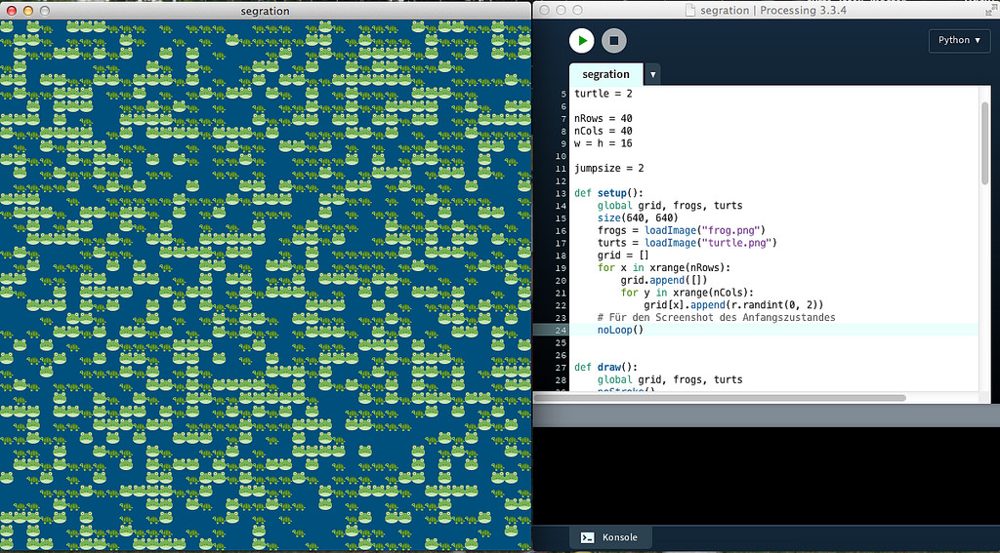

Resnick hat das natürlich in [StarLogo](http://cognitiones.kantel-chaos-team.de/programmierung/starlogo.html) programmiert, ich habe ein leicht abgewandeltes Processing.py-Programm geschrieben, mit dem man das Verhalten untersuchen kann. Beim Start verteilen wir zufällig die Schildkröten und Frösche zu gleichen Teilen auf einem 40x40-Raster, wobei etwa 30 Prozent leer bleiben, damit sich die Viecher auch bewegen können. In jedem Durchlauf wird zufällig ein Bewohner ausgewählt und er wird gefragt, ob er glücklich sei. Glücklich ist er nur, wenn er wenigstens drei Nachbarn hat, die der gleichen Spezies angehören. Ist er glücklich, bleibt er da sitzen wo er ist. Ist er unglücklich, sucht er zufällig in der Nachbarschaft in seiner Sprungdistanz (ja, in meiner Geschichte können auch Schildkröten springen) eine Seerose aus. Ist diese Seerose frei, springt er dahin, hoffend, dort glücklich zu werden. Ist das Feld nicht frei, bleibt er hocken und hofft auf eine neue Chance, wieder ausgewürfelt zu werden.

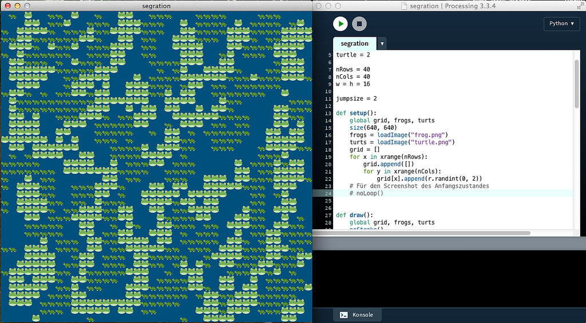

Läßt man diese Simulation nun laufen, stellt man fest, daß sich tatsächlich Cluster gleicher Spezies bilden. Die kleinste stabile Einheit ist ein Quadrat mit der Kantenlänge zwei – hier hat jeder mindestens drei Nachbarn. Außerdem ist eine Flucht von den Rändern weg zu beobachten. Hier habe ich einfach angenommen, daß das Wasser so flach ist, daß dort keine Seerosen gedeihen – die Ränder werden also nicht periodisch fortgesetzt. Und so hat man an den Rändern natürlich weniger Nachbarn und die Chance, glücklich zu sein, ist geringer.

Außerdem kann es vorkommen, daß einzelne Tiere regelrecht von der benachbarten Spezies eingekesselt werden und sie nicht mehr fliehen können. Die Armen sind zu einem ewigen Unglücklichsein verdammt. Hier hilft nur, die maximale Sprungdistanz zu erhöhen.

Überhaupt: Obige Screenshots stammen von einem Sketch mit einer Sprungdistanz von zwei, nachdem der Sektch etwa eine halbe Stunde gelaufen war. Es passiert nicht mehr viel. Die meisten zufällig ausgewählten in einer Runde sind glücklich und verharren auf ihren Platz. Nur noch wenige Exemplare einer Gattung irren umher und suchen Anschluß. Andere sind enteder vom Rand des Teiches oder von den Spezies der anderen Art eingekesselt und zu ewigem unglücklich sein verdammt.

Erhöht man aber den Wert der Sprungdistanz (zum Beispiel auf fünf), dann geht nicht nur die Clusterbildung schneller vonstatten, sondern auch die Zahl der eingekesselten Tiere geht massiv zurück.

Was uns dieses einfache Programm über die tatsächliche [Segregation](https://de.wikipedia.org/wiki/Segregation_(Soziologie)) erzählt, überlasse ich aber der Phantasie meiner Leserinnen und Leser.

### Der Quellcode

~~~python
import random as r

empty = 0
frog = 1
turtle = 2

nRows = 40
nCols = 40
w = h = 16

jumpsize = 2

def setup():
    global grid, frogs, turts
    size(640, 640)
    frogs = loadImage("frog.png")
    turts = loadImage("turtle.png")
    grid = []
    for x in xrange(nRows):
        grid.append([])
        for y in xrange(nCols):
            grid[x].append(r.randint(0, 2))
    # Für den Screenshot des Anfangszustandes
    # noLoop()
            

def draw():
    global grid, frogs, turts
    noStroke()
    background(0, 80, 125)
    
    for x in xrange(nRows):
        for y in xrange(nCols):
            if grid[x][y] == empty:
                fill(0, 80, 125)
                rect(x*w, y*h, w, h)
            elif grid[x][y] == frog:
                image(frogs, x*w, y*h, w, h)
            elif grid[x][y] == turtle:
                image(turts, x*w, y*h, w, h)
            else:
                println("Etwas ist falsch im Staate Lilypond!")
                
    actorX = r.randint(0, nRows-1)
    actorY = r.randint(0, nCols-1)
    # Lebt hier jemand?
    if grid[actorX][actorY] > 0:
        # Und ist er glücklich?
        happy = isHappy(grid[actorX][actorY], actorX, actorY)
        # Wenn nicht, dann möglichst weg von hier
        if not(happy):
            newX = r.randint(-jumpsize, jumpsize)
            newY = r.randint(-jumpsize, jumpsize)
            newX += actorX
            newY += actorY
            # Liegt mein Ziel noch im Teich?
            if ((newX >= 0) and (newX < nRows)
			    and (newY >= 0) and (newY < nCols)):
                if grid[newX][newY] == empty:
                    grid[newX][newY] = grid[actorX][actorY]
                    grid[actorX][actorY] = empty

def isHappy(animal, x, y):
    happy = 0
    if (y-1 > 0) and (grid[x][y-1] == animal):
        happy += 1
    if (x+1 < nRows) and (y-1 > 0) and (grid[x+1][y-1] == animal):
        happy += 1
    if (x+1 < nRows) and (grid[x+1][y] == animal):
        happy += 1
    if (x+1 < nRows) and (y+1 < nCols) and (grid[x+1][y+1] == animal):
        happy += 1
    if (y+1 < nCols) and (grid[x][y+1] == animal):
        happy += 1
    if (x-1 > 0) and (y+1 < nCols) and (grid[x-1][y+1] == animal):
        happy += 1
    if (y+1 < nCols) and (grid[x][y+1] == animal):
        happy += 1
    if (x-1 > 0) and (grid[x-1][y] == animal):
        happy += 1
    if happy >= 3:
        return True
    else:
        return False
~~~

Die Bilder von Frosch und Schildkröte habe ich den [Twitter-Emojis](https://github.com/twitter/twemoji) entnommen und hier sind sie noch einmal, damit Ihr das Spiel nachprogrammieren könnt:

 

### Literatur

- Mitchel Resnick: *Turtles, Termites, and Traffic Jams: Explorations in Massively Parallel Microworlds*, Cambridge, MA (MIT Press) 1997, p. 81 - 88

## Der Waldbrand-Simulator

Bei dem [Demokratie-Spiel](waehler.md) und bei den [Experimenten mit den Fröschen und Schildkröten](segregation.md) änderte sich pro Durchlauf jeweils nur das Verhalten einer Zelle in Abänggkeit von ihren direkten Nachbarn und war für den weiteren Verlauf der Simulation verantwortlich. Bei den meisten Simulationen mit zellulären Automaten jedoch wird der neue Wert *aller* Zellen in Abhängigkeit von den Nachbarn betrachtet und neu berechnet. Dafür muß man dann zwei Arrays anlegen, eines, das die aktuellen und eines das die zukünftigen Werte beinhaltet. Ich möchte das mal am Beispiel einer beliebten Simulation zeigen, der Simulation eines Waldbrandes mit einem zellulären Automaten.

[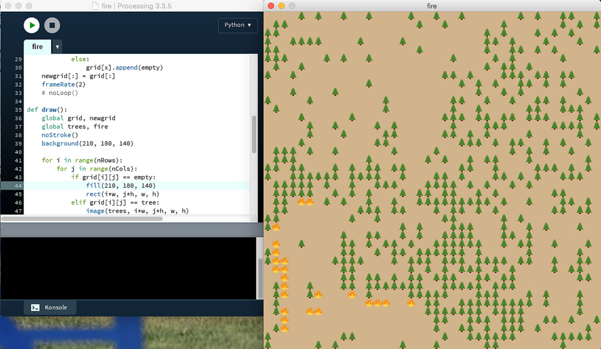](https://www.flickr.com/photos/schockwellenreiter/36833659066)

Die Regeln dieser Simulation folgen der Beschreibung, die *Daniel Scholz* in seinem Buch »Pixelspiele«[^12_1] gegeben hat:

[^12_1]: Daniel Scholz: *Pixelspiele, Modellieren und Simulieren mit zellulären Automaten*, Berlin - Heidelberg (Springer Spektrum) 2014, S. 19-25


### Kein Spiel ohne Regeln

Für alle Zellen *x<sub>ij</sub>* gelten folgende Regeln:

1. Befindet sich *x<sub>ij</sub>* im Zustand leer *(empty)*, dann wächst auf *x<sub>ij</sub>* mit einer Wahrscheinlichkeit `a` ein Baum, so daß der Zustand von *x<sub>ij</sub>* im nächsten Schritt  *tree* ist.
2. Befindet sich *x<sub>ij</sub>* im Zustand Baum *(tree)*, und mindestens eine Zelle in der Nachbarschaft ist im Zustand Feuer *(burning)*, dann brennt auch *x<sub>ij</sub>*, so daß der Zustand von *x<sub>ij</sub>* im nächsten Schritt auch *burning* ist.
3. Automatischer Ablauf: Falls *x<sub>ij</sub>* ein Baum ist und keiner seiner Nachbarn brennt, dann wird *x<sub>ij</sub>* mit einer Wahrscheinlichkeit von `g` von einem Blitz getroffen, so daß *x<sub>ij</sub>* im nächsten Schritt ebenfalls *burning* ist.
4. Interaktive Version: Wird die Zelle *x<sub>ij</sub>* mit dem Mauszeiger angeklickt, dann wird *x<sub>ij</sub>* von einem Blitz getroffen und der Zustand von *x<sub>ij</sub>* ist im nächsten Schritt *burning*.
5. Befindet sich die Zelle *x<sub>ij</sub>* im Zustand *burning*, dann erlischt das Feuer und der Zustand von *x<sub>ij</sub>* ist im nächsten Schritt *empty*.
6. Trifft keine der obigen Regeln zu, dann verändert sich der Zustand der Zelle *x<sub>ij</sub>* im nächsten Schritt nicht.

Als Nachbarschaft wird die [Von-Neumann-Nachbarschaft](http://cognitiones.kantel-chaos-team.de/programmierung/softcomputing/neumannnb.html) angenommen, Nachbarn sind also nur die direkten Zellen oben und unten sowie rechts und links, das heißt, jede Zelle hat genau vier Nachbarn.

Als Randbedingung wurde ein geschlossener Rand gewählt, daß heißt die Zellen am Rande des Feldes werden in der Simulation gar nicht berücksichtigt, sie bleiben auf ewig, wie sie sind. Daher habe ich bei der Initialisierung des Feldes mit

~~~python
            if ((x > 0) and (y > 0) and (x < nRows-1)
			    and (y < nCols-1) and randint(0, 10000) <= 2000):
                grid[x].append(tree)
            else:
                grid[x].append(empty)
~~~

dafür gesorgt, daß die Randfelder immer leer sind. Das hat auf den Simulationsverlauf keinen Einfluß, aber es störte mich besonders bei der Darstellung mit den Emojis, daß auf den Rändern anfangs immer ein paar Bäume dumm herum standen, wie noch im obigen Screenshot dokumentiert, der während einer frühen Phase der Realisierung dieser Simulation enstand.

### Die Realisierung

Oben habe ich es schon angesprochen, für die erste Version der Waldbrandsimulation habe ich wieder [Twitters Twemojis](https://github.com/twitter/twemoji) geplündert und hier sind die Bildchen vom Baum und vom Feuer, damit Ihr die Simulation nachprogrammieren könnt:

 

Wenn Ihr die Bilder herunterladet, beachtet bitte, daß ich, weil es schon ein anderes Baumbildchen gab, dieses hier `tree2.png` nennen mußte. Im Sketch heißt es aber `tree.png`, Ihr müßt also entweder die Bezeichnung im Sketch ändern (nicht gut) oder einfach den Namen des Bildchens ändern (besser). Es sind winzige, 16x16 Pixel große Bildchen und das Spielfeld habe ich diesen Ausmaßen angepaßt:

~~~python
def setup():
    global trees, fire
    size(640, 640)
    background(210, 180, 140)
    trees = loadImage("tree.png")
    fire  = loadImage("fire.png")
    for x in range(nRows):
        grid.append([])
        newgrid.append([])
        for y in range(nCols):
            # Randbedingungen
            if ((x > 0) and (y > 0) and (x < nRows-1)
			    and (y < nCols-1) and randint(0, 10000) <= 2000):
                grid[x].append(tree)
            else:
                grid[x].append(empty)
    newgrid[:] = grid[:]
    frameRate(2)
~~~

Eine `frameRate()` von 2 ist durchaus ausreichend, sonst läuft die Simulation so schnell, daß Ihr gar nichts nachvollziehen könnt.

Aber ganz zu Beginn habe ich `randint` für die Zufallszahlen importiert, ein paar Konstanten gesetzt und die beiden Arrays initialisiert:

~~~python
from random import randint

empty = 0
tree = 1
burning = 20

a = 40
g = 1

nRows = 40
nCols = 40
w = h = 16

grid = []
newgrid = []
~~~

Die `draw()`-Funktion ist in allen Simulationen gleich,

~~~python
draw():
    global grid, newgrid
    global trees, fire
    noStroke()
    background(210, 180, 140)
    
    for i in range(nRows):
        for j in range(nCols):
            if grid[i][j] == empty:
                fill(210, 180, 140)
                rect(i*w, j*h, w, h)
            elif grid[i][j] == tree:
                image(trees, i*w, j*h, w, h)
            elif grid[i][j] == burning:
                image(fire, i*w, j*h, w, h)
    calcNext()
~~~
 
der Unterschied für den per Zufall generierten Blitzeinschlag, respektive den durch Nutzereingabe verursachten Blitz, liegt in der Funktion `calcNext()`. Hier erst einmal die nicht interaktive Version:
 
~~~python
 calcNext():
     global grid, newgrid
     newgrid[:] = grid[:]
     # Next Generation
     for i in range(1, nRows-1):
         for j in range(1, nCols-1):
             if grid[i][j] == burning:
                 newgrid[i][j] = empty
                 # Brennt ein Nachbar?
                 if grid[i-1][j] == tree:
                     newgrid[i-1][j] = burning
                 if grid[i][j-1] == tree:
                     newgrid[i][j-1] = burning
                 if grid[i][j+1] == tree:
                     newgrid[i][j+1] = burning
                 if grid[i+1][j] == tree:
                     newgrid[i+1][j] = burning
             elif grid[i][j] == empty:
                 if randint(0, 10000) < a:
                     newgrid[i][j] = tree
             if grid[i][j] == tree:
             # Schlägt ein Blitz ein?
                 if (random(10000) < g):
                     newgrid[i][j] = burning
     grid[:] = newgrid[:]
~~~

Mit `for i in range(1, nRows-1)` und `for j in range(1, nCols-1)` habe ich die Randfelder von der Abfrage ausgeschlossen und somit die Randbedingung »geschlossener Rand« erfüllt.

In den vorletzten zwei Zeilen wird die Wahrscheinlichkeit abgefragt, ob ein Blitz einschlägt und wenn diese (geringe) Wahrscheinlichkeit zutrifft, dann wird das Feld *x<sub>ij</sub>* für den nächsten Zustand auf brennend *(burning)* gesetzt. In der interaktiven Variante entfallen diese beiden Zeilen, dafür kommt noch die Funktion `mousePressed()` hinzu,

~~~python
def mousePressed():
    newgrid[mouseX/16][mouseY/16] = burning
~~~

die einfach für die Zelle, in der die Maus klickt, den neuen Zustand auf *burning* setzt.

### Der Quellcode (1)

Bevor ich weitermache, erst einmal den Quellcode des vollständigen Programmes in der interaktiven Version:

~~~python
from random import randint

empty = 0
tree = 1
burning = 20

a = 40
g = 1

nRows = 40
nCols = 40
w = h = 16

grid = []
newgrid = []

def setup():
    global trees, fire
    size(640, 640)
    background(210, 180, 140)
    trees = loadImage("tree.png")
    fire  = loadImage("fire.png")
    for x in range(nRows):
        grid.append([])
        newgrid.append([])
        for y in range(nCols):
            # Randbedingungen
            if ((x > 0) and (y > 0) and (x < nRows-1)
			    and (y < nCols-1) and randint(0, 10000) <= 2000):
                grid[x].append(tree)
            else:
                grid[x].append(empty)
    newgrid[:] = grid[:]
    frameRate(2)
    # noLoop()
    
def draw():
    global grid, newgrid
    global trees, fire
    noStroke()
    background(210, 180, 140)
    
    for i in range(nRows):
        for j in range(nCols):
            if grid[i][j] == empty:
                fill(210, 180, 140)
                rect(i*w, j*h, w, h)
            elif grid[i][j] == tree:
                image(trees, i*w, j*h, w, h)
            elif grid[i][j] == burning:
                image(fire, i*w, j*h, w, h)
    calcNext()
 
def calcNext():
    global grid, newgrid
    newgrid[:] = grid[:]
    # Next Generation
    for i in range(1, nRows-1):
        for j in range(1, nCols-1):
            if grid[i][j] == burning:
                newgrid[i][j] = empty
                # Brennt ein Nachbar?
                if grid[i-1][j] == tree:
                    newgrid[i-1][j] = burning
                if grid[i][j-1] == tree:
                    newgrid[i][j-1] = burning
                if grid[i][j+1] == tree:
                    newgrid[i][j+1] = burning
                if grid[i+1][j] == tree:
                    newgrid[i+1][j] = burning
            elif grid[i][j] == empty:
                if randint(0, 10000) < a:
                    newgrid[i][j] = tree
    grid[:] = newgrid[:]

def mousePressed():
    newgrid[mouseX/16][mouseY/16] = burning
~~~

Für die automatisch ablaufende Fassung müßt Ihr einfach nur die oben erwähnten zwei Zeilen vor

~~~python
    grid[:] = newgrid[:]
~~~

in die Funktion `calcNext()` einfügen und die Funktion `mousePressed()` löschen.

### Ein größerer Wald

Die obige Simulation läuft schon sehr zufriedenstellend ab, aber um Muster zu erkennen, muß man den »Wald« doch weiter vergrößern. Ich habe in einer neuen Version dieser Simulation das Spielfeld daher auf 280x160 Zellen erweitert. Damit mein Monitor nicht gesprengt wird, sind diese Zellen jetzt nur noch 2x2 Pixel groß, was zu einer Fenstergröße von 560x320 führt.

Die Zellen werden jetzt nicht mehr durch Emojis dargestellt, sondern durch kleine Rechtecke in verschiedenen Farben. Da ich leicht farbenblind bin, habe ich mir die Farben aus einer Tabelle mit Farbnamen zusammengsucht, ein leeres Feld sollte daher ockerfarben dargestellt werden, ein Feld mit einem Baum dunkelgrün und ein brennendes Feld in einem leuchtenden rot. Diese Angaben sind ohne Gewähr, aber Ihr könnt die Farben ja im Zweifelsfalle selber Euren Wünschen anpassen.

### Beispielsimulation


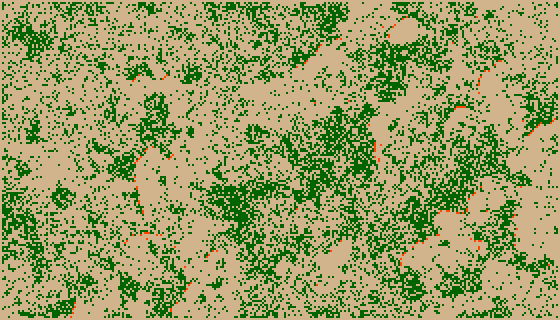


Wenn Ihr diese Simulation über einen gewissen Zeitraum laufen laßt, dann erkennt Ihr, daß sich im Laufe der Zeit ein gewisses, wenn auch schwankendes Gleichgewicht zwischen Wald und freier Fläche einstellt. Dieses Gleichgewicht soll sich sogar relativ unabhängig von den gewählten Parametern einstellen (das ist allerdings in der Literatur umstritten). In den obigen Schreenshots, die ich mit

~~~python
    if (frameCount % 50) == 0:
        print(frameCount)
        saveFrame("frames/fire-gen-####.png")
~~~

erstellt habe, könnt Ihr sehen, wie sich die Simulation nach je 50 Schritten verändert hat und nach einer ruhigen Anfangsphase des Wachstums scheint der Gleichgewichtszustand tatsächlich erreicht. Generation 150 und Generation 300 sind sich sehr ähnlich, dazwischen brennt der Wald erst heftiger (Generation 200) und erlebt dann wieder eine Phase des Wachstums (Generation 250).

### Der Quellcode (2)

Probiert es -- auch mit anderen Paramtern für `a` und `g` einfach mal aus. Darum hier der komplette Quellcode dieser Version:

~~~python
from random import randint

empty = 0
tree = 1
burning = 20

a = 40
g = 1

nRows = 280
nCols = 160
w = h = 2

grid = []
newgrid = []

def setup():
    global trees, fire
    size(560, 320)
    background(210, 180, 140)
    for x in range(nRows):
        grid.append([])
        newgrid.append([])
        for y in range(nCols):
            # Randbedingungen
            if ((x > 0) and (y > 0) and (x < nRows-1)
			    and (y < nCols-1) and randint(0, 10000) <= 2000):
                grid[x].append(tree)
            else:
                grid[x].append(empty)
    newgrid[:] = grid[:]
    frameRate(10)
    # noLoop()
    
def draw():
    global grid, newgrid
    global trees, fire
    noStroke()
    background(210, 180, 140)
    for i in range(nRows):
        for j in range(nCols):
            if grid[i][j] == empty:
                fill(210, 180, 140)
                rect(i*w, j*h, w, h)
            elif grid[i][j] == tree:
                fill(0, 100, 0)
                rect(i*w, j*h, w, h)
            elif grid[i][j] == burning:
                fill(255, 69, 0)
                rect(i*w, j*h, w, h)
    if (frameCount % 50) == 0:
        print(frameCount)
        saveFrame("frames/fire-gen-####.png")
    calcNext()
 
def calcNext():
    global grid, newgrid
    newgrid[:] = grid[:]
    # Next Generation
    for i in range(1, nRows-1):
        for j in range(1, nCols-1):
            if grid[i][j] == burning:
                newgrid[i][j] = empty
                # Brennt ein Nachbar?
                if grid[i-1][j] == tree:
                    newgrid[i-1][j] = burning
                if grid[i][j-1] == tree:
                    newgrid[i][j-1] = burning
                if grid[i][j+1] == tree:
                    newgrid[i][j+1] = burning
                if grid[i+1][j] == tree:
                    newgrid[i+1][j] = burning
            elif grid[i][j] == empty:
                if randint(0, 10000) < a:
                    newgrid[i][j] = tree
            if grid[i][j] == tree:
            # Schlägt ein Blitz ein?
                if (random(10000) < 1):
                    newgrid[i][j] = burning
    grid[:] = newgrid[:]
~~~

Er unterscheidet sich nicht grundlegend von den vorherigen Versionen, daher solltet Ihr ihn durchaus nachvollziehen können.

### Caveat

Ich glaube nicht wirklich, daß diese Simualtion ein realistisches Bild von Waldbränden liefert, dazu fehlen zum Beispiel Parameter für die Windrichtung, manche Bäume brennen leichter als andere und vieles mehr. Aber es ist eine nette Spielerei und Ihr seid durchaus aufgefordert, die fehlenden Parameter einzufügen und damit zu spielen. Der Aufsatz »[Simulating the World in Emojis](http://ncase.me/simulating/)« den *Nicky Case* im Januar 2016 veröffentlichte, gibt dafür -- aber auch für weitere Simualtionen -- nette Anregungen.

# 3D mit Processing.py

## Kugeln und Kisten

Processing und damit auch Processing.py besitzt die Möglichkeit, sehr einfach 3D-Objekte zu erzeugen, allerdings sind als Primitive nur eine Kugel und eine Kiste (`sphere()` und `box()`) vorgesehen. Als Erstes möchte ich zeigen, wie man schnell eine sich drehende Kugel damit zaubert:

[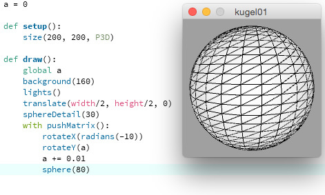](https://www.flickr.com/photos/schockwellenreiter/32057051544/)

Um mit Processing in drei Dimensionen zu arbeiten, muß man das bei der Initialisierung des Fensters dem Programm mitteilen:

~~~python
def setup():
    size(200, 200, P3D)
~~~

Eigentlich teilt man Processing auch mit, wenn man in zwei Dimensionen hantieren will, nur ist `P2D` einfach der Default und kann entfallen.

Dann besitzt Processing eine einfache Methode, die 3D-Landschaft auszuleuchten, nämlich `lights()`. Und ähnlich wie den Kreisen und Ellipsen ist auch bei einer Kugel per Default, der Ursprung der Koordinaten die Mitte. Daher habe ich mit

~~~python
    translate(width/2, height/2, 0)
~~~

die x- und y-Achsen des Koordinatensystems in die Mitte des Fensters gelegt. Mit `sphereDetail(n)` wird die Anzahl der Dreiecke bestimmt, aus denen die Kugel zusammengesetzt werden soll. Je mehr Dreiecke, desto »runder« die Kugel, aber auch um so größer die Rechenzeit. Bei diesem einfachen Programm spielt das noch keine Rolle, die Zahl `30` ist eher dem Umstand geschuldet, daß die Kugel vor lauter Dreieicken sonst nicht mehr zu erkennen ist.

Und dann kommt wieder das geniale `with`-Statement zu Einsatz: 

~~~python
    with pushMatrix():
        rotateX(radians(-10))
        rotateY(a)
        a += 0.01
        sphere(80)
~~~

Mit `rotateX()` wird die Kugel ein wenig geneigt und mit `rotateY()` dreht sie sich um die eigene Achse. Einfacher kann man eine sich bewegende Kugel in 3D eigentlich gar nicht programmieren.

### Der Quellcode

Hier noch einmal der komplette Quellcode des Sketches zum Nachbauen:

~~~python
a = 0

def setup():
    size(200, 200, P3D)

def draw():
    global a
    background(160)
    lights()
    translate(width/2, height/2, 0)
    sphereDetail(30)
    with pushMatrix():
        rotateX(radians(-10))
        rotateY(a)
        a += 0.01
        sphere(80)
~~~


### Und es geht doch: Kugeln und Texturen

Ich hatte irrtümlich angenommen, daß man die einfachen 3D-Primitive `sphere()` und `box()` nicht mit Texturen versehen kann und man darum dann eigene 3D-Objekte bauen müsse. Nun gibt es jedoch einen einfachen Weg, diese Beschränkung zu umgehen. Denn der Befehl `createShape()` erzeugt nicht nur ein Objekt, sondern er kann auch Parameter übernehmen. Und so kann man mit

~~~python
earth = loadImage("bluemarble.jpg")
noStroke()
globe = createShape(SPHERE, 80)
globe.setTexture(earth)
~~~

auf einfachste Weise einen *Shape* erzeugen, den man mit Texturen versehen kann.

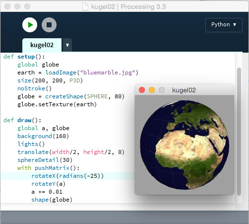

Hier der vollständige Sketch, der uns diese Erdkugel erzeugt:

~~~python
a = 0

def setup():
    global globe
    earth = loadImage("bluemarble.jpg")
    size(200, 200, P3D)
    noStroke()
    globe = createShape(SPHERE, 80)
    globe.setTexture(earth)

def draw():
    global a, globe
    background(160)
    lights()
    translate(width/2, height/2, 0)
    sphereDetail(30)
    with pushMatrix():
        rotateX(radians(-25))
        rotateY(a)
        a += 0.01
        shape(globe)
~~~

### Und noch eine Textur

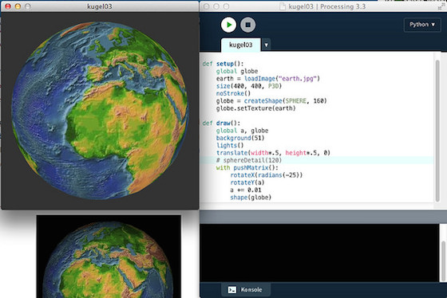

Und hier noch einmal die Erdkugel mit einer anderen Textur, die ich [hier gefunden](http://www.inf-schule.de/information/informationsdarstellungxml/darstellunginformation/fallstudie_3dgrafiken/exkurs/farben) habe. Schaut man genau hin, entdeckt man, daß die Erde an der Datumsgrenze einen Riß aufweist -- ein Phänomen, daß ich hin und wieder schon beobachtet, für daß ich allerdings bis jetzt noch keine Erklärung habe.

Der Quellcode wurde nur geringfügig geändert, aber der Vollständigkeit halber hier noch einmal:

~~~python
a = 0

def setup():
    global globe
    earth = loadImage("earth.jpg")
    size(400, 400, P3D)
    noStroke()
    globe = createShape(SPHERE, 160)
    globe.setTexture(earth)

def draw():
    global a, globe
    background(51)
    lights()
    translate(width*.5, height*.5, 0)
    # sphereDetail(120)
    with pushMatrix():
        rotateX(radians(-25))
        rotateY(a)
        a += 0.01
        shape(globe)
~~~


## Die Erde ist eine Kiste

Natürlich kann man das, was im letzten Abschnitt mit einer Kugel angestellt habe, auch mit einer Kiste (in Processing `BOX` genannt) anstellen. Der einzige Unterschied ist, daß die Textur jeweils komplett auf alle sechs Seiten der Box abgebildet wird.

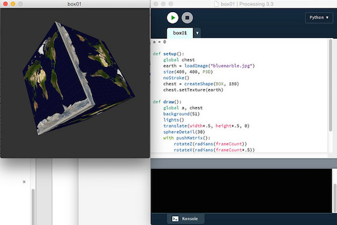

Aber dann hat man den Beweis: Die Erde ist eine Kiste!

### Quellcode

~~~python
a = 0

def setup():
    global chest
    earth = loadImage("bluemarble.jpg")
    size(400, 400, P3D)
    noStroke()
    chest = createShape(BOX, 180)
    chest.setTexture(earth)

def draw():
    global a, chest
    background(51)
    lights()
    translate(width*.5, height*.5, 0)
    sphereDetail(30)
    with pushMatrix():
        rotateZ(radians(frameCount))
        rotateX(radians(frameCount*.5))
        rotateY(radians(a))
        a += 0.01
        shape(chest)
~~~

## Licht und Schatten

[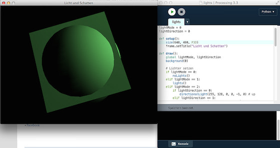](https://www.flickr.com/photos/schockwellenreiter/32593587580/)

Bei dreidimensionalen Applikationen gilt für jede Software genau wie im wirklichen Leben: »Ohne Licht sehen Sie nichts!« Das ist bei den spezialisierten Programmen wie [Blender](http://cognitiones.kantel-chaos-team.de/multimedia/computergraphik/3d/blender.html) oder [PoVRay](http://cognitiones.kantel-chaos-team.de/multimedia/computergraphik/3d/povray.html) genau so, wie auch in Processing.py. Daher möchte ich in folgendem Skript zeigen, welche Möglichkeiten der Beleuchtung es in Processing gibt und welche Auswirkung sie auf die Szene haben.

Dazu habe ich eine Kugel verschachtelt in einer Box erzeugt und sie in ein 3D-Fenster gesetzt. Sie ist im Grunde farblos, nur für eine Belichtung (`lights()`) habe ich der Kugel eine hell- und der Box eine dunkelblaue Farbe verpaßt.

Bevor ich die Kugel und die Box zeichnen lasse, überprüfe ich, welche Beleuchtungsfunktion aktuell angewählt ist. Processing kennt sechs Beleuchtungfunktionen. Diese sind

1. `noLights()`: Diese schaltet alle Beleuchtung aus und die dreidimensionalen Objekte wirken zweidimensional. Diese Funktion kann benutzt werden, um dreidimensionale Objekte mit zweidimensionalen Zeichnungen zu kombinieren.
2. `lights()`: Das ist die einfachste Beleuchtungsfunktion, die die Umgebung in ein neutrales, ambientes Licht taucht. Sie kann immer erst einmal für den Test der dreidiemnsionalen Objekte eingesetzt verwendet werden, bevor man sich an spektakulärere Beleuchtungsmodelle wagt.
3. `directionalLight(v1, v2, v3, nx, ny, nz)`: Diese Beleuchtungsfunktion besitzt sechs Parameter. Die ersten drei geben die Farbwerte an (es können je nach gewähltem Farbmode entweder RGB- oder HSB-Werte sein). Die letzten drei Werte geben jeweils die Richtung des Lichtes aus der x-, y, und/oder z-Richtung an. Direkte Richtungen sind `0, -1, 0` nach oben, `0, 1, 0` nach unten, `1, 0, 0` nach rechts und `-1, 0, 0` nach links. Analog sind die Werte für »Licht von vorne« und »Licht von hinten« einzustellen und durch Kombinationen der drei Parameter bekommt man auch Licht aus beliebigen Richtungen.
4. `ambientLight(v1, v2, v3)` taucht die Umgebung in ein ambientes Licht in der mit `v1, v2, v3` spezifizierten Farbe (RGB oder HSB). Ambientes Licht wird meist mit anderen Lichtquellen kombiniert, um zum Beispiel die Schlagschatten der anderen, gerichteten Lichtquellen aufzuhellen.
5. `pointLight(v1, v2, v3, x, y, z)` setzt ein punktförmiges Licht in den Farben `v1, v2, v3` aus der Position `x, y, z`.
6. `spotLight(v1, v2, v3, x, y, z, nx, ny, nz, angle, concentration)` ergibt ein kegelförmiges Licht in den Varben `v1, v2, v3` von der Quelle `x, y, z` in die Richtung `nx, ny, nz` mit dem Winkel `angle` und der Intensität `concentration`.

Alle Beleuchtungsfunktionen müssen innerhalb der `draw()`-Funktion aufgerufen werden. Werden sie stattdessen in der `setup`-Funktion aufgerufen, sind sie nur beim ersten Durchlauf wirksam. Daher habe ich das auch im Sketch so gehalten, wobei je nach gewähltem `lightMode` die Beleuchtung gesetzt wird.

## Licht aus -- Spot an!

Die Beleuchtung kann man während der Sketch läuft mit der Tastatur auswählen. Die Tasten sind sprechend gewählt:

~~~python
def keyPressed():
    global lightMode, lightDirection
    if key == "n":
        lightMode = 0            # no lights
    elif key == "l":
        lightMode = 1            # lights
    elif key == "d":
        lightMode = 2            # directional light
    elif key == "a":
        lightMode = 3            # ambient light
    elif key == "p":
        lightMode = 4            # point light
    elif key == "s":
        lightMode = 5            # spot light
~~~

!!! warning "Warnung"
    Bevor man die Tasten drückt, sollte man darauf achten, daß das Graphikfenster von Processing.py im Vordergrund ist, also den Fokus besitzt. Denn sonst tippt man versehentlich gnadenlos Buchstaben in sein Skript und wundert sich, warum es anschließend nicht mehr läuft. Ich verstehe nicht ganz, warum im Python-Mode das Ausgabefenster beim Start des Programmes nicht automatisch den Fokus bekommt, wie das im Java-Mode von Processing der Fall ist?

Ist das direktionale Licht ausgewählt kann man zusätzlich noch mit den Pfeiltasten die Richtung des Lichtes bestimmen.


### Quellcode

Wenn man bedenkt, daß in diesem Programm doch einiges passiert, ist der Quellcode immer noch sehr kurz. Das Nachvollziehen sollte auch keine besondere Mühe machen, schließlich wird Python ja oft und zu Recht als lauffähiger Pseudocode bezeichnet.

~~~python
lightMode = 0
lightDirection = 0

def setup():
    size(640, 480, P3D)
    frame.setTitle("Licht und Schatten")

def draw():
    global lightMode, lightDirection
    background(0)
    
    # Lichter setzen
    if lightMode == 0:
        noLights()
    elif lightMode == 1:
        lights()
    elif lightMode == 2:
        if lightDirection == 0:
            directionalLight(255, 128, 0, 0, -1, 0) # up
        elif lightDirection == 1:
            directionalLight(0, 255, 0, 1, 0, 0)    # right
        elif lightDirection == 2:
            directionalLight(255, 0, 255, 0, 1, 0)  # down
        elif lightDirection == 3:
            directionalLight(0, 255, 255, -1, 0, 0) # left
    elif lightMode == 3:
        ambientLight(0, 255, 255)
    elif lightMode == 4:
        pointLight(255, 255, 0, 100, height*0.3, 100)
    elif lightMode == 5:
        spotLight(128, 255, 128, 800, 20, 300, -1, .25, 0, PI, 2)
    else:
        noLights()
    
    # Kugel und Box zeichnen
    with pushMatrix():
        translate(width/2, height/2)
        with pushMatrix():
            rotateY(radians(frameCount))
            fill(255)
            if lightMode == 1:
                fill(151, 255, 255)
            noStroke()
            sphere(160)
        with pushMatrix():
            rotateZ(radians(frameCount))
            rotateX(radians(frameCount/2.0))
            fill(255)
            if lightMode == 1:
                fill(0, 0, 139)
            noStroke()
            box(240)
            
def keyPressed():
    global lightMode, lightDirection
    if key == "n":
        lightMode = 0            # no lights
    elif key == "l":
        lightMode = 1            # lights
    elif key == "d":
        lightMode = 2            # directional light
    elif key == "a":
        lightMode = 3            # ambient light
    elif key == "p":
        lightMode = 4            # point light
    elif key == "s":
        lightMode = 5            # spot light
    
    if key == CODED:
        if keyCode == UP:
            lightDirection = 0
        elif keyCode == RIGHT:
            lightDirection = 1
        elif keyCode == DOWN:
            lightDirection = 2
        elif keyCode == LEFT:
           lightDirection = 3
~~~

### Credits

Dieses Beispielprogramm folgt einer Idee aus dem Bucn »Processing 2: Creative Programming Cookbook« von *Jan Vantomme*. Ich habe sie geringfügig überarbeitet und vom Processing 2 Java-Mode in den Python-Mode von Processing 3 umgeschrieben.

### Literatur

- Jan Vantomme: *Processing 2: Creative Programming Cookbook*, Birmingham *(Packt Publishing)*, 2012


## Einen Globus basteln

-- neu schreiben --

# Projekt: Einen eigenen Wetterbericht mit OpenWeatherMap

## OpenWeatherMap

[OpenWeatherMap](http://openweathermap.org/) bietet aktuelle und freie ([CC BY-SA 4.0](https://creativecommons.org/licenses/by-sa/4.0/)) Wetterdaten von mehr als 200.000 Stationen weltweit (sagt die [Wikipedia](https://de.wikipedia.org/wiki/OpenWeatherMap)), die über eine frei nutzbare [JSON-API](http://openweathermap.org/api) abgefragt werden können -- allerdings wird eine Registrierung und ein API-Key benötigt und um einen Rücklink auf OpenWeastherMap gebeten. Mit dem freien API-Key darf man 60 Anfragen in der Minute stellen und es stehen einem die

- Current Weather API, die
- 5 day/3 hour forecast API und die
- Weather maps API

zur Verfügung. Benötigt man mehr, muß man eine der kommerziellen Lizenzen nutzen. Man kann die APIs nach Städtenamen, Geo-Koordinaten oder Städte-IDs abfragen. Ich habe für mich mal ein paar relevante Orte herausgesucht:

- Berlin Tempelhof,DE -- Geo-Koordinaten [52.4769, 13.4103] (das ist die nächste Station an meinem Wohnort)
- Berlin Steglitz Zehlendorf,DE -- Geo-Koordinaten [52.4348, 13.2418]
- Schmargendorf,DE -- Geo-Koordinaten [52.4752, 13.2907] (ich weiß nicht, welche von den beiden näher an meiner Arbeitsstelle stationiert sind, Schmargendorf steht übrigens für Berlin Dahlem)
- Berlin Koepenick,DE -- Geo-Koordinaten [52.4425, 13.5823] (da ist »unser« Hundeplatz) und
- Berlin,DE -- Geo-Koordinaten [52.5244, 13.4105] (Berlin Mitte)

Per Default kommen die Antwort in Englisch und die Temperaturangaben in Kelvin. Will man sie in Deutsch und °Celsius haben, muß man der URL noch die Parameter `&lang=de` und `&units=metric` mitgeben. Ein Aufruf für Berlin-Tempelhof sähe dann so aus (zur Besseren Lesbarkeit umgebrochen, natürlich ist die URL einzeilig ohne Leerzeichen):

~~~
http://api.openweathermap.org/data/2.5/weather?
q=Berlin%20Tempelhof,DE&units=metric&lang=de&APPID=0815
~~~

Die APPID habe ich mir ausgedacht, Ihr müßt Euch schon selber eine besorgen (die dann auch viel komplizierter und länger ist). Wird die Anfrage mit einer gültigen APPID abgeschickt, bekommt Ihr eine Antwort der Art:

~~~json
{"coord":
	{"lon":13.41,"lat":52.48},
	"weather":[{"id":500,"main":"Rain",
	            "description":"leichter Regen","icon":"10d"}],
	"base":"stations",
	"main":
		{"temp":8,"pressure":992,"humidity":93,"temp_min":8,"temp_max":8
	},
	"visibility":9000,
	"wind":{"speed":5.7,"deg":210},"clouds":{"all":90},
	"dt":1487857800,
	"sys":
		{"type":1,"id":4892,"message":0.0029,"country":"DE",
		 "sunrise":1487829867,"sunset":1487867737
	},
	"id":7290253,"name":"Berlin Tempelhof","cod":200
}
~~~

Die Antwort kommt in einer Zeile, ich habe sie nur der besseren Lesbarkeit wegen umgebrochen. Die Bedeutung der einzelnen Paramter bekommt Ihr auf [dieser Seite](http://openweathermap.org/current) erklärt und die *Weather Condition Codes* und Icons sind auf [dieser Seite](http://openweathermap.org/weather-conditions) aufgeführt.

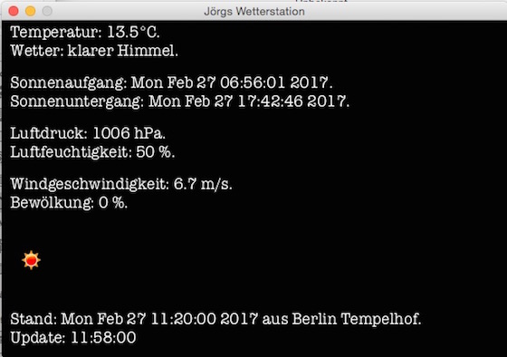

## Die Wetterstation mit Processing.py

Um diese JSON-Daten nun mit Processing.py lesen zu können, kann man auf die Standardbibliothek zurückgreifen, die einmal mit `urllib2` einen einfachen Umgang mit dem Laden von Daten aus dem Netz erlaubt und zum anderen mit `json` ein Modul mitbringt, das den Umgang mit den JSON-Dateien vereinfacht.

~~~python
import json
import urllib2
# wegen der besseren Lesbarkeit umgebrochen
weatherUrl = "http://api.openweathermap.org/data/2.5/weather" +
             "?q=Berlin%20Tempelhof,DE&units=metric&lang=de&APPID=4711"
weatherData = json.load(urllib2.urlopen(weatherUrl))
~~~

Noch einmal: Den API-Key (`APPID`) habe ich mir ausgedacht, um den Code-Schnipsel oben zum Laufen zu bekommen, müßt Ihr Euch auf den Seiten von OpenWeatherMap schon einen eigenen API-Key besorgen.

~~~pyton
{
    u'visibility': 10000,
    u'main': {
        u'temp': 3,
        u'pressure': 1007,
        u'temp_max': 3,
        u'temp_min': 3,
        u'humidity': 74
    },
    u'clouds': {u'all': 40},
    u'sys': {
        u'country':
        u'DE',
        u'sunrise': 1487916142,
        u'type': 1,
        u'message': 0.0025,
        u'sunset': 1487954244,
        u'id': 4892
    },
    u'dt': 1487940600,
    u'coord': {u'lon': 13.41, u'lat': 52.48},
    u'weather': [{
        u'icon': u'13d',
		u'description': u'm\xe4\xdfiger Schnee',
		u'main': u'Snow', u'id': 600
    }],
    u'name': u'Berlin Tempelhof',
    u'cod': 200,
    u'id': 7290253,
    u'base': u'stations',
    u'wind': {u'deg': 310, u'speed': 4.6}
}
~~~

Laßt Ihr Euch die `weatherData` aus obigem Codeschnipsel mal anzeigen (ich habe sie wieder der besseren Lesbarkeit wegen umgebrochen), dann seht Ihr, daß die JSON-Bibliothek die Antwort als *Dictionary* behandelt und Ihr damit nicht mehr auf die Reihenfolge bauen könnt. Es ist zwar alles vorhanden, was Ihr auch ganz oben in der ersten Anwort seht, aber in einer völlig anderen Reihenfolge. Außerdem hat die Bibliothek alle Strings als UTF-8-Strings gekennzeichnet.

Nun lassen sich aber die Werte in *Dictionaries* in Python mit Ihrem Key abfragen und die Keys können miteinander verkettet werden. Wollt Ihr zum Beispiel den Wert des Dictionaries `"temp"`, das Teil des Dictionaries `"main"` ist, abfragen, so ist dies mit

~~~python
temp = weatherData["main"]["temp"]
~~~

möglich. In einigen Fällen beinhalten die JSON-Objekte aber auch Listen. Diese können aber ebenfalls verkettet werden und werden über ihren Index aufgerufen. Wollt Ihr zum Beispiel die Wetterbeschreibung (`"description"`) aus dem Dictionary `"weather"` haben, so müßt Ihr folgendes programmieren:

~~~python
wetter = weatherData["weather"][0]["description"]
~~~

So habe ich mir Stück für Stück alle Daten, die ich für mein kleines Wetterfenster haben wollte, zusammengeklaubt.

Schaut Ihr Euch die Daten, die eine Datums- und Zeitangabe betreffen, genauer an, werdet Ihr feststellen (oder in der Dokumentation nachlesen), daß diese -- wie international üblich -- als UTC-Timestamp kommen. Um dieses zu konvertieren, bildet das Modul `datetime` Hilfe an, zum Beispiel:

~~~python
import datetime
sunrise = weatherData["sys"]["sunrise"]
lokalsunrise = datetime.datetime.fromtimestamp(sunrise).ctime()
~~~

Mit `fromtimestamp` wird der UTC-Stempel in eine lesbare Zeit verwandelt und das anschließende `ctime` sorgt dafür, daß dies in die lokale Rechnerzeit umgewandelt wird (in meinem Fall in UTC+1 oder während der Sommerzeit in UTC+2). Um die Sommerzeit kümmert sich `ctime` automatisch, da muß sich der Programmierer nicht weiter sorgen.

Das Wetter-Icon kommt natürlich auch von OpenWeatherMap und kann so geladen und angezeigt werden:

~~~python
icon = weatherData["weather"][0]["icon"]
weatherIcon = loadImage("http://openweathermap.org/img/w/"
                        + icon + ".png")
image(weatherIcon, 10, 260)
~~~

Das ist eigentlich alles, was der Programmierer wissen muß. Für die aktuelle Zeit habe ich ebenfalls das Modul `datetime` genutzt und die Berechnungen durchgeführt, die ich auch schon in dem Programm zur [Rentenuhr](http://py.kantel-chaos-team.de/rentenuhr/) genutzt hatte.

Um den Hauptsketch übersichtlich zu halten, habe ich die beiden Funktionen `getWeatherData()` und `getNow()` in ein eigenes Modul `getWeatherData.py` ausgelagert, das wie folgt aussieht:

~~~python
# coding=utf-8
import json
import urllib2
import datetime

def getWeatherData():
    weatherUrl = "http://api.openweathermap.org/data/2.5/weather?"  +
	           "q=Berlin%20Tempelhof,DE&units=metric&lang=de&APPID=4711"
    weatherData = json.load(urllib2.urlopen(weatherUrl))
    
    # Temperatur
    temp = weatherData["main"]["temp"]
    myTemperatur = u"Temperatur: " + str(temp) + u"°C."
    text(myTemperatur, 10, 20)
    
    # Wetter-Beschreibung
    wetter = weatherData["weather"][0]["description"]
    myWetter = u"Wetter: " + wetter + "."
    text(myWetter, 10, 42)
    
    # Sonnenauf- und -untergang
    sunrise = weatherData["sys"]["sunrise"]
    sunset = weatherData["sys"]["sunset"]
    mySunrise = "Sonnenaufgang: " +
	             datetime.datetime.fromtimestamp(sunrise).ctime() + "."
    mySunset =  "Sonnenuntergang: " +
	             datetime.datetime.fromtimestamp(sunset).ctime() + "."                             
    text(mySunrise, 10, 80)
    text(mySunset, 10, 102)
    
    # Luftdruck und -feuchtigkeit
    pressure = weatherData["main"]["pressure"]
    myPressure = "Luftdruck: " + str(pressure) + " hPa."
    text(myPressure, 10, 140)
    humidity = weatherData["main"]["humidity"]
    myHumidity = "Luftfeuchtigkeit: " + str(humidity) + " %."
    text(myHumidity, 10, 162)
    
    # Windgeschwindigkeit und Bewölkung
    wind = weatherData["wind"]["speed"]
    myWind = "Windgeschwindigkeit: " + str(wind) + " m/s."
    text(myWind, 10, 200)
    clouds = weatherData["clouds"]["all"]
    myClouds = u"Bewölkung: " + str(clouds) + " %."
    text(myClouds, 10, 222)
    
    # Wetter-Icon
    icon = weatherData["weather"][0]["icon"]
    weatherIcon = loadImage("http://openweathermap.org/img/w/"
	              + icon + ".png")
    image(weatherIcon, 10, 260)
    
    # Abfragezeit und -ort
    dt = weatherData["dt"]
    station = weatherData["name"]
    myDt = "Stand: " + datetime.datetime.fromtimestamp(dt).ctime()
	        + " aus " + station + "."
    text(myDt, 10, 360)

def getNow():
    myNow = datetime.datetime.now()
    myHour = str(myNow.hour)
    myMinute = str(myNow.minute).rjust(2, "0")
    mySecond = str(myNow.second).rjust(2, "0")
    myTime = myHour + ":" + myMinute + ":" + mySecond              
    text(u"Update: " + myTime, 10, 382)
~~~

Zum letzten Mal: Die APPID habe ich mir ausgedacht, mit dieser bekommt Ihr keine Daten von OpenWeatherMap.

Das Modul wirkt auf den ersten Blick schlimmer als es ist, denn eigentlich ist alles *straigforward*: Die Daten werden aus dem JSON-Objekt ausgelesen, dann wird ein String erzeugt und zum Schluß wird dieser String mit Hilfe der `text()`-Funktion angezeigt.

So ist das Hauptprogramm wieder sehr kurz geraten:

~~~python
from getWeatherData import getWeatherData, getNow

def setup():
    size(600, 400)
    background(0)
    frame.setTitle (u"Jörgs Wetterstation")
    font = createFont("American Typewriter", 18)
    textFont(font)
    getWeatherData()
    getNow()
    frameRate(1)

def draw():
    if(second() == 0):
        background(0)
        getWeatherData()
        getNow()
~~~

In der `setup()`-Funktion rufe ich zu Initialisierung genau einmal die Wetterdaten ab. Nun darf man in der kostenlosen Lizenz die Daten maximal 60 mal in der Minute abrufen. Mit `frameRate(1)` alleine schafft man das nicht (ich habe sie auch nur darauf gesetzt, um den Rechner nicht unnötig zu belasten). Darum werden die weiteren Abfragen nur gestartet, wenn die Sekunde auf Null steht, das heißt es gibt nur einen Aufruf in der Minute. Damit habe ich die Lizenz der API mehr als eingehalten.

Eigentlich könnte man die Daten noch seltener abrufen: Die von mir angefragte Station *Berlin Tempelhof* gibt nur jede halbe Stunde (um x:20 Uhr und um x:50 Uhr) ihre Daten weiter und es kann noch bis zu einer weiteren halben Stunde dauern, bis die Daten bei OpenWeatherMap eingepflegt und abrufbar sind. Im schlimmsten Fall kann es zu Verzögerungen bis zu einer Stunde kommen, manchmal sind die neuen Daten aber auch überraschend schnell da.

Sicher kann man die Wetterstation optisch noch ein wenig aufpeppen und man kann auch mehrere Wetterstationen abfragen oder die API zur Wettervorhersage nutzen, aber als Beispiel, wie man JSON-Daten per API aus dem Netz holt und aufbereitet, ist dieser Sketch völlig ausreichend. Alles weitere bleibt der Phantasie meiner Leserinnen und Leser überlassen.

## Caveat

Der Quellcode in diesem Kapitel enthielt viele lange Zeilen, die ich wegen ich der besseren Lesbarkeit umbrechen mußte. Sehen Sie sich daher im Zweifelsfalle lieber den (nicht umgebrochenen) Quellcode auf GitHub an.

# Noch ein Projekt: Processing.py und WordCram


Wie man eine Python-Bibliothek in Processing.py nutzt, [hatte ich ja schon gezeigt](weather.md). Das geht so einfach, wie man es auch von »normalen« Python-Programmen gewohnt ist -- solange die Pakete *pure Python* sind. Doch wie sieht es aus, wenn man eine Bibliothek nutzen will, die für den Java-Mode von Processing in Java geschrieben wurde? Um dies zu testen, hatte ich mir die Bibliothek [WordCram](http://wordcram.org/), die die beliebten Wortwolken *(Word Clouds)* erzeugt, ausgesucht und heruntergeladen. Bevor man damit irgendetwas anstellen kann, muß man die Bibliothek entpacken und in den `libraries`-Ordner im Processing-Verzeichnis ablegen. Falls Ihr nicht mehr wißt, wo Euer Processing-Verzeichnis liegt, findet Ihr es im Processing-Menü unter `Einstellungen -> Sketchbook Pfad`.

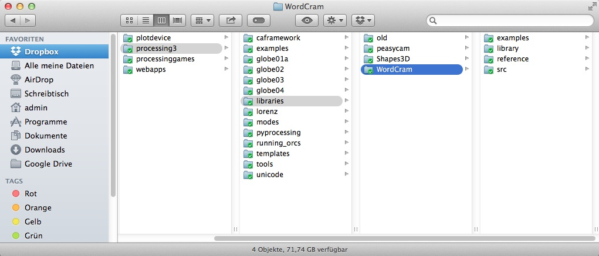

Da ich von mehreren Rechnern an mehreren Standorten meine Processing.py-Sketche bearbeite, liegt dieser Ordner bei mir in der Dropbox. Das ist nicht unbedingt immer eine gute Idee, manche Libraries bestehen aus Tausenden von Dateien und da kann das Synchronisieren schon mal eine gewisse Zeit in Anspruch nehmen.


Wenn Ihr dies erledigt habt, findet die Processing-IDE unter `Sketch -> Library importieren` die Bibliothek und sie kann mit einem Klick in Euren Sketch eingefügt werden:

~~~python
add_library('WordCram')
~~~

Natürlich könnt Ihr diese Zeile auch einfach selber eintippen.

Um das Teil zu testen, habe ich diesen kleinen Sketch geschrieben:

~~~python
add_library('WordCram')

def setup():
    size(700, 400)
    background(255)
    
    wordcram = WordCram(this
        ).fromWebPage("http://blog.schockwellenreiter.de/444.html"
        ).sizedByWeight(0, 150
        ).withFont("Copse")
    wordcram.drawAll()
~~~

Der ruft [diese Seite](http://blog.schockwellenreiter.de/2017/04/2017040404.html) (Die URL im Quellcode ist ein Fake, Sie müssen sie durch eine URL Ihrer Wahl ersetzen) auf und stellt ihren Inhalt -- wie obiger Screenshot zeigt -- als Wortwolke dar.

Zwei Dinge sind noch zu beachten: Erstens verlangen viele Processing (Java) Bibliotheken eine Referenz auf das aktuelle PApplet-Objekt -- so auch WordCram. Im Java-Mode für Processing wird dafür das eingebaute `this`-Keyword verwendet. Python allerdings kennt kein `this`-Schlüsselwort, aber Processing.py stellt automatisch eine globale Variable namens `this` zur Verfügung, die für diese Zwecke verwendet werden kann.

Zweitens kann man in Python wegen der besonderen Bedeutung der Einrückung nicht so, wie es in Java üblich ist, die fortlaufende Punkt-Notierung an dem Punkt umbrechen, wenn Ihr es so versucht

~~~python
    wordcram = WordCram(this)
	    .fromWebPage("http://blog.schockwellenreiter.de/444.html")
	    .sizedByWeight(0, 150)
        .withFont("Copse")
~~~

bekommt Ihr eine Fehlermeldung. Ich habe daher überall die schließende Klammer aus der darüberliegenden Zeile weggenommen und vor den Punkt gestellt. Das ist nicht wirklich eine schöne Lösung, funktioniert aber und hält den Code einigermaßen leserlich. Vielleicht fällt mir dafür noch eine schönere Lösung ein.

Die WordCram-Bibliothek ist ziemlich mächtig, aber leider nicht besonders gut dokumentiert. Sie erkennt zum Beispiel selbstständig, daß mein Text auf Deutsch geschrieben ist und ist auch UTF-8-fest. Zudem scheint sie für viele Sprachen schon eine eingebaute Liste von Stopwörtern mitzubringen. Und man kann auch irgendwie die Wörter der Cloud einfärben, aber das ist nicht sehr intuitiv und die bisher erzielten Ergebnisse hatten mir nicht gefallen, so daß ich es bei der schwarz-weiß-Darstellung belassen habe. *Still digging!*


# Running Orc mit Processing.py

Nach den vielen Tutorials mit den Figuren aus *Cute Planet* wurde mir das allmählich zu niedlich und ich beschloß, einen Ork über den Bildschirm wuseln zu lassen.


Dafür habe ich erst einmal die Klasse `orc()` definiert und nach der Initialisierung -- wie in den anderen Tutorials auch schon -- die Methoden `loadPics()`, `move()` und `display()` implementiert:

~~~python
class Orc():

    def __init__(self, posX, posY):
        self.x = posX
        self.y = posY
        self.dy = 0

    def loadPics(self):
        self.orc1 = loadImage("orc1.png")
        self.orc2 = loadImage("orc2.png")
        self.orc3 = loadImage("orc3.png")
    
    def move(self):
        self.y += self.dy
        if self.y >= height + 48:
            self.y = -48
            self.x = random(width-48)
    
    def display(self):
        if frameCount % 4 == 1:
            image(self.orc1, self.x, self.y)
        elif frameCount % 4 == 3:
            image(self.orc3, self.x, self.y)
        else:
            image(self.orc2, self.x, self.y)
~~~

Die Zeichnungen des *Orcs* stammen aus dem freien (CC-BY-SA) OpenPixels-Projekt von Silveira Neto. Der Einfachheit halber und damit Ihr das nachprogrammieren könnt, habe ich die drei animierten Bildchen hier noch einmal eingebunden:

  

Das Hauptskript war dank des Klasse `Orc()` dann wieder von erfrischender Kürze:

~~~python
from orcs import Orc

orc = Orc(160, -48)

def setup():
    global bg
    bg = loadImage("field.png")
    frameRate(15)
    size(320, 320)
    orc.loadPics()
    orc.dy = 5
    
def draw():
    background(bg)
    orc.move()
    orc.display()
~~~

In `setup()` habe ich zuerst das Hintergrundbild eingebunden (es ist ebenfalls aus dem oben erwähnten OpenPixels-Projekt -- Ihr könnt alternativ aber auch einfach einen grünen Hintergrund zeichnen) und dann den Orc angewiesen, seine Bilder zu laden. Und wie in den vorhergegangenen Tutorials auch wird in `draw()` zuerst der Hintergrund gezeichnet, dann der Ork bewegt und schließlich an seiner neuen Position angezeigt. *That's all!*

## Running Orc in vier Richtungen

Heute möchte ich meine kleine Einführung in Processing.py, dem Python-Mode für Processing, damit fortsetzen, daß ich einen kleinen Ork unter Benutzerführung und mit Hilfe der Pfeiltasten in allen vier Himmelsrichtungen über die Spielwiese wuseln lasse. Die Grundlagen hatte ich dafür ja schon im [hier][4]  gelegt, der Unterschied aber ist, daß der kleine Ork sich tatsächlich bewegt und auch in alle Richtungen dreht. Dafür brauchte ich erst einmal diese acht Bildchen des kleinen Monsters:

       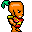

Im Gegensatz zu dem Ork aus dem letzten Abschnitt stammen diese Bildchen (bis auf die Hintergrund-Wiese) nicht aus dem OpenPixels-Fundus von Silveira Neto, sondern aus der ebenfalls freien [CC BY 3.0) [Sprite-Sammlung](http://blogoscoped.com/archive/2006-08-08-n51.html) von *Philipp Lenssen* (über 700 animierte Avatare in der klassischen Größe von 32x32 Pixeln). Und die Animationen setzen sich auch nur aus je zwei verschiedenen Bildchen zusammen, was zum einen Code und Speicher spart und zum anderen den Charakteren einen besonders wuseligen Eindruck verschafft, der an die Frühzeit der Computerspiele erinnert (aus der die Bilder auch stammen). Man benötigt so für jede der vier Himmelsrichtungen nur zwei Bilder, was dann zusammen obige acht Bildchen ergibt.

Als erstes habe ich dem Ork natürlich wieder eine eigene Klasse spendiert (in dem Tab/der Datei `orc2.py`), deren Quellcode nun schon bedeutend umfangreicher geworden ist:

~~~python
class Orc():

    def __init__(self, posX, posY):
        self.x = posX
        self.y = posY
        self.dir = 1
        self.dx = 0
        self.dy = 0

    def loadPics(self):
        self.orcrt1 = loadImage("orcrt1.gif")
        self.orcrt2 = loadImage("orcrt2.gif")
        self.orcfr1 = loadImage("orcfr1.gif")
        self.orcfr2 = loadImage("orcfr2.gif")
        self.orclf1 = loadImage("orclf1.gif")
        self.orclf2 = loadImage("orclf2.gif")
        self.orcbk1 = loadImage("orcbk1.gif")
        self.orcbk2 = loadImage("orcbk2.gif")
    
    def move(self):
        if self.dir == 0:
            if self.x >= width - 32:
                self.x = width - 32
                self.image1 = self.orcrt2
                self.image2 = self.orcrt2
            else:
                self.x += self.dx
                self.image1 = self.orcrt1
                self.image2 = self.orcrt2
        elif self.dir == 1:
            if self.y >= height - 32:
                self.y = height - 32
                self.image1 = self.orcfr2
                self.image2 = self.orcfr2
            else:
                self.y += self.dy
                self.image1 = self.orcfr1
                self.image2 = self.orcfr2
        elif self.dir == 2:
            if self.x <= 0:
                self.x = 0
                self.image1 = self.orclf2
                self.image2 = self.orclf2
            else:
                self.x -= self.dx
                self.image1 = self.orclf1
                self.image2 = self.orclf2
        elif self.dir == 3:
            if self.y <= 0:
                self.y = 0
                self.image1 = self.orcbk2
                self.image2 = self.orcbk2
            else:
                self.y -= self.dy
                self.image1 = self.orcbk1
                self.image2 = self.orcbk2
    
    def display(self):
        if frameCount % 8 >= 4:
            image(self.image1, self.x, self.y)
        else:
            image(self.image2, self.x, self.y)
~~~

Im Konstruktor werden nur die Startposition festgelegt und ein paar Variblen initialisiert und mit Default-Werten versehen. Danach werden die acht Bildchen geladen. Die eigentliche Logik liegt in der Funktion `move()`: Erreicht der Orc einer der Fensterränder, bleibt er einfach stehen. Der visuelle Eindruck wird dadurch erreicht, daß die beiden zu swappenden Bilder identisch sind. Ansonsten bewegt er sich in der angesagten Richtung weiter, indem `dx` oder `dy` zu der akutellen Position addiert oder abgezogen werden.

Die Funktion `display()` ist dann für die Darstellung zuständig: Ist der `frameCount % 8 >= 4`, dann wird das erste Bild gezeichnet, ansonsten das zweite Bild. Durch diesen Modulo-Trick bin ich noch einmal daran vorbeigekommen, einen Timer implementieren zu müssen, aber irgendwann wird kein Weg mehr daran vorbeiführen.


Das Hauptprogramm ist immer noch vergleichsweise kurz und übersichtlich geraten:

~~~python
from orc2 import Orc

orc = Orc(160, -32)


def setup():
    global bg
    bg = loadImage("field.png")
    frameRate(30)
    size(320, 320)
    orc.loadPics()
    orc.dx = 2
    orc.dy = 2
    
def draw():
    background(bg)
    orc.move()
    orc.display()
    
def keyPressed():
    if keyPressed and key == CODED:
        if keyCode == RIGHT:
            orc.dir = 0
        elif keyCode == DOWN:
            orc.dir = 1
        elif keyCode == LEFT:
            orc.dir = 2
        elif keyCode == UP:
            orc.dir = 3
~~~

Die Klasse `Orc` wird importiert und initialisiert. Danach wird das Hintergrundbild geladen (Ihr könnt auch hier wieder alternativ einfach einen grünen Hintergrund zeichnen) und die Fenstergröße festgelegt. Dann wird die Funktion `orc.loadPics()` aufgerufen und die horizontale und vertikale Geschwindigkeit auf je zwei Pixel pro Frame-Durchlauf bestimmt.

Die `draw()`-Routine ist immer noch einfach: Erst wird der Hintergrund gezeichnet, dann der Ork bewegt und danach ebenfalls in das Fenster gezeichnet.

Neu ist die Funktion `keyPressed()`, die während des gesamten Programmablaufs die Tastatur überwacht. Sie überprüft, welche der Pfeiltasten gedrückt wurden und weist ihnen dementsrpechend eine Himmelsrichtung zu. Per Konvention fängt man normalerweise im Osten an (`orc.dir = 0`), um dann über den Süden (`orc.dir = 1`) und den Westen (`orc.dir = 2`) zum Norden (`orc.dir = 3`) zu gelangen.

Beachtet bitte, daß die Abfrage der Tastatur erst greift, wenn das Programmfenster den Fokus besitzt. Leider passiert das bei Processing.py nicht automatisch beim Programmstart, Ihr müßt einmal mit der Maus in das Fenster klicken.

Das ist alles. Erfreut Euch auch an dem kleinen Gag, den *Philipp Lenssen* seinem Ork verpaßt hat: Das Haarschwänzchen wedelt fröhlich hin und her.

## Ork mit Kollisionserkennung

-- überarbeiten --

Nachdem ich im letzten Abschnitt gezeigt hatte, wie man einen kleinen Ork mit Hilfe der Pfeiltasten in allen vier Himmelsrichtungen über das Bildschirmfenster jagen kann, bis er am Fensterrand stehenbleibt, möchte ich Euch nun zeigen, wie man eine generelle Kollisionserkennung implementiert. Dafür habe ich erst einmal eine Oberklasse namens `Sprite` eingeführt, die das Verhalten, das allen *Sprites* gemein ist, festlegt und von der alle Sprites erben sollen (zur Bedeutung und Herkunft des Begriffs [Sprite](https://de.wikipedia.org/wiki/Sprite_(Computergrafik)) informiert die Wikipedia).

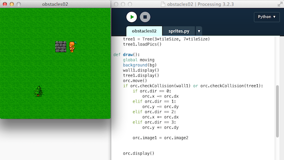

Die Klasse `Sprite` sieht in Processing.py erst einmal so aus:

~~~python
class Sprite(object):

    def __init__(self, posX, posY):
        self.x = posX
        self.y = posY
        self.dir = 1
        self.dx = 0
        self.dy = 0
    
    def checkCollision(self, otherSprite):
        if (self.x < otherSprite.x + tw and otherSprite.x < self.x + tw
            and self.y < otherSprite.y + th and otherSprite.y < self.y + th):
            println("Kollision")
            return True
        else:
            return False
~~~

Das Objekt wird initialisiert und die Startposition festgelegt. Dann werden noch ein paar Variablen mit Defaultwerten besetzt. Da es durchaus Sprites geben kann, die sich gar nicht bewegen, sind `dx` und `dy` mit `0` vorbelegt.

Momentan die wichtigste Funktion ist die Funktion `checkCollision(self, otherSprite)`. Darin wird geprüft, ob sich die umgebenden Rechtecke der Sprites (in diesem Falle ist das die Bildgröße (`tw` und `th` sind jeweils 32 Pixel) überlappen, denn dann liegt eine Kollision vor. Dazu ist es für eine einigermaßen »realistische« Darstellung natürlich wichtig, daß die Sprite-Zeichnung das Rechteck möglichst vollständig ausfüllt. In diesem Falle nehme ich das einfach mal an (mehr dazu weiter unten). Die Klasse `Orc` erbt nun natürlich von `Sprite`:

~~~python
class Orc(Sprite):

    def loadPics(self):
        self.orcrt1 = loadImage("orcrt1.gif")
        self.orcrt2 = loadImage("orcrt2.gif")
        self.orcfr1 = loadImage("orcfr1.gif")
        self.orcfr2 = loadImage("orcfr2.gif")
        self.orclf1 = loadImage("orclf1.gif")
        self.orclf2 = loadImage("orclf2.gif")
        self.orcbk1 = loadImage("orcbk1.gif")
        self.orcbk2 = loadImage("orcbk2.gif")
        
    def move(self):
        if self.dir == 0:
            if self.x >= width - tileSize:
                self.x = width - tileSize
                self.image1 = self.orcrt2
                self.image2 = self.orcrt2
            else:
                self.x += self.dx
                self.image1 = self.orcrt1
                self.image2 = self.orcrt2
        elif self.dir == 1:
            if self.y >= height - tileSize:
                self.y = height - tileSize
                self.image1 = self.orcfr2
                self.image2 = self.orcfr2
            else:
                self.y += self.dy
                self.image1 = self.orcfr1
                self.image2 = self.orcfr2
        elif self.dir == 2:
            if self.x <= 0:
                self.x = 0
                self.image1 = self.orclf2
                self.image2 = self.orclf2
            else:
                self.x -= self.dx
                self.image1 = self.orclf1
                self.image2 = self.orclf2
        elif self.dir == 3:
            if self.y <= 0:
                self.y = 0
                self.image1 = self.orcbk2
                self.image2 = self.orcbk2
            else:
                self.y -= self.dy
                self.image1 = self.orcbk1
                self.image2 = self.orcbk2
                
    def display(self):
        if frameCount % 8 >= 4:
            image(self.image1, self.x, self.y)
        else:
            image(self.image2, self.x, self.y)
~~~

hat sich aber ansonsten gegenüber dem letzten Tutorial nicht verändert. Da ja nun die Kollisionsüberprüfung getestet werden muß, habe ich ein weiteres, unbewegliches Sprite konstruiert, das ich aus naheliegenden Gründen `Wall` genannt habe. Auch `Wall` erbt natürlich von `Sprite`:

~~~python
class Wall(Sprite):
    
    def loadPics(self):
        self.pic = loadImage("wall.png")
        
    def display(self):
        image(self.pic, self.x, self.y)
~~~

Da sich die Mauer nicht bewegt, besitzt `Wall` batürlich auch keine `move()`-Methode, sondern wird nur angezeigt. Ganz oben in die ersten drei Zeilen des Tabs `sprites.py` habe noch ein paar Konstanten initialisiert:

~~~python
tw = 32
th = 32
tileSize = 32
~~~

Das war erst einmal das Modul `sprites.py`. Das Hauptprogramm, das ich `obstacles` genannt habe, ist immer noch von erfrischender Kürze und dank der Objekte kaum verändert:

~~~python
tileSize = 32

from sprites import Orc, Wall

def setup():
    global bg
    bg = loadImage("field.png")
    frameRate(30)
    size(320, 320)
    global orc
    orc = Orc(8*tileSize, 0)
    orc.loadPics()
    orc.dx = 2
    orc.dy = 2
    global wall1
    wall1 = Wall(5*tileSize, 3*tileSize)
    wall1.loadPics()

def draw():
    global moving
    background(bg)
    wall1.display()
    orc.move()
    orc.display()
    orc.checkCollision(wall1)
         
    
def keyPressed():
    if keyPressed and key == CODED:
        if keyCode == RIGHT:
            orc.dir = 0
        elif keyCode == DOWN:
            orc.dir = 1
        elif keyCode == LEFT:
            orc.dir = 2
        elif keyCode == UP:
            orc.dir = 3
~~~

Neu ist lediglich das Mauerfragment `wall1` und das nun als letztes in der `draw()`-Funktion mit `orc.checkCollision(wall1)` überprüft wird, ob unser Ork mit der Mauer kollidiert. Im Falle einer Kollision wird bisher allerdings lediglich »Kollision« in das Terminalfenster geschrieben. Das zeigt, daß der Algorithmus funktioniert, mehr aber noch nicht.

Um dies zu ändern, habe ich erst einmal das `println("Kollision")` in der Klasse `Sprite` gelöscht und -- um auf ein Problem aufmerksam zu machen -- die Klasse `Tree` als weiteres, unbewegliches Objekt hinzugefügt:

~~~python
class Tree(Sprite):
    
    def loadPics(self):
        self.pic = loadImage("tree.png")
        
    def display(self):
        image(self.pic, self.x, self.y)
~~~

Bis auf das andere Bildchen unterscheidet sie sich nicht von der Klasse `Wall`. Baum und Mauer (sowie die neue Hintergrundkachel) habe ich dem freien (CC BY 3.0]) Angband-Tilesets von [dieser Site](http://pousse.rapiere.free.fr/tome/) entnommen und mit dem Editor Tiled zurechtgeschnitten. Hier die Bildchen auch für Euch, damit Ihr das Beispiel nachprogrammieren könnt:

 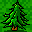 

Das Hintergrundbild habe ich in *Tiled* aus der Graskachel erzeugt. Die Bilder des Orks könnt Ihr im letzten Abschnitt finden.

Die Datei im Tab `sprites.py` hat sich sonst nicht weiter verändert, aber eine wesentliche Veränderung hat im Hauptprogramm stattgefunden. Hier heißt es nun zwischen `orc.move()` und `orc.display()`:

~~~python
    if orc.checkCollision(wall1) or orc.checkCollision(tree1):
        if orc.dir == 0:
            orc.x -= orc.dx
        elif orc.dir == 1:
            orc.y -= orc.dy
        elif orc.dir == 2:
            orc.x += orc.dx
        elif orc.dir == 3:
            orc.y += orc.dy
        orc.image1 = orc.image2
~~~

Jetzt wird also überprüft, ob eine Kollision mit dem Mauerfragment oder mit dem Baum stattgefunden hat. Hat eine stattgefunden, wird der Orc einfach auf die vorherige Position zurückgesetzt und die beiden Bilder -- wie wir es schon mit der Kollision mit den Rändern hatten -- auf ein Bild gesetzt, so daß es aussieht, als ob der Ork stehen bleiben würde und auf Eure nächste Eingabe wartet.

Hier nun den kompletten Sketch zum Nachbauen. Erst einmal das Hauptprogramm `obstacles02`:

~~~python
tileSize = 32
from sprites import Orc, Wall, Tree

def setup():
    global bg
    bg = loadImage("ground0.png")
    frameRate(30)
    size(320, 320)
    global orc
    orc = Orc(8*tileSize, 0)
    orc.loadPics()
    orc.dx = 2
    orc.dy = 2
    global wall1
    wall1 = Wall(5*tileSize, 3*tileSize)
    wall1.loadPics()
    global tree1
    tree1 = Tree(3*tileSize, 7*tileSize)
    tree1.loadPics()

def draw():
    background(bg)
    wall1.display()
    tree1.display()
    orc.move()
    if orc.checkCollision(wall1) or orc.checkCollision(tree1):
        if orc.dir == 0:
            orc.x -= orc.dx
        elif orc.dir == 1:
            orc.y -= orc.dy
        elif orc.dir == 2:
            orc.x += orc.dx
        elif orc.dir == 3:
            orc.y += orc.dy
        orc.image1 = orc.image2
        
    orc.display()
         
    
def keyPressed():
    if keyPressed and key == CODED:
        if keyCode == RIGHT:
            orc.dir = 0
        elif keyCode == DOWN:
            orc.dir = 1
        elif keyCode == LEFT:
            orc.dir = 2
        elif keyCode == UP:
            orc.dir = 3
~~~

Und dann das Modul `sprites.py`, das ich in einem separaten Tab untergebracht habe:

~~~python
tw = 32
th = 32
tileSize = 32

class Sprite(object):

    def __init__(self, posX, posY):
        self.x = posX
        self.y = posY
        self.dir = 1
        self.dx = 0
        self.dy = 0
    
    def checkCollision(self, otherSprite):
        if (self.x < otherSprite.x + tw and otherSprite.x < self.x + tw
            and self.y < otherSprite.y + th and otherSprite.y < self.y + th):
            return True
        else:
            return False

class Orc(Sprite):

    def loadPics(self):
        self.orcrt1 = loadImage("orcrt1.gif")
        self.orcrt2 = loadImage("orcrt2.gif")
        self.orcfr1 = loadImage("orcfr1.gif")
        self.orcfr2 = loadImage("orcfr2.gif")
        self.orclf1 = loadImage("orclf1.gif")
        self.orclf2 = loadImage("orclf2.gif")
        self.orcbk1 = loadImage("orcbk1.gif")
        self.orcbk2 = loadImage("orcbk2.gif")
        
    def move(self):
        if self.dir == 0:
            if self.x >= width - tileSize:
                self.x = width - tileSize
                self.image1 = self.orcrt2
                self.image2 = self.orcrt2
            else:
                self.x += self.dx
                self.image1 = self.orcrt1
                self.image2 = self.orcrt2
        elif self.dir == 1:
            if self.y >= height - tileSize:
                self.y = height - tileSize
                self.image1 = self.orcfr2
                self.image2 = self.orcfr2
            else:
                self.y += self.dy
                self.image1 = self.orcfr1
                self.image2 = self.orcfr2
        elif self.dir == 2:
            if self.x <= 0:
                self.x = 0
                self.image1 = self.orclf2
                self.image2 = self.orclf2
            else:
                self.x -= self.dx
                self.image1 = self.orclf1
                self.image2 = self.orclf2
        elif self.dir == 3:
            if self.y <= 0:
                self.y = 0
                self.image1 = self.orcbk2
                self.image2 = self.orcbk2
            else:
                self.y -= self.dy
                self.image1 = self.orcbk1
                self.image2 = self.orcbk2
                
    def display(self):
        if frameCount % 8 >= 4:
            image(self.image1, self.x, self.y)
        else:
            image(self.image2, self.x, self.y)
            
class Wall(Sprite):
    
    def loadPics(self):
        self.pic = loadImage("wall.png")
        
    def display(self):
        image(self.pic, self.x, self.y)

class Tree(Sprite):
    
    def loadPics(self):
        self.pic = loadImage("tree.png")
        
    def display(self):
        image(self.pic, self.x, self.y)
~~~

Wenn Ihr nun ein wenig damit herumspielt, werdet Ihr eine kleine Ungenauigkeit bemerken. Nähert sich der Ork von rechts oder von links der Tanne, dann sieht es so aus, als ob er ziemlich weit davor stehenbleiben würde. Das liegt daran, daß sowohl die Seitenansichten des Ork wie auch die der Tanne die 32-Pixel Breite nicht besonders gut ausfüllen. Abhilfe könnte man schaffen, indem man die umgebenden Rechtecke schmaler macht. Das ist noch relativ einfach zu implementieren, macht den Quellcode aber dennoch komplizierter und unübersichtlicher. Da ich aber erst einmal nur das Prinzip der Kollisionserkennung mit überlappenden Rechtecken deutlich machen wollte, dachte ich, daß man im Sinne der Klarheit mit diesem kleinen Handicap leben kann.


## Ein Ork im Labyrinth

Nachdem ich im letzten Abschnitt erfolgreich eine Kollisionserkennung implementiert hatte, wollte ich nun das alles auf die Spitze treiben und den kleinen Ork durch ein Labyrinth (genauer: einen Irrgarten) bewegen. Und natürlich sollte er nur dort laufen können, wo es keine Hindernisse gab. Im Endeffekt sollte das Ergebnis so aussehen:

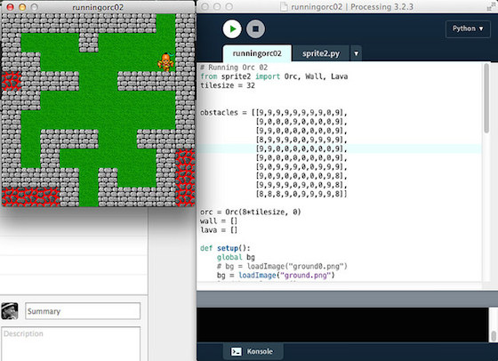

Die einzelnen Klassen im zweiten Reiter (`sprites2.py`) blieben gegenüber dem letzten Abschnitt nahezu unverändert. Lediglich die Klasse `Tree` habe ich durch die Klasse `Lava` ersetzt und der Klasse `Wall` ein anderes Kachelbild verpaßt, was aber beides nur kosmetische Gründe hat. Hier die notwendigen Kacheln:

  

Das Labyrinth habe ich in [Tiled](http://cognitiones.kantel-chaos-team.de/multimedia/spieleprogrammierung/tiled.html) entworfen und die Bilder dafür wieder dem freien (CC BY 3.0) Angband-Tilesets von [dieser Site](http://pousse.rapiere.free.fr/tome/) entnommen.

Die größten Änderungen gab es im Hauptprogramm. Zu den üblichen Vorbelegungen kam ein zweidimensionales Array `obstacles` hinzu. Dies habe ich mir zurechtgebastelt, in dem ich in *Tiled* das Tileset als CSV exportiert habe und dann in dem Text-Editor meines Vertrauens mit *Suchen und Ersetzen* die Zahlen ein wenig vereinfacht hatte:

~~~python
obstacles = [[9,9,9,9,9,9,9,9,0,9],
             [9,0,0,0,9,0,0,0,0,9],
             [9,9,0,0,0,0,0,0,0,9],
             [8,9,9,9,0,0,9,9,9,9],
             [9,9,0,0,0,0,0,0,0,9],
             [9,0,0,0,0,0,0,0,0,9],
             [9,0,9,9,9,0,0,9,9,9],
             [9,0,9,0,0,0,0,0,9,8],
             [9,9,9,9,0,9,0,0,9,8],
             [8,8,8,9,0,9,9,9,9,8]]
~~~

Wenn Ihr das mit dem Screenshot oben vergleicht, vermutet Ihr sicher sehr schnell, daß die 9 für ein Mauerstück und die 8 für Lava steht, während Null einfach der Fußboden ist. Dann habe ich den Ork und zwei leere Listen, die Mauer und Lava aufnehmen sollen, initialisiert:

~~~python
orc = Orc(8*tilesize, 0)
wall = []
lava = []
~~~

Die `setup()`-Funktion sieht nun so aus:

~~~python
def setup():
    global bg
    bg = loadImage("ground0.png")
    loadObstaclesData()
    for i in range(len(wall)):
        wall[i].loadPics()
    for i in range(len(lava)):
        lava[i].loadPics()
    frameRate(30)
    size(320, 320)
    orc.loadPics()
    orc.dx = 2
    orc.dy = 2
~~~

Sie ruft die Funktion `loadObstaclesData()` auf, die für die Belegung der beiden Listen `wall` und `lava` zuständig ist

~~~python
def loadObstaclesData():
    for y in range(10):
        for x in range(10):
            if obstacles[y][x] == 9:
                wall.append(Wall(x*tilesize, y*tilesize))
            elif obstacles[y][x] == 8:
                lava.append(Lava(x*tilesize, y*tilesize))
~~~

und lädt anschließend die entsprechenden Bilder für die Hindernisse.

In der `draw()`-Funktion wird erst das Hintergrundbild geladen, das nur aus einer grünen Grasfläche belegt und dann werden die einzelnen *Obstacles* eingezeichnet:

~~~python
def draw():
    background(bg)
    for i in range(len(wall)):
        wall[i].display()
    for i in range(len(lava)):
        lava[i].display()
    orc.move()
    for i in range(len(wall)):
        if orc.checkCollision(wall[i]):
            if orc.dir == 0:
                orc.x -= orc.dx
            elif orc.dir == 1:
                orc.y -= orc.dy
            elif orc.dir == 2:
                orc.x += orc.dx
            elif orc.dir == 3:
                orc.y += orc.dy
            orc.image1 = orc.image2                            
    orc.display()
~~~

Die Bewegung des Orcs wurde aus dem letzten Tutorial unverändert übernommen. Da der Ork niemals mit einem Lava-Feld kollidieren kann (er trifft immer vorher auf eine Mauer) reichte es, die Kollisionsüberprüfung auf die Mauerteile zu beschränken.

Damit ist das Prinzip erklärt, doch es geht noch einfacher. Denn man kann sich das Neuzeichnen der einzelnen Hindernisse bei jedem Durchlauf natürlich ersparen, wenn man sie in dem Hintergrundbild mit aufgenommen hat. Also habe ich das Hintergrundbild mit allen Mauern und dem Lava aus *Tiled* exportiert und als Hintergrund geladen. Dann sieht die Funktion `setup()` so aus:

~~~python
def setup():
    global bg
    bg = loadImage("ground.png")
    loadObstaclesData()
    frameRate(30)
    size(320, 320)
    orc.loadPics()
    orc.dx = 2
    orc.dy = 2
~~~

Statt `ground0.png` heißt das Hintergrundbild nun nur noch `ground.png` und enthält nicht nur den Rasen, sondern das gesamte Labyrinth. Auch die `draw()`-Funktion ist um vier Zeilen kürzer geworden:

~~~python
def draw():
    background(bg)
    orc.move()
    for i in range(len(wall)):
        if orc.checkCollision(wall[i]):
            if orc.dir == 0:
                orc.x -= orc.dx
            elif orc.dir == 1:
                orc.y -= orc.dy
            elif orc.dir == 2:
                orc.x += orc.dx
            elif orc.dir == 3:
                orc.y += orc.dy
            orc.image1 = orc.image2                            
    orc.display()
~~~

Man erspart sich so die `laodPics()` wie auch die `display()`-Aufrufe der *Obstacle Sprites*, was auch einiges an Rechenzeit spart.

Zum Abschluß das vollständige Programm. Zuerst das Paket `sprite2.py`, das ich in einem separaten Tab untergebracht habe:

~~~python
tw = 32
th = 32
tileSize = 32

class Sprite(object):

    def __init__(self, posX, posY):
        self.x = posX
        self.y = posY
        self.dir = 1
        self.dx = 0
        self.dy = 0
    
    def checkCollision(self, otherSprite):
        if (self.x < otherSprite.x + tw and otherSprite.x < self.x + tw
            and self.y < otherSprite.y + th and otherSprite.y < self.y + th):
            return True
        else:
            return False

class Orc(Sprite):

    def loadPics(self):
        self.orcrt1 = loadImage("orcrt1.gif")
        self.orcrt2 = loadImage("orcrt2.gif")
        self.orcfr1 = loadImage("orcfr1.gif")
        self.orcfr2 = loadImage("orcfr2.gif")
        self.orclf1 = loadImage("orclf1.gif")
        self.orclf2 = loadImage("orclf2.gif")
        self.orcbk1 = loadImage("orcbk1.gif")
        self.orcbk2 = loadImage("orcbk2.gif")
        
    def move(self):
        if self.dir == 0:
            if self.x >= width - tileSize:
                self.x = width - tileSize
                self.image1 = self.orcrt2
                self.image2 = self.orcrt2
            else:
                self.x += self.dx
                self.image1 = self.orcrt1
                self.image2 = self.orcrt2
        elif self.dir == 1:
            if self.y >= height - tileSize:
                self.y = height - tileSize
                self.image1 = self.orcfr2
                self.image2 = self.orcfr2
            else:
                self.y += self.dy
                self.image1 = self.orcfr1
                self.image2 = self.orcfr2
        elif self.dir == 2:
            if self.x <= 0:
                self.x = 0
                self.image1 = self.orclf2
                self.image2 = self.orclf2
            else:
                self.x -= self.dx
                self.image1 = self.orclf1
                self.image2 = self.orclf2
        elif self.dir == 3:
            if self.y <= 0:
                self.y = 0
                self.image1 = self.orcbk2
                self.image2 = self.orcbk2
            else:
                self.y -= self.dy
                self.image1 = self.orcbk1
                self.image2 = self.orcbk2
                
    def display(self):
        if frameCount % 8 >= 4:
            image(self.image1, self.x, self.y)
        else:
            image(self.image2, self.x, self.y)
            
class Wall(Sprite):
    
    def loadPics(self):
        self.pic = loadImage("wall2.png")
        
    def display(self):
        image(self.pic, self.x, self.y)

class Lava(Sprite):
    
    def loadPics(self):
        self.pic = loadImage("lava.png")
        
    def display(self):
        image(self.pic, self.x, self.y)
~~~

Es hat jetzt schon einiges an Länge angenommen, dafür ist aber das Hauptprogramm immer noch recht kurz:

~~~python
from sprite2 import Orc, Wall, Lava
tilesize = 32


obstacles = [[9,9,9,9,9,9,9,9,0,9],
             [9,0,0,0,9,0,0,0,0,9],
             [9,9,0,0,0,0,0,0,0,9],
             [8,9,9,9,0,0,9,9,9,9],
             [9,9,0,0,0,0,0,0,0,9],
             [9,0,0,0,0,0,0,0,0,9],
             [9,0,9,9,9,0,0,9,9,9],
             [9,0,9,0,0,0,0,0,9,8],
             [9,9,9,9,0,9,0,0,9,8],
             [8,8,8,9,0,9,9,9,9,8]]

orc = Orc(8*tilesize, 0)
wall = []
lava = []

def setup():
    global bg
    bg = loadImage("ground.png")
    loadObstaclesData()
    frameRate(30)
    size(320, 320)
    orc.loadPics()
    orc.dx = 2
    orc.dy = 2
    
def draw():
    background(bg)
    orc.move()
    for i in range(len(wall)):
        if orc.checkCollision(wall[i]):
            if orc.dir == 0:
                orc.x -= orc.dx
            elif orc.dir == 1:
                orc.y -= orc.dy
            elif orc.dir == 2:
                orc.x += orc.dx
            elif orc.dir == 3:
                orc.y += orc.dy
            orc.image1 = orc.image2
    orc.display()
    
def keyPressed():
    if keyPressed and key == CODED:
        if keyCode == RIGHT:
            orc.dir = 0
        elif keyCode == DOWN:
            orc.dir = 1
        elif keyCode == LEFT:
            orc.dir = 2
        elif keyCode == UP:
            orc.dir = 3
            
def loadObstaclesData():
    for y in range(10):
        for x in range(10):
            if obstacles[y][x] == 9:
                wall.append(Wall(x*tilesize, y*tilesize))
            elif obstacles[y][x] == 8:
                lava.append(Lava(x*tilesize, y*tilesize))
~~~

Wenn Ihr das Programm laufen laßt, werdet Ihr feststellen, daß ich kurz vor dem Ausgang unten eine kleine Gemeinheit eingebaut habe und es gar nicht so einfach ist, den Ork dorthin zu lotsen. Er will partout 32 Pixel breit sein und macht sich nicht schmaler, daher muß man die Drehung nach unten genau abpassen. Aber es ist nicht unmöglich, ich habe es probiert und geschafft.

Die Bilder des Orks stammen  ebenfalls wieder aus der freien (CC BY 3.0) [Sprite-Sammlung von Philipp Lenssen](http://blogoscoped.com/archive/2006-08-08-n51.html) (über 700 animierte Avatare in der klassischen Größe von 32x32 Pixeln).

Alle Quelltexte und Bilder gibt es übrigens auch immer aktuell im [GitHub-Repo](https://github.com/kantel/processingpy) zu diesem Buch.


## Der autonome Ork

-- überarbeiten --

Nun sind Orks, wie ich sie in den letzten Beiträgen über den Bildschirm habe wuseln lassen, normalerweise nicht die Figuren, mit denen der Spieler spielt. Er leitet seinen Held, einen *Hero* durch die Spielewelt. Orks und andere Monster hingegen sind meist computergesteuerte Spielfiguren, sogenannte NPCs *(Non Player Characters)*. Daher habe ich in dieser Folge einen spielbaren Helden eingebaut und der Ork bewegt sich mehr oder weniger autonom durch das Spielfenster.

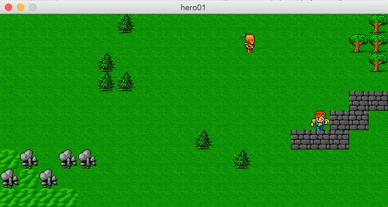

Dafür habe ich dann erst einmal die Klasse Hero in den zweiten Tab (den ich dieses Mal `sprite3.py` genannt habe) eingefügt:

~~~python
class Hero(Sprite):

    def loadPics(self):
        self.mnv1rt1 = loadImage("mnv1rt1.gif")
        self.mnv1rt2 = loadImage("mnv1rt2.gif")
        self.mnv1fr1 = loadImage("mnv1fr1.gif")
        self.mnv1fr2 = loadImage("mnv1fr2.gif")
        self.mnv1lf1 = loadImage("mnv1lf1.gif")
        self.mnv1lf2 = loadImage("mnv1lf2.gif")
        self.mnv1bk1 = loadImage("mnv1bk1.gif")
        self.mnv1bk2 = loadImage("mnv1bk2.gif")
    
    def move(self):
        if self.dir == 0:
            if self.x >= width - tileSize:
                self.x = width - tileSize
                self.image1 = self.mnv1rt2
                self.image2 = self.mnv1rt2
            else:
                self.x += self.dx
                self.image1 = self.mnv1rt1
                self.image2 = self.mnv1rt2
        elif self.dir == 1:
            if self.y >= height - tileSize:
                self.y = height - tileSize
                self.image1 = self.mnv1fr2
                self.image2 = self.mnv1fr2
            else:
                self.y += self.dy
                self.image1 = self.mnv1fr1
                self.image2 = self.mnv1fr2
        elif self.dir == 2:
            if self.x <= 0:
                self.x = 0
                self.image1 = self.mnv1lf2
                self.image2 = self.mnv1lf2
            else:
                self.x -= self.dx
                self.image1 = self.mnv1lf1
                self.image2 = self.mnv1lf2
        elif self.dir == 3:
            if self.y <= 0:
                self.y = 0
                self.image1 = self.mnv1bk2
                self.image2 = self.mnv1bk2
            else:
                self.y -= self.dy
                self.image1 = self.mnv1bk1
                self.image2 = self.mnv1bk2
                
    def display(self):
        if frameCount % 8 >= 4:
            image(self.image1, self.x, self.y)
        else:
            image(self.image2, self.x, self.y)
~~~

Sie unterscheidet sich -- bis auf die Bildchen -- kaum von der bisherigen `Orc`-Klasse. Auch diese Bildchen stammen aus der ebenfalls freien (CC BY 3.0) Sprite-Sammlung von *Philipp Lenssen* und hier sind sie, damit Ihr sie herunterladen und verwenden könnt:

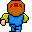   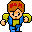 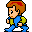   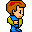

Den Hintergrund habe ich wieder mit Tiled erstellt und die Bilder dafür auch wieder dem ebenfalls freien (CC BY 3.0) Angband-Tilesets entnommen. Nach einem Export als CSV-Datei und ein wenig *Suchen und Ersetzen* kam dann dieses Terrain zustande:

~~~python
terrain = [[0,0,0,0,0,0,8,0,0,0,0,0,0,0,0,0,0,0,0,7],
           [0,0,0,0,0,0,0,0,0,0,0,0,0,0,0,0,0,0,7,7],
           [0,0,0,0,0,8,0,0,0,0,0,0,0,0,0,0,0,0,0,7],
           [0,0,0,0,0,8,8,0,0,0,0,0,0,0,0,0,0,0,0,0],
           [0,0,0,0,0,0,0,0,0,0,0,0,0,0,0,0,0,0,6,6],
           [0,0,0,0,0,0,0,0,0,0,0,0,0,0,0,0,0,6,6,0],
           [0,0,0,0,0,0,0,0,0,0,8,0,0,0,0,6,6,6,0,0],
           [6,9,0,9,9,0,0,0,0,0,0,0,8,0,0,0,0,0,0,0],
           [9,6,9,0,0,0,0,0,0,0,0,0,0,0,0,0,0,0,0,0],
           [6,6,6,6,0,0,0,0,0,0,0,0,0,0,0,0,0,0,0,0]]
~~~

Wie man leicht sieht, haben alle Hindernisse einen Wert `> 5`, wodurch man sie recht einfach in einer Liste zusammenfassen kann, was im Anschluß auch die Kollisionserkennung erleichtert:

~~~python
def loadObstaclesData():
    for y in range(10):
        for x in range(20):
            if terrain[y][x] > 5:
                obstacles.append(Obstacle(x*tilesize, y*tilesize))
~~~

Und da alle Hindernisse ja schon im Hintergrundbild eingezeichnet sind, braucht man sie auch nicht mehr einzeln zu zeichnen und zu lokalisieren. Es reicht, wenn man die Position eines Hindernisses kennt, egal ob es ein Sumpf, ein Fels, ein Baum, eine Tanne oder eine Mauer ist.

Die Funktion `keyPressed()` ändert jetzt nicht mehr die Laufrichtung des Orks, sondern die unseres Helden. Der Ork bewegt sich selbstständig und ändert die Richtung, sobald er auf ein Hindernis trifft

~~~python
    orc.move()
    for i in range(len(obstacles)):
        if orc.checkCollision(obstacles[i]):
            if orc.dir == 0:
                orc.x -= orc.dx
                orc.dir = int(random(4))
            elif hero.dir == 1:
                orc.y -= orc.dy
                orc.dir = int(random(4))
            elif hero.dir == 2:
                orc.x += orc.dx
                orc.dir = int(random(4))
            elif hero.dir == 3:
                orc.y += orc.dy
                orc.dir = int(random(4))
            orc.image1 = orc.image2
~~~

oder eines der Fensterränder erreicht hat.

Jetzt der Vollständigkeit halber das ganze Skript. Erst einmal alles, was ich in dem Reiter `sprites3.py` eingetippt habe:

~~~python
tw = 32
th = 32
tileSize = 32

class Sprite(object):

    def __init__(self, posX, posY):
        self.x = posX
        self.y = posY
        self.dir = 1
        self.dx = 0
        self.dy = 0
    
    def checkCollision(self, otherSprite):
        if (self.x < otherSprite.x + tw and otherSprite.x < self.x + tw
            and self.y < otherSprite.y + th and otherSprite.y < self.y + th):
            return True
        else:
            return False
class Hero(Sprite):

    def loadPics(self):
        self.mnv1rt1 = loadImage("mnv1rt1.gif")
        self.mnv1rt2 = loadImage("mnv1rt2.gif")
        self.mnv1fr1 = loadImage("mnv1fr1.gif")
        self.mnv1fr2 = loadImage("mnv1fr2.gif")
        self.mnv1lf1 = loadImage("mnv1lf1.gif")
        self.mnv1lf2 = loadImage("mnv1lf2.gif")
        self.mnv1bk1 = loadImage("mnv1bk1.gif")
        self.mnv1bk2 = loadImage("mnv1bk2.gif")
    
    def move(self):
        if self.dir == 0:
            if self.x >= width - tileSize:
                self.x = width - tileSize
                self.image1 = self.mnv1rt2
                self.image2 = self.mnv1rt2
            else:
                self.x += self.dx
                self.image1 = self.mnv1rt1
                self.image2 = self.mnv1rt2
        elif self.dir == 1:
            if self.y >= height - tileSize:
                self.y = height - tileSize
                self.image1 = self.mnv1fr2
                self.image2 = self.mnv1fr2
            else:
                self.y += self.dy
                self.image1 = self.mnv1fr1
                self.image2 = self.mnv1fr2
        elif self.dir == 2:
            if self.x <= 0:
                self.x = 0
                self.image1 = self.mnv1lf2
                self.image2 = self.mnv1lf2
            else:
                self.x -= self.dx
                self.image1 = self.mnv1lf1
                self.image2 = self.mnv1lf2
        elif self.dir == 3:
            if self.y <= 0:
                self.y = 0
                self.image1 = self.mnv1bk2
                self.image2 = self.mnv1bk2
            else:
                self.y -= self.dy
                self.image1 = self.mnv1bk1
                self.image2 = self.mnv1bk2
                
    def display(self):
        if frameCount % 8 >= 4:
            image(self.image1, self.x, self.y)
        else:
            image(self.image2, self.x, self.y)
            
class Orc(Sprite):

    def loadPics(self):
        self.orcrt1 = loadImage("orcrt1.gif")
        self.orcrt2 = loadImage("orcrt2.gif")
        self.orcfr1 = loadImage("orcfr1.gif")
        self.orcfr2 = loadImage("orcfr2.gif")
        self.orclf1 = loadImage("orclf1.gif")
        self.orclf2 = loadImage("orclf2.gif")
        self.orcbk1 = loadImage("orcbk1.gif")
        self.orcbk2 = loadImage("orcbk2.gif")
        
    def move(self):
        if self.dir == 0:
            if self.x >= width - tileSize:
                self.x = width - tileSize
                self.dir = int(random(4))
            else:
                self.x += self.dx
                self.image1 = self.orcrt1
                self.image2 = self.orcrt2
        elif self.dir == 1:
            if self.y >= height - tileSize:
                self.y = height - tileSize
                self.y -= self.dy
                self.dir = int(random(4))
            else:
                self.y += self.dy
                self.image1 = self.orcfr1
                self.image2 = self.orcfr2
        elif self.dir == 2:
            if self.x <= 0:
                self.x = 0
                self.dir = int(random(4))
            else:
                self.x -= self.dx
                self.image1 = self.orclf1
                self.image2 = self.orclf2
        elif self.dir == 3:
            if self.y <= 0:
                self.y = 0
                self.dir = int(random(4))
            else:
                self.y -= self.dy
                self.image1 = self.orcbk1
                self.image2 = self.orcbk2
                
    def display(self):
        if frameCount % 8 >= 4:
            image(self.image1, self.x, self.y)
        else:
            image(self.image2, self.x, self.y)


class Obstacle(Sprite):
    
    def loadPics(self):
        self.pic = loadImage("wall.png")
        
    def display(self):
        image(self.pic, self.x, self.y)
~~~

Es ist noch umfangreicher geworden, aber eigentlich ist alles aus den vorherigen Tutorials bekannt. Die Klasse `Obstacle()` ist eigentlich überflüssig, da ihre Methoden nicht benötigt werden, man könnte stattdessen direkt die Klasse `Sprite()` nutzen. Sie schafft in meinen Augen aber mehr Klarheit und daher habe ich sie dennoch -- mit Dummy-Methoden -- stehen lassen.

Auch das Hauptprogramm wird langsam umfangreicher, ist aber immer noch übersichtlich. Es sieht nun so aus:

~~~python
from sprites3 import Hero, Orc, Obstacle
tilesize = 32

terrain = [[0,0,0,0,0,0,8,0,0,0,0,0,0,0,0,0,0,0,0,7],
           [0,0,0,0,0,0,0,0,0,0,0,0,0,0,0,0,0,0,7,7],
           [0,0,0,0,0,8,0,0,0,0,0,0,0,0,0,0,0,0,0,7],
           [0,0,0,0,0,8,8,0,0,0,0,0,0,0,0,0,0,0,0,0],
           [0,0,0,0,0,0,0,0,0,0,0,0,0,0,0,0,0,0,6,6],
           [0,0,0,0,0,0,0,0,0,0,0,0,0,0,0,0,0,6,6,0],
           [0,0,0,0,0,0,0,0,0,0,8,0,0,0,0,6,6,6,0,0],
           [6,9,0,9,9,0,0,0,0,0,0,0,8,0,0,0,0,0,0,0],
           [9,6,9,0,0,0,0,0,0,0,0,0,0,0,0,0,0,0,0,0],
           [6,6,6,6,0,0,0,0,0,0,0,0,0,0,0,0,0,0,0,0]]

hero = Hero(16*tilesize, 0)
orc  = Orc(4*tilesize, 0)
obstacles = []           

def setup():
    global bg
    bg = loadImage("terrain.png")
    loadObstaclesData()
    frameRate(30)
    size(640, 320)
    hero.loadPics()
    orc.loadPics()
    hero.dx = 2
    hero.dy = 2
    orc.dx = 2
    orc.dy = 2

def draw():
    background(bg)
    hero.move()
    for i in range(len(obstacles)):
        if hero.checkCollision(obstacles[i]):
            if hero.dir == 0:
                hero.x -= hero.dx
            elif hero.dir == 1:
                hero.y -= hero.dy
            elif hero.dir == 2:
                hero.x += hero.dx
            elif hero.dir == 3:
                hero.y += hero.dy
            hero.image1 = hero.image2
    hero.display()
    orc.move()
    for i in range(len(obstacles)):
        if orc.checkCollision(obstacles[i]):
            if orc.dir == 0:
                orc.x -= orc.dx
                orc.dir = int(random(4))
            elif hero.dir == 1:
                orc.y -= orc.dy
                orc.dir = int(random(4))
            elif hero.dir == 2:
                orc.x += orc.dx
                orc.dir = int(random(4))
            elif hero.dir == 3:
                orc.y += orc.dy
                orc.dir = int(random(4))
            orc.image1 = orc.image2
    orc.display()

def keyPressed():
    if keyPressed and key == CODED:
        if keyCode == RIGHT:
            hero.dir = 0
        elif keyCode == DOWN:
            hero.dir = 1
        elif keyCode == LEFT:
            hero.dir = 2
        elif keyCode == UP:
            hero.dir = 3

def loadObstaclesData():
    for y in range(10):
        for x in range(20):
            if terrain[y][x] > 5:
                obstacles.append(Obstacle(x*tilesize, y*tilesize)
~~~

### Caveat

Wenn Ihr das Programm laufen laßt, werdet Ihr feststellen, daß der Ork manchmal kleine Tänzchen veranstaltet oder sogar durch Mauern gehen kann. Und aus der linken, oberen Ecke findet er auch manchmal schwer wieder heraus. Das erste liegt daran, daß ich nicht verhindert habe, daß er nach einer Kollisionserkennung zufällig die gleiche Richtung noch einmal auswählt. Das kann man zum Beispiel verhindern, in dem man bei jeder Kollisionserkennung jeweils eine Liste der »zulässigen« Richtungen erstellt und nur daraus die neue Richtung heraussuchen läßt.

Für das zweite Problem bräuchte der Ork einfach mehr »Intelligenz«. Bisher wechselt er die Richtung nur, wenn er auf einer Hindernis trifft. Anders sähe es aus, wenn man zufallsgeseteuert nach etwa jedem 20. Schritt eine Richtungsänderung vornimmt. Die Laufrichtungen des Ork würden dann noch unvorhersehbarer.


## Drei Orks und ein Held


Im letzten Abschnitt dieses Kapitels, in dem erstmalig auch mehrere Orks auftreten, habe ich die Unstimmigkeiten aus dem letzten Abschnitt beseitigt. Die Ränder-Behandlung habe ich dadurch vereinfacht, daß nun die ganze Spielwelt eingezäunt ist[^16_1] und die Tänzchen vor Hindernissen habe ich dadurch eliminiert, daß ich Listen der zulässigen Richtungsänderungen angelegt habe und nur diese per Zufall auswählen lasse:

[^16_1]: Das ist keine Einschränkung, denn der Fensterrand ist ja im Grunde auch nichts anderes als eine undurchdringliche Mauer und im Zweifelsfall macht man das Spielfeld einfach um die Mauerdicke größer.

~~~{python}
for i in range(len(orc)):
        orc[i].move()
        for j in range(len(wall)):
            if orc[i].checkCollision(wall[j]):
                if orc[i].dir == 0:
                    orc[i].x -= orc[i].dx
                    legalMove = [1, 2, 3]
                    orc[i].dir = legalMove[int(random(3))]
                elif orc[i].dir == 1:
                    orc[i].y -= orc[i].dy
                    legalMove = [0, 2, 3]
                    orc[i].dir = legalMove[int(random(3))]
                elif orc[i].dir == 2:
                    orc[i].x += orc[i].dx
                    legalMove = [0, 1, 3]
                    orc[i].dir = legalMove[int(random(3))]
                elif orc[i].dir == 3:
                    orc[i].y += orc[i].dy
                    legalMove = [0, 1, 2]
                    orc[i].dir = legalMove[int(random(3))
        orc[i].display()
~~~

Außerdem habe ich in der Klasse `Orc` (im Modul `sprite2.py`) den Orks einen zufälligen Richtungswechsel verpaßt, damit sie nicht nur bei einer Kollision mit Hindernissen ihre Richtung ändern und so ihre Bewegungen unvorhersehbarer werden.

~~~{python}
    def move(self):
        if frameCount % int(random(30, 120)) == 0:
            if self.dir == 0:
                legalMove = [1, 2, 3]
                self.dir = legalMove[int(random(3))]
            elif self.dir == 1:
                legalMove = [0, 2, 3]
                self.dir = legalMove[int(random(3))]
            elif self.dir == 2:
                legalMove = [0, 1, 3]
                self.dir = legalMove[int(random(3))]
            elif self.dir == 3:
                legalMove = [0, 1, 2]
                self.dir = legalMove[int(random(3))]
~~~

Fragt mich nicht, wie ich auf die Werte `30, 120` gekommen bin. Ich habe einfach ein wenig experimentiert und diese brachten in meinen Augen das ansprechendste Ergebnis.

Das einzige sonstige neue ist, daß ich die drei Orks in einer Liste zusammengefaßt habe, so daß sie -- wie das Code-Fragment ganz oben zeigt -- in einer Schleife abgehandelt werden können.

### Der Quellcode

Daher erst einmal der vollständige Quellcode, damit Ihr das Beispiel auch nachvollziehen und -programmieren könnt. Erst einmal das Modul `sprite2.py`, das ich wieder in einem separaten Tab in der Processing-IDE untergebracht habe:

~~~{python}
tw = 32
th = 32
tileSize = 32

class Sprite(object):

    def __init__(self, posX, posY):
        self.x = posX
        self.y = posY
        self.dir = 1
        self.dx = 0
        self.dy = 0
    
    def checkCollision(self, otherSprite):
        if (self.x < otherSprite.x + tw and otherSprite.x < self.x + tw
            and self.y < otherSprite.y + th and otherSprite.y < self.y + th):
            return True
        else:
            return False

class Hero(Sprite):

    def loadPics(self):
        self.mnv1rt1 = loadImage("mnv1rt1.gif")
        self.mnv1rt2 = loadImage("mnv1rt2.gif")
        self.mnv1fr1 = loadImage("mnv1fr1.gif")
        self.mnv1fr2 = loadImage("mnv1fr2.gif")
        self.mnv1lf1 = loadImage("mnv1lf1.gif")
        self.mnv1lf2 = loadImage("mnv1lf2.gif")
        self.mnv1bk1 = loadImage("mnv1bk1.gif")
        self.mnv1bk2 = loadImage("mnv1bk2.gif")
    
    def move(self):
        if self.dir == 0:
            self.x += self.dx
            self.image1 = self.mnv1rt1
            self.image2 = self.mnv1rt2
        elif self.dir == 1:
            self.y += self.dy
            self.image1 = self.mnv1fr1
            self.image2 = self.mnv1fr2
        elif self.dir == 2:
            self.x -= self.dx
            self.image1 = self.mnv1lf1
            self.image2 = self.mnv1lf2
        elif self.dir == 3:
            self.y -= self.dy
            self.image1 = self.mnv1bk1
            self.image2 = self.mnv1bk2
                
    def display(self):
        if frameCount % 8 >= 4:
            image(self.image1, self.x, self.y)
        else:
            image(self.image2, self.x, self.y)

class Orc(Sprite):

    def loadPics(self):
        self.orcrt1 = loadImage("orcrt1.gif")
        self.orcrt2 = loadImage("orcrt2.gif")
        self.orcfr1 = loadImage("orcfr1.gif")
        self.orcfr2 = loadImage("orcfr2.gif")
        self.orclf1 = loadImage("orclf1.gif")
        self.orclf2 = loadImage("orclf2.gif")
        self.orcbk1 = loadImage("orcbk1.gif")
        self.orcbk2 = loadImage("orcbk2.gif")
        
    def move(self):
        if frameCount % int(random(30, 120)) == 0:
            if self.dir == 0:
                legalMove = [1, 2, 3]
                self.dir = legalMove[int(random(3))]
            elif self.dir == 1:
                legalMove = [0, 2, 3]
                self.dir = legalMove[int(random(3))]
            elif self.dir == 2:
                legalMove = [0, 1, 3]
                self.dir = legalMove[int(random(3))]
            elif self.dir == 3:
                legalMove = [0, 1, 2]
                self.dir = legalMove[int(random(3))]
        if self.dir == 0:
            self.x += self.dx
            self.image1 = self.orcrt1
            self.image2 = self.orcrt2
        elif self.dir == 1:
            self.y += self.dy
            self.image1 = self.orcfr1
            self.image2 = self.orcfr2
        elif self.dir == 2:
            self.x -= self.dx
            self.image1 = self.orclf1
            self.image2 = self.orclf2
        elif self.dir == 3:
            self.y -= self.dy
            self.image1 = self.orcbk1
            self.image2 = self.orcbk2
                
    def display(self):
        if frameCount % 8 >= 4:
            image(self.image1, self.x, self.y)
        else:
            image(self.image2, self.x, self.y)
            
class Wall(Sprite):
    
    def loadPics(self):
        self.pic = loadImage("wall.png")
        
    def display(self):
        image(self.pic, self.x, self.y)
~~~

Es ist gegenüber dem letzten Mal ein wenig einfacher geworden, weil die Ränderbehandlung entfallen ist. Das Hauptprogramm hat allerdings an Komplexität deutlich zugenommen:

~~~{python}
from sprite2 import Hero, Orc, Wall
tilesize = 32

dungeon = [[9,9,9,9,9,9,9,9,9,9,9,9,9,9,9,9,9,7,7,9],
           [8,9,0,0,0,9,0,0,0,0,0,0,0,0,0,0,0,0,0,9],
           [8,9,0,0,0,0,0,0,0,0,0,0,0,0,0,0,0,0,0,9],
           [9,9,9,9,9,9,0,0,0,0,0,0,0,0,0,9,9,9,9,9],
           [9,0,0,0,0,0,0,0,0,0,0,0,0,0,0,9,0,0,0,9],
           [9,0,0,0,0,0,0,0,9,9,0,0,0,0,0,9,0,0,0,9],
           [9,0,0,0,0,0,0,0,9,0,0,0,0,0,0,9,0,0,0,9],
           [9,9,9,9,9,9,9,9,9,0,0,0,0,0,0,9,0,0,0,9],
           [8,9,0,0,0,0,0,0,9,0,0,0,0,0,0,0,0,0,0,9],
           [8,9,0,0,0,0,0,0,9,0,0,0,0,0,0,9,0,0,0,9],
           [8,9,0,0,0,0,0,0,9,0,0,9,9,9,9,9,9,9,9,9],
           [9,9,0,0,0,0,0,0,9,0,0,9,0,0,0,0,0,0,0,9],
           [9,0,0,0,0,0,0,0,0,0,0,9,0,0,0,0,0,0,0,9],
           [9,9,0,0,0,0,0,0,0,0,0,0,0,0,0,0,0,0,0,5],
           [8,9,9,9,9,9,9,9,9,9,9,9,9,9,9,9,9,9,9,9]]

wall = []
hero = Hero(18*tilesize, 13*tilesize)
orc  = []
orc.append(Orc(2*tilesize, 12*tilesize))
orc.append(Orc(3*tilesize, 2*tilesize))
orc.append(Orc(16*tilesize, 4*tilesize))

def setup():
    global bg
    bg = loadImage("dungeon.png")
    loadDungeonData()
    frameRate(30)
    size(640, 480)
    hero.loadPics()
    hero.dx = 2
    hero.dy = 2
    hero.dir = 2
    for i in range(len(orc)):
        orc[i].loadPics()
        orc[i].dx = 2
        orc[i].dy = 2
        orc[i].dir = 0
    

def draw():
    background(bg)
    hero.move()
    for j in range(len(wall)):
        if hero.checkCollision(wall[j]):
            if hero.dir == 0:
                hero.x -= hero.dx
            elif hero.dir == 1:
                hero.y -= hero.dy
            elif hero.dir == 2:
                hero.x += hero.dx
            elif hero.dir == 3:
                hero.y += hero.dy
            hero.image1 = hero.image2
    hero.display()

    for i in range(len(orc)):
        orc[i].move()
        for j in range(len(wall)):
            if orc[i].checkCollision(wall[j]):
                if orc[i].dir == 0:
                    orc[i].x -= orc[i].dx
                    legalMove = [1, 2, 3]
                    orc[i].dir = legalMove[int(random(3))]
                elif orc[i].dir == 1:
                    orc[i].y -= orc[i].dy
                    legalMove = [0, 2, 3]
                    orc[i].dir = legalMove[int(random(3))]
                elif orc[i].dir == 2:
                    orc[i].x += orc[i].dx
                    legalMove = [0, 1, 3]
                    orc[i].dir = legalMove[int(random(3))]
                elif orc[i].dir == 3:
                    orc[i].y += orc[i].dy
                    legalMove = [0, 1, 2]
                    orc[i].dir = legalMove[int(random(3))]
        orc[i].display()

def loadDungeonData():
    for y in range(15):
        for x in range(20):
            if dungeon[y][x] >= 5:
                wall.append(Wall(x*tilesize, y*tilesize))

def keyPressed():
    if keyPressed and key == CODED:
        if keyCode == RIGHT:
            hero.dir = 0
        elif keyCode == DOWN:
            hero.dir = 1
        elif keyCode == LEFT:
            hero.dir = 2
        elif keyCode == UP:
            hero.dir = 3
~~~

Den Raum habe ich wieder in Tiled erstellt und einmal als Bild und einmal als CSV-Datei exportiert. Aus dieser CSV-Datei habe ich dann obiges Array gebastelt, aus dem man die Struktur des *Dungeon* ziemlich gut ablesen kann. Damit das mit dem Ablesen aber auch wirklich funktioniert, mußte ich gegenüber dem gewohnten Brauch `x` und `y` vertauschen (weil man sonst den Kopf immer schräg legen müßte).

### Meditieren mit den Orks

Ich habe mir bei der Platzierung der Orks beim Programmstart etwas gedacht. Läßt man das Progrämmchen nämlich eine Weile laufen, dann werdet Ihr feststellen, daß die beiden Orks unten kaum Probleme haben, ihrem ursprünglichen Raum zu entkommen, während der Ork in dem kleinen Zimmerchen rechts wie ein im Zoo eingesperrter Tiger meist ziemlich lange dort auf und ab tigert, bis er endlich entkommen kann (irgendwann entkommt aber jeder). Um mir das anzuschauen, manövriere ich den Helden gerne in das kleine Räumchen oben links und lasse ihn dort einfach stehen (noch passiert ja nichts, wenn er von einem Ork entdeckt wird).

Wenn man den Sketch dann lange genug laufen läßt, verirrt sich hin und wieder auch ein Ork zurück in das Gefängniszimmer und braucht natürlich ebenfalls seine Zeit, bis er wieder entkommt. Ein chinesisches Restaurant in der Nähe meines Arbeitsplatzes hat kleine Aquarien mit Guppies im Gastraum. Wenn ich dort essen gehe, setze ich mich gerne in die Nähe der Aquarien und schaue den Fischen beim Umherwieseln zu. Ihre Bewegungen sind denen der Orks in diesem Skript ziemlich ähnlich und daher wirkt dieser Sketch ähnlich meditativ auf mich. Glaubt mir, ich habe gestern abend fast eine Stunde vor dem Rechner gesessen und den Orks ganz entspannt beim Wuseln zugesehen.

### Credits

Die Bilder des Helden und der Orks entstammen wieder der freien (CC BY 3.0) Sprite-Sammlung von *Philipp Lenssen*. Den Hintergrund habe ich -- wie bei den anderen Abschnitten auch -- mit Tiled erstellt und die Tiles dem ebenfalls freien ([CC0](http://creativecommons.org/publicdomain/zero/1.0/)) [Dungeon Crawl Tileset](http://opengameart.org/content/dungeon-crawl-32x32-tiles) entnommen.


# Exkurs Rauhnächte: Spaß mit Processing.py

Jeden Winter in den [Rauhnächten](https://de.wikipedia.org/wiki/Rauhnacht) treffen sich die Geister mit den Engeln, um gemeinsam zu tanzen und ihrer Freude Ausdruck zu verleihen, daß die Tage nun wieder länger werden. Ich habe das mal in einem kleinen Processing.py-Sketch nachempfunden.

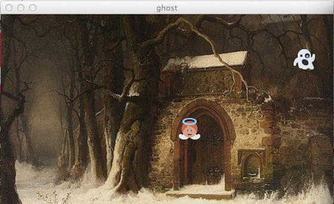

Hier treffen sich Geist und Engelchen vor dem Tor einer Waldkirche oder -kapelle um anmutig Euren Mauszeiger zu umtanzen. Dabei habe ich eine Technik verwendet, die *[Easing](https://processing.org/examples/easing.html)* genannt wird. Dabei folgt zwar der *Sprite* dem Mauszeiger, doch bei jedem Durchlauf wird die Distanz zwischen dem Mauszeiger und dem Sprite berechnet und mit einer kleinen Konstante (zum Beispiel 0.05) multipliziert.

~~~python
easing1 = 0.01
easing2 = 0.05

[…]

targetX = mouseX
targetY = mouseY

[…]

engelX += (targetX - engelX) * easing1
engelY += (targetY - engelY) * easing1

[…]

ghostX += (targetX - ghostX) * easing2
ghostY += (targetY - ghostY) * easing2
~~~

Durch die beiden unterschiedlichen Konstanten `easing1` und `easing2` habe ich erreicht, daß die beiden Sprites in unterschiedlichen Geschwindigkeiten und Abständen den Mauszeiger umtanzen.

## Das vollständige Programm

~~~python
easing1 = 0.01
easing2 = 0.05
ghostX = 240
ghostY = 200
engelX = 200
engelY = 240

def setup():
    global bg, ghost, engel
    bg = loadImage("koken.jpg")
    ghost = loadImage("ghost.png")
    engel = loadImage("engel.png")
    frameRate(30)
    size(560, 320)
  
def draw():
    global ghostX, ghostY, engelX, engelY
    background(bg)
    targetX = mouseX
    targetY = mouseY
    
    engelX += (targetX - engelX) * easing1
    if engelX >= (width - 36):
        engelX = width - 36
    elif engelX <= 0:
        engelX = 0;
    engelY += (targetY - engelY) * easing1
    if engelY >= (height - 36):
        engelY = height - 36
    elif engelY <= 0:
        engelY = 0
    image(engel, engelX, engelY)
    
    ghostX += (targetX - ghostX) * easing2
    if ghostX >= (width - 36):
        ghostX = width - 36
    elif ghostX <= 0:
        ghostX = 0;
    ghostY += (targetY - ghostY) * easing2
    if ghostY >= (height - 36):
        ghostY = height - 36
    elif ghostY <= 0:
        ghostY = 0
    image(ghost, ghostX, ghostY)
~~~

Wie Ihr seht, ist da eigentlich nicht viel mehr. Außer dem *Easing* habe ich mit den Randabfragen nur noch dafür gesorgt, daß die beiden Sprites bei ihrem Tänzchen das Programmfenster nicht verlassen.

## Maus versus Tastatur

Die Abfrage der Mausposition funktioniert bei Processing(.py) im Gegensatz zur Tastaturabfrage auch dann, wenn das Programmfenster nicht den Fokus besitzt, sondern auch, wenn die IDE oder andere Fenster noch im Vordergrund sind. Denn die IDE muß sich die Maus ja auch nicht mit dem Programmfenster teilen, die Tastatur aber doch.

## Caveat

Meine ursprüngliche Idee war, statt der Bilder Emojis für Geist und Engel einzusetzen, wie ich eine ähnliche Idee schon einmal in einem [P5.js-Sketch](http://blog.schockwellenreiter.de/2016/07/2016071001.html) umgesetzt hatte. Dann fiel mir jedoch ein, daß Processing.py ja auf Jython aufsetzt und es daher mit der UTF-8-Unterstützung im Allgemeinen und der Nutzung von Emojis im Besonderen schwierig werden kann (ein aktuelles Jython ist zwar nahezu kompatibel zu Python 2.7, aber eben nicht zu Python 3). Daher habe ich wieder auf die freien (CC-BY 4.0) [Twemoji-Graphiken von Twitter](https://github.com/twitter/twemoji) zurückgegriffen. Hier sind sie, falls Ihr das Beispiel nachprogrammieren wollt.

 

Der Geist sieht zwar nicht ganz so fröhlich aus, wie das Emoji von Apple und anderen, aber es ist vielleicht realistischer. Wenn Männer tanzen (müssen), dann verziehen sie halt oft schmerzhaft ihr Gesicht.

## Weitere Credits


Das Tor zur Waldkirche ist ein Ausschnitt aus einem Gemälde von *Edmund Koken*, das -- da der Maler 1872 verstorben ist -- hinreichend gemeinfrei sein dürfte, so daß Ihr das Bild gefahrlos verwenden könnt.


# Das Avoider Game

## Stage 1

Als ersten Abschluß dieses Buches möchte als kleinen Höhepunkt ich mit und für Euch ein kleines, vollständiges Spieleprojekt programmieren. Es basiert zum einen auf dem »[AS3 Avoider Game Tutorial](http://gamedev.michaeljameswilliams.com/as3-avoider-game-tutorial-base/)«, das *Michael James Williams* für ActionScript 3 und Flash geschrieben hat und das *Michael Haungs* dann in seinem Buch »Creative Greenfoot« nach Java und Greenfoot portierte. Zum anderen habe ich es noch mit Ideen aus einem Programm aus dem wundervollen Buch »Game Programming«, einem PyGame-Tutorial von *Andy Harris* aufgepeppt, in dem ein Postflieger Inseln anfliegen, aber Wolken vermeiden muß.

### Die Spiel-Idee

[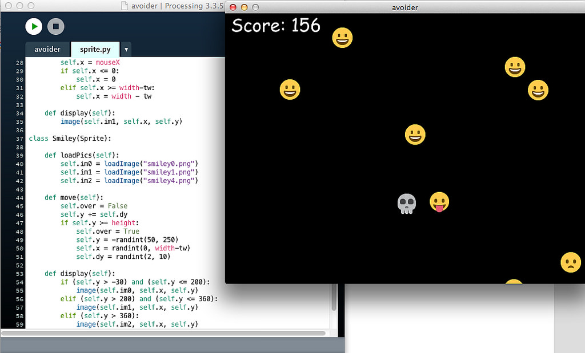](https://www.flickr.com/photos/schockwellenreiter/36501204602/)

Ziel des Spiels ist es, daß der Held seinen von oben herabregnenden Feinden ausweichen muß. Doch in diesem Spiel ist nichts so, wie es scheint: Die Feinde sind lächelnde Smileys und unser Held ist ein häßlicher Totenkopfschädel. Im ersten Stadium möchte ich nur dieses einfache Spieleprinzip und einen *Highscore* implementieren, in den nächsten Tutorials möchte ich dieses mit weiteren Variationen und Ideen zu einem interessanteren Spiel ausbauen.

### Das Sprite-Modul

Wie schon mehrmals praktiziert, lege ich erst einmal einen separaten Tab `spite.py` an, der in der Hauptsache die Klasse `Sprite` und die davon abgeleiteten Unterklassen `Skull` und `Smiley` beherbergt:

~~~python
from random import randint

tw = th = 36

class Sprite():
    def __init__(self, posX, posY):
        self.x = posX
        self.y = posY
        self.dx = 0
        self.dy = 0
        self.score = 0
        self.over = False

    def checkCollision(self, otherSprite):
        if (self.x < otherSprite.x + tw and otherSprite.x < self.x + tw
            and self.y < otherSprite.y + th
			and otherSprite.y < self.y + th):
            return True
        else:
            return False

class Skull(Sprite):
    
    def loadPics(self):
        self.im1 = loadImage("skull.png")
        
    def move(self):
        self.x = mouseX
        if self.x <= 0:
            self.x = 0
        elif self.x >= width-tw:
            self.x = width - tw
            
    def display(self):
        image(self.im1, self.x, self.y)

class Smiley(Sprite):
    
    def loadPics(self):
        self.im0 = loadImage("smiley0.png")
        self.im1 = loadImage("smiley1.png")
        self.im2 = loadImage("smiley4.png")
        
    def move(self):
        self.over = False
        self.y += self.dy
        if self.y >= height:
            self.over = True
            self.y = -randint(50, 250)
            self.x = randint(0, width-tw)
            self.dy = randint(2, 10)
        
    def display(self):
        if (self.y > -30) and (self.y <= 200):
            image(self.im0, self.x, self.y)
        elif (self.y > 200) and (self.y <= 360):
            image(self.im1, self.x, self.y)
        elif (self.y > 360):
            image(self.im2, self.x, self.y)
~~~

Für die Bilder der Akteure habe habe ich mich wieder bei den freien [Twitter Emojis](https://github.com/twitter/twemoji) bedient und hier sind sie, damit Ihr das Spiel nachprogrammieren könnt:

   

Die Bilder sind jeweils 36x36 Pixel groß, das habe ich in den Variablen `tw` und `th` festgehalten. Unser armer Held, der den grinsenden Smileys ausweichen muß, soll mit der Maus gesteuert werden. Dabei kann er sich nur horizontal bewegen, sein vertikaler Standort ist im Programm festverdrahtet. Mit den Zeilen

~~~python
        if self.x <= 0:
            self.x = 0
        elif self.x >= width-tw:
            self.x = width - tw
~~~

ist sichergestellt, daß er das Spielfeld nicht heimlich verlassen kann, um sich den Grinsebacken zu entziehen. Diese grinsen tatsächlich nicht immer: Fröhlich stürzen sie herab, strecken auf der Höhe unseres Helden die Zunge heraus, um dann, wenn sie merken, daß sie ihn nicht getroffen haben, mit verärgertem Gesicht in die Tiefe zu stürzen. Dazu wird ihnen je nach Y-Koordinate in der `display()`-Funktion das entsprechende Bildchen zugewiesen:

~~~python
    def display(self):
        if (self.y > -30) and (self.y <= 200):
            image(self.im0, self.x, self.y)
        elif (self.y > 200) and (self.y <= 360):
            image(self.im1, self.x, self.y)
        elif (self.y > 360):
            image(self.im2, self.x, self.y)
~~~

Die Smileys stürzen natürlich nicht ins Bodenlose. Ich wollte mir den Streß ersparen und die Smiley-Objekte löschen zu müssen, nachdem sie das Spielfeld verlassen haben. Stattdessen habe ich im Hauptprogramm die Anzahl der Smileys konstant gesetzt (es sind zehn) und diese jedesmal, wenn sie das Spielefenster verlassen haben, habe ich sie an einer zufälligen Position weit oberhalb des Fensters wieder neu positioniert:

~~~python
            self.y = -randint(50, 250)
            self.x = randint(0, width-tw)
            self.dy = randint(2, 10)
~~~

Mit der letzten Zeile wird ihnen dabei auch noch zufällig eine neue Geschwindigkeit zugewiesen, so daß der Spieler nicht merkt, daß er es immer wieder mit den gleichen Akteuren zu tun hat.

### Das Hauptprogramm

Nun zum Hauptprogramm. Es ist zwar nicht ganz so kurz geraten, wie einige andere, die ich hier schon vorgestellt hatte, aber eigentlich immer noch übersichtlich:

~~~python
from random import randint
from sprite import Skull, Smiley

w = 640
tw = th = 36
noSmileys = 10
startGame = True
playGame = False
gameOver = False


skull = Skull(w/2, 320)
smiley = []
for i in range(noSmileys):
    smiley.append(Smiley(randint(0, w-tw), randint(50, 250)))

def setup():
    skull.score = 0
    size(640, 480)
    frameRate(30)
    skull.loadPics()
    for i in range(len(smiley)):
        smiley[i].loadPics()
        smiley[i].dy = randint(2, 10)
    font = loadFont("ComicSansMS-32.vlw")
    textFont(font, 32)
  
def draw():
    global startGame, playGame, gameOver
    background(0, 0, 0)
    text("Score: " + str(skull.score), 10, 32)
    if startGame:
        text("Klick to Play", 200, height/2)
        if mousePressed:
            startGame = False
            playGame = True
    elif playGame:
        skull.move()
        for i in range(len(smiley)):
            if skull.checkCollision(smiley[i]):
                playGame = False
                gameOver = True        
        skull.display()
        for i in range(len(smiley)):
            smiley[i].move()
            if smiley[i].over:
                skull.score += 1
            smiley[i].display()
    elif gameOver:
        text("Game Over!", 200, height/2)
~~~

Für dieses Spiel habe ich mir mal erlaubt, die allgemein verpönte Schrift `Comic Sans` zu verwenden, denn nichts ist hier so, wie es scheint: Das Böse ist gut und das Gute ist böse. Die Entsprechende `.vlw`-Datei habe ich mit dem Tool »Schrift erstellen« (in `Tools -> Schrift erstellen …`) erzeugt und wie die Bildchen in den `data`-Folder des Sketches abgelegt.

Nach dem Import der Klassen `Skull` und `Smiley` habe ich die entsprechenden Objekte erzeugt und ihnen ihre Startposition zugewiesen. Im `setup()` werden dann die Bilder geladen und den Smileys je eine eigene, zufällige Geschwindigkeit (`dy`) zugewiesen.

Etwas komplizierter ist die `draw()`-Funktion aufgebaut. Wegen der Eigenheit von Processing.py, daß das Programm zwar aus der IDE heraus startet, das Programmfenster aber dann noch nicht den Fokus besitzt (den hat nach wie vor die IDE), war es notwendig, einen Startbildschirm vorzuschalten, der das Spiel erst nach einem Mausklick startet (und damit dem Programmfenster auch den Fokus gibt). Und natürlich sollte es auch einen »Game Over«-Bildschirm geben. Daher habe ich drei globale Zustandvariablen (`startGame`, `playGame` und `gameOver`) definiert und je nach ihrem Zustand werden dann die jeweiligen Bildschirme angezeigt.

Jeder Smiley, der das Fenster verläßt, ohne mit dem Schädel zu kollidieren, erhöht den Score des Spielers um einen Punkt. Dazu wurde die Variable `over` schon in der Klasse Smiley erzeugt, die jedesmal, wenn ein Smiley das Fenster verläßt

~~~python
        if self.y >= height:
            self.over = True
~~~

auf `True` gesetzt wird. Dies wird aber beim nächsten Druchlauf in

~~~python
    def move(self):
        self.over = False
~~~

sofort wieder zurückgesetzt. Im Hauptprogramm wird dann in den Zeilen

~~~python
            if smiley[i].over:
                skull.score += 1
~~~

der Zustand abgefragt und der Score entsprechend hochgesetzt.

Das Programm ist tatsächlich spielbar. Passt der Spieler nicht auf und kollidiert mit einem der Smileys, dann ist es unbarmherzig zu Ende und es heißt »Game Over!«


## Stage 2

Nun ist es an der Zeit, das *Avoider Game* ein wenig aufzupeppen und auch ein bißchen *Refactoring* vorzunehmen. Zum einen war es ja bisher sehr unnachgiebig und hat bei jeden Kontakt mit einem Smiley unseren Helden sofort sterben lassen. Nun möchte ich ihm ein paar Leben mehr spendieren. Und zum anderen habe ich aus Bequemlichkeit einige Initialisierungen in der Klasse `Sprite` vorgenommen, die dort eigentlich nicht hingehörten, da sie redundant waren. Diese habe ich nun in die abgeleiteten Klassen verfrachtet. Dazu mußte ich aber die `__init__()`-Methode jeweils überschreiben, so daß ich in den abgeleiteten Klassen `super()` aufrufen mußte, um die `__init()__`-Methode der Oberklasse auch aufzurufen. Ich will das mal an einem Beispiel zeigen. Die Klasse `Sprite` sieht nun so aus:

~~~python
class Sprite(object):
    def __init__(self, posX, posY):
        self.x = posX
        self.y = posY

    def checkCollision(self, otherSprite):
        if (self.x < otherSprite.x + tw and otherSprite.x < self.x + tw
            and self.y < otherSprite.y + th and otherSprite.y < self.y + th):
            return True
        else:
            return False
~~~

Sie hat nur noch eine minimale Initialisierung und besitzt auch nur noch die Methode `checkCollision()`, da nur diese an die daraus abgeleiteten Klassen vererbt wird. Die Klasse `Skull` hingegen und ihre `__init__()`-Methode sieht nun so aus:

~~~python
class Skull(Sprite):

    def __init__(self, posX, posY):
        super(Skull, self).__init__(posX, posY)
        self.score = 0
        self.health = 0
~~~

Der Aufruf der `super()`-Methode ist so Python 2.7 spezifisch, in Python 3 wurde sie vereinfacht, aber Processing.py beruht nun mal auf Jython und Jython ist (noch?) Processing 2.7. Damit der `super()`-Aufruf funktioniert, muß übrigens das Eltern-Objekt von `object` abgeleitet werden, sonst kann Processing.py den Typ nicht erkennen.

Die Variablen `score` und `health` sind nur für das Objekt `Skull` von Bedeutung und wurden daher vom Eltern-Objekt in das abgeleitete Objekt verschoben.

### Das Spiel


Um das Spiel angenehmer für den Spieler zu machen, bekam der Schädel ein paar Leben spendiert, die mit Herzchen symbolisiert werden, und außerdam bekam der *Game-Over-Screen* die Möglichkeit, von hier aus das Spiel noch einmal zu starten. Dafür mußte ich der Klasse `Smiley`, deren `__init__()`-Methode nun so aussieht,

~~~python
    def __init__(self, posX, posY):
        super(Smiley, self).__init__(posX, posY)
        self.outside = False
~~~

eine `reset()`-Methode verpassen, die die Möglichkeit gibt, zu Beginn eines neuen Spieles auch die Smileys wieder oberhalb des oberen Bildschirmrandes zu katapultieren, von der sie dann fröhlich wieder herabfallen können. Sie ist ganz einfach gehalten, da die Berechnung der neuen Positionen im Hauptprogramm abläuft:

~~~python
    def reset(self, posX, posY):
        self.x = posX
        self.y = posY
~~~

In der Initialisierung habe ich noch die Variable `over` in `outside` geändert. Auch wenn es nur Kosmetik ist, der Name schien mir verständlicher auszudrücken, was die Variable machen soll. Ansonsten hat es in dem Reiter `sprite.py` keine weiteren Veränderungen gegeben.

### Das Hauptprogramm

Alle anderen Veränderungen fanden im Hauptprogramm statt, das ein komplettes *Refactoring* erfahren hat. Die `draw()`-Schleife sieht nun so aus:

~~~python
def draw():
    global heart
    background(0, 0, 0)
    text("Score: " + str(skull.score), 10, 32)
    for i in range(skull.health):
        image(heart, width - i*tw - tw - 2, 2)
    if startgame:
        startGame()
    elif playgame:
        playGame()
    elif gameover:
        gameOver()
~~~

Nach der Definition des Hintergrundes wird ein *HUD* *(Head-Up-Display)* gezeichnet der in allen drei Bildschirmen gleich ist. Damit die Herzchen, obwohl von links nach rechts gezeichnet, immer in der rechten oberen Ecke kleben, sieht die Berechnung der Position etwas seltsam aus, aber es ist einfach nur die Weite des Bildschirms, abzüglich der Weite der Herzchen (in diesem Fall `tw = 36`) multipliziert mit der Anzahl der Herzchen und versehen mit einem Abstand von je zwei Pixeln.

Die einzelnen Bildschirme (Startbildschirm, das eigentliche Spiel und den Game-Over-Bildschirm) habe ich dann in eigene Funktionen verschoben und so aus der Hauptschleife ausgelagert. Sie sehen nun so aus:

~~~python
def startGame():
    global startgame, playgame
    text("Klick to Play", 200, height/2)
    if mousePressed:
        startgame = False
        playgame = True
        
def playGame():
    global playgame, gameover
    skull.move()
    for i in range(len(smiley)):
        if skull.checkCollision(smiley[i]):
            if skull.health > 0:
                skull.health -= 1
                smiley[i].reset(randint(0, w-tw), -randint(50, 250))
            else:
                playgame = False
                gameover = True 
    skull.display()
    for i in range(len(smiley)):
        smiley[i].move()
        if smiley[i].outside:
            skull.score += 1
        smiley[i].display()

def gameOver():
    global playgame, gameover
    text("Game Over!", 200, height/2)
    text("Klick to play again.", 200, 300)
    if mousePressed:
        gameover = False
        for i in range(len(smiley)):
            smiley[i].reset(randint(0, w-tw), -randint(50, 250))
        playgame = True
        skull.health = 5
~~~

Zu `startGame()`ist eigentlich nichts zu schreiben, der Code sollte selbsterklärend sein.

Anders ist es bei `playGame()`. Da der Kontakt des Schädels mit einem Spieler nicht mehr zum sofortigen Spielende führt, muß bei Kontakt das Smiley »gelöscht« werden, das heißt es wird wieder an eine zufällige Stelle oberhalb des Bildschirms versetzt. Und bei jedem Kontakt bekommt der Spieler natürlich ein Leben und ein Herzchen abgezogen. Da ich schon soviel darüber geschrieben habe, hier erst einmal das Herzchen, damit Ihr das Spiel auch nachprogrammieren könnt:


Ähnliches gilt für den `gameOver`-Screen. Hier müssen *alle* Smileys wieder an eine zufällige Position oberhalb des Bildschirms katapultiert werden und natürlich erhält der Schädel auch alle seine Leben wieder zurück.

### Der Quellcode

Zum vollen Verständnis und damit Ihr das Spiel auch vollständig nachprogrammieren könnt, hier der vollständige Quellcode. Erst einmal der Code im Reiter `sprite.py`:

~~~python
from random import randint

tw = th = 36

class Sprite(object):
    def __init__(self, posX, posY):
        self.x = posX
        self.y = posY

    def checkCollision(self, otherSprite):
        if (self.x < otherSprite.x + tw and otherSprite.x < self.x + tw
            and self.y < otherSprite.y + th
			and otherSprite.y < self.y + th):
            return True
        else:
            return False

class Skull(Sprite):

    def __init__(self, posX, posY):
        super(Skull, self).__init__(posX, posY)
        self.score = 0
        self.health = 0
            
    def loadPics(self):
        self.im1 = loadImage("skull.png")
        
    def move(self):
        self.x = mouseX
        if self.x <= 0:
            self.x = 0
        elif self.x >= width-tw:
            self.x = width - tw
            
    def display(self):
        image(self.im1, self.x, self.y)

class Smiley(Sprite):
    
    def __init__(self, posX, posY):
        super(Smiley, self).__init__(posX, posY)
        self.outside = False

    def loadPics(self):
        self.im0 = loadImage("smiley0.png")
        self.im1 = loadImage("smiley1.png")
        self.im2 = loadImage("smiley4.png")
        
    def move(self):
        self.outside = False
        self.y += self.dy
        if self.y >= height:
            self.outside = True
            self.y = -randint(50, 250)
            self.x = randint(0, width-tw)
            self.dy = randint(2, 10)
        
    def display(self):
        if (self.y > -30) and (self.y <= 200):
            image(self.im0, self.x, self.y)
        elif (self.y > 200) and (self.y <= 360):
            image(self.im1, self.x, self.y)
        elif (self.y > 360):
            image(self.im2, self.x, self.y)
    
    def reset(self, posX, posY):
        self.x = posX
        self.y = posY
~~~

Und dann das Hauptprogramm `avoider2`:

~~~python
from random import randint
from sprite import Skull, Smiley

w = 640
tw = th = 36
noSmileys = 10
startgame = True
playgame = False
gameover = False

skull = Skull(w/2, 320)
smiley = []
for i in range(noSmileys):
    smiley.append(Smiley(randint(0, w-tw), -randint(50, 250)))

def setup():
    global heart
    skull.score = 0
    skull.health = 5
    size(640, 480)
    frameRate(30)
    skull.loadPics()
    for i in range(len(smiley)):
        smiley[i].loadPics()
        smiley[i].dy = randint(2, 10)
    font = loadFont("ComicSansMS-32.vlw")
    textFont(font, 32)
    heart = loadImage("heart.png")
    # noCursor()
    # cursor(HAND)
  
def draw():
    global heart
    background(0, 0, 0)
    text("Score: " + str(skull.score), 10, 32)
    for i in range(skull.health):
        image(heart, width - i*tw - tw - 2, 2)
    if startgame:
        startGame()
    elif playgame:
        playGame()
    elif gameover:
        gameOver()

def startGame():
    global startgame, playgame
    text("Klick to Play", 200, height/2)
    if mousePressed:
        startgame = False
        playgame = True
        
def playGame():
    global playgame, gameover
    skull.move()
    for i in range(len(smiley)):
        if skull.checkCollision(smiley[i]):
            if skull.health > 0:
                skull.health -= 1
                smiley[i].reset(randint(0, w-tw), -randint(50, 250))
            else:
                playgame = False
                gameover = True 
    skull.display()
    for i in range(len(smiley)):
        smiley[i].move()
        if smiley[i].outside:
            skull.score += 1
        smiley[i].display()

def gameOver():
    global playgame, gameover
    text("Game Over!", 200, height/2)
    text("Klick to play again.", 200, 300)
    if mousePressed:
        gameover = False
        for i in range(len(smiley)):
            smiley[i].reset(randint(0, w-tw), -randint(50, 250))
        playgame = True
        skull.health = 5
~~~

Ich glaube, das *Refactoring* hat dem Quellcode gutgetan, er ist deutlich lesbarer und verständlicher geworden. Das Spiel ist so schon richtig gut spielbar, in einer nächsten Version möchte ich aber noch ein paar *Gimmicks* einbauen.

## Stage 3: Sternenhimmel

Als nächstes wollte ich dem kleinen Avoider-Spiel ein wenig optische Tiefe verpassen. Daher habe ich einen Sternenhimmel inszeniert, bei dem die kleinen Sternen im fernen Hintergrund sich sehr langsam bewegen und die größeren Sterne etwas schneller. So, wie wenn man bei einer Zugfahrt aus dem Fenster schaut, da scheinen die nahen Bäume auch schnell vorbeizufliegen, während der Wald im Hintergrund sich nur langsam bewegt. Diese Wahrnehmung nennt man [Bewegungsparallaxe](https://de.wikipedia.org/wiki/Bewegungsparallaxe) und sie wird besonders gerne in [Plattformspielen](https://de.wikipedia.org/wiki/Jump_%E2%80%99n%E2%80%99_Run) angewandt.

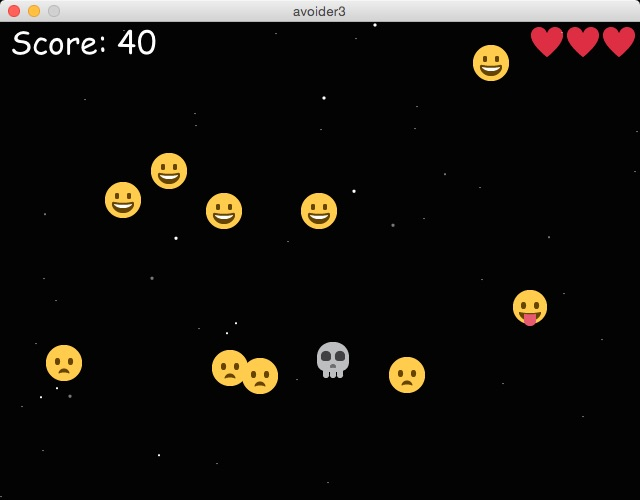

### Die Sterne

Um dies zu inszenieren, habe ich erst einmal im Reiter `sprite.py` eine Klasse `Star` angelegt:

~~~python
class Star(object):
    
    def __init__(self, posX, posY, dia, speed):
        self.x = posX
        self.y = posY
        self.r = dia
        self.dy = speed
        self.a = 255 # Transparency
    
    def move(self):
        self.outside = False
        self.y += self.dy
        if self.y >= height:
            self.outside = True
            self.y = -2*self.r
            self.x = randint(0, width - 2*self.r)
    
    def display(self):
        fill(255, 255, 255, self.a)
        noStroke()
        ellipse(self.x, self.y, self.r, self.r)
~~~

Ich hätte die Sterne natürlich auch von der Klasse `Sprite` ableiten können, aber da für sie ja keine Kollisionserkennung benötigt wird, hielt ich dies für *Overkill*. Da zumindest die größeren Sterne blinken sollen, bekommmen sie eine Alpha-Kanal für Transparenz zugewiesen (`self.a`). Ansonsten bewegen sie sich genauso wie die Smileys von oben nach unten, nur viel, viel langsamer.

Jeder Stern wird mit seiner Position, seiner Größe und seiner Geschwindigkeit initialisiert. Per Default erhält er die größtmögliche Transparenz, das heißt, er ist strahlend weiß.

Im Hauptprogramm werden für die Sterne zwei Listen angelegt, eine (`bstar[]`) für die weit entfernten, kleinen Sterne und eine `nStar` für die größeren, näher erscheinenden Sterne. Das Auffüllen aller Listen habe ich in die `setup`-Funktion verschoben, dort wird nun die Funktion `loadData()` aufgerufen:

~~~python
def loadData():
    for i in range(noSmileys):
        smiley.append(Smiley(randint(0, w-tw), -randint(50, 250)))
    for i in range(nobStars):
        bStar.append(Star(randint(0, w-2), randint(2, h-2), 1, 0.1))
    for i in range(nonStars):
        nStar.append(Star(randint(0, w-4), randint(2, h-2), randint(2, 3), 0.2))
~~~

Die kleinen Sterne werden mit einem Durchmesser von 1 initialisert, die größeren Sterne bekommen per Zufallszahl entweder einen Durchmesser von 2 oder 3 zugewiesen. Interessant ist die Geschwindigkeit, mit der die Sterne sich bewegen: 0.1 per Frame für die kleinen, 0.2 per Frame für die großen. Processing kommt intern erstaunlich gut mit diesen dezimalen Werten bei der Positionierung zurecht, obwohl ja eigentlich nur ganzzahlige Pixel möglich sind.

Es gibt jeweils eine feste Anzahl von Sternen, wie bei den Smileys auch werden sie, wenn sie den unteren Bildrand passiert haben, wieder auf eine zufällige Position oberhalb des Fensters zurückversetzt.

Die Bewegung der Sterne findet natürlich in der Funktion `playGame()` statt, und zwar als erstes, bevor alle anderen Akteure gezeichnet werden (schließlich bilden sie den Hintergrund des Spiels):

~~~python
    for i in range(len(bStar)):
        bStar[i].move()
        bStar[i].display()
    for i in range(len(nStar)):
        nStar[i].move()
        if (frameCount % randint(15, 30)) < randint(1, 15):
            nStar[i].a = 120
        else:
            nStar[i].a = 255
        nStar[i].display()
~~~

Die größeren Sterne sollen zusätzlich zur Bewegung auch noch Blinken, daher habe ich ihnen zufällige Intervalle zugewiesen, in denen der Alpha-Kanal auf 120 gesetzt wird (`nStar[i].a = 120`). Die Werte für die Zufallszahlen habe ich experimentell herausgefunden, Ihr könnt ruhig auch einmal andere Intervalle ausprobieren.

### Der Quellcode

Und nun zum Nachvollziehen der vollständige Quellcode. Zuerst der Code aus dem Reiter `sprite.py`:

~~~python
from random import randint

tw = th = 36

class Sprite(object):
    def __init__(self, posX, posY):
        self.x = posX
        self.y = posY

    def checkCollision(self, otherSprite):
        if (self.x < otherSprite.x + tw and otherSprite.x < self.x + tw
            and self.y < otherSprite.y + th
			and otherSprite.y < self.y + th):
            return True
        else:
            return False


class Skull(Sprite):

    def __init__(self, posX, posY):
        super(Skull, self).__init__(posX, posY)
        self.score = 0
        self.health = 0
            
    def loadPics(self):
        self.im1 = loadImage("skull.png")
        
    def move(self):
        self.x = mouseX
        if self.x <= 0:
            self.x = 0
        elif self.x >= width-tw:
            self.x = width - tw
            
    def display(self):
        image(self.im1, self.x, self.y)

class Smiley(Sprite):
    
    def __init__(self, posX, posY):
        super(Smiley, self).__init__(posX, posY)
        self.outside = False

    def loadPics(self):
        self.im0 = loadImage("smiley0.png")
        self.im1 = loadImage("smiley1.png")
        self.im2 = loadImage("smiley4.png")
        
    def move(self):
        self.outside = False
        self.y += self.dy
        if self.y >= height:
            self.outside = True
            self.y = -randint(50, 250)
            self.x = randint(0, width-tw)
            self.dy = randint(4, 10)
        
    def display(self):
        if (self.y > -30) and (self.y <= 250):
            image(self.im0, self.x, self.y)
        elif (self.y > 250) and (self.y <= 320):
            image(self.im1, self.x, self.y)
        elif (self.y > 320):
            image(self.im2, self.x, self.y)
    
    def reset(self, posX, posY):
        self.x = posX
        self.y = posY
            
class Star(object):
    
    def __init__(self, posX, posY, dia, speed):
        self.x = posX
        self.y = posY
        self.r = dia
        self.dy = speed
        self.a = 255 # Transparency
    
    def move(self):
        self.outside = False
        self.y += self.dy
        if self.y >= height:
            self.outside = True
            self.y = -2*self.r
            self.x = randint(0, width - 2*self.r)
    
    def display(self):
        fill(255, 255, 255, self.a)
        noStroke()
        ellipse(self.x, self.y, self.r, self.r)
~~~

Außer dem schon oben besprochen Objekt `Star` gibt es hier nichts Neues. Aber auch im Hauptprogramm sind nur die erwähnten Änderungen neu:

~~~python
from random import randint
from sprite import Skull, Smiley, Star

w = 640
h = 480
tw = th = 36
noSmileys = 10
nobStars = 30
nonStars = 15
startgame = True
playgame = False
gameover = False

skull = Skull(w/2, 320)
smiley = []
bStar = []
nStar = []

def setup():
    global heart
    skull.score = 0
    skull.health = 5
    size(640, 480)
    frameRate(30)
    loadData()
    skull.loadPics()
    for i in range(len(smiley)):
        smiley[i].loadPics()
        smiley[i].dy = randint(4, 10)
    font = loadFont("ComicSansMS-32.vlw")
    textFont(font, 32)
    heart = loadImage("heart.png")
    # noCursor()
    # cursor(HAND)
  
def draw():
    global heart
    background(0, 0, 0)
    fill(255, 255, 255, 255)
    text("Score: " + str(skull.score), 10, 32)
    for i in range(skull.health):
        image(heart, width - i*tw - tw - 2, 2)
    if startgame:
        startGame()
    elif playgame:
        playGame()
    elif gameover:
        gameOver()

def loadData():
    for i in range(noSmileys):
        smiley.append(Smiley(randint(0, w-tw), -randint(50, 250)))
    for i in range(nobStars):
        bStar.append(Star(randint(0, w-2), randint(2, h-2), 1, 0.1))
    for i in range(nonStars):
        nStar.append(Star(randint(0, w-4), randint(2, h-2), randint(2, 3), 0.2))

def startGame():
    global startgame, playgame
    text("Klick to Play", 200, height/2)
    if mousePressed:
        startgame = False
        playgame = True
        
def playGame():
    global playgame, gameover
    for i in range(len(bStar)):
        bStar[i].move()
        bStar[i].display()
    for i in range(len(nStar)):
        nStar[i].move()
        if (frameCount % randint(15, 30)) < randint(1, 15):
            nStar[i].a = 120
        else:
            nStar[i].a = 255
        nStar[i].display()
    skull.move()
    for i in range(len(smiley)):
        if skull.checkCollision(smiley[i]):
            if skull.health > 0:
                skull.health -= 1
                smiley[i].reset(randint(0, w-tw), -randint(50, 250))
            else:
                playgame = False
                gameover = True 
    skull.display()
    for i in range(len(smiley)):
        smiley[i].move()
        if smiley[i].outside:
            skull.score += 1
        smiley[i].display()

def gameOver():
    global playgame, gameover
    text("Game Over!", 200, height/2)
    text("Klick to play again.", 200, 300)
    if mousePressed:
        gameover = False
        for i in range(len(smiley)):
            smiley[i].reset(randint(0, w-tw), -randint(50, 250))
        playgame = True
        skull.health = 5
~~~

Das Spiel ist schon recht spielbar geworden, durch die Sterne entsteht tatsächlich die Illusion von Tiefe und es ist auch nicht einfach, den Schädel für längere Zeit an den herunterfallenden Smileys vorbei zu manövrieren. Irgendwann erwischt es einen immer.

## Stage 4: PowerUp und PowerDown

Im vierten und letzten Teil meiner kleinen Serie über die Programmierung des Avoider-Spiels in Processing.py wollte ich das Spiel noch mit ein paar zusätzlichen Akteuren aufpeppen. Dazu habe ich *Power Items* eingeführt, die entweder dem Spieler zusätzliche Leben geben oder nehmen, also je ein *PowerUp* und ein *PowerDown*. Als besonderes Highlight bewegen diese sich auf anderen Wegen durch das Spielefenster als die Smileys und sind daher etwas unberechenbarer für den Spieler. Gemäß dem Motto des Spieles, daß man niemanden trauen darf, das gut aussieht, ist das PowerUp, das dem Spieler ein weiteres Leben schenkt, ein grimmig aussehendes Gespenst und das PowerDown, das ihm ein Leben nimmt, ein lecker aussehendes Tassentörtchen.

 

Auch diese Bilder habe ich wieder den freien [Twitter Emojis](https://github.com/twitter/twemoji) *(Twemojis)* entnommen und hier sind sie, damit Ihr das Spiel nachprogrammieren könnt.

### Power Items

Als erstes habe ich im Reiter `sprite.py` eine Klasse `PowerItem` angelegt, die von `Sprite` erbt:

~~~python
class PowerItem(Sprite):
    
    def __init__(self, posX, posY, tX, tY, eT):
        super(PowerItem, self).__init__(posX, posY)
        self.origX = posX
        self.origY = posY
        self.targetX = tX
        self.targetY = tY
        self.expireTime = eT
        self.duration = self.expireTime/2.0
        self.counter = 0
        self.pause = randint(10, 150)
        
    def curveX(self, x):
        return x
    
    def curveY(self, y):
        return y
    
    def easing(self):
        self.counter += 1
        self.fX = self.fY = (self.counter)/float(self.duration)
        self.fX = self.curveX(self.fX)
        self.fY = self.curveY(self.fY)
        self.x = (self.targetX * self.fX) + (self.origX * (1.0 - self.fX))
        self.y = (self.targetY * self.fY) + (self.origY * (1.0 - self.fY))

    def move(self):
        self.expireTime -= 1
        if self.expireTime < 0:
            self.pause -= 1
            if self.pause < 0:
                self.reset()
    
    def display(self):
        # print(self.x, self.y)
        image(self.im1, self.x, self.y)
    
    def reset(self):
        self.origX = randint(-150, width-tw)
        self.origY = -randint(50, 250)
        self.targetX = randint(tw, width-tw)
        self.targetY = randint(tw, height-tw)
        self.expireTime = self.duration*2.0
        self.counter = 0
        self.pause = randint(10, 150)
~~~

Die *Power Items* haben nur eine gewisse Lebensdauer und bewegen sich während ihrer Lebenszeit (`eT`) von der Startposition (`posX`, `posY`) zur Zielposition (`tX`, `tY`). Diese Parameter müssen daher dem Konstruktor übergeben werden.

Wie alle Akteure prasseln die *Power Items* zu Beginn des Spieles quasi gleichzeitig vom oberen Fensterrand auf den Spieler nieder, damit sich die Lage in den folgenden Runden entspannt, habe ich den einzelnen Items nach Ende ihren Lebens eine Pause verordnet, deren Länge vom Zufallszahlengenerator bestimmt wird, bevor sie wieder die Arena betreten dürfen.

### Easing

Das Prinzip des *[Easings](https://processing.org/examples/easing.html)* hatte ich in einem früheren Kapitel schon einmal eingeführt. Es war ein einfaches, lineares Easing, in dem die Figur immer langsamer wurde, je mehr sie sich dem Ziel näherte. Dieses lineare Easing ist auch in der Klasse `PowerItem` implementiert, aber so, daß es verändert werden kann, wenn die abgeleiteten Klassen die Methoden `curveX()` und/oder `curveY()` überschreiben. Außerdem wird die Geschwindigkeit und neue Position unter anderem auch von der Lebensdauer des *Power Items* beeinflußt.

In den von `PowerItem` abgeleiteten Klassen `Ghost` und `Cupcake` mußten also nur die entsprechenden Bildchen geladen und die Methode `curveY()` überschreiben:

~~~python
class Ghost(PowerItem):
    
    def loadPics(self):
        self.im1 = loadImage("ghost.png")
    
    
    def curveY(self, y):
        return y**5

class Cupcake(PowerItem):
    
    def loadPics(self):
        self.im1 = loadImage("cupcake.png")
    
    def curveY(self, y):
        return 3*sin(3*y)
~~~

Im Falle des *Power Up*, des Gespenstes, bewegt sich das *Power Item* in einer expotentionellen Kurve von oben nach unten und wird immer schneller, je tiefer es fällt. Der Spieler muß sich schon beeilen, um mit diesem Item zu kollidieren, um ein zusätzlichres Leben einzufangen. Dagegen habe ich mir im Falle des Tassentörtchens etwas Gemeines überlegt: Die einzelnen Törtchen bewegen sich auf einer übergroßen Sinuskurve durch das Geschehen. Daher kann es durchaus passieren, daß die Törtchen, nachdem sie das Fenster am unteren Rand verlassen haben, von dort auch wieder auftauchen und nach oben schießen. Das macht es dem Spieler schwieriger, ihnen auszuweichen. Also: Die Kollision mit den *Power Ups* ist schwierig, umgekehrt it es schwer, den *Power Downs* auszuweichen. Schießlich soll es dem Spieler ja nicht zu einfach vorkommen.

Die jeweiligen Werte in der Methode `curveY()` habe ich durch wildes Experimentieren herausgefunden.

### Das Hauptprogramm

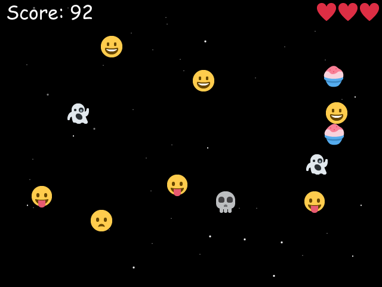

Im Hauptprogramm sind die wichtigsten Änderungen in der Funktion `playGame()` vorgenommen worden, die folgende zusätzliche Zeilen erhielt:

~~~python
    for i in range(len(ghost)):
        ghost[i].easing()
        ghost[i].move()
        if ghost[i].checkCollision(skull):
            if skull.health < 5:
                skull.health += 1
                ghost[i].reset()
        ghost[i].display()
    for i in range(len(cupcake)):
        cupcake[i].easing()
        cupcake[i].move()
        if cupcake[i].checkCollision(skull):
            skull.health -= 1
            cupcake[i].reset()
        cupcake[i].display()
~~~

Für jedes *Power Item* wird erst das *Easing* berechnet, dann die neue Position bestimmt, überprüft ob es mit dem Spieler kollidiert und dann wird es angezeigt. Außerdem lasse ich als kleine Optimierung nicht mehr in jedem Frame den Spieler prüfen, ob er mit einem der Smileys kollidiert (das muß er nämlich jedes Mal mit *allen* Smileys machen), sondern nun überprüfen -- wie bei den *Power Items* -- die Smileys, ob sie mit dem Spieler kollidieren:

~~~python
    for i in range(len(smiley)):
        smiley[i].move()
        if smiley[i].checkCollision(skull):
            skull.health -= 1
            smiley[i].reset(randint(0, w-tw), -randint(50, 250))
        if smiley[i].outside:
            skull.score += 1
        smiley[i].display()
~~~

Das Spiel startet in meiner Version mit zehn Smileys, drei Gespenstern und fünf Tassentörtchen. Das sind 18 Akteure auf die der Spieler aufpassen muß und das macht das Spiel schon ganz schön schwierig, aber ohne daß es unfair wirkt oder gar unspielbar ist.

### Der Quellcode

Und nun -- wie immer -- der vollständige Quellcode, damit Ihr das Spiel nachprogrammieren und nachvollziehen könnt. Als erstes wieder der Code aus dem Reiter `sprite.py`:

~~~python
from random import randint

tw = th = 36

class Sprite(object):
    def __init__(self, posX, posY):
        self.x = posX
        self.y = posY

    def checkCollision(self, otherSprite):
        if (self.x < otherSprite.x + tw and otherSprite.x < self.x + tw
            and self.y < otherSprite.y + th and otherSprite.y < self.y + th):
            return True
        else:
            return False


class Skull(Sprite):

    def __init__(self, posX, posY):
        super(Skull, self).__init__(posX, posY)
        self.score = 0
        self.health = 0
            
    def loadPics(self):
        self.im1 = loadImage("skull.png")
        
    def move(self):
        self.x = mouseX
        if self.x <= 0:
            self.x = 0
        elif self.x >= width-tw:
            self.x = width - tw
            
    def display(self):
        image(self.im1, self.x, self.y)

class Smiley(Sprite):
    
    def __init__(self, posX, posY):
        super(Smiley, self).__init__(posX, posY)
        self.outside = False

    def loadPics(self):
        self.im0 = loadImage("smiley0.png")
        self.im1 = loadImage("smiley1.png")
        self.im2 = loadImage("smiley4.png")
        
    def move(self):
        self.outside = False
        self.y += self.dy
        if self.y >= height:
            self.outside = True
            self.y = -randint(50, 250)
            self.x = randint(0, width-tw)
            self.dy = randint(4, 10)
        
    def display(self):
        if (self.y > -30) and (self.y <= 250):
            image(self.im0, self.x, self.y)
        elif (self.y > 250) and (self.y <= 320):
            image(self.im1, self.x, self.y)
        elif (self.y > 320):
            image(self.im2, self.x, self.y)
    
    def reset(self, posX, posY):
        self.x = posX
        self.y = posY

class PowerItem(Sprite):
    
    def __init__(self, posX, posY, tX, tY, eT):
        super(PowerItem, self).__init__(posX, posY)
        self.origX = posX
        self.origY = posY
        self.targetX = tX
        self.targetY = tY
        self.expireTime = eT
        self.duration = self.expireTime/2.0
        self.counter = 0
        self.pause = randint(10, 150)
        
    def curveX(self, x):
        return x
    
    def curveY(self, y):
        return y
    
    def easing(self):
        self.counter += 1
        self.fX = self.fY = (self.counter)/float(self.duration)
        self.fX = self.curveX(self.fX)
        self.fY = self.curveY(self.fY)
        self.x = (self.targetX * self.fX) + (self.origX * (1.0 - self.fX))
        self.y = (self.targetY * self.fY) + (self.origY * (1.0 - self.fY))

    def move(self):
        self.expireTime -= 1
        if self.expireTime < 0:
            self.pause -= 1
            if self.pause < 0:
                self.reset()
    
    def display(self):
        # print(self.x, self.y)
        image(self.im1, self.x, self.y)
    
    def reset(self):
        self.origX = randint(-150, width-tw)
        self.origY = -randint(50, 250)
        self.targetX = randint(tw, width-tw)
        self.targetY = randint(tw, height-tw)
        self.expireTime = self.duration*2.0
        self.counter = 0
        self.pause = randint(10, 150)
        
class Ghost(PowerItem):
    
    def loadPics(self):
        self.im1 = loadImage("ghost.png")
    
    
    def curveY(self, y):
        return y**5

class Cupcake(PowerItem):
    
    def loadPics(self):
        self.im1 = loadImage("cupcake.png")
    
    def curveY(self, y):
        return 3*sin(3*y)
    
            
class Star(object):
    
    def __init__(self, posX, posY, dia, speed):
        self.x = posX
        self.y = posY
        self.r = dia
        self.dy = speed
        self.a = 255 # Transparency
    
    def move(self):
        self.outside = False
        self.y += self.dy
        if self.y >= height:
            self.outside = True
            self.y = -2*self.r
            self.x = randint(0, width - 2*self.r)
    
    def display(self):
        fill(255, 255, 255, self.a)
        noStroke()
        ellipse(self.x, self.y, self.r, self.r)
~~~

Und dann das eigentliche Hauptprogramm, das ebenfalls noch einmal an Umfang zugenommen hat:

~~~python
from random import randint
from sprite import Skull, Smiley, Ghost, Cupcake, Star

w = 640
h = 480
tw = th = 36
noSmileys = 10
nobStars = 30
nonStars = 15
noGhost = 3
noCupcakes = 5
startgame = True
playgame = False
gameover = False

skull = Skull(w/2, 320)
smiley = []
bStar = []
nStar = []
ghost = []
cupcake = []

def setup():
    global heart
    size(640, 480)
    frameRate(30)
    loadData()
    skull.score = 0
    skull.health = 5
    skull.loadPics()
    for i in range(len(smiley)):
        smiley[i].loadPics()
        smiley[i].dy = randint(4, 10)
    for i in range(len(ghost)):
        ghost[i].loadPics()
    for i in range(len(cupcake)):
        cupcake[i].loadPics()
    font = loadFont("ComicSansMS-32.vlw")
    textFont(font, 32)
    heart = loadImage("heart.png")
    # noCursor()
    # cursor(HAND)
  
def draw():
    global heart
    background(0, 0, 0)
    fill(255, 255, 255, 255)
    text("Score: " + str(skull.score), 10, 32)
    for i in range(skull.health):
        image(heart, width - i*tw - tw - 2, 2)
    if startgame:
        startGame()
    elif playgame:
        playGame()
    elif gameover:
        gameOver()

def loadData():
    for i in range(noSmileys):
        smiley.append(Smiley(randint(0, width-tw), -randint(50, 250)))
    for i in range(noGhost):
        ghost.append(Ghost(randint(-150, width-tw), -randint(50, 250),
		randint(tw, width-tw), randint(tw, height-tw), 300))
    for i in range(noCupcakes):
        cupcake.append(Cupcake(randint(-150, width-tw), -randint(50, 250),
		randint(tw, width-tw), randint(tw, height-tw), 600))
    for i in range(nobStars):
        bStar.append(Star(randint(0, width-2), randint(2, height-2), 1, 0.1))
    for i in range(nonStars):
        nStar.append(Star(randint(0, width-4), randint(2, height-2),
		randint(2, 3), 0.2))

def startGame():
    global startgame, playgame
    text("Klick to Play", 200, height/2)
    if mousePressed:
        startgame = False
        playgame = True
        
def playGame():
    global playgame, gameover
    for i in range(len(bStar)):
        bStar[i].move()
        bStar[i].display()
    for i in range(len(nStar)):
        nStar[i].move()
        if (frameCount % randint(15, 30)) < randint(1, 15):
            nStar[i].a = 120
        else:
            nStar[i].a = 255
        nStar[i].display()
    skull.move()
    if skull.health < 0:
        playgame = False
        gameover = True 
    skull.display()
    for i in range(len(smiley)):
        smiley[i].move()
        if smiley[i].checkCollision(skull):
            skull.health -= 1
            smiley[i].reset(randint(0, w-tw), -randint(50, 250))
        if smiley[i].outside:
            skull.score += 1
        smiley[i].display()
    for i in range(len(ghost)):
        ghost[i].easing()
        ghost[i].move()
        if ghost[i].checkCollision(skull):
            if skull.health < 5:
                skull.health += 1
                ghost[i].reset()
        ghost[i].display()
    for i in range(len(cupcake)):
        cupcake[i].easing()
        cupcake[i].move()
        if cupcake[i].checkCollision(skull):
            skull.health -= 1
            cupcake[i].reset()
        cupcake[i].display()

def gameOver():
    global playgame, gameover
    text("Game Over!", 200, height/2)
    text("Klick to play again.", 200, 300)
    if mousePressed:
        gameover = False
        for i in range(len(smiley)):
            smiley[i].reset(randint(0, w-tw), -randint(50, 250))
        for i in range(len(ghost)):
            ghost[i].reset()
        for i in range(len(cupcake)):
            cupcake[i].reset()
        playgame = True
        skull.health = 5
        skull.score = 0
        
def mousePressed():
    global playgame
    if playgame:
        saveFrame("frames/screenshot-####.png")
~~~

### Screenshots

Bei diesem Spiel ist es nahezu unmöglich, mit den Bordmitteln des Betriebssystems noch aussagefähige Screenshots wie den oben im Beitrag zu erstellen. Daher habe ich das mit Processing-eigenen Mitteln erledigt: Die Funktion `mousePressed()`

~~~python
def mousePressed():
    global playgame
    if playgame:
        saveFrame("frames/screenshot-####.png")
~~~

schießt jedes Mal, wenn die linke Maustaste gedrückt wird, einen aktuellen Screenshot. Aus dem fertigen Spiel solltet Ihr diese Funktion natürlich wieder herausnehmen.

Das war es mit dem *Avoider Game*. Natürlich sind noch jede Menge Erweiterungen möglich und auch die Gestaltung des Start- und des Game-Over-Bildschirms kann sicher noch verschönert werden. Mir kam es aber darauf an, zu zeigen, wie in Processing.py mit einfachen Mitteln doch schnell ein ansprechendes Spiel programmiert werden kann. Alles weitere ist Eurer Phantasie überlassen.

## Nachtrag: Avoider Game Stage 4a

Ich konnte es nicht lassen, nachdem ich zwei Nächte darüber geschlafen hatte, mußte ich doch noch einmal an das Avoider Game heran. Die *Power Ups* und *Power Downs* sollten jeweils zwei unterschiedliche Bildchen zugeordnet bekommen. Erreicht habe ich das mit der Python-eigenen Zufallsfunktion `choice()` aus der [Random-Bibliothek](https://docs.python.org/2/library/random.html). So habe ich im Reiter `sprite.py` in der ersten Zeile `choice` importiert:

~~~python
from random import randint, choice
~~~

Und dann in der Klasse `Ghost` die Methode `loadPics()` wie folgt geändert:

~~~python
    def loadPics(self):
        self.im1 = loadImage(choice(["ghost.png", "octo.png"]))
~~~

In der Klasse `Cupcake` sieht die gleiche Methode nun so aus:

~~~python
    def loadPics(self):
        self.im1 = loadImage(choice(["cupcake.png", "bier.png"]))
~~~

Hier sind die Bildchen für diejenigen unter Euch, die auch diese (letzte) Änderung nachprogrammieren wollen:

 

Auch diese Bilder entstammen den freien ([CC-BY](http://twitter.github.io/twemoji/)) [Twitter Emojis](https://github.com/twitter/twemoji) *(Twemojis)*.


Ich habe leider keinen Screenshot hinbekommen, auf denen alle verwendeten Bildchen zu sehen sind. So müßt Ihr mit obigem vorliebnehmen und mir glauben: Auch die Krake existiert!

# Beinahe ein Epilog: Walking Pingus

Die älteren unter Euch können sich sicher noch an das Computerspiel [Lemminge](https://de.wikipedia.org/wiki/Lemmings) von 1991 erinnern, in dem man eine Horde kleiner, aber dummer Geschöpfe mit grünen Haaren und blauem Anzug, die immer stur geradeaus liefen, davon abhalten mußte, ins Verderben zu rennen und sie zum rettenden Ausgang führen. *Ingo Runke* hatte einen freien (GPL) Klon gebastelt, den er in Anspielung auf das Linus-Maskottchen *Tux* [Pingus](https://de.wikipedia.org/wiki/Pingus) nannte und in dem man -- statt der Lemming -- kleine Pinguine retten mußte. Die Pinguine bewegten sich in jede Richtung mit 8 Bildern und da ich mal etwas anderes als zappelige Orks mit Processing.py auf den Bildschirm bringen wollte, habe ich mich mal an den Pinguinen versucht.


Nach den bisherigen Helden- und Orks-Tutorials ist es nur eine Fingerübung. Auf eine Oberklasse `Sprites` habe ich dieses Mal verzichtet, der Pingus muß ja nur mit den Fensterrändern kommunizieren. Wie schon bisher existieren neben der Initialisierung drei Methoden, nämlich `loadPics()`, `move()` und `display()`. Die ersten beiden Methoden sind eigentlich trivial und nur deswegen so umfangreich, weil sie jeweils mit 16 Bildchen umgehen müssen. Lediglich bei der `display()`-Methode muß man aufpassen und rückwärts zählen, da andersherum die Schleife nach dem ersten Male immer sofort verlassen wird:

~~~python
    def display(self):
        if frameCount % 32 >= 28:
            image(self.image1, self.x, self.y)
        elif frameCount % 32 >= 24:
            image(self.image2, self.x, self.y)
        elif frameCount % 32 >= 20:
            image(self.image3, self.x, self.y)
        elif frameCount % 32 >= 16:
            image(self.image4, self.x, self.y)
        elif frameCount % 32 >= 12:
                image(self.image5, self.x, self.y)
        elif frameCount % 32 >= 8:
            image(self.image6, self.x, self.y)
        elif frameCount % 32 >= 4:
            image(self.image7, self.x, self.y)
        else:
            image(self.image8, self.x, self.y)
~~~

Die einzelnen Bilder habe ich wieder mit Tiled aus dem Spritesheet ausgeschnitten. Dabei ist zu beachten, daß die einzelnen Pinguine eine Tilegröße von 32x44 Pixeln besitzen.


## Der Quellcode

Wie gesagt, es ist nur eine kleine Fingerübung. Hier erst einmal das Modul `penguin.py`, das nur die Klasse `Penguin` enthält:

~~~python
class Penguin(object):
    
    def __init__(self, posX, posY):
        self.x = posX
        self.y = posY
        self.dir = 0
        self.dx = 0
        
    def loadPics(self):
        # nach rechts laufen
        self.pingrt1 = loadImage("pingrt1.png")
        self.pingrt2 = loadImage("pingrt2.png")
        self.pingrt3 = loadImage("pingrt3.png")
        self.pingrt4 = loadImage("pingrt4.png")
        self.pingrt5 = loadImage("pingrt5.png")
        self.pingrt6 = loadImage("pingrt6.png")
        self.pingrt7 = loadImage("pingrt7.png")
        self.pingrt8 = loadImage("pingrt8.png")
        # nach links laufen
        self.pinglft1 = loadImage("pinglft1.png")
        self.pinglft2 = loadImage("pinglft2.png")
        self.pinglft3 = loadImage("pinglft3.png")
        self.pinglft4 = loadImage("pinglft4.png")
        self.pinglft5 = loadImage("pinglft5.png")
        self.pinglft6 = loadImage("pinglft6.png")
        self.pinglft7 = loadImage("pinglft7.png")
        self.pinglft8 = loadImage("pinglft8.png")
        
    def move(self):
        if self.dir == 1:
            self.x += self.dx
            self.image1 = self.pingrt1
            self.image2 = self.pingrt2
            self.image3 = self.pingrt3
            self.image4 = self.pingrt4
            self.image5 = self.pingrt5
            self.image6 = self.pingrt6
            self.image7 = self.pingrt7
            self.image8 = self.pingrt8
        elif self.dir == -1:
            self.x -= self.dx
            self.image1 = self.pinglft1
            self.image2 = self.pinglft2
            self.image3 = self.pinglft3
            self.image4 = self.pinglft4
            self.image5 = self.pinglft5
            self.image6 = self.pinglft6
            self.image7 = self.pinglft7
            self.image8 = self.pinglft8
        
    def display(self):
        if frameCount % 32 >= 28:
            image(self.image1, self.x, self.y)
        elif frameCount % 32 >= 24:
            image(self.image2, self.x, self.y)
        elif frameCount % 32 >= 20:
            image(self.image3, self.x, self.y)
        elif frameCount % 32 >= 16:
            image(self.image4, self.x, self.y)
        elif frameCount % 32 >= 12:
                image(self.image5, self.x, self.y)
        elif frameCount % 32 >= 8:
            image(self.image6, self.x, self.y)
        elif frameCount % 32 >= 4:
            image(self.image7, self.x, self.y)
        else:
            image(self.image8, self.x, self.y)
~~~

Das Hauptprogramm ist extrem kurz, aber der Pinguin watschelt ja auch nur von links nach rechts und wieder zurück:

~~~python
from penguin import Penguin

pingus = Penguin(0, 16)

def setup():
    frameRate(30)
    size(640, 64)
    pingus.loadPics()
    pingus.dx = 1
    pingus.dir = 1

def draw():
    background(0, 153, 204)
    pingus.move()
    if pingus.x >= 640 - 32:
        pingus.dir = -1
    if pingus.x <= 0:
        pingus.dir = 1
    pingus.display()
~~~

Im Gegensatz zu den Orks aus den vorherigen Programmen bewegt sich Pingus mit jedem Frame nur einen Pixel weiter. Denn durch die vielen Bilder ist die Bewegung doch so exakt, daß es bei schnellerem Vorangehen aussieht, als ob Pingus auf Eis schlittert (bei Pinguinen sicher nicht unüblich, aber in diesem Fall nicht gewollt). Es ist eben kein *Running Ork* sondern nur ein *Walking Pingus*.

Wenn Ihr das nachprogrammiert und laufen laßt, werdet Ihr sehen, daß das schon sehr nett aussieht, besonders auch wie die Zipfelmütze des kleinen Pinguins im Takt hin und her wippt.

## Pingus Links

Wenn Ihr Pingus spielen wollt, das Spiel gibt es trotz seines Alters immer noch [hier für Windows, Mac und Linux zum freien Download](https://pingus.seul.org/download.html). Auf meinen Macs läuft es auch noch, macht Spaß und die [Quellen könnt Ihr auf GitHub](https://github.com/Pingus/pingus) finden.

# Apple Invaders

In einem [YouTube-Video](https://www.youtube.com/watch?v=AX-Zfcz1AEs) erzählte der junge Informatik-Student *Matthew Hopson* von einem Programmierwettbewerb an seiner Hochschule, in dem ein Spiel programmiert werden sollte, in dem gute Androiden böse Äpfel fressen oder zermantschen sollen. (Was wollte der Lehrer seinen Studenten bloß damit sagen?)

Bei *Matthew Hopson* kam dabei eine Mischung aus *Spave Invaders* und einem *Plattformer* heraus und diese Version inspirierte mich, so etwas auch einmal mit Processing.py zu versuchen. Im letzten Abschnitt hatte ich ja schon gezeigt, wie man eine Spielfigur mit acht verschiedenen Bildern je Bewegungsrichtung animiert und so etwas ähnliches sollte es dieses Mal auch sein.

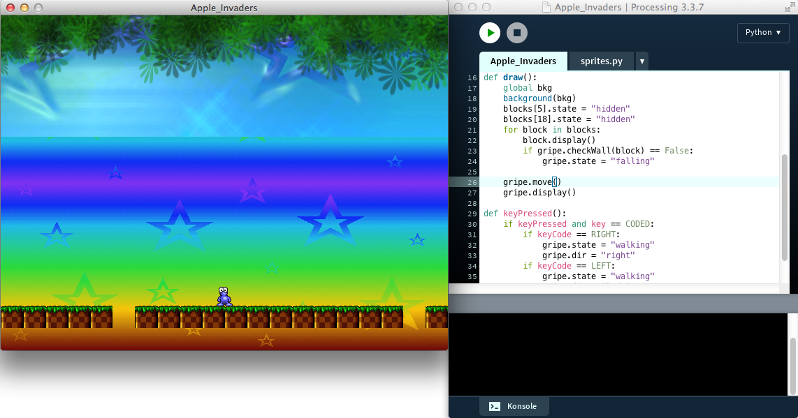

Der Held des Spieles ist *Gripe*, ein kleines blaues, haariges Monster und er wie auch die Blöcke der Plattform habe ich dem freien ([CC-BY-4.0](https://creativecommons.org/licenses/by/4.0/deed.de)) Tileset von *Marc Russell* von [Zingot Games](http://www.zingot.com/) entnommen, das es auf OpenGameArt.org zum [Download](https://opengameart.org/content/gfxlib-fuzed) gibt. Die Lizenzbedingungen verlangen die Namensnennung und das habe ich damit erledigt. Hier erst einmal die benötigten Bildchen:


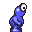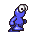

 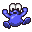 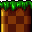

Es sind dies acht Bilder für die Bewegugung nach rechts, acht Bilder für die Bewegung nach links ein Bild des stehenden und ein Bild des fallenden Gripes und schließlich noch der Block, aus dem die Plattform zusammengesetzt wird.

Dann habe ich noch ein Hintergrundbild gebastelt, das nicht wirklich schön ist (mir fehlt jede Befähigung zum Künstler), für die Zwecke des Spiels sollte es aber ausreichen:


## Das Spiel

Der *Gripe* bewegt sich auf einer Plattform. Von oben fallen Äpfel herab, die der Gripe fangen und fressen muß. Erreichen die roten Äpfel die Plattform, zerstören sie den Block, auf den sie gefallen sind. Hin und wieder tauchen auch grüne Äpfel auf. Wenn diese einen Block der Plattform berühren, wird die gesamte Plattform wieder vollständig instand gesetzt.

Für jeden gefangenen Apfel erhält der *Gripe* zehn Punkte. Er lebt solange, wie er nicht durch ein Loch in der Plattform ins Bodenlose stürzt.

## Stage 1

In einer ersten Fassung will ich nur die Plattform und den *Gripe* mit all seinen Bewegungen realisieren. Um sie zu separieren, habe ich in der Processing IDE einen neuen Reiter für die im Spiel verwendeten Klassen aufgemacht. Wie schon so oft, habe ich erst einmal eine Oberklasse `Sprite` definiert:

~~~python
class Sprite(object):
    
    def __init__(self, xPos, yPos):
        self.x = xPos
        self.y = yPos
        self.th = 32
        self.tw = 32
    
    def checkCollision(self, otherSprite):
        if (self.x < otherSprite.x + otherSprite.tw and 
        otherSprite.x < self.x + self.tw and
        self.y < otherSprite.y + otherSprite.th
        and otherSprite.y < self.y + self.th):
            return True
        else:
            return False
~~~

Der Konstruktor ist trivial und die Kollisionserkennung habe ich sehr großzügig angelegt. Denn der *Gripe* soll mit den Pfeiltasten nach rechts und links bewegt werden und diese reagieren zumindest auf meinem betagten MacBook Pro doch recht träge. Bei einer exakteren Kollisionserkennung hätte unser kleiner Held nur wenige Chancen, seine Äpfel einzufangen.

Nun also die Klasse für den Helden:

~~~python
class Actor(Sprite):
    
    def __init__(self, xPos, yPos):
        super(Actor, self).__init__(xPos, yPos)
        self.speed = 5
        self.dy = 0
        self.d = 3
        self.dir = "right"
        self.state = "standing"
        self.walkR = []
        self.walkL = []
    
    def loadPics(self):
        self.standing = loadImage("gripe_stand.png")
        self.falling = loadImage("grfalling.png")
        for i in range(8):
            imageName = "gr" + str(i) + ".png"
            self.walkR.append(loadImage(imageName))
        for i in range(8):
            imageName = "gl" + str(i) + ".png"
            self.walkL.append(loadImage(imageName))
            
    def checkWall(self, wall):
        if wall.state == "hidden":
            if (self.x >= wall.x - self.d and
                    (self.x + 32 <= wall.x + 32 + self.d)):
                return False
    
    def move(self):
        if self.dir == "right":
            if self.state == "walking":
                self.im = self.walkR[frameCount % 8]
                self.dx = self.speed
            elif self.state == "standing":
                self.im = self.standing
                self.dx = 0
            elif self.state == "falling":
                self.im = self.falling
                self.dx = 0
                self.dy = 5
        elif self.dir == "left":
            if self.state == "walking":
                self.im = self.walkL[frameCount % 8]
                self.dx = -self.speed
            elif self.state == "standing":
                self.im = self.standing
                self.dx = 0
            elif self.state == "falling":
                self.im = self.falling
                self.dx = 0
                self.dy = 5
        else:
            self.dx = 0
        self.x += self.dx
        self.y += self.dy

        if self.x <= 0:
            self.x = 0
        if self.x >= 640 - self.tw:
            self.x = 640 -self.tw
    
    def display(self):
        image(self.im, self.x, self.y)
~~~

Er ist als eine endliche Maschine *(Finite State Machine)* mit drei Zuständen angelegt: Sie besitzt die Zustände `walking`, `standing` und `falling`.

Danach werden nach der Initialisierung erst einmal alle Bilder des *Gripe* geladen. Damit die jeweils acht Bilder je Bewegungsrichtung nicht einzeln geladen werden müssen, was den Programmcode nur unnötig aufblähen würde, habe ich das jeweils in einer Schleife erledigt:

~~~python
        for i in range(8):
            imageName = "gr" + str(i) + ".png"
            self.walkR.append(loadImage(imageName))
~~~

lädt die Bilder für die Bewegung nach rechts und diese Schleife

~~~python
        for i in range(8):
            imageName = "gl" + str(i) + ".png"
            self.walkL.append(loadImage(imageName))
~~~

die Bilder für die Bewegung nach links. Eine geschickte Benennung der Dateinamen machte es möglich.

Damit die einzelnen Bilder genauso platzsparend bei den Bewegungen aufgerufen werden, werden diese in eine Liste gesteckt, so daß wir sie über den Index der Liste aufrufen können.

Das geschieht in der Methode `move()` mit diesem Aufruf:

~~~python
            if self.state == "walking":
                self.im = self.walkR[frameCount % 8]
~~~

`frameCount % 8` nimmt nacheinander immer einen Wert zwischen 0 und 7 an und so wird sichergestellt, daß die Indizes in dieser Reihenfolge aufgerufen werden.

In der Methode `checkWall()` wird erst einmal überprüft, ob der Zustand des Blocks auch `hidden`, das heißt ob er unsichtbar (also zerstört) ist. Den Abstand von 3 Pixeln (`self.d`) habe ich experimentell herausgefunden, um sicherzustellen, daß das kleine blaue Fellmonster die Löcher nicht einfach überläuft. Das bedeutet aber auch, daß es, wenn es noch mit mindestens 3 Pixeln einen bestehenden Block berührt, nicht abstürzt -- das kann schon gelegentlich sehr seltsam aussehen.

Der Wert von `self.d` hängt übrigens auch von der Geschwindigkeit (`self.speed`) ab. Wenn Ihr diese verändert, müßt Ihr unter Umständen auch `self.d` anpassen.

Die letzten vier Zeilen der Methode `move()` dienen der Randerkennung und sorgen dafür, daß der Spieler links und rechts das Fenster nicht verlassen kann.

Die Methode `display()` ist wieder sehr einfach. Sie zeigt nur das gerade aktuelle Bild an.

Zuletzt bleibt nur noch die Klasse `Block`, die ebenfalls von `Sprite` erbt.

~~~python
class Block(Sprite):
    
    def __init__(self, xPos, yPos):
        super(Block, self).__init__(xPos, yPos)
        self.state = "visible"
    
    def loadPics(self):
        self.im = loadImage("block.png")
    
    def display(self):
        if self.state == "visible":
            image(self.im, self.x, self.y)
~~~

Der Konstrukor setzt den Status jeden Blocks auf sichtbar (`visible`), dann wird das Bild geladen und da sich solch ein Block ja nicht bewegt, entfällt die Methode `move()` und es kommt nur die Methode `display()` zum Einsatz, die den Block zeichnet, aber natürlich nur, wenn er sichtbar ist.

Jetzt das Hauptprogramm:

~~~python
from sprites import Actor, Block
gripe = Actor(304, 384)
blocks = []

def setup():
    global bkg
    size(640, 480)
    frameRate(60)    
    bkg = loadImage("bkg1.png")
    for i in range(20):
        block = Block(i*32, 416)
        blocks.append(block)
        blocks[i].loadPics()
    gripe.loadPics()

def draw():
    global bkg
    background(bkg)
    blocks[5].state = "hidden"
    blocks[18].state = "hidden"
    for block in blocks:
        block.display()
        if gripe.checkWall(block) == False:
            gripe.state = "falling"
            
    gripe.move()
    gripe.display()

def keyPressed():
    if keyPressed and key == CODED:
        if keyCode == RIGHT:
            gripe.state = "walking"
            gripe.dir = "right"
        if keyCode == LEFT:
            gripe.state = "walking"
            gripe.dir = "left"

def keyReleased():
    gripe.state = "standing"
~~~

Zuerst werden die benötigten Klassen importiert, der Held ungefähr in die Mitte des Spielfeldes auf seine Plattform gesetzt und dann für die Blöcke eine Liste initialisiert.

In `setup()` werden alle benötigten Bilder geladen und die Liste mit den Blöcken erstellt.

in der Funktion `draw()` habe ich zu Testzwecken zwei Blöcke manuell auf `hidden` gesetzt, um herauszufinden, ob der *Gripe* auch tatsächlich herunterfällt. Wenn Ihr testen wollt, ob er auch nicht das Spielfeld verläßt, müßt Ihr diese beiden Zeilen auskommentieren.

Über alle Blocks wird geprüft, ob der *Gripe* sie überhaupt betreten kann. Betritt er einen Block, dessen Zustand `hidden` ist, wird der Zustand des *Gripes* auf `falling` gesetzt. Zum Schluß werden dann nur noch die `move()` und die `display()` Methode des blauen Monsters aufgerufen.

In der Funktion `keyPressed()` wird überprüft, ob die rechte oder die linke Pfeiltate gedrückt ist. Wenn ja, ist der Zustand des *Gripes* `walking` und die Richtung des *Gripes* entweder rechts oder links.

Werden die Pfeiltasten wieder losgelassen, setzt die Funktion `keyReleased()` den Status des *Gripes* auf `standing`.

Damit sind alle Stati abgedeckt, der *Gripe* steht, fällt oder läuft. Mehr Zustände kennt und braucht er nicht.

## Stage 2

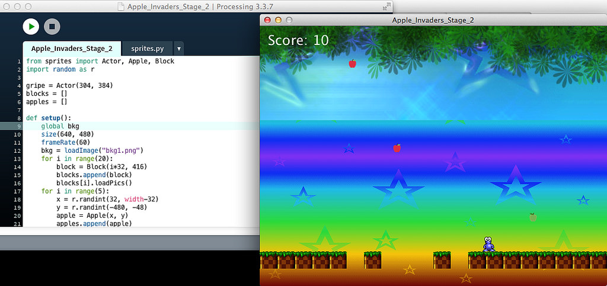

Um das Spiel nun abzuschließen, müssen jetzt nur noch die Äpfel vom Himmel regnen, die der *Gripe* entweder einfangen und zermantschen (rote Äpfel) oder durchlassen muß, damit sie seine ramponierte Plattform wieder reparieren (grüne Äpfel). Wie schon so vieles andere auch habe ich die Bilder der Äpfel Twitters freiem ([CC-BY-4.0](https://creativecommons.org/licenses/by/4.0/) Emoji-Set [Twemoji](https://github.com/twitter/twemoji) entnommen[^20_1] und mit einem Bildverarbeitungsprogramm meines Vertrauens auf 16 x 16 Pixel heruntergerechnet.

 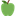

[^20_1]: Hier gibt es übrigens eine immer aktuell gehaltene [Vorschau](https://twitter.github.io/twemoji/2/test/preview.html) der kleinen Bildchen. Es sind mittlerweile mehr als 2.800 Emojis, die Verwendung in eigenen Projekten finden können. Für jemanden mit so geringen Fähigkeiten zum Graphiker wie mich eine Goldgrube.

Um die Äpfel im Spiel zum Leben zu erwecken, müssen sie natürlich ebenfalls eine eigen Klasse bekommen, die -- wie sollte es anders sein -- ebenfalls von `Sprite` erbt. Ich habe die Klasse wenig überraschend `Apple` genannt:

~~~python
class Apple(Sprite):
    
    def __init__(self, xPos, yPos):
        super(Apple, self).__init__(xPos, yPos)
        if r.randint(0, 100) < 5:
            self.state = "green"
        else:
            self.state = "red"
        self.speed = 1
        self.tw = 16
        self.th = 16
    
    def loadPics(self):
        self.imRed = loadImage("applered.png")
        self.imGreen = loadImage("applegreen.png")
    
    def move(self):
        self.y += self.speed
        if self.y >= height + self.th:
            self.reset()

    def reset(self):
        self.x = r.randint(self.tw, width-self.tw)
        self.y = r.randint(-480, -48)
        if r.randint(0, 100) < 5:
            self.state = "green"
        else:
            self.state = "red"
                            
    def display(self):
        if self.state == "green":
            self.im = self.imGreen
        elif self.state == "red":
            self.im = self.imRed
        image(self.im, self.x, self.y)
~~~

Im Konstruktor wird festgelegt, daß etwa fünf Prozent der Äpfel gute (grüne) Äpfel sind und die restlichen Äpfel rot. Sie sollen sich bei jedem Durchlauf um einen Pixel nach unten bewegen (`self.speed = 1` -- hier könnt Ihr durchaus mit anderen Geschwindigkeiten experimentieren) und natürlich muß die Höhe und Weite auf dei tatsächliche Größe (16 x 16 Pixel) angepaßt werden. Hier werden die Festlegungen der Oberklasse überschrieben.

Die Methode `loadPics()` ist simpel, sie lädt einfach nur die Bildchen der roten und grünen Äpfel und auch die Methode `move()` ist hier sehr schlicht gehalten: Sie sorgt dafür, daß die Äpfel nach unten fallen und wenn sie den unteren Fensterrand verlassen haben, wird die Methode `reset()` aufgerufen.

Diese katapultiert die Äpfel wieder an eine zufällige Stelle oberhalb des Fensterrandes. Damit nicht alle Äpfel gleichzeitig vom Himmel regnen, kann ihre Startposition bei bis zu 480 Pixel oberhalb des Fensterrandes liegen.

Außerdem wird wieder dafür gesorgt, daß nur etwa fünf Prozent der Äpfel grüne Äpfel sind, alle anderen sind wieder rot.

Eine kleine Änderung gab es noch im Konstruktor der Klasse `Actor`. Da der *Gripe* ja auch Punkte einkassieren können soll, wird mit

~~~python
        self.score = 0
~~~

die Punkte-Variable vorinitialisiert.

Das ist eigentlich alles, was sich in der Datei `sprite.py` geändert hat. Alle anderen Änderungen finden im Hauptprogramm statt:

~~~python
from sprites import Actor, Apple, Block
import random as r

gripe = Actor(304, 384)
blocks = []
apples = []
~~~

Erst einmal werden alle *Sprites* importiert und -- weil es nun benötigt wird -- auch hier das Modul `random` aus der Standardbibliothek importiert. Neben der schon bekannten Liste `blocks[]`  muß nun auch die Liste `apples[]` initialisiert werden.

In der Funktion `setup()` ist nur die Schleife zum Auffüllen der Apfel-Liste hinzugekommen:

~~~python
    for i in range(5):
        x = r.randint(32, width-32)
        y = r.randint(-480, -48)
        apple = Apple(x, y)
        apples.append(apple)
        apples[i].loadPics()
~~~

Zum Üben habe ich es erst einmal bei fünf Äpfeln belassen. Der *Gripe* steht dann zwar manchmal einige Sekunden dumm herum, aber bei viel mehr Äpfeln hetzt er nur noch um sein Leben.

Bei der `draw()`-Funktion gibt es so viele Änderungen, daß ich sie hier noch einmal komplett aufliste:

~~~python
def draw():
    global bkg
    background(bkg)
    noCursor()
    for block in blocks:
        block.display()
        if gripe.checkWall(block) == False:
            gripe.state = "falling"
    
    for apple in apples:
        apple.move()
        if apple.checkCollision(gripe):
            apple.reset()
            gripe.score += 10
        for block in blocks:
            if (block.state == "visible" and
            apple.checkCollision(block)):
                if apple.state == "red":
                    block.state = "hidden"
                    apple.reset()
                elif apple.state == "green":
                    for block in blocks:
                        block.state = "visible"
                    apple.reset()
        apple.display()
            
    gripe.move()
    if gripe.y > height + 32:
        textSize(50)
        text("Game Over!!!", width/2 - 150, height/2)
        cursor()
        noLoop()
    gripe.display()
    textSize(25)
    text("Score: " + str(gripe.score), 15, 35)
~~~

Eine nur kosmetische Änderung ist das Verstecken des Mauzeigers mit `noCursor()` zu Beginn der Funktion und die Schleife über die Blöcke ist unverändert geblieben.

Vollständig neu ist die Schleife über die Äpfel-Liste. Hier wird zu erst einmal geprüft, ob einer der Äpfel mit dem *Gripe* kollidiert. Passiert dies, wird mit `reset()` der Apfel wieder nach oben katapultiert und der *Gripe* erhält 10 Punkte gutgeschrieben. Hier unterscheide ich nicht zwischen rot und grün, es ist das Problem des *Gripes*, wenn er versehentlich einen grünen Apfel auffrißt oder zermanscht -- Apfel ist Apfel. Die Kollisionsüberprüfung ist auch hier sehr großzügig. Wegen der oben schon erwähnten Trägheit der Zeigertasten wollte ich dem *Gripe* wenigstens den Hauch einer Chance geben.

Anders ist es bei der Kollisionsüberprüfung der Äpfel mit den Blöcken -- sinnvollerweise findet sie nur mit den sichtbaren Blöcken statt: Trifft ein roter Apfel auf einen Block, dann wird dieser zerstört und der Apfel beginnt ein neues Leben oberhalb des Bildschirmfensters. Ist es dagegen ein grüner Apfel, der auf einen unzerstörten Block trifft, dann werden alle Blöcke wieder repariert und erst danach wird auch dieser Apfel erneut auf die Reise geschickt.

Für das Anzeigen der Punkte habe ich dieses Mal auf eine Klasse `HUD` (für *Head Up Display*) verzichtet, sondern diese Anzeige mit

~~~
    textSize(25)
    text("Score: " + str(gripe.score), 15, 35)
~~~

einfach an das Ende der `draw()`-Funktion geschrieben. Doch zuerst wird überprüft, ob sich der *Gripe* überhaupt noch im Spiel befindet. Ist er nämlich aus dem Fensterrand herausgefallen, wird mit

~~~python
        textSize(50)
        text("Game Over!!!", width/2 - 150, height/2)
        cursor()
        noLoop()
~~~

das Ende des Spiels angezeigt, der Mauszeiger wieder hervorgekramt und mit `noLoop()` auch die `draw()`-Funktion angehalten.

Damit ist das Spiel vollständig. Natürlich gibt es noch vieles, was man verbessern oder hinzufügen könnte. Als erstes würde mir eine exaktere Kollisionserkennung einfallen. Dann könnte man den *Gripe* auch kleine Bomben nach oben werfen lassen, mit denen er die Äpfel schon im Flug zerstören kann. Das [GFXlib-fuzed](https://opengameart.org/content/gfxlib-fuzed)-Tileset bietet die Bildchen dafür. Aber auch *power ups* und/oder *power downs* sind denkbar und was hindert eine Spielewelt daran, daß sich Äpfel immer gerade von oben nach unten bewegen müssen, andere Flugbahnen sind doch auch denkbar. Grenzen setzt eigentlich nur Eure Phantasie.

Zum Schluß wie immer der Vollständigkeit halber noch einmal der komplette Sketch, erst einmal die Datei `sprites.py`:

~~~python
import random as r

class Sprite(object):
    
    def __init__(self, xPos, yPos):
        self.x = xPos
        self.y = yPos
        self.th = 32
        self.tw = 32
    
    def checkCollision(self, otherSprite):
        if (self.x < otherSprite.x + otherSprite.tw
			and otherSprite.x < self.x + self.tw
            and self.y < otherSprite.y + otherSprite.th
			and otherSprite.y < self.y + self.th):
            return True
        else:
            return False

class Actor(Sprite):
    
    def __init__(self, xPos, yPos):
        super(Actor, self).__init__(xPos, yPos)
        self.speed = 5
        self.dy = 0
        self.d = 3
        self.score = 0
        self.dir = "right"
        # self.newdir = "right"
        self.state = "standing"
        self.walkR = []
        self.walkL = []
    
    def loadPics(self):
        self.standing = loadImage("gripe_stand.png")
        self.falling = loadImage("grfalling.png")
        for i in range(8):
            imageName = "gr" + str(i) + ".png"
            self.walkR.append(loadImage(imageName))
        for i in range(8):
            imageName = "gl" + str(i) + ".png"
            self.walkL.append(loadImage(imageName))
            
    def checkWall(self, wall):
        if wall.state == "hidden":
            if (self.x >= wall.x - self.d and
                    (self.x + 32 <= wall.x + 32 + self.d)):
                return False
    
    def move(self):
        if self.dir == "right":
            if self.state == "walking":
                self.im = self.walkR[frameCount % 8]
                self.dx = self.speed
            elif self.state == "standing":
                self.im = self.standing
                self.dx = 0
            elif self.state == "falling":
                self.im = self.falling
                self.dx = 0
                self.dy = 5
        elif self.dir == "left":
            if self.state == "walking":
                self.im = self.walkL[frameCount % 8]
                self.dx = -self.speed
            elif self.state == "standing":
                self.im = self.standing
                self.dx = 0
            elif self.state == "falling":
                self.im = self.falling
                self.dx = 0
                self.dy = 5
        else:
            self.dx = 0
        self.x += self.dx
        self.y += self.dy

        if self.x <= 0:
            self.x = 0
        if self.x >= 640 - self.tw:
            self.x = 640 - self.tw
    
    def display(self):
        image(self.im, self.x, self.y)
        

class Apple(Sprite):
    
    def __init__(self, xPos, yPos):
        super(Apple, self).__init__(xPos, yPos)
        if r.randint(0, 100) < 5:
            self.state = "green"
        else:
            self.state = "red"
        self.speed = 1
        self.tw = 16
        self.th = 16
    
    def loadPics(self):
        self.imRed = loadImage("applered.png")
        self.imGreen = loadImage("applegreen.png")
    
    def move(self):
        self.y += self.speed
        if self.y >= height + self.th:
            self.reset()

    def reset(self):
        self.x = r.randint(self.tw, width-self.tw)
        self.y = r.randint(-480, -48)
        if r.randint(0, 100) < 5:
            self.state = "green"
        else:
            self.state = "red"
                            
    def display(self):
        if self.state == "green":
            self.im = self.imGreen
        elif self.state == "red":
            self.im = self.imRed
        image(self.im, self.x, self.y)


class Block(Sprite):
    
    def __init__(self, xPos, yPos):
        super(Block, self).__init__(xPos, yPos)
        self.state = "visible"
    
    def loadPics(self):
        self.im = loadImage("block.png")
    
    def display(self):
        if self.state == "visible":
            image(self.im, self.x, self.y)
~~~

Und dann das eigentlich Hauptprogramm:

~~~python
from sprites import Actor, Apple, Block
import random as r

gripe = Actor(304, 384)
blocks = []
apples = []

def setup():
    global bkg
    size(640, 480)
    frameRate(60)    
    bkg = loadImage("bkg1.png")
    for i in range(20):
        block = Block(i*32, 416)
        blocks.append(block)
        blocks[i].loadPics()
    for i in range(5):
        x = r.randint(32, width-32)
        y = r.randint(-480, -48)
        apple = Apple(x, y)
        apples.append(apple)
        apples[i].loadPics()
    gripe.loadPics()

def draw():
    global bkg
    background(bkg)
    noCursor()
    for block in blocks:
        block.display()
        if gripe.checkWall(block) == False:
            gripe.state = "falling"
    
    for apple in apples:
        apple.move()
        if apple.checkCollision(gripe):
            apple.reset()
            gripe.score += 10
        for block in blocks:
            if (block.state == "visible" and
            apple.checkCollision(block)):
                if apple.state == "red":
                    block.state = "hidden"
                    apple.reset()
                elif apple.state == "green":
                    for block in blocks:
                        block.state = "visible"
                    apple.reset()
        apple.display()
            
    gripe.move()
    if gripe.y > height + 32:
        textSize(50)
        text("Game Over!!!", width/2 - 150, height/2)
        cursor()
        noLoop()
    gripe.display()
    textSize(25)
    text("Score: " + str(gripe.score), 15, 35)

def keyPressed():
    if keyPressed and key == CODED:
        if keyCode == RIGHT:
            gripe.state = "walking"
            gripe.dir = "right"
        if keyCode == LEFT:
            gripe.state = "walking"
            gripe.dir = "left"

def keyReleased():
    gripe.state = "standing"
~~~

Die Funktionen `keyPressed()` und `keyReleased()` sind übrigens gegenüber der Vorversion unverändert geblieben.


# Epilog

# Anhang

## Literaturverzeichnis

## Index