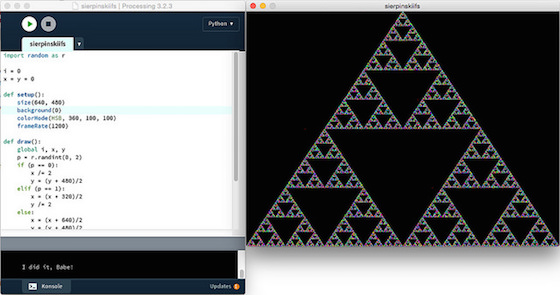
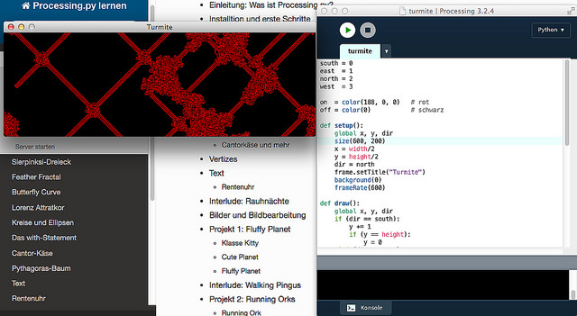
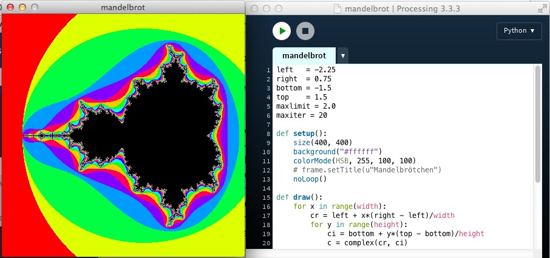
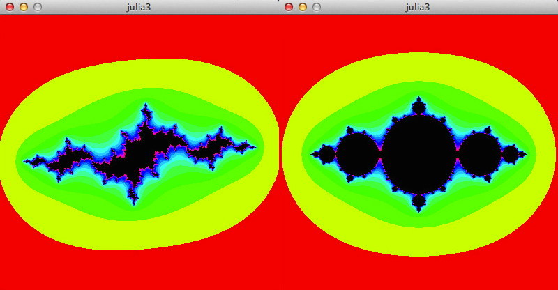

---
title: Processing.py in Beispielen
subtitle: Visualisierungen und interaktive Anwendungen mit Python und Processing programmieren
author: Jörg Kantel
date: \today
***

# Einleitung

# Download und Installation

# Start: Rotkäppchen und die drei Tanten

Rotkäppchen hat nicht nur eine Großmutter, sondern -- was weniger bekannt ist -- auch drei Tanten, Agathe, Beatrice und Cynthia. Diese wohnen in drei Häusern, die zusammen ein Dreieck bilden. Wenn Rotkäppchen nicht ihre Großmutter besucht, dann besucht sie eine der drei Tanten. Letzten Sonntag jedoch war sie sehr unschlüssig, welche sie besuchen sollte. Sie startete, um Agathe einen Besuch abzustatten. Jedoch genau auf dem halben Weg zu Agathe wurde sie unsicher und überlegte es sich noch einmal. Sie beschloß, eine ihrer drei Tanten aufzusuchen, es könnte auch wieder Agathe gewesen sein. Doch es war wie verhext: Jedesmal, wenn sie genau den halben Weg zurückgelegt hatte, wurde sie wieder unsicher und entschloß sich neu, einer ihrer drei Tanten aufzusuchen, möglicherweise die gleiche, möglicherweise eine andere. Und das wieder, und wieder, und wieder …

*William P. Beuamont* [Beaum1996] nannte es das »Tantenspiel«. Ziel ist es nicht, herauszufinden, welche Tante gewinnt (es kann gar keine gewinnen), sondern welche Figur entsteht, wenn man Rotkäppchens Irrweg visualisiert. Ich habe das einmal mit Processing.py nachprogrammiert und herausgekommen ist obige Figur, in der Fachliteratur auch als [Sierpinski Dreieck][3_1] bekannt, benannt nach dem polnischen Mathematiker *Wacław Sierpiński*, der das Fraktal schon 1915 als erster beschrieb.

[3_1]: https://de.wikipedia.org/wiki/Sierpinski-Dreieck

## Der Quellcode

Normalerweise wird dieses Fraktal mit einem rekursiven Algorithmus erzeugt, aber es geht eben auch mithilfe dieses »Chaos-Spiels« [Herrm1994]

~~~python
import random as r

i = 0
x = y = 0

def setup():
    size(640, 480)
    background(0)
    colorMode(HSB, 360, 100, 100)
    frameRate(1200)

def draw():
    global i, x, y
    p = r.randint(0, 2)
    if (p == 0):
        x /= 2
        y = (y + 480)/2
    elif (p == 1):
        x = (x + 320)/2
        y /= 2
    else:
        x = (x + 640)/2
        y = (y + 480)/2
    stroke(i%360, 100, 100)
    point(x, y)
    i += 1
    if (i > 120000):
        print("I did it, Babe!")
        noLoop()
~~~

Die Schleife wird 120.000 mal durchlaufen, bevor sie stoppt. Damit ich nicht ewig auf das Ergebnis warten muß, habe ich die Framerate auf 1.200 FPS gesetzt. Das ist vermutlich etwas übertrieben, in diversen Foren habe ich Vermutung gefunden, daß Processing kaum eine Framerate von 1.000 FPS überschreiten kann. Das habe ich experimentell bestätigt, obiger Sketch lief auf meinem schnellsten Rechner, einem Mac Pro mit 3,5 GHz 6-Core Intel Xeon E5, 2 Minuten und 20 Sekunden. Wären genau 1.000 FPS erreicht worden, hätte er exakt 2 Minuten laufen müssen.

Aber man sieht sehr schön, wie sich das Dreieck zufällig, aber dennoch erkennbar, zusammensetzt. Je nach zufälligem Startwert liegen die ersten drei bis vier Punkte noch außerhalb des Fraktals, danach geht aber alles seinen geordneten Gang. Und an den Farben erkennt man, daß auch die Reihenfolge, in der die einzelnen Punkte des Fraktals von Rotkäppchen angelaufen werden, ebenfalls zufällig sind.

## Literatur

- *[Beaum1996]* William P. Beaumont: *Conquering the Math Bogeyman*, in Clifford A. Pickover (Ed.): *Fractal Horizons -- The Future Use of Fractals*, New York (St. Martin's Press) 1996, Seiten 3 - 15
- *[Herrm1994]* Dietmar Herrmann: *Algorithmen für Chaos und Fraktale*, Bonn (Addison-Wesley) 1994, Seiten 132ff.

# Punkte und Pixel

## Turmite

Turmiten sind quadratische, 1x1 Pixel große, kybernetische Kreaturen mit einer höchst kümmerlichen Andeutung eines Gehirns. Sie können die Farben des Pixels oder der Zelle, auf der sie gerade stehen, erkennen und danach handeln. Ist die Zelle schwarz, färben sie sie rot und bewegen sich um ein Feld nach links. Ist die Farbe rot, färben sie die Zelle schwarz und bewegen sich um ein Feld nach rechts.

Wird solch eine Turmite auf eine schwarze, unendlichen Ebene gesetzt, erzeugt sie zuerst ein chaotisches Muster. Doch nach ungefähr 10.000 Schritten bildet sie auf einmal eine Turmiten-Autobahn, eine regelmäßige Struktur, die immer nach 104 Schritten in denselben Zustand zurückkehrt, nur jeweils um 2 Felder verschoben.

### Die Turmite programmieren

Ich habe eine dieser Turmiten in einem Processing.py-Sketch zum Leben erweckt. Damit sie nicht in der Unendlichkeit der Ebene entfleucht, habe ich die Ecken des Fensters miteinander verklebt und sie so in eine [Torus](https://de.wikipedia.org/wiki/Torus)-Welt verwandelt. Wenn die Turmite am unteren Ende des Fensters verschwindet, taucht sie am oberen Ende wieder auf, verschwindet sie am rechten Rand erscheint sie wieder am linken Rand. Für beide Ränder gilt das natürlich auch umgekehrt, die Welt der Turmite ist also ein fett aufgeblasener Fahrradschlauch, auf dem sie sich entlang bewegt.

Den Farbsensor der Turmite habe ich mit dem Processing-Befehl `get(x, y)` simuliert. Er liest die Farbe des Pixels. Analog dazu gibt es die Funktion `set(x, y, color)`, die die Farbe `color` an die Stelle `x, y` schreibt. Die beiden Farben habe ich im Sketch `on` für schwarz und `off` für rot genannt. Ich bin von der Metapher ausgegangen, daß die Turmite auf der schwarzen Ebene ein Feld entweder einschaltet (also rot färbt) oder es wieder ausschaltet (es wird wieder schwarz).

Als ich damals auf meinem Atari-ST mein erstes Turmitenprogramm schrieb, dauerte es ewig, bis die Turmite mit ihrer Autobahn im Unendlichen verschwunden war (sie das Bildschirmfenster verlassen hatte). An eine Rückkehr via Torus wagte ich nicht zu denken, dafür reichte meine Geduld nicht aus. Nun in Processing.py habe ich die Framerate auf 600 gesetzt und so geht es doch recht schnell voran.

Interessant ist, daß die Turmite, wenn sie auf eine von ihr geschaffene Autobahn trifft, zwar erst einmal wieder ein chaotisches Verhalten an den Tag legt, aber über kurz oder lang wieder eine Autobahn baut. Diese Turmiten-Autobahnen kennen nur zwei Orientierungen, sie verlaufen entweder parallel oder stehen senkrecht aufeinander.

### Quellcode

Nach dem oben Beschriebenen dürfte der Quellcode leicht verständlich sein. In der `setup()`-Funktion wird die Hintergrundfarbe auf schwarz und die Turmite in die Mitte des Fensters mit der Ausrichtung nach Norden gesetzt.

Im ersten Abschnitt der `draw()`-Funktion wird die Turmite gemäß Ihrer aktuellen Orientierung bewegt und die Behandlung der Fensterränder berücksichtigt. Dann wird die Farbe der aktuellen Zelle gelesen (mit `get(x, y)`) und je nach Zustand eine neue Farbe gesetzt und die Orientierung der Turmite den Regeln entsprechend geändert. Das ist alles.

~~~python
south = 0
east  = 1
north = 2
west  = 3

on  = color(188, 0, 0)   # rot
off = color(0)           # schwarz

def setup():
    global x, y, dir
    size(600, 200)
    x = width/2
    y = height/2
    dir = north
    background(0)
    frameRate(600)

def draw():
    global x, y, dir
    if (dir == south):
        y += 1
        if (y == height):
            y = 0
    elif (dir == east):
        x += 1
        if (x == width):
            x = 0
    elif (dir == north):
        if (y == 0):
            y = height - 1
        else:
            y -= 1
    elif (dir == west):
        if (x == 0):
            x = width - 1
        else:
            x -= 1
    
    if (get(x, y) == on):
        set(x, y, off)
        if (dir == south):
            dir = west
        else:
            dir -= 1
    else:
        set(x, y, on)
        if (dir == west):
            dir = south
        else:
            dir += 1
~~~

### Weitere mögliche Experimente

Die Turmiten gehen auf *Greg Turk* zurück, der damals Doktorand an der Universität von North Carolina in Chapel Hill war. Er zeigte, daß sie eine zweidimensionale [Turingmaschine](https://de.wikipedia.org/wiki/Turingmaschine) sind. Später hat sie *Christopher Langton* weiterentwickelt und beschrieben -- daher ist sie auch unter dem Namen »Langtons Ameise« *(Lanton's Ant)* bekannt. Die hier vorgestellte ist die einfachste Form solch einer Ameise. Ein nächster Schritt wäre beispielsweise, die Welt mit zwei Turmiten zu bevölkern, die eine färbt die Ebene rot, wenn sie auf ein schwarzes Feld trifft, die andere färbt sie blau. Natürlich müßten dann beide Ameisen auch Regeln implementiert bekommen, wie sie zu verfahren haben, wenn sie auf ein blaues respektive ein rotes Feld treffen.

Von Turk selber gibt es zum Beispiel eine Turmite mit zwei Zuständen, nennen wir diese `A` und `B` und mit folgendem Regelsatz:

Zustand  | A                   | B
:--------|:--------------------|:--------------
grün     | schwarz, vorwärs, B | grün, rechts, A
schwarz  | grün, links, A      | grün, rechts, A

Sie erzeugt ein Spiralmuster, »immer größer werdende strukturierte Gebiete, die sich in regelmäßiger Anordnung um einen Startpunkt winden«.

Eine weitere Turmite, die mit vier Farben hantiert, braucht nur einen Zustand, um ebenfalls ein interessantes, symmetrisches Muster zu bilden. Hier ihr Regelsatz:

Zustand | A
:-------|:---------
blau    | rot, rechts, A
rot     | gelb, rechts, A
gelb    | grün, links, A
grün    | blau, links, A

Es gibt also noch viel zu entdecken in der Welt der Turmiten und Ameisen.

### Literatur

- A.K. Dewdney: *Turmiten*, in: Immo Diener (Hg.): *Computer-Kurzweil 2, Spektrum Akademischer Verlag: Verständliche Forschung*, Heidelberg 1992, Seiten 156-160
- [Ameise (Turingmaschine)](https://de.wikipedia.org/wiki/Ameise_(Turingmaschine)) in der Wikipedia.

## Wir backen uns ein Mandelbrötchen

Die [Mandelbrot-Menge](https://de.wikipedia.org/wiki/Mandelbrot-Menge) ist die zentrale Ikone der Chaos-Theorie und das Urbild aller Fraktale. Sie ist die Menge aller komplexen Zahlen *c*, für welche die durch

\begin{align}
z_{0} & = 0\\
z_{n+1} & = z_{n}^{2}+c
\end{align}

rekursiv definierte Folge beschränkt ist. Bilder der Mandelbrot-Menge können erzeugt werden, indem für jeden Wert des Parameters *c*, der gemäß obiger Rekursion endlich bleibt, ein Farbwert in der komplexen Ebene zugeordnet wird.

Die komplexe Ebene wird in der Regel so dargestellt, daß in der Horizontalen (in der kartesisschen Ebene die *x-Achse*) der Realteil der komplexen Zahl und in der Vertikalen (in der kartesischen Ebene die *y-Achse*) der imaginäre Teil aufgetragen wird. Jede komplexe Zahl entspricht also einen Punkt in der komplexen Ebene. Die zur Mandelbrotmenge gehörenden Zahlen werden im Allgemeinen schwarz dargestellt, die übrigen Farbwerte werden der Anzahl von Iterationen (`maxiter`) zugeordnet, nach der der gewählte Punkt der Ebene einen Grenzwert (`maxlimit`) verläßt. Der theoretische Grenzwert ist *2.0*, doch können besonders bei Ausschnitten aus der Menge, um andere Farbkombinationen zu erreichen, auch höhere Grenzwerte verwendet werden. Bei Ausschnitten muß auch die Anzahl der Iterationen massiv erhöht werden, um eine hinreichende Genauigkeit der Darstellung zu erreichen.

### Das Programm

Python kennt den Datentyp `complex` und kann mit komplexen Zahlen rechnen. Daher drängt sich die Sprache für Experimente mit komplexen Zahlen geradezu auf. Zuert werden mit `cr` und `ci` Real- und Imaginärteil definiert und dann mit

~~~python
c = complex(cr, ci)
~~~

die komplexe Zahl erzeugt. Für die eigentliche Iteration wird dann -- nachdem der Startwert `z = 0.0` festgelegt wurde -- nur eine Zeile benötigt:

~~~python
z = (z**2) + c
~~~

Wie schon in anderen Beispielen habe ich für die Farbdarstellung den HSB-Raum verwendet und über den *Hue*-Wert iteriert. Das macht alles schön bunt, aber es gibt natürlich viele Möglichkeiten, ansprechendere Farben zu bekommen, beliebt sind zum Beispiel selbsterstellte Paletten mit 256 ausgesuchten Farbwerten, die entweder harmonisch ineinander übergehen oder bestimmte Kontraste betonen.

### Der komplette Quellcode

~~~python
left   = -2.25
right  = 0.75
bottom = -1.5
top    = 1.5
maxlimit = 2.0
maxiter = 20

def setup():
    size(400, 400)
    background("#ffffff")
    colorMode(HSB, 255, 100, 100)
    noLoop()

def draw():
    for x in range(width):
        cr = left + x*(right - left)/width
        for y in range(height):
            ci = bottom + y*(top - bottom)/height
            c = complex(cr, ci)
            z = 0.0
            i = 0
            for i in range(maxiter):
                if abs(z) > maxlimit:
                    break
                z = (z**2) + c
                if i == (maxiter - 1):
                    set(x, y, color(0, 0, 0))
                else:
                    set(x, y, color((i*48)%255, 100, 100))
~~~

Um zu sehen, wie sich die Farben ändern, kann man durchaus mal mit den Werten von `maxlimit` spielen und diesen zum Beispiel auf `3.0` oder `4.0` setzen. Auch die Erhöhung der Anzahl der Iterationen `maxiter` verändert die Farbzuordnung, verlängert aber auch die Rechhenzeit drastisch, so daß man speziell bei Ausschnitten aus der Mandelbrotmenge schon einige Zeit auf das Ergebnis warten muß.

## Pixel-Array versus set()

Will man einzelne Pixel im Ausgabefenster oder in einem Bild manipulieren, bietet Processing(.py) grundsätzlich zwei Möglichkeiten: Zum einen kann man mit

~~~python
set(x, y, color)
~~~

direkt einen Farbpunkt an eine bestimmte Position `x, y` setzen, oder aber man lädt mit

~~~python
loadPixels()
~~~

das gesamte Ausgabe-Fenster in ein eindimensionales Pixel-Array, um dann mit

~~~python
pixels[x + y*width] = color()
~~~

die Farbe an die gewünschte Stelle `x, y` zu setzen. Anschließend darf man nicht vergessen, mit

~~~python
updatePixels()
~~~

Processing dazu zu bewegen, die geänderten Pixel auch anzuzeigen. Dadurch, daß das Pixel-Array eindimensional ist und so die gewünschte Position mit `x + y*width` angesprochen werden muß, ist die erste Version (für die es übrigens auch noch ein entsprechendes `get(x, y)` gibt, mit dem man die Farbe an der gewünschten Stelle abfragen kann) einfacher handzuhaben, aber die [Reference zu Processing](https://processing.org/reference/set_.html) zu bedenken:

>Setting the color of a single pixel with set(x, y) is easy, but not as fast as putting the data directly into pixels[].

Das gilt aber nicht immer, mit dem im [letzten Abschnitt gebackenen Mandelbrötchen](mandelbrot.md) habe ich die Probe aufs Exempel gemacht. Zwei nahezu identische Programme habe ich gegeneinander antreten lassen.

### Programm 1: Mandelbrot-Menge mit set()

~~~python
left   = -2.25
right  = 0.75
bottom = -1.5
top    = 1.5
maxlimit = 4.0
maxiter = 100

def setup():
    size(600, 600)
    background("#ffffff")
    colorMode(HSB, 255, 100, 100)
    noLoop()

def draw():
    for x in range(width):
        cr = left + x*(right - left)/width
        for y in range(height):
            ci = bottom + y*(top - bottom)/height
            c = complex(cr, ci)
            z = complex(0.0, 0.0)
            i = 0
            for i in range(maxiter):
                if abs(z) > maxlimit:
                    break
                z = (z**2) + c
                if i == (maxiter - 1):
                    set(x, y, color(0, 0, 0))
                else:
                    set(x, y, color((i*48)%255, 100, 100))
    println(millis())
~~~

### Programm 2: Mandelbrot-Menge mit Pixel-Array

~~~python
left   = -2.25
right  = 0.75
bottom = -1.5
top    = 1.5
maxlimit = 4.0
maxiter = 100

def setup():
    size(600, 600)
    background("#ffffff")
    colorMode(HSB, 255, 100, 100)
    noLoop()

def draw():
    loadPixels()
    for x in range(width):
        cr = left + x*(right - left)/width
        for y in range(height):
            ci = bottom + y*(top - bottom)/height
            c = complex(cr, ci)
            z = complex(0.0, 0.0)
            i = 0
            for i in range(maxiter):
                if abs(z) > maxlimit:
                    break
                z = (z**2) + c
                if i == (maxiter - 1):
                    pixels[x + y*width] = color(0, 0, 0)
                else:
                    pixels[x + y*width] = color((i*48)%255, 100, 100)
    updatePixels()
    println(millis())
~~~

Und -- Überraschung! -- das Programm mit `set()` war fast immer geringfügig schneller als das Programm mit den Pixel-Arrays. Auf meinem betagten MacBook Pro benötigte das erste Programm rund 15.000 bis 16.000 Millisekunden, während das zweite Programm um die 18.000 Millisekunden benötigte. Der Unterschied ist nicht groß, aber dennoch bemerkenswert. Es liegt zum einen sicher daran, daß die benötigte Zeit für die Berechnung des Apfelmännchens im Vergleich zu der benötigten Zeit, dieses zu zeichnen, riesig ist. Zum anderen wird die `draw()`-Schleife ja auch nur einmal durchlaufen und so kann das Pixel-Array seine Fähigkeit der schnellen Pixelmanipulation nicht richtig ausspielen.

Die Erkenntnis daraus: Es kann sich durchaus lohnen, auch mal das Handbuch zu hinterfragen. 😈

## Julia-Menge

Die [Julia-Menge](https://de.wikipedia.org/wiki/Julia-Menge) wurde 1918 von den beiden französischen Mathematikern *Gaston Maurice Julia* (nachdem sie benannt wurde) und *Pierre Fatou* (dessen Zugang heute die meisten Lehrbücher folgen) unabhängig voneinander beschrieben. Sie steht im engen Zusammenhang zur im letzten Abschnitt beschriebenen [Mandelbrot-Menge](mandelbrot.md). Während die Mandelbrot-Menge, die Menge aller komplexen Zahlen *c* ist, die der iterierten Gleichung

\begin{align}
z_{0} & = 0\\
z_{n+1} & = z_{n}^{2}+c
\end{align}

folgen, ist bei der Julia-Menge *c* konstant:

\begin{align}
z_{n}^{2}+c
\end{align}

Die Mandelbrot-Menge ist also eine Beschreibungsmenge aller Julia-Mengen. Jedem Punkt *c* der komplexen Zahlenebene entspricht eine Julia-Menge. Eigenschaften der Julia-Menge lassen sich an der Lage von *c* relativ zur Mandelbrot-Menge beurteilen: Wenn der Punkt *c* Element der Mandelbrot-Menge ist, dann ist die Julia-Menge zusammenhängend. Andernfalls ist sie eine Cantormenge unzusammenhängender Punkte. Ist der Imaginärteil *ci = 0*, dann ist die Julia-Menge symmetrisch (vlg. Abbildung links oben), ansonsten kann sie alle möglichen Formen annehmen.

### Julia-Menge interaktiv

Ich habe die obigen Bilder mit diesem Programm erzeugt, daß den Parameter *c* in Abhängigkeit von der Mausposition setzt:

~~~python
left   = -2.0
right  = 2.0
bottom = 2.0
top    = -2.0
maxlimit = 3.0
maxiter = 25

def setup():
    size(400, 400)
    background("#555ddd")
    colorMode(HSB, 1)

def draw():
    cr = map(mouseX, 0, width, left, right)
    ci = 0
    # ci = map(mouseY, 0, height, top, bottom)
    c = complex(cr, ci)
    for x in range(width):
        zr = left + x*(right - left)/width
        for y in range(height):
            zi = bottom + y*(top - bottom)/height
            z = complex(zr, zi)
            i = 0
            for i in range(maxiter):
                if abs(z) > maxlimit:
                    break
                z = (z**2) + c
                if i == (maxiter-1):
                    set(x, y, color(0))
                else:
                    set(x, y, color(sqrt(float(i)/maxiter), 100, 100))
    println("cr = " + str(cr))
    println("ci = " + str(ci))
~~~

Kommentiert man die Zeile `ci = 0` aus und aktiviert stattdessen die auskommentierte Zeile darunter, erhält man (theoretisch) alle Julia-Mengen, sonst erzeugt das Programm nur die symmetrischen. Richtig flüssig ist die Animation allerdings nicht, Processing.py gerät -- zumindest auf meinem betagten MacBook Pro -- schon ganz schön ins Stottern.

### Julia-Menge animiert

Das gilt auch für das zweite Programm, das die Parameter der Julia-Menge anhand zweier Sinus- (wahlweise auch Cosinus-) Funktionen periodisch durchläuft:

~~~python
left   = -2.0
right  = 2.0
bottom = 2.0
top    = -2.0
maxlimit = 3.0
maxiter = 25

def setup():
    size(400, 400)
    background("#555ddd")
    colorMode(HSB, 1)

def draw():
    # cr = 0
    cr = 2*sin(frameCount)
    ci = 0
    # ci = 2*cos(frameCount)
    c = complex(cr, ci)
    for x in range(width):
        zr = left + x*(right - left)/width
        for y in range(height):
            zi = bottom + y*(top - bottom)/height
            z = complex(zr, zi)
            i = 0
            for i in range(maxiter):
                if abs(z) > maxlimit:
                    break
                z = (z**2) + c
                if i == (maxiter-1):
                    set(x, y, color(0))
                else:
                    set(x, y, color(sqrt(float(i)/maxiter), 100, 100))
    println("cr = " + str(cr))
    println("ci = " + str(ci))
~~~

Auch hier kommt das Programm ganz schön ins Schwitzen. Das läßt allerdings dem Betrachter Zeit, die Schönheit der Julia-Menge zu bewundern. 

## Schnelle Bildmanipulation: Das Pixel-Array

### Fantastic Feather Fractal

# Linien

## Anschauliche Mathematik: Die Schmetterlingskurve

## Der Lorenz-Attraktor, eine Ikone der Chaos-Theorie

# Shapes

## For Your Eyes Only – Processing.py zieht Kreise

## Spaß mit Kreisen: Konfetti

## Syntaktischer Zucker: »with« in Processing.py

## Spaß mit Kreisen (2) in Processing.py: Cantor-Käse und mehr

## Weitere geometrische Grundformen

## Eine analoge Uhr aus Kreisbögen

## Visualisierung: Die Sonntagsfrage

## Der Baum des Pythagoras

# Text(verarbeitung) in Processing.py

## Spaß mit Processing.py: Rentenuhr

# Bildverarbeitung mit Processing.py

## Jeder sein kleiner Warhol

## Filter für die Bildverarbeitung

## Pointillismus

## Noch mehr Pointillismus

# Animationen

## Ein kleiner roter Luftballon

# Spaß mit (SVG-) Shapes: Pinguine im Eismeer

# Objkete und Klassen mit Kitty

## Hallo Hörnchen – Hallo Kitty revisited

## Moving Kitty

## Klasse Kitty!

## »Cute Planet« mit Processing.py

## Fluffy Planet

# Zelluläre Automaten

## Das Demokratie-Spiel

## Frösche und Schildkröten oder: Wie entsteht Segregation?

## Der Waldbrand-Simulator

# 3D mit Processing.py

## Kugeln und Kisten

## Und es geht doch: Kugeln und Texturen

## Die Erde ist eine Kiste

## Licht und Schatten

## Einen Globus basteln

# Einen eigenen Wetterbericht mit OpenWeatherMap

# WordCram: Processing.py und eine Processing (Java) Bibliothek

# Running Orc mit Processing.py

## Running Orc in vier Richtungen

## Ork mit Kollisionserkennung

## Ein Ork im Labyrinth

## Der autonome Ork

## Drei Orks und ein Held

# Exkurs Rauhnächte: Spaß mit Processing.py

# Exkurs: Walking Pingus

# Das Avoider Game

## Game Stage 1

## Stage 2

## Stage 3: Sternenhimmel

## Stage 4: PowerUp und PowerDown

## Nachtrag: Avoider Game Stage 4a

# Epilog

# Anhang

## Literaturverzeichnis

## Index