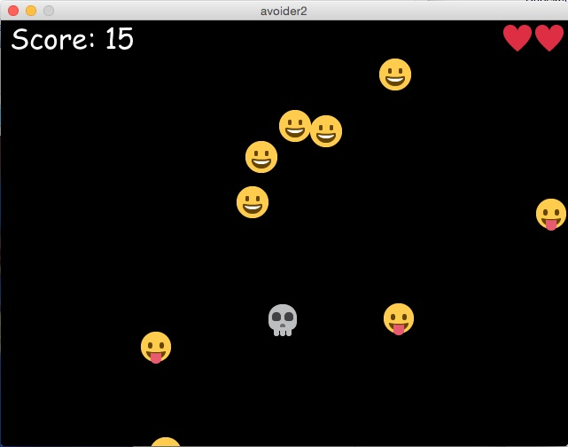

# Avoider Game Stage 2

Nun ist es an der Zeit, das *Avoider Game*, das ich [hier begonnen](avoider1.md) hatte ein wenig aufzupeppen und auch ein bißchen *Refactoring* vorzunehmen. Zum einen war es ja bisher sehr unnachgiebig und hat bei jeden Kontakt mit einem Smiley unseren Helden sofort sterben lassen. Nun möchte ich ihm ein paar Leben mehr spendieren. Und zum anderen habe ich aus Bequemlichkeit einige Initialisierungen in der Klasse `Sprite` vorgenommen, die dort eigentlich nicht hingehörten, da sie redundant waren. Diese habe ich nun in die abgeleiteten Klassen verfrachtet. Dazu mußte ich aber die `__init__()`-Methode jeweils überschreiben, so daß ich in den abgeleiteten Klassen `super()` aufrufen mußte, um die `__init()__`-Methode der Oberklasse auch aufzurufen. Ich will das mal an einem Beispiel zeigen. Die Klasse `Sprite` sieht nun so aus:

~~~python
class Sprite(object):
    def __init__(self, posX, posY):
        self.x = posX
        self.y = posY

    def checkCollision(self, otherSprite):
        if (self.x < otherSprite.x + tw and otherSprite.x < self.x + tw
            and self.y < otherSprite.y + th and otherSprite.y < self.y + th):
            return True
        else:
            return False
~~~

Sie hat nur noch eine minimale Initialisierung und besitzt auch nur noch die Methode `checkCollision()`, da nur diese an die daraus abgeleiteten Klassen vererbt wird. Die Klasse `Skull` hingegen und ihre `__init__()`-Methode sieht nun so aus:

~~~python
class Skull(Sprite):

    def __init__(self, posX, posY):
        super(Skull, self).__init__(posX, posY)
        self.score = 0
        self.health = 0
~~~

Der Aufruf der `super()`-Methode ist so Python 2.7 spezifisch, in Python 3 wurde sie vereinfacht, aber Processing.py beruht nun mal auf Jython und Jython ist (noch?) Processing 2.7. Damit der `super()`-Aufruf funktioniert, muß übrigens das Eltern-Objekt von `object` abgeleitet werden, sonst kann Processing.py den Typ nicht erkennen.

Die Variablen `score` und `health` sind nur für das Objekt `Skull` von Bedeutung und wurden daher vom Eltern-Objekt in das abgeleitete Objekt verschoben.

## Das Spiel

Um das Spiel angenehmer für den Spieler zu machen, bekam der Schädel ein paar Leben spendiert, die mit Herzchen symbolisiert werden, und außerdam bekam der *Game-Over-Screen* die Möglichkeit, von hier aus das Spiel noch einmal zu starten. Dafür mußte ich der Klasse `Smiley`, deren `__init__()`-Methode nun so aussieht,

~~~python
    def __init__(self, posX, posY):
        super(Smiley, self).__init__(posX, posY)
        self.outside = False
~~~

eine `reset()`-Methode verpassen, die die Möglichkeit gibt, zu Beginn eines neuen Spieles auch die Smileys wieder oberhalb des oberen Bildschirmrandes zu katapultieren, von der sie dann fröhlich wieder herabfallen können. Sie ist ganz einfach gehalten, da die Berechnung der neuen Positionen im Hauptprogramm abläuft:

~~~python
    def reset(self, posX, posY):
        self.x = posX
        self.y = posY
~~~

In der Initialisierung habe ich noch die Variable `over` in `outside` geändert. Auch wenn es nur Kosmetik ist, der Name schien mir verständlicher auszudrücken, was die Variable machen soll. Ansonsten hat es in dem Reiter `sprite.py` keine weiteren Veränderungen gegeben.

## Das Hauptprogramm

Alle anderen Veränderungen fanden im Hauptprogramm statt, das ein komplettes *Refactoring* erfahren hat. Die `draw()`-Schleife sieht nun so aus:

~~~python
def draw():
    global heart
    background(0, 0, 0)
    text("Score: " + str(skull.score), 10, 32)
    for i in range(skull.health):
        image(heart, width - i*tw - tw - 2, 2)
    if startgame:
        startGame()
    elif playgame:
        playGame()
    elif gameover:
        gameOver()
~~~

Nach der Definition des Hintergrundes wird ein *HUD* *(Head-Up-Display)* gezeichnet der in allen drei Bildschirmen gleich ist. Damit die Herzchen, obwohl von links nach rechts gezeichnet, immer in der rechten oberen Ecke kleben, sieht die Berechnung der Position etwas seltsam aus, aber es ist einfach nur die Weite des Bildschirms, abzüglich der Weite der Herzchen (in diesem Fall `tw = 36`) multipliziert mit der Anzahl der Herzchen und versehen mit einem Abstand von je zwei Pixeln.

Die einzelnen Bildschirme (Startbildschirm, das eigentliche Spiel und den Game-Over-Bildschirm) habe ich dann in eigene Funktionen verschoben und so aus der Hauptschleife ausgelagert. Sie sehen nun so aus:

~~~python
def startGame():
    global startgame, playgame
    text("Klick to Play", 200, height/2)
    if mousePressed:
        startgame = False
        playgame = True
        
def playGame():
    global playgame, gameover
    skull.move()
    for i in range(len(smiley)):
        if skull.checkCollision(smiley[i]):
            if skull.health > 0:
                skull.health -= 1
                smiley[i].reset(randint(0, w-tw), -randint(50, 250))
            else:
                playgame = False
                gameover = True 
    skull.display()
    for i in range(len(smiley)):
        smiley[i].move()
        if smiley[i].outside:
            skull.score += 1
        smiley[i].display()

def gameOver():
    global playgame, gameover
    text("Game Over!", 200, height/2)
    text("Klick to play again.", 200, 300)
    if mousePressed:
        gameover = False
        for i in range(len(smiley)):
            smiley[i].reset(randint(0, w-tw), -randint(50, 250))
        playgame = True
        skull.health = 5
~~~

Zu `startGame()`ist eigentlich nichts zu schreiben, der Code sollte selbsterklärend sein.

Anders ist es bei `playGame()`. Da der Kontakt des Schädels mit einem Spieler nicht mehr zum sofortigen Spielende führt, muß bei Kontakt das Smiley »gelöscht« werden, das heißt es wird wieder an eine zufällige Stelle oberhalb des Bildschirms versetzt. Und bei jedem Kontakt bekommt der Spieler natürlich ein Leben und ein Herzchen abgezogen. Da ich schon soviel darüber geschrieben habe, hier erst einmal das Herzchen, damit Ihr das Spiel auch nachprogrammieren könnt:

Ähnliches gilt für den `gameOver`-Screen. Hier müssen *alle* Smileys wieder an eine zufällige Position oberhalb des Bildschirms katapultiert werden und natürlich erhält der Schädel auch alle seine Leben wieder zurück.

## Der Quellcode

Zum vollen Verständnis und damit Ihr das Spiel auch vollständig nachprogrammieren könnt, hier der vollständige Quellcode. Erst einmal der Code im Reiter `sprite.py`:

~~~python
from random import randint

tw = th = 36

class Sprite(object):
    def __init__(self, posX, posY):
        self.x = posX
        self.y = posY

    def checkCollision(self, otherSprite):
        if (self.x < otherSprite.x + tw and otherSprite.x < self.x + tw
            and self.y < otherSprite.y + th and otherSprite.y < self.y + th):
            return True
        else:
            return False

class Skull(Sprite):

    def __init__(self, posX, posY):
        super(Skull, self).__init__(posX, posY)
        self.score = 0
        self.health = 0
            
    def loadPics(self):
        self.im1 = loadImage("skull.png")
        
    def move(self):
        self.x = mouseX
        if self.x <= 0:
            self.x = 0
        elif self.x >= width-tw:
            self.x = width - tw
            
    def display(self):
        image(self.im1, self.x, self.y)

class Smiley(Sprite):
    
    def __init__(self, posX, posY):
        super(Smiley, self).__init__(posX, posY)
        self.outside = False

    def loadPics(self):
        self.im0 = loadImage("smiley0.png")
        self.im1 = loadImage("smiley1.png")
        self.im2 = loadImage("smiley4.png")
        
    def move(self):
        self.outside = False
        self.y += self.dy
        if self.y >= height:
            self.outside = True
            self.y = -randint(50, 250)
            self.x = randint(0, width-tw)
            self.dy = randint(2, 10)
        
    def display(self):
        if (self.y > -30) and (self.y <= 200):
            image(self.im0, self.x, self.y)
        elif (self.y > 200) and (self.y <= 360):
            image(self.im1, self.x, self.y)
        elif (self.y > 360):
            image(self.im2, self.x, self.y)
    
    def reset(self, posX, posY):
        self.x = posX
        self.y = posY
~~~

Und dann das Hauptprogramm `avoider2`:

~~~python
from random import randint
from sprite import Skull, Smiley

w = 640
tw = th = 36
noSmileys = 10
startgame = True
playgame = False
gameover = False

skull = Skull(w/2, 320)
smiley = []
for i in range(noSmileys):
    smiley.append(Smiley(randint(0, w-tw), -randint(50, 250)))

def setup():
    global heart
    skull.score = 0
    skull.health = 5
    size(640, 480)
    frameRate(30)
    skull.loadPics()
    for i in range(len(smiley)):
        smiley[i].loadPics()
        smiley[i].dy = randint(2, 10)
    font = loadFont("ComicSansMS-32.vlw")
    textFont(font, 32)
    heart = loadImage("heart.png")
    # noCursor()
    # cursor(HAND)
  
def draw():
    global heart
    background(0, 0, 0)
    text("Score: " + str(skull.score), 10, 32)
    for i in range(skull.health):
        image(heart, width - i*tw - tw - 2, 2)
    if startgame:
        startGame()
    elif playgame:
        playGame()
    elif gameover:
        gameOver()

def startGame():
    global startgame, playgame
    text("Klick to Play", 200, height/2)
    if mousePressed:
        startgame = False
        playgame = True
        
def playGame():
    global playgame, gameover
    skull.move()
    for i in range(len(smiley)):
        if skull.checkCollision(smiley[i]):
            if skull.health > 0:
                skull.health -= 1
                smiley[i].reset(randint(0, w-tw), -randint(50, 250))
            else:
                playgame = False
                gameover = True 
    skull.display()
    for i in range(len(smiley)):
        smiley[i].move()
        if smiley[i].outside:
            skull.score += 1
        smiley[i].display()

def gameOver():
    global playgame, gameover
    text("Game Over!", 200, height/2)
    text("Klick to play again.", 200, 300)
    if mousePressed:
        gameover = False
        for i in range(len(smiley)):
            smiley[i].reset(randint(0, w-tw), -randint(50, 250))
        playgame = True
        skull.health = 5
~~~

Ich glaube, das *Refactoring* hat dem Quellcode gutgetan, er ist deutlich lesbarer und verständlicher geworden. Das Spiel ist so schon richtig gut spielbar, in einer nächsten Version möchte ich aber noch ein paar *Gimmicks* einbauen.