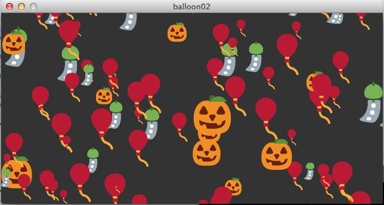
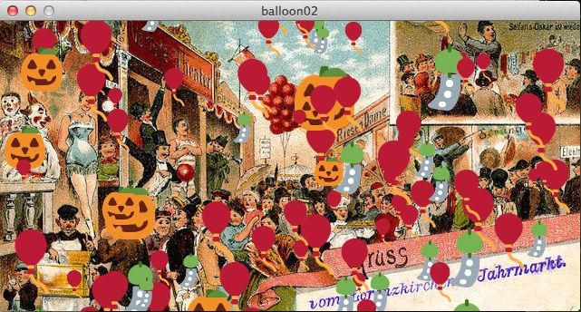
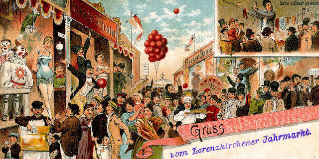

# Ein kleiner roter Luftballon

Die Idee zu diesem Tutorial kam mir, nachdem ich [ein Video](https://www.youtube.com/watch?v=DPFJROWdkQ8) von *Daniel Shiffman* gesehen hatte, in dem er Pflanzen wie Blasen aufsteigen ließ. Dieser Sketch war eine Erweiterung eines anderen Sketches *Bubbles* ([Quellcode](https://github.com/CodingRainbow/Rainbow-Code/tree/master/Processing/11_video/sketch_15_2_array_images)), in dem er die dort verwendeten Kreise durch die Bilder von Blüten ersetzte. Ich dachte mir, so etwas ähnliches möchte ich auch einmal mit Processing.py prgrammieren und es sollte auch noch schöner aussehen. Zwar hatte ich zumindest eine der Blüten auch als PNG-Datei -- es ist nämlich das Logo von *TextMate 2*, meines bevorzugten Texteditors --, aber ich dachte schon beim Anschauen des Videos sofort an Ballons und die bekommt man als Emoji geliefert. Nun ist aber Python 2.7 und damit auch Jython, das den Python-Mode von Processing antreibt, nicht gerade wirklich UTF-8-fest und Emoji-freundlich, also mußten Bilder her. Die Lösung sind die [Twemojis](https://github.com/twitter/twemoji) von Twitter, ein vollständiger Emoji-Bilder-Satz in diversen Auflösungen und auch als SVG, der unter der unter der [CC-BY-4.0](https://creativecommons.org/licenses/by/4.0/) Lizenz steht und frei verwendet werden kann. Dort habe ich mir erst einmal den Ballon als 72x72 Pixel großes, transparentes PNG herausgesucht

und dann zum Warmwerden damit diesen kleinen Sketch geschrieben:

~~~python
speed = 1.5

def setup():
    global balloon, x, y
    size(400, 200)
    balloon = loadImage("1f388.png")
    x = random(0, width-72)
    y = height

def draw():
    global balloon, x, y
    background(51)
    image(balloon, x, y)
    y -= speed
    if (y < -72):
        y = height
        x = random(0, width-72)
~~~

Damit zieht ein einsamer kleiner, roter Luftballon durch das Sketch-Fenster, der -- wenn er oben am Fesnterrand verschwindet -- unten an einer anderen, zufälligen Position wieder auftaucht.

## Viele, viele rote Luftballons

Doch da geht natürlich mehr. Ich wollte mehrere Ballons aufsteigen lassen und sie sollten sich auch ein wenig zufälliger bewegen. Und was macht man, wenn man mehrere ähnliche Objekt hat? Richtig, man erstellt eine Klasse für diese Objekte:

~~~python
class Balloon():
    
    def __init__(self, dia, img):
        self.diameter = dia
        self.x = random(0, width - self.diameter)
        self.y = height
        self.diameter = dia
        self.img = img
        self.yspeed = random(0.5, 2)
        
    def move(self):
        self.y -= self.yspeed
        self.x = self.x + random(-2, 2)
        
    def display(self):
        image(self.img, self.x, self.y, self.diameter, self.diameter)
        
    def top(self):
        if (self.y <= 0):
            self.y = 0
~~~

Bilder in Processing funktionieren im Prinzip wie Rechtecke. Wird die Funktion `image(x, y)` nur mit zwei Parametern aufgerufen, wird das Bild an dieser Stelle in seiner vollen Größe gezeigt. Ruft man hingegen `image(x, y, w, h)` auf, dann wird das Bild an dieser Stelle mit den Seitenlängen `w` und `h` gezeigt. Dabei wird das Bild im Zweifelsfalle auch proportional gestaucht oder gestreckt. Ihr könnt es einfach mal ausprobieren, indem Ihr ein Bild in `draw()` mit `image(0, 0, mouseX, mouseY)` aufruft.

Ich habe aber einfach dem Konstruktor der Klasse den Durchmesser des Bildes mitgegeben und eine Referenz auf das Bild, das zu laden ist. Dann wird mit `move()` das Bild bewegt und mit `display()` wird es in das Sketchfenster gezeichnet. Diese Konstruktion wird Euch in vielen Klassen in Processing begegnen.

Eine Besonderheit ist die Methode ` top()`. Hier wird abgefragt, ob der Luftballon das obere Fenster erreicht hat und bleibt dann zitternd dort kleben.

Hier dann das Hauptprogramm,

~~~python
from balloon import Balloon

numBalloons = 15
balloons = []

def setup():
    size(640, 320)
    i = 0
    balloon = loadImage("1f388.png")
    while (i < numBalloons):
        dia = random(24, 72)
        balloons.append(Balloon(dia, balloon))
        i += 1

def draw():
    background(51)
    for i in range(len(balloons)):
        balloons[i].move()
        balloons[i].display()
        balloons[i].top()
~~~

das dann dieses Bild erzeugt, das ich in diesem Screenshot zu Beginn festgehalten habe:

Ein wenig habe ich dabei gemogelt. Denn um überhaupt noch ein paar Ballons zu erwischen, die nicht an der Decke kleben, hatte ich die Geschwindigkeit drastisch reduziert.

## Es kann nicht nur einen geben

Meine Idee war es aber, daß die Ballons vollständig den oberen Fensterrand passieren und dann an einer zufälligen Position und in einer zufälligen Größe unten wieder auftauchte, so daß die Illusion eines kontinuierlichen Ballonaufstiegs entsteht. Daher habe ich die Methode `top()` in der Klasse `Ballon` umgeschrieben:

~~~python
    def top(self):
        if (self.y <= -self.diameter):
            self.y = height + self.diameter
            self.x = random(0, width - self.diameter)
            self.diameter = random(24, 72)
            self.yspeed = random(0.5, 2)
~~~

Außerdem fand ich nur einen Ballon langweilig. *Dan Shiffman* hat in seinem oben erwähnten Video ja auch drei unterschiedliche Blüten genützt. Also habe ich die Twemojis weiter geplündert und mir diese drei Vertreter ausgesucht:

  

Neben dem schon bekannten Ballon (`1f388.png`) ist es noch ein Halloween-Kürbis (`1f383.png`) und ein japanisches Windspiel (`1f390.png`), das zum Himmel aufsteigen soll:

Die Klasse `Balloon` mußte dafür nicht weiter geändert werden, aber im Hauptprogramm habe ich einige Erweiterungen durchgeführt.

~~~python
from balloon import Balloon

numBalloons = 100
balloons = []

def setup():
    size(640, 320)
    i = 0
    balloon = loadImage("1f388.png")
    jackolantern = loadImage("1f383.png")
    windchime = loadImage("1f390.png")
    while (i < numBalloons):
        rand = random(10)
        if (rand < 1):
            img = jackolantern
        elif (rand < 8):
            img = balloon
        else:
            img = windchime
        dia = random(24, 72)
        balloons.append(Balloon(dia, img))
        i += 1

def draw():
    background(51)
    for i in range(len(balloons)):
        balloons[i].move()
        balloons[i].display()
        balloons[i].top()
~~~

Die Anzahl der »Ballons« habe ich großzügig auf 100 erhöht -- man hat's ja. In `setup()` habe ich dann die Bilder der einzelnen Objekte geladen und in der `while`-Schleife sie erst einmal zufällig verteilt und dann die 100 Objekte in einer Liste erzeugt.

## In Lorenzkirch ist Jahrmarkt

Zu guter Letzt habe ich noch den Hintergrund aufgehübscht und ihn mit einem Bild des [Jahrmarkts von Lorenzkirch](https://de.wikipedia.org/wiki/Lorenzkirch#Gr.C3.BCndung_des_Ortes_Lorenzkirch.2C_der_Sankt_Laurentiuskirche_und_des_Laurentiusmarktes) um 1900 versehen. Der vollständige Sketch sieht nun so aus:

~~~python
from balloon import Balloon

numBalloons = 100
balloons = []

def setup():
    global jahrmarkt
    size(640, 320)
    jahrmarkt = loadImage("jahrmarkt.jpg")
    i = 0
    balloon = loadImage("1f388.png")
    jackolantern = loadImage("1f383.png")
    windchime = loadImage("1f390.png")
    while (i < numBalloons):
        rand = random(10)
        if (rand < 1):
            img = jackolantern
        elif (rand < 8):
            img = balloon
        else:
            img = windchime
        dia = random(24, 72)
        balloons.append(Balloon(dia, img))
        i += 1

def draw():
    global jahrmarkt
    background(jahrmarkt)
    # background(51)
    for i in range(len(balloons)):
        balloons[i].move()
        balloons[i].display()
        balloons[i].top()
~~~

An der Klasse `Balloon` wurde nichts mehr geändert.

## Credits

Neben den oben schon erwähnten Twemojis, für die ich Twitter danke, habe ich das [Bild des Lorenzmarktes um 1900](https://commons.wikimedia.org/wiki/File:Jahrmarkt_in_Lorenzkirch_im_Jahr_1900.jpg) den Wikimedia Commons entnommen. Es ist alt genug, daß es gemeinfrei ist und frei verwendet werden darf.

