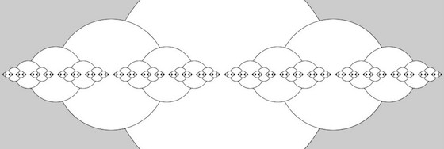
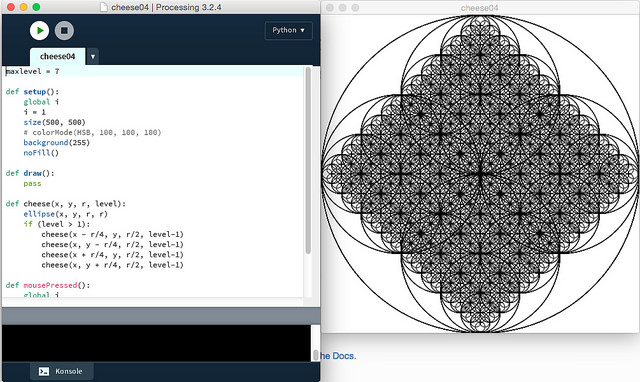

# Spaß mit Kreisen in Processing.py: Cantor-Käse und mehr

Wie im letzten Beitrag gezeigt, ist es in Processing (und damit auch in Processing.py, dem Python-Mode für Processing) recht einfach, einfache Kreise oder Ellipsen zu zeichnen. Aber das ist auf die Dauer natürlich ein wenig langweilig, daher wende ich mich nun einer rekursiven Figur zu, die zwar ebenfalls nur aus Kreisen besteht, aber dennoch einige interessante Eigenschaften aufweist, dem **Cantor-Käse**, einer Figur, die der [Cantor-Menge][3] topologisch ähnlich ist. Sie wird konstruiert, in dem aus einem Kreis bis auf zwei kleinere Kreise alles entfernt wird. Aus diesen zwei kleineren Kreisen wird wiederum bis auf zwei kleinere Kreise alles entfernt. Nun hat man schon vier Kreise, aus denen man jeweils bis auf zwei kleinere Kreise alles entfernt. Und so weiter und so fort …

Das schreit natürlich nach einer rekursiven Funktion und die ist in Python (genauer: in Processings Python-Mode) recht schnell erstellt:

~~~python
def setup():
    size(500, 500)
    # colorMode(HSB, 100, 100, 100)
    noLoop()

def draw():
    cheese(width/2, height/2, 500, 10)

def cheese(x, y, r, level):
    ellipse(x, y, r, r)
    if (level > 1):
        cheese(x - r/4, y, r/2, level-1)
        cheese(x + r/4, y, r/2, level-1)
~~~

Das Ergebnis könnt Ihr in obenstehenden Screenshot bewundern. Im Screenshot sieht man noch, daß ich auch versucht habe, mit Farbe zu experimentieren, aber ein wirklich befriedigendes Ergebnis war dabei nicht herausgekommen

Ich hatte diese Figur auch schon mal in [Shoes zeichnen lassen][4] und dabei Porbleme mit der Rekursiontiefe festgestellt (ab einer Rekursionstiefe von 15 stürzte Shoes gnadenlos ab). Hier scheint Processing robuster zu sein, eine Rekursionstiefe von 15 nahm die Software gelassen hin, ließ sich dann natürlich Zeit mit der Ausgabe. Das muß schließlich alles berechnet werden.

Weil der Durchmesser der Kreise in der Literatur oft mit `r` bezeichnet wird, neige ich dazu, Radius und Durchmesser zu verwechseln. Setzt man dann den Algorithmus 1:1 um, zum Beispiel wie in diesem Sketch

~~~python
def setup():
    size(1000, 500)
    noLoop()

def draw():
    cheese(width/2, height/2, 500, 10)

def cheese(x, y, r, level):
    ellipse(x, y, r, r)
    if (level > 1):
        cheese(x - r/2, y, r/2, level-1)
        cheese(x + r/2, y, r/2, level-1)
~~~

kommt die Figur heraus, die den Kopf dieses Beitrages ziert. Das ist zwar streng genommen kein Cantor-Käse mehr, aber dennoch ein interessantes Ergebnis. Das macht den Vorteil des schnellen Skizzierens in Processing aus: Selbst Fehler können unerwartete und notierenswerte Ergebnisse liefern. Man hebt dann den Sketch einfach auf.

## Cantors Doppelkäse

Schon bei meinen Experimenten mit Shoes [hatte ich mich gefragt][5], wie es denn aussähe, wenn man diese Figur sich nicht nur in der Horizontalen, sondern auch in der Vertikalen ausbreiten läßt?

Dabei habe ich auch gleich ein interaktives Element eingeführt: Startet man das Programm, zeigt es zuerst nur ein weißes Fenster, nach dem ersten Mausklick sieht man die erste Rekursionstiefe, einen einfachen Kreis, der nächste Mausklick zeigt vier darin eingeschriebene Kreise, der nächste Mausklick zeigt dann in jedem der kleinen Kreise wiederum vier eingeschriebene Kreise und so weiter und so fort …

~~~python
maxlevel = 7

def setup():
    global i
    i = 1
    size(500, 500)
    # colorMode(HSB, 100, 100, 100)
    background(255)
    noFill()

def draw():
    pass

def cheese(x, y, r, level):
    ellipse(x, y, r, r)
    if (level > 1):
        cheese(x - r/4, y, r/2, level-1)
        cheese(x, y - r/4, r/2, level-1)
        cheese(x + r/4, y, r/2, level-1)
        cheese(x, y + r/4, r/2, level-1)

def mousePressed():
    global i
    cheese(width/2, height/2, 500, i)
    i += 1
    if (i >= maxlevel):
        noLoop()
~~~

Das Programm stoppt dann bei einer Rekursionstiefe von sieben. Auch hier ist Processing robuster als Shoes, höhere Rekursionstiefen waren kein Problem, nur man sah dann nicht viel mehr als ein auf der Spitze stehendes Quadrat mit ein paar Ausbuchtungen -- die Auflösung des Bildschirms setzt hier neuem Erkenntnisgewinn Grenzen.

Interessant und neu für mich war, daß man -- um überhaupt ein Zeichenfenster zu bekommen, in das man mit der Maus klicken konnte -- eine leere `draw()`-Funktion benötigte. Eigentlich logisch, aber ich hatte vorher nie darüber nachgedacht.

## Literatur

- Clifford A. Pickover: *[Mit den Augen des Computers. Phantastische Welten aus dem Geist der Maschine](http://www.amazon.de/gp/product/3877913237/ref=as_li_tl?ie=UTF8&camp=1638&creative=19454&creativeASIN=3877913237&linkCode=as2&tag=derschockwell-21)*, München (Markt und Technik) 1992. Diese deutsche Übersetzung von *Computers and the Imagination* ist eine geniale Fundgrube für alle, die Simulationen und mathematische Spielereien mit dem Computer lieben. Es ist eines der besten Bücher [Pickovers](http://cognitiones.kantel-chaos-team.de/personen/pickover.html). Dem Cantor-Käse ist auf den Seiten 171-181 ein eigenes Kapitel gewidmet.
- Chris Robart: *[Programming Ideas: For Teaching High School Computer Programming](http://mmhs.ca/compsci/ideas2.pdf)*, (<%= imageref("pdf") %> 260 KB, 2nd Edition) 2001. Ebenfalls eine Fundgrube voller Ideen, deren Download sich in jedem Fall lohnt.

[3]: https://de.wikipedia.org/wiki/Cantor-Menge
[4]: http://blog.schockwellenreiter.de/2016/05/2016050302.html
[5]: http://blog.schockwellenreiter.de/2016/09/2016091601.html