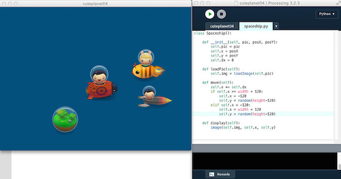

# »Cute Planet« mit Processing.py

Im [letzten Teil][1] meiner kleinen Tutorial-Reihe zu [Processing.py][2], dem [Python][3]-Mode für [Processing][4], hatte ich ja eine Klasse erstellt. Auf den ersten Blick erschien sie nicht besonders nützlich, da ich im eigentlichen Sketch ja nur eine Instanz der Klasse erzeugt hatte. So sah das schon ein wenig nach mehr Schreibaufwand ohne großen Nutzen aus. Um die Skeptiker zu überzeugen, werde ich in diesem Tutorial wieder eine Klasse erstellen, von der es im Sketch dann aber vier Instanzen geben wird. Vier Raumschiffe werden im Anschluß über den Bildschirm wuseln.

Also erst einmal die Klasse selber, ich habe sie aus naheliegenden Gründen `Spaceship` genannt (auch wenn ein Planet ja im eigentlichen Sinne des Wortes kein Raumschiff ist, aber wie Ihr später sehen werdet, in »Space Cute« schon 😜 ):

~~~{python}
class Spaceship():
    
    def __init__(self, pic, posX, posY):
        self.pic = pic
        self.x = posX
        self.y = posY
        self.dx = 0
        
    def loadPic(self):
        self.img = loadImage(self.pic)
    
    def move(self):
        self.x += self.dx
        if self.x >= width + 120:
            self.x = -120
            self.y = random(height-120)
        elif self.x < -120:
            self.x = width + 120
            self.y = random(height-120)
    
    def display(self):
        image(self.img, self.x, self.y)
~~~

Der Konstruktor der Klasse verlangt die URL eines Bildes, das das Raumschiff (oder den Planeten) auf dem Monitor darstellt und eine initiale Position, auf der es im Fenster erscheinen soll.

Dann gibt es die Funktion `loadPic()`, die dieses Bild dann lädt. Die Bilder stammen wieder aus dem von *Daniel Cook (Danc)* in seinem Blog *[Lost Garden][9]* unter einer [freien Lizenz][10] ([CC BY 3.0 US][11]) zu Verfügung gestellten Tileset *[Planet Cute][12]*. Ich habe sie mit dem [Bildverarbeitungsprogramm meiner Wahl][5] zurechtgeschnitten und auf eine Größe von 120x120 Pixeln heruntergerechnet und sie dann durch einfaches Schieben auf das Editor-Fenster der Processing IDE in den `data`-Ordner des Sketches transportiert. So findet Processing (und damit auch Processing.py) sie ohne zusätzliche Pfadangabe.

   

Dann folgt die Funktion `move()`, die das Herzstück der Klasse darstellt. Hier werden die einzelnen Raumschiffe bewegt und wenn sie die Grenzen des Fenster verlassen haben, von der gegenüberliegenden Seite von einer zufällig gewählten Position wieder zurück ins Fenster geschickt. Die Funktion `display()` kümmert sich dann um die Darstellung des Raumschiffs.

Nun das Hauptprogramm: Dank der Klasse `Spaceship` ist es kurz und übersichtlich geblieben.

~~~{python}
from spaceship import Spaceship

planet = Spaceship("planet.png", 500, 350)
rocket = Spaceship("rocketship.png", 300, 300)
octopussy = Spaceship("octopussy.png", 400, 150)
beetle = Spaceship("beetleship.png", 200, 100)

ships = [planet, rocket, octopussy, beetle]

def setup():
    size(640, 480)
    planet.loadPic()
    planet.dx = 1
    rocket.loadPic()
    rocket.dx = 10
    octopussy.loadPic()
    octopussy.dx = -5
    beetle.loadPic()
    beetle.dx = 5

def draw():
    background(0, 80, 125)
    for i in range(len(ships)):
        ships[i].move()
        ships[i].display()
~~~

Als erstes wird die Klasse `Spaceship` importiert und der Variablen `spaceship` zugewiesen. Dann werden vier *Spaceships«* erzeugt und einer Variablen zugewiesen, die den Konstruktor der Klasse aufruft. Dann wird noch eine Liste erstellt, die alle vier »Raumschiffe« enthält. Im `setup()` laden dann alle vier ihre Bilder und bekommen (mit `dx`) eine Geschwindigkeit verpaßt.

Das war es dann scho fast: In `draw()` wird dann nur noch eine Schleife durchlaufen, die für jedes der »Raumschiffe« die Funktionen `move()` und `display()` aufruft. Wenn Ihr nun den Sketch laufen laßt, werdet Ihr sehen, daß im Weltall rund um den Planeten »Space Cute« ein Verkehr wie auf dem Kudamm herrscht. Stellt Euch mal vor, ich hätte noch mehr Instanzen der Klasse `Spaceship` erzeugt. 😇

[1]: klassekitty,md
[2]: http://cognitiones.kantel-chaos-team.de/programmierung/creativecoding/processing/processingpy.html
[3]: http://cognitiones.kantel-chaos-team.de/programmierung/python/python.html
[4]: http://cognitiones.kantel-chaos-team.de/programmierung/creativecoding/processing/processing.html
[5]: http://cognitiones.kantel-chaos-team.de/multimedia/computergraphik/gimp.html
[9]: http://www.lostgarden.com/search/label/free%20game%20graphics
[10]: http://www.lostgarden.com/2007/03/lost-garden-license.html
[11]: http://creativecommons.org/licenses/by/3.0/us/
[12]: http://www.lostgarden.com/2007/05/dancs-miraculously-flexible-game.html

