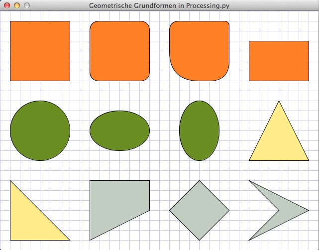

# Geometrische Grundformen

## Der Quelltext

~~~python
def setup():
    size(640, 480)
    frame.setTitle("Geometrische Grundformen in Processing.py")
    # noLoop()

def draw():
    background(255)
    drawGrid()
    stroke(0)
    
    # Rechtecke
    with pushStyle():
        fill(255,127,36)
        rect(20, 20, 120, 120)
        rect(180, 20, 120, 120, 20)
        rect(340, 20, 120, 120, 20, 10, 40, 80)
        rect(500, 60, 120, 80)
    
    # Kreise und Ellipsen
    with pushStyle():
        fill(107, 142, 35)
        ellipse(80, 240, 120, 120)
        ellipse(240, 240, 120, 80)
        ellipse(400, 240, 80, 120)
    
    # Dreiecke
    with pushStyle():
        fill(255, 236, 139)
        triangle(560, 180, 620, 300, 500, 300)
        triangle(20, 340, 140, 460, 20, 460)
        
    # Vierecke
    with pushStyle():
        fill(193, 205, 193)
        quad(180, 340, 300, 340, 300, 400, 180, 460)
        quad(400, 340, 460, 400, 400, 460, 340, 400)
        quad(500, 340, 620, 400, 500, 460, 560, 400)
    

def drawGrid():
    stroke(200, 200, 255)
    for i in range(0, width, 20):
        line(i, 0, i, height)
    for i in range(0, height, 20):
        line(0, i, width, i)
~~~