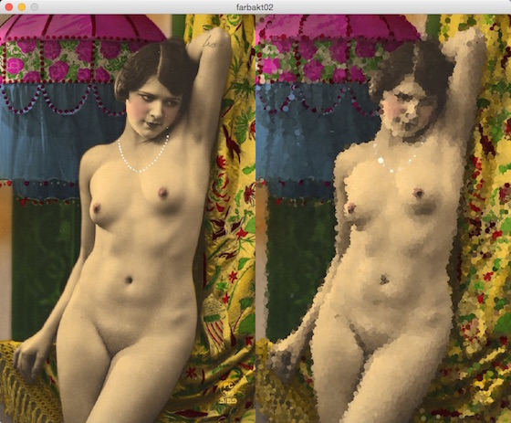

# Pointillismus

[Pointillismus](https://de.wikipedia.org/wiki/Pointillismus) bezeichnet eine Stilrichtung der Malerei, die zwsichen 1889 und 1910 ihre Blütezeit hatte. Pointillistische Bilder bestehen aus kleinen regelmäßigen Farbtupfern in reinen Farben. Der Gesamt-Farbeindruck einer Fläche ergibt sich erst im Auge des Betrachters und aus einer gewissen Entfernung. So etwas in der Art kann man natürlich auch leicht in Processing.py nachbilden (wobei die möglichst reinen Farben in dem Beispielprogramm nur annähernd getroffen werden, weil es sich bei dem Ausgangsbild um eine handkolorierte Photographie vermutlich ebenfalls aus dem 19. Jahrhundert handelt[^1]).

[^1]: Fragt nicht, wo ich diese Photographie gefunden habe. Ich habe sie einfach aus den unendlichen Tiefen des WWW gefischt.

Das Programmfenster zeigt links das Ausgangsbild. Rechts entsteht so langsam das aus Kreisen zufälliger Größe zusammengesetzte Zielbild. Dabei besitzen die Punkte einen Ausganswert (`radius`) von sechs, der mit einem Zufallsfaktor zwischen 0.2 und 1.5 multipliziert wird. (Ich benutze im Programm die `randint()`-Funktion von Python und nicht die eingebaute `random()`-Funktion von Processing. Mir ist die Python-Funktion irgendwie sympathischer, aber das ist vermutlich Geschmackssache.)

Bei jedem Durchlauf der `draw()`-Schleife wird der Farbwert eines zufälligen Punktes im Ursprungsbild ermittelt und dann als Kreis (Punkt) im Zielbild eingezeichnet. Das Ergebnis gleicht dem Ursprungsbild, nur das es den Anschein erweckt, als würde man es durch eine Scheibe Strukturglas, wie sie manchmal Duschen- oder Badezimmertüren zieren, betrachten.

## Der Quellcode

~~~python
import random as r
radius = 6

def setup():
    global akt
    size(800, 640)
    akt = loadImage("akt.jpg")
    background(0)
    frameRate(600)

def draw():
    global akt
    image(akt, 0, 0)
    x = r.randint(0, akt.width - 1)
    y = r.randint(0, akt.height - 1)
    c = akt.pixels[x + y*akt.width]
    zufall = r.randint(2, 15)/10.0
    noStroke()
    fill(c)
    ellipse(x + 400, y, radius*zufall, radius*zufall)
~~~

Der Quellcode ist wieder schön kurz und lädt zum Experimentieren ein. Setzt man zum Beispiel die Konstante `radius = 3`, dann wirkt das Zielbild bedeutend realistischer. Und ein sehr seltsames Ergebnis bekommt man, wenn man die Zeile mit dem `noStroke()` auskommentiert.

Man muß natürlich nicht unbedingt Kreise zeichnen. Ein Quadrat oder ein Dreieck ergibt noch ganz andere Effekte. Spielt einfach mal ein wenig damit herum. Processing(.py) ist zum Spielen entworfen worden.