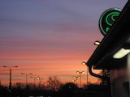
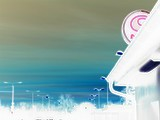
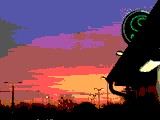
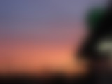
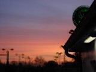
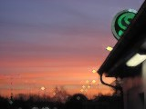
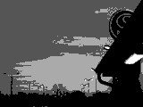
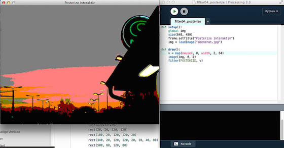

# Filter für die Bildverarbeitung

Processing und damit auch Processing.py bringen eine kleine Sammlung vorgefertigter Filter für die Bildmanipulation mit, die auf jedes Bild angewandt werden können. Die Filter haben folgende Syntax: Entweder

~~~python
filter(MODE)
~~~

oder

~~~python
filter(MODE, param)
~~~

Ob ein Filter einen zusätzlichen Paramter mitbekommen kann, hängt vom Filter ab. Wie die Filter wirken und ob und wie sie einen Paramter mitbekommen, könnt Ihr der folgenden Tabelle entnehmen:

Filter | Ergebnis
:----- | :------:
Originalbild (keinen Filter) | 
THRESHOLD, Parameter (optional) zwischen 0 und 1, Default 0.5 | 
GRAY, keinen Parameter | 
INVERT, photographisch gesprochen das Negativ, keinen Parameter | 
POSTERIZE, zwischen 2 und 255, aber einen richtigen Effekt hat man nur mit niedrigen Werten | 
BLUR, je größer der Wert, desto verschwommener wird das Bild. Der Parameter ist optional, der Default ist 1 | 
ERODE, keinen Parameter | 
DILATE (das Gegenteil von ERODE), keinen Parameter | 
Filter können auch kombiniert werden, hier erst GRAY und dann POSTERIZE | 

Mit folgendem kleinen Sketch könnt Ihr mit den diversen Filtern spielen (die auskommentierten Teile habe ich für die *Thumbnails* in obiger Tabelle benötigt):

~~~python
selectFilter = 8

def setup():
    global img
    # Thumbnails
    # size(160, 120)
    # img = loadImage("abendrot-s.jpg")
    # Volle Größe
    size(640, 480)
    img = loadImage("abendrot.jpg")
    noLoop()

def draw():
    global img
    background(255, 127, 36)
    image(img, 0, 0)
    if (selectFilter == 1):
        filter(THRESHOLD, 0.55)
    elif (selectFilter == 2):
        filter(GRAY)
    elif (selectFilter == 3):
        filter(INVERT)
    elif (selectFilter == 4):
        filter(POSTERIZE, 4)
    elif (selectFilter == 5):
        filter(BLUR, 6)
    elif (selectFilter == 6):
        filter(ERODE)
    elif (selectFilter == 7):
        filter(DILATE)
    elif (selectFilter == 8):
        filter(GRAY)
        filter(POSTERIZE, 4)
    # save("filter020" + str(selectFilter) + ".jpg")
~~~

Einfach bei `selectFilter` den gewünschten Wert (zwischen `0` und `8`) eingeben und dann den Sketch laufen lassen. Ihr seid natürlich eingeladen, bei den Filtern, die Parameter zulassen, mit diesen zu spielen.

Die letzte (auskommentierte) Zeile zeigt Euch, wie Ihr das Ergebnis abspeichern könnt. Das Format des Bildes erkennt Processing an der Endung.

## Filter interaktiv

Noch besser könnt Ihr natürlich die Wirkung der diversen Filterparameter interaktiv mit der Maus erkunden. Ich habe als Beispiel dafür zwei kleine Sketche geschrieben, die einmal `POSTERIZE` und zum anderen `THRESHOLD` erkunden.

~~~python
def setup():
    global img
    size(640, 480)
    frame.setTitle("Posterize interaktiv")
    img = loadImage("abendrot.jpg")

def draw():
    v = map(mouseX, 0, width, 2, 64)
    image(img, 0, 0)
    filter(POSTERIZE, v)
~~~

Da die hohen Werte bei `POSTERIZE` keinen interessanten Effekte mehr liefern, habe ich hier mithilfe der `map()`-Funktion den Parameter auf die Werte zwischen `2` und `64` begrenzt.

~~~python
def setup():
    global img
    size(640, 480)
    frame.setTitle("Threshold interaktiv")
    img = loadImage("abendrot.jpg")

def draw():
    v = float(mouseX)/width
    image(img, 0, 0)
    filter(THRESHOLD, v)
~~~

`THRESHOLD` erwartet Werte zwischen `0.0` und `1.0`. Daher habe ich einfach den `mouseX`-Wert durch die Breite des Fensters geteilt. Wegen der Integer-Division von Python 2.7 mußte ich einen der Werte explizit zu einem `float` konvertieren, um das gewünschte Ergebnis zu erhalten (denn sonst bekommt man nur den Wert Null). So aber wird das Bild, wenn die Maus ganz weit links ist, nur weiiß, während es bei einer Mausposition ganz rechts im Fenster fast vollständig schwarz wird. Irgendwo dazwischen liegen die interessanten Ergebnisse. Ihr solltet dies mit diversen Bildern ausprobieren, um ein Gefühl für die zu erwartenden Effekte zu bekommen.