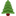
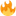
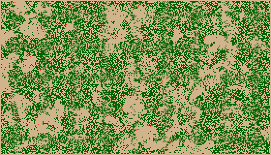

# Zelluläre Automaten: Der Waldbrand-Simulator

Bei dem [Demokratie-Spiel](waehler.md) und bei den [Experimenten mit den Fröschen und Schildkröten](segregation.md) änderte sich pro Durchlauf jeweils nur das Verhalten einer Zelle in Abänggkeit von ihren direkten Nachbarn und war für den weiteren Verlauf der Simulation verantwortlich. Bei den meisten Simulationen mit zellulären Automaten jedoch wird der neue Wert *aller* Zellen in Abhängigkeit von den Nachbarn betrachtet und neu berechnet. Dafür muß man dann zwei Arrays anlegen, eines, das die aktuellen und eines das die zukünftigen Werte beinhaltet. Ich möchte das mal am Beispiel einer beliebten Simulation zeigen, der Simulation eines Waldbrandes mit einem zellulären Automaten.

Die Regeln dieser Simulation folgen der Beschreibung, die *Daniel Scholz* in seinem Buch »Pixelspiele«[^1] gegeben hat:

[^1]: Daniel Scholz: *[Pixelspiele][a1], Modellieren und Simulieren mit zellulären Automaten*, Berlin - Heidelberg (Springer Spektrum) 2014, S. 19-25

[a1]: https://www.amazon.de/Pixelspiele-Modellieren-Simulieren-zellul%C3%A4ren-Springer-Lehrbuch/dp/3642451306/ref=as_li_ss_tl?_encoding=UTF8&qid=1504972682&sr=8-1&linkCode=ll1&tag=derschockwell-21&linkId=2f0f795b9536747199607226b165a5da

## Kein Spiel ohne Regeln

Für alle Zellen *xij* gelten folgende Regeln:

1. Befindet sich *xij* im Zustand leer *(empty)*, dann wächst auf *xij* mit einer Wahrscheinlichkeit `a` ein Baum, so daß der Zustand von *xij* im nächsten Schritt  *tree* ist.
2. Befindet sich *xij* im Zustand Baum *(tree)*, und mindestens eine Zelle in der Nachbarschaft ist im Zustand Feuer *(burning)*, dann brennt auch *xij*, so daß der Zustand von *xij* im nächsten Schritt auch *burning* ist.
3. Automatischer Ablauf: Falls *xij* ein Baum ist und keiner seiner Nachbarn brennt, dann wird *xij* mit einer Wahrscheinlichkeit von `g` von einem Blitz getroffen, so daß *xij* im nächsten Schritt ebenfalls *burning* ist.
4. Interaktive Version: Wird die Zelle *xij* mit dem Mauszeiger angeklickt, dann wird *xij* von einem Blitz getroffen und der Zustand von *xij* ist im nächsten Schritt *burning*.
5. Befindet sich die Zelle *xij* im Zustand *burning*, dann erlischt das Feuer und der Zustand von *xij* ist im nächsten Schritt *empty*.
6. Trifft keine der obigen Regeln zu, dann verändert sich der Zustand der Zelle *xij* im nächsten Schritt nicht.

Als Nachbarschaft wird die [Von-Neumann-Nachbarschaft](http://cognitiones.kantel-chaos-team.de/programmierung/softcomputing/neumannnb.html) angenommen, Nachbarn sind also nur die direkten Zellen oben und unten sowie rechts und links, das heißt, jede Zelle hat genau vier Nachbarn.

Als Randbedingung wurde ein geschlossener Rand gewählt, daß heißt die Zellen am Rande des Feldes werden in der Simulation gar nicht berücksichtigt, sie bleiben auf ewig, wie sie sind. Daher habe ich bei der Initialisierung des Feldes mit

~~~python
            if (x > 0) and (y > 0) and (x < nRows-1) and (y < nCols-1) and randint(0, 10000) <= 2000:
                grid[x].append(tree)
            else:
                grid[x].append(empty)
~~~

dafür gesorgt, daß die Randfelder immer leer sind. Das hat auf den Simulationsverlauf keinen Einfluß, aber es störte mich besonders bei der Darstellung mit den Emojis, daß auf den Rändern anfangs immer ein paar Bäume dumm herum standen, wie noch im obigen Screenshot dokumentiert, der während einer frühen Phase der Realisierung dieser Simulation enstand.

## Die Realisierung

Oben habe ich es schon angesprochen, für die erste Version der Waldbrandsimulation habe ich wieder [Twitters Twemojis](https://github.com/twitter/twemoji) geplündert und hier sind die Bildchen vom Baum und vom Feuer, damit Ihr die Simulation nachprogrammieren könnt:

 

Wenn Ihr die Bilder herunterladet, beachtet bitte, daß ich, weil es schon ein anderes Baumbildchen gab, dieses hier `tree2.png` nennen mußte. Im Sketch heißt es aber `tree.png`, Ihr müßt also entweder die Bezeichnung im Sketch ändern (nicht gut) oder einfach den Namen des Bildchens ändern (besser). Es sind winzige, 16x16 Pixel große Bildchen und das Spielfeld habe ich diesen Ausmaßen angepaßt:

~~~python
def setup():
    global trees, fire
    size(640, 640)
    background(210, 180, 140)
    trees = loadImage("tree.png")
    fire  = loadImage("fire.png")
    for x in range(nRows):
        grid.append([])
        newgrid.append([])
        for y in range(nCols):
            # Randbedingungen
            if (x > 0) and (y > 0) and (x < nRows-1) and (y < nCols-1) and randint(0, 10000) <= 2000:
                grid[x].append(tree)
            else:
                grid[x].append(empty)
    newgrid[:] = grid[:]
    frameRate(2)
~~~

Eine `frameRate()` von 2 ist durchaus ausreichend, sonst läuft die Simulation so schnell, daß Ihr gar nichts nachvollziehen könnt.

Aber ganz zu Beginn habe ich `randint` für die Zufallszahlen importiert, ein paar Konstanten gesetzt und die beiden Arrays initialisiert:

~~~python
from random import randint

empty = 0
tree = 1
burning = 20

a = 40
g = 1

nRows = 40
nCols = 40
w = h = 16

grid = []
newgrid = []
~~~

Die `draw()`-Funktion ist in allen Simulationen gleich,

~~~python
draw():
    global grid, newgrid
    global trees, fire
    noStroke()
    background(210, 180, 140)
    
    for i in range(nRows):
        for j in range(nCols):
            if grid[i][j] == empty:
                fill(210, 180, 140)
                rect(i*w, j*h, w, h)
            elif grid[i][j] == tree:
                image(trees, i*w, j*h, w, h)
            elif grid[i][j] == burning:
                image(fire, i*w, j*h, w, h)
    calcNext()
~~~
 
der Unterschied für den per Zufall generierten Blitzeinschlag, respektive den durch Nutzereingabe verursachten Blitz, liegt in der Funktion `calcNext()`. Hier erst einmal die nicht interaktive Version:
 
~~~python
 calcNext():
     global grid, newgrid
     newgrid[:] = grid[:]
     # Next Generation
     for i in range(1, nRows-1):
         for j in range(1, nCols-1):
             if grid[i][j] == burning:
                 newgrid[i][j] = empty
                 # Brennt ein Nachbar?
                 if grid[i-1][j] == tree:
                     newgrid[i-1][j] = burning
                 if grid[i][j-1] == tree:
                     newgrid[i][j-1] = burning
                 if grid[i][j+1] == tree:
                     newgrid[i][j+1] = burning
                 if grid[i+1][j] == tree:
                     newgrid[i+1][j] = burning
             elif grid[i][j] == empty:
                 if randint(0, 10000) < a:
                     newgrid[i][j] = tree
             if grid[i][j] == tree:
             # Schlägt ein Blitz ein?
                 if (random(10000) < g):
                     newgrid[i][j] = burning
     grid[:] = newgrid[:]
~~~

Mit `for i in range(1, nRows-1)` und `for j in range(1, nCols-1)` habe ich die Randfelder von der Abfrage ausgeschlossen und somit die Randbedingung »geschlossener Rand« erfüllt.

In den vorletzten zwei Zeilen wird die Wahrscheinlichkeit abgefragt, ob ein Blitz einschlägt und wenn diese (geringe) Wahrscheinlichkeit zutrifft, dann wird das Feld *xij* für den nächsten Zustand auf brennend *(burning)* gesetzt. In der interaktiven Variante entfallen diese beiden Zeilen, dafür kommt noch die Funktion `mousePressed()` hinzu,

~~~python
def mousePressed():
    newgrid[mouseX/16][mouseY/16] = burning
~~~

die einfach für die Zelle, in der die Maus klickt, den neuen Zustand auf *burning* setzt.

## Der Quellcode (1)

Bevor ich weitermache, erst einmal den Quellcode des vollständigen Programmes in der interaktiven Version:

~~~python
from random import randint

empty = 0
tree = 1
burning = 20

a = 40
g = 1

nRows = 40
nCols = 40
w = h = 16

grid = []
newgrid = []

def setup():
    global trees, fire
    size(640, 640)
    background(210, 180, 140)
    trees = loadImage("tree.png")
    fire  = loadImage("fire.png")
    for x in range(nRows):
        grid.append([])
        newgrid.append([])
        for y in range(nCols):
            # Randbedingungen
            if (x > 0) and (y > 0) and (x < nRows-1) and (y < nCols-1) and randint(0, 10000) <= 2000:
                grid[x].append(tree)
            else:
                grid[x].append(empty)
    newgrid[:] = grid[:]
    frameRate(2)
    # noLoop()
    
def draw():
    global grid, newgrid
    global trees, fire
    noStroke()
    background(210, 180, 140)
    
    for i in range(nRows):
        for j in range(nCols):
            if grid[i][j] == empty:
                fill(210, 180, 140)
                rect(i*w, j*h, w, h)
            elif grid[i][j] == tree:
                image(trees, i*w, j*h, w, h)
            elif grid[i][j] == burning:
                image(fire, i*w, j*h, w, h)
    calcNext()
 
def calcNext():
    global grid, newgrid
    newgrid[:] = grid[:]
    # Next Generation
    for i in range(1, nRows-1):
        for j in range(1, nCols-1):
            if grid[i][j] == burning:
                newgrid[i][j] = empty
                # Brennt ein Nachbar?
                if grid[i-1][j] == tree:
                    newgrid[i-1][j] = burning
                if grid[i][j-1] == tree:
                    newgrid[i][j-1] = burning
                if grid[i][j+1] == tree:
                    newgrid[i][j+1] = burning
                if grid[i+1][j] == tree:
                    newgrid[i+1][j] = burning
            elif grid[i][j] == empty:
                if randint(0, 10000) < a:
                    newgrid[i][j] = tree
    grid[:] = newgrid[:]

def mousePressed():
    newgrid[mouseX/16][mouseY/16] = burning
~~~

Für die automatisch ablaufende Fassung müßt Ihr einfach nur die oben erwähnten zwei Zeilen vor

~~~python
    grid[:] = newgrid[:]
~~~

in die Funktion `calcNext()` einfügen und die Funktion `mousePressed()` löschen.

## Ein größerer Wald

Die obige Simulation läuft schon sehr zufriedenstellend ab, aber um Muster zu erkennen, muß man den »Wald« doch weiter vergrößern. Ich habe in einer neuen Version dieser Simulation das Spielfeld daher auf 280x160 Zellen erweitert. Damit mein Monitor nicht gesprengt wird, sind diese Zellen jetzt nur noch 2x2 Pixel groß, was zu einer Fenstergröße von 560x320 führt.

Die Zellen werden jetzt nicht mehr durch Emojis dargestellt, sondern durch kleine Rechtecke in verschiedenen Farben. Da ich leicht farbenblind bin, habe ich mir die Farben aus einer Tabelle mit Farbnamen zusammengsucht, ein leeres Feld sollte daher ockerfarben dargestellt werden, ein Feld mit einem Baum dunkelgrün und ein brennendes Feld in einem leuchtenden rot. Diese Angaben sind ohne Gewähr, aber Ihr könnt die Farben ja im Zweifelsfalle selber Euren Wünschen anpassen.

## Beispielsimulation

*Generation 50*

*Generation 100*

*Generation 150*

*Generation 200*

*Generation 250*

*Generation 300*

Wenn Ihr diese Simulation über einen gewissen Zeitraum laufen laßt, dann erkennt Ihr, daß sich im Laufe der Zeit ein gewisses, wenn auch schwankendes Gleichgewicht zwischen Wald und freier Fläche einstellt. Dieses Gleichgewicht soll sich sogar relativ unabhängig von den gewählten Parametern einstellen (das ist allerdings in der Literatur umstritten). In den obigen Schreenshots, die ich mit

~~~python
    if (frameCount % 50) == 0:
        print(frameCount)
        saveFrame("frames/fire-gen-####.png")
~~~

erstellt habe, könnt Ihr sehen, wie sich die Simulation nach je 50 Schritten verändert hat und nach einer ruhigen Anfangsphase des Wachstums scheint der Gleichgewichtszustand tatsächlich erreicht. Generation 150 und Generation 300 sind sich sehr ähnlich, dazwischen brennt der Wald erst heftiger (Generation 200) und erlebt dann wieder eine Phase des Wachstums (Generation 250).

## Der Quellcode (2)

Probiert es -- auch mit anderen Paramtern für `a` und `g` einfach mal aus. Darum hier der komplette Quellcode dieser Version:

~~~python
from random import randint

empty = 0
tree = 1
burning = 20

a = 40
g = 1

nRows = 280
nCols = 160
w = h = 2

grid = []
newgrid = []

def setup():
    global trees, fire
    size(560, 320)
    background(210, 180, 140)
    for x in range(nRows):
        grid.append([])
        newgrid.append([])
        for y in range(nCols):
            # Randbedingungen
            if (x > 0) and (y > 0) and (x < nRows-1) and (y < nCols-1) and randint(0, 10000) <= 2000:
                grid[x].append(tree)
            else:
                grid[x].append(empty)
    newgrid[:] = grid[:]
    frameRate(10)
    # noLoop()
    
def draw():
    global grid, newgrid
    global trees, fire
    noStroke()
    background(210, 180, 140)
    for i in range(nRows):
        for j in range(nCols):
            if grid[i][j] == empty:
                fill(210, 180, 140)
                rect(i*w, j*h, w, h)
            elif grid[i][j] == tree:
                fill(0, 100, 0)
                rect(i*w, j*h, w, h)
            elif grid[i][j] == burning:
                fill(255, 69, 0)
                rect(i*w, j*h, w, h)
    if (frameCount % 50) == 0:
        print(frameCount)
        saveFrame("frames/fire-gen-####.png")
    calcNext()
 
def calcNext():
    global grid, newgrid
    newgrid[:] = grid[:]
    # Next Generation
    for i in range(1, nRows-1):
        for j in range(1, nCols-1):
            if grid[i][j] == burning:
                newgrid[i][j] = empty
                # Brennt ein Nachbar?
                if grid[i-1][j] == tree:
                    newgrid[i-1][j] = burning
                if grid[i][j-1] == tree:
                    newgrid[i][j-1] = burning
                if grid[i][j+1] == tree:
                    newgrid[i][j+1] = burning
                if grid[i+1][j] == tree:
                    newgrid[i+1][j] = burning
            elif grid[i][j] == empty:
                if randint(0, 10000) < a:
                    newgrid[i][j] = tree
            if grid[i][j] == tree:
            # Schlägt ein Blitz ein?
                if (random(10000) < 1):
                    newgrid[i][j] = burning
    grid[:] = newgrid[:]
~~~

Er unterscheidet sich nicht grundlegend von den vorherigen Versionen, daher solltet Ihr ihn durchaus nachvollziehen können.

## Caveat

Ich glaube nicht wirklich, daß diese Simualtion ein realistisches Bild von Waldbränden liefert, dazu fehlen zum Beispiel Parameter für die Windrichtung, manche Bäume brennen leichter als andere und vieles mehr. Aber es ist eine nette Spielerei und Ihr seid durchaus aufgefordert, die fehlenden Parameter einzufügen und damit zu spielen. Der Aufsatz »[Simulating the World in Emojis](http://ncase.me/simulating/)« den *Nicky Case* im Januar 2016 veröffentlichte, gibt dafür -- aber auch für weitere Simualtionen -- nette Anregungen.