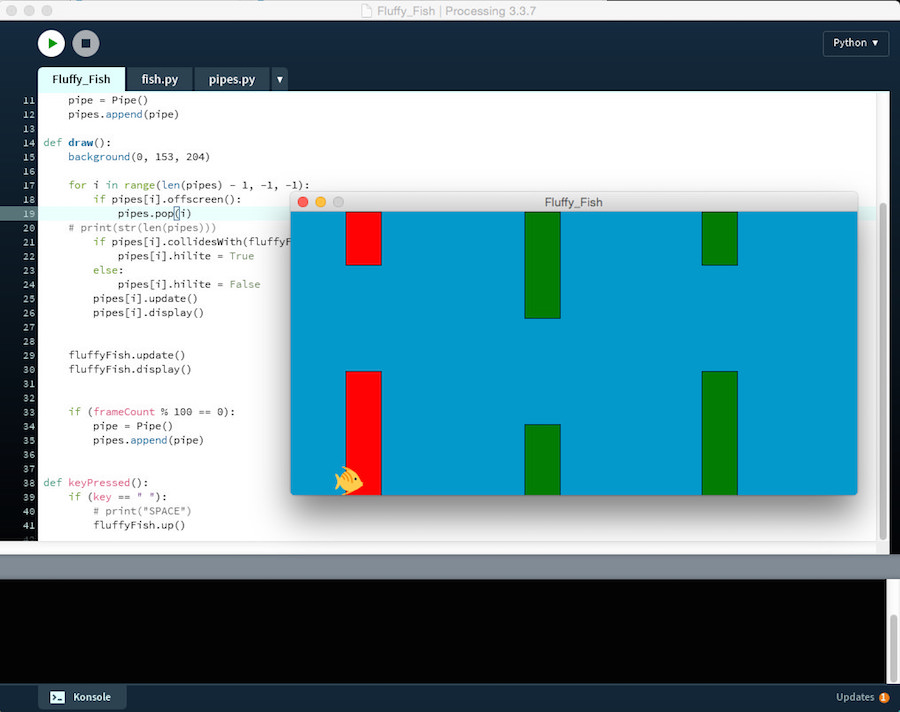

# Fluffy Fish - ein Flappy-Bird-Klon in Processing.py

In seiner [100. Coding-Challenge](http://blog.schockwellenreiter.de/2018/04/2018041902.html) (mit [Fortsetzung](http://blog.schockwellenreiter.de/2018/04/2018042601.html)) hat *Daniel Shiffman* gezeigt, wie man mit Hilfe eines [Neuronalen Netzwerkes](http://blog.schockwellenreiter.de/2018/01/2018012303.html) und [genetischen Algorithmen](https://de.wikipedia.org/wiki/Evolution%C3%A4rer_Algorithmus) seinem Rechner beibringen kann, erfolgreich [Flappy Bird](https://de.wikipedia.org/wiki/Flappy_Bird) zu spielen. Grundlage war sein eigener [Flappy-Bird-Klon](http://blog.schockwellenreiter.de/2016/08/2016081103.html), den er in P5.js, dem JavaScript-Mode von *Processing*, implementiert hatte. Natürlich reizt das zur Nachahmung in Python, doch bevor ich mich an [neuroevolutionäre Algorithmen](https://de.wikipedia.org/wiki/NeuroEvolution_of_Augmented_Topologies) (NEAT) wage, möchte ich zur Übung in der Programmiersprache meines Vertrauens doch erst einmal selber einen Flappy-Bird-Klon bauen. Damit ich nicht zu weit von *Shiffmans* Vorgaben abweiche, programmierte ich das in Processing.py, dem Python-Mode von Processing.


Um das Ganze aufzuhübschen, habe ich statt des Vogels einen Fisch gewählt, dessen Bild ich Twitters [Twemojis](https://github.com/twitter/twemoji), einer freien (MIT-Lizenz für den Code und [CC-BY 4.0](https://creativecommons.org/licenses/by/4.0/) für die Graphiken) Emoji-Implementierung entnommen habe. Ich habe den Fisch in der Bildverarbeitung meines Vertrauens gespiegelt und auf eine Größe von 32x32 Pixeln zurechtgestutzt. Natürlich heißt das Programm nun auch nicht *Flappy Bird*, sondern *Fluffy Fish*.



Zuerst habe ich im Hauptsketch die Grundlagen gelegt:

```python
from fish import Fish

fluffyFish = Fish()

def setup():
    size(640, 320)
    fluffyFish.loadPic()

def draw():
    background(0, 153, 204)

    fluffyFish.update()
    fluffyFish.display()

def keyPressed():
    if (key == " "):
        # print("SPACE")
        fluffyFish.up()
```

Wie man leicht sieht, wird ein Modul `fish.py` benötigt. Also habe ich dieses Modul erst einmal angelegt,

```python
class Fish():
    
    def __init__(self):
        self.x = 50
        self.y = 240
        self.r = 32
        
        self.gravity = 0.6
        self.lift = -12
        self.velocity = 0
        
    def loadPic(self):
        self.pic = loadImage("fisch2.png")
        
    def up(self):
        self.velocity += self.lift
        
    def display(self):
        image(self.pic, self.x, self.y)
    
    def update(self):
        self.velocity += self.gravity
        self.velocity *= 0.9
        self.y += self.velocity
        if (self.y >= height - self.r):
            self.y = height - self.r
            self.velocity = 0
        elif (self.y <= 0):
            self.y = 0
            self.velocity = 0
```

damit es importiert werden kann. Neben dem Konstruktor hat die Klasse `Fish`drei Methoden: Die Methode `loadPic()` lädt einfach nur das Bild des Fisches und die Methode `display()` zeigt den Fisch an der aktuellen x- und y-Position. In der Methode `update()` fällt der Fisch, falls der Spieler nicht eingreift, einfach nach unten. Die Geschwindigkeit wird durch eine Gravitationskonstante erhöht und durch eine leichte Reibungskonstante etwas gebremst. Bei den Werten dieser Konstanten habe ich mich an *Shiffmans* Beispiel orientiert, doch sind diese durchaus noch optimierungsfähig. Der experimentierfreudige Leser ist aufgefordert, hier selber mit anderen Werten zu spielen. Wenn der Spieler die Leertaste drückt, wird die Methode `up()` aufgerufen, die den Fisch nach oben hüpfen läßt.

Damit der Fisch dabei nicht oben oder unten über den Fensterrand hinausschießt, sorgen die sechs letzten Zeilen der `update()`- Methode dafür, daß der Bewegungsraum des Fisches oben und unten begrenzt ist.

Damit ist die eigentliche Spielmechanik implementiert. Der Fisch fällt, falls der Spieler nicht eingreift, nach unten, der Spieler kann ihn durch Betätigen der Leertaste nach oben katapultieren. Jetzt müssen dem Fisch nur noch die Säulen entgegenkommen, die er auf gar keinen Fall berühren darf. Dafür habe ich eine Datei `pipes.py` angelegt, die die Klasse `Pipe` beherbergt:

```python
class Pipe():
    
    def __init__(self):
        self.top = random(height) - 60
        if self.top < 60:
            self.top = 60
        if self.top > height - 180:
            self.top = height - 180
        self.bottom = height - self.top - 120
        # self.bottom = random(height/2)
        self.x = width
        self.w = 40
        self.speed = 2
        self.hilite = False
    
    def display(self):
        fill(0, 125, 0)
        if self.hilite:
            fill(255, 0, 0)
        rect(self.x, 0, self.w, self.top)
        rect(self.x, height - self.bottom, self.w, self.bottom)
    
    def update(self):
        self.x -= self.speed
    
    def offscreen(self):
        if (self.x < -self.w):
            return True
        else:
            return False
    
    def collidesWith(self, otherObject):
        if (otherObject.y < self.top) or (otherObject.y + otherObject.r > height - self.bottom):
            if (otherObject.x + otherObject.r > self.x) and (otherObject.x < self.x + self.w):
                return True
        else:
            return False
```

Im Gegensatz zu *Shiffman*, der die Höhe beider Säulen komplett vom Zufall abhängig machte und dadurch riskierte, daß der Abstand zwischen zwei Säulen so klein wurde, daß sein Vogel dort nicht durchfliegen konnte, hatte ich mir ein paar andere Flappy-Bird-Implementierungen angeschaut und gesehen, daß dort der Abstand zwischen den beiden Säulen immer konstant war. Daher brauchte ich nur die obere Säule per Zufall zu generieren, die untere Säule wurde einfach mit 120 Pixel Abstand zum Ende der oberen Säule konstruiert. Damit auch beide Säulen immer zu sehen sind, habe ich mit den Werten `60` und `180` Mindesthöhen festgelegt. Diese Werte habe ich experimentell herausgefunden.

Die Methode `display()` zeigt einfach die beiden Säulen an der aktuellen Position, und zwar im Normalfall in Lindgrün, falls aber der Fisch mit einer der Säulen kollidiert (`hilite = True`) in Knallrot. Die Methode `update()` bewegt die Säulen mit der Geschwindigkeit `speed` auf den Fisch zu.

Die Methode `offscreen()` ist eine Hilfsfunktion, die benötigt wird, um im Hauptprogramm die Säulen, die das Fenster links verlassn haben, auch zu löschen. Und mit der Methode `collidesWith()` wird überprüft, ob Fisch und Säule zusammenstoßen. Diese Methode kann man sicher noch optimieren, aber für die Zwecke des Spiels reicht sie völlig aus.

Natürlich ist jetzt auch das Hauptprogramm ein wenig angeschwollen. Es sieht in der Endfassung nun so aus:

```python
from fish import Fish
from pipes import Pipe

fluffyFish = Fish()
pipes = []

def setup():
    size(640, 320)
    fluffyFish.loadPic()
    pipe = Pipe()
    pipes.append(pipe)
    
def draw():
    background(0, 153, 204)
    
    for i in range(len(pipes) - 1, -1, -1):
        if pipes[i].offscreen():
            pipes.pop(i)
    # print(str(len(pipes)))
        if pipes[i].collidesWith(fluffyFish):
            pipes[i].hilite = True
        else:
            pipes[i].hilite = False
        pipes[i].update()
        pipes[i].display()

    fluffyFish.update()
    fluffyFish.display()
    
    if (frameCount % 100 == 0):
        pipe = Pipe()
        pipes.append(pipe)
    
def keyPressed():
    if (key == " "):
        # print("SPACE")
        fluffyFish.up()
```

Neben dem Fisch wird nun auch die Liste `pipes[]` initialisiert, die im `setup()` mit einer einzigen Säule gefüllt wird. Alle weiteren Säulen kommen in der `draw()`-Funktion jeweils dann hinzu, wenn der `frameCount` modulo 100 Null ergiebt, also bei jedem hundertsten Durchlauf.

Wichtig ist, daß, wenn man Elemente aus einer Liste entfernt, man diese Liste **rückwärts** durchlaufen läßt. Andernfalls werden nicht nur einzelne Elemente der Liste übersprungen, sondern man erhält auch den berüchtigten `index out of range`-Fehler. Daher wurde dies mit

```python
    for i in range(len(pipes) - 1, -1, -1):
        if pipes[i].offscreen():
            pipes.pop(i)
```

implementiert. Der erste Parameter in der `range()`-Funktion ist der Startwert, der zweite Parameter der Endwert und der dritte Parameter die Schrittlänge. Hier gilt es nun aufzupassen, denn der Endwert ist exklusive (mathematisch gesprochen wird das halboffen Intervall `[startwert, endwert[` aufgerufen). Würde man also als zweiten Parameter `0` eingeben, würde die Schleife nicht bei `0`, sondern bei `1` ende, das erste Element der Liste würde also nie abgefragt.

Anschließend wird überprüft, ob der Fisch mit einer der beiden Säulen kollidiert. Hier wird momentan nur `hilite` auf `True` oder `False` gesetzt, aber das wäre der Ort, an dem Punkte vergeben werden können oder der Fisch stirbt und damit das Spiel beendet ist.

Nun funktioniert das Spiel wie gewünscht. Wie gesagt, an den Parametern kann und muß sicher noch geschraubt werden, aber es entspricht im Großen und Ganzen der Implementierung von *Daniel Shiffman* und steht nun für weitere Experimente bereit.