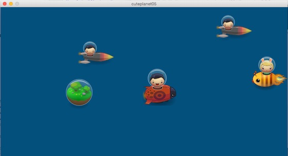

# Spieleprogrammierung mit Processing.py: Fluffy Planet (1)

Nachdem ich nun ein paar Tage mit Orks und Fraktalen herumgespielt habe, fühle ich mich gestärkt genug, um mit meinen Processing.py-Experimenten mit den niedlichen Figürchen aus dem von *Daniel Cook (Danc)* in seinem Blog *[Lost Garden][2]* unter einer [freien Lizenz][3] ([CC BY 3.0 US][4]) zu Verfügung gestellten Tileset [Planet Cute][5] fortzufahren. 

Ich möchte aus dem [bisher erlernten][6] ein kleines Spielchen entwickeln: Die süße *Octopussy* ist mit ihrem Raumschiff auf den Weg nach Hause. Dabei wird sie allerdings von den Brüdern *Rocketboy* und dem *Käferjungen* attackiert, die versuchen, sie zu rammen. Zwar hat Octopussys Raumschiff Schutzschilde, die die Karambolage abfangen, aber es sind nur fünf. Die Gegner haben keine Schutzschilde und werden nach jeder Kollision in das Weltall zurückgeworfen, aus dem sie nach einer gewissen Zeit aber wieder auftauchen. Es ist also so eine Art [Autoscooter][8] im Weltenraum

Um ihre Schutzschilde zu erneuern, muß Octopussy möglichst oft die kleinen Planeten überfliegen, denn diese laden ihre Schutzschilde bis zur maximalen Anzahl von fünf wieder auf.

Im ersten Schritt habe ich nur eine simple Spielmechanik integriert: Octopussy kann ihr Schiff mit den Pfeiltasten nach unten und oben bewegen, mit jedem Druck auf die Tasten erhöht sich ihre Geschwindigkeit, während die gegenüberliegende Taste sie dann jeweils wieder um den gleichen Betrag erniedrigt. Natürlich gibt es eine Maximalgeschwindigkeit und an den Bildrändern oben und unten wird sie rigoros auf Null gesetzt. Die Gegner kommen von links nach rechts in geraden Bahnen und Octopussy muß ihnen ausweichen, aber dennoch versuchen, die kleinen Planeten zu überfliegen.

Um dem lästigen Umstand entgegenzuwirken, daß die Tastaturbefehle nur greifen, wenn das Graphikfenster von Processing.py den Fokus besitzt, wird das Spiel erst gestartet, wenn zum ersten Mal eine Taste bewegt wurde, bis dahin bleibt es im Startzustand eingefroren.

## Quellcode

Jetzt aber der Quellcode, zuerst das Modul `spaceship.py` mit den Klassen `Spaceship` und der daraus abgeleiteten Klasse `Octopussy`:

~~~python
class Spaceship():
    
    def __init__(self, pic, posX, posY):
        self.pic = pic
        self.x = posX
        self.y = posY
        self.dx = 0
        self.dy = 0
        
    def loadPic(self):
        self.img = loadImage(self.pic)
    
    def move(self):
        self.x += self.dx
        if self.x >= width + 120:
            self.x = -120
            self.y = random(height-120)
        elif self.x < -120:
            self.x = width + 120
            self.y = random(height-120)
    
    def display(self):
        image(self.img, self.x, self.y)

class Octopussy(Spaceship):
    
    def move(self):
        self.y += self.dy
        if self.dy >= 5:
            self.dy = 5
        elif self.dy <= -5:
            self.dy = -5
        if self.y < 0:
            self.y = 0
            self.dy = 0
        if self.y > height - 120:
            self.y = height - 120
            self.dy = 0
~~~

Das dürfte für Euch, die Ihr diese Serie schon verfolgt, nichts Neues mehr sein. Die benötigten Sprites findet Ihr auch [hier][9].

Auch das Hauptprogramm birgt wenig Überraschungen:

~~~python
#Spaceship
from spaceship import Spaceship, Octopussy

octopussy = Octopussy("octopussy.png", 800, 150)
planet = Spaceship("planet.png", 500, 350)
rocketboy1 = Spaceship("rocketship.png", 300, 300)
rocketboy2 = Spaceship("rocketship.png", -300, 250)
beetle = Spaceship("beetleship.png", 200, 100)

ships = [planet, rocketboy1, rocketboy2, beetle]
fps = 30

def setup():
    size(920, 480)
    frameRate(fps)
    planet.loadPic()
    rocketboy1.loadPic()
    rocketboy2.loadPic()
    beetle.loadPic()
    octopussy.loadPic()
    rocketboy1.dx = rocketboy2.dx = beetle.dx = planet.dx= 0
    octopussy.dx = 0
    octopussy.dy = 0

def draw():
    background(0, 80, 125)
    for i in range(len(ships)):
        ships[i].move()
        ships[i].display()
    octopussy.move()
    octopussy.display()

def keyPressed():
    if keyPressed and key == CODED:
        planet.dx = 2
        rocketboy1.dx = 8
        rocketboy2.dx = 10
        beetle.dx = 6
        if keyCode == UP:
            octopussy.dy -= 1
        elif keyCode == DOWN:
            octopussy.dy += 1
~~~

Im zweiten Teil dieses Tutorials möchte ich dann eine Kollisionserkennung implementieren und zeigen, wie man die Schutzschilde ab- und wieder aufbaut und die gegnerischen Raumschiffe ins All schleudert. *Still digging!*

[2]: http://www.lostgarden.com/search/label/free%20game%20graphics
[3]: http://www.lostgarden.com/2007/03/lost-garden-license.html
[4]: http://creativecommons.org/licenses/by/3.0/us/
[5]: http://www.lostgarden.com/2007/05/dancs-miraculously-flexible-game.html
[6]: http://py.kantel-chaos-team.de/cuteplanet/
[7]: http://py.kantel-chaos-team.de/
[8]: https://de.wikipedia.org/wiki/Autoscooter
[9]: http://py.kantel-chaos-team.de/cuteplanet/