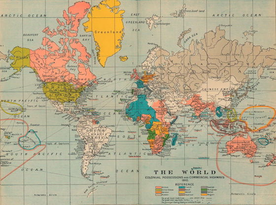

# Einen Globus basteln

Wenn ich -- wie im [vorletzten Beispiel](http://py.kantel-chaos-team.de/kugel/) -- eine dreidimensionale Kugel programmiere, denke ich immer an den Leuchtglobus, der vor Jahrzehnten auf meinem Kinderzimmerschreibtisch stand und dem ich die Liebe zur Geographie verdanke. Es war ein Leuchtglobus, ausgeschaltet zeigte er eine topographische Weltkarte und eingeschaltet wurde er bunt und zeigte jeden Staat in einer anderen Farbe. So etwas ähnliches, nämlich einen Globus mit wechselnden Darstellungen möchte ich nun in Processing.py programmieren.

Um das zu erreichen, müssen Texturen über eine Kugel gelegt werden und das ist bei den einfachen, mit `sphere()` erzeugten Kugeln leider nicht möglich, wir müssen uns schon eine eigene Kugel aus [Vertices](https://de.wikipedia.org/wiki/Vertex#Computergrafik) (Eckpunkten) selber basteln. Wir entwickeln sie in der Funktion `makeSphere()` aus einzelnen, aus Rechtecken zusammengesetzten Streifen in Polarkoordinaten, die dann mit Hilfe der Sinus- und Cosinus-Funktion in kartesische Koordinaten umgerechnet werden.

Um die einzelnen Rechteckstücke zu bekommen, müssen wir dem `beginShape()` den Modus `QUAD_STRIP` mitgeben. Eine anderer möglicher Modus wäre `TRIANGLE_STRIP`, Ihr könnt das ja mal testweise in den Sketch unten einsetzen, statt aus Streifen wird dann die Kugel aus Dreiecken zusammengesetzt.

## Quellcode Globe 01

~~~python
a = 0.0

def setup():
    global globe
    size(400, 400, P3D)
    globe = makeSphere(150, 10)

def draw():
    global globe, a
    background(0)
    translate(width/2, height/2)
    with pushMatrix():
        # rotateX(radians(0))
        rotateY(a)
        a += 0.01
        shape(globe)

def makeSphere(r, step):
    s = createShape()
    s.beginShape(QUAD_STRIP)
    s.noFill()
    s.stroke(255)
    s.strokeWeight(1)
    i = 0
    while i < 180:
        sini = sin(radians(i))
        cosi = cos(radians(i))
        sinip = sin(radians(i + step))
        cosip = cos(radians(i + step))
        j = 0
        while j <= 360:
            sinj = sin(radians(j))
            cosj = cos(radians(j))
            s.vertex(r*cosj*sini, r*-cosi, r*sinj*sini)
            s.vertex(r*cosj*sinip, r*-cosip, r*sinj*sinip)
            j += step
        i += step
    s.endShape()
    return s
~~~

Der nächste Schritt wäre dann, dieser Kugel eine Farbe zu verpassen. Ich habe dies in dem Sketch unten mit `fill(135, 206, 250)` versucht, das ein leichtes Blau erzeugt. Außerdem habe ich mit `pointLight(255, 255, 255, -250, -250, 500)` eine dramatische Beleuchtung gesetzt, die aber in den weiteren Fassungen wieder durch das einfache `lights()`, das für eine gleichmäßige Ausleuchtung sorgt, wieder ersetzt wird.

Doch das alleine reicht nicht aus. Wenn Ihr den Sketch so laufen laßt, werdet Ihr feststellen, daß die Kugel irgendwie »eckig« wirkt. Die Übergänge zwischen den einzelnen Quads sind deutlich zu erkennen. Und außerdem scheint sie sich an dem 0°- respektive 360°-Linie zu überlappen oder eine kleine Lücke zu klaffen. Um dies zu ändern, benutzt man in der Computergraphik den [Normalenvektor](https://de.wikipedia.org/wiki/Normalenvektor) zur Glättung von Kanten und auch in Processing ist dies mit der Methode `normal()` schon vorgesehen. Die Normalen sind Vektoren, die senkrecht auf einem Punk stehen und diese müssen vor dem `vertex()`-Aufruf gesetzt werden.

## Quellcode Globe 02

~~~python
a = 0.0

def setup():
    global globe
    size(400, 400, P3D)
    globe = makeSphere(150, 5)

def draw():
    global globe, a
    background(0)
    translate(width/2, height/2)
    pointLight(255, 255, 255, -250, -250, 500)
    # lights()
    with pushMatrix():
        rotateX(radians(-30))
        rotateY(a)
        a += 0.01
        shape(globe)

def makeSphere(r, step):
    s = createShape()
    s.beginShape(QUAD_STRIP)
    s.fill(135, 206, 250)
    s.noStroke()
    s.strokeWeight(1)
    i = 0
    while i < 180:
        sini = sin(radians(i))
        cosi = cos(radians(i))
        sinip = sin(radians(i + step))
        cosip = cos(radians(i + step))
        j = 0
        while j <= 360:
            sinj = sin(radians(j))
            cosj = cos(radians(j))
            s.normal(cosj*sini, -cosi, sinj*sini)
            s.vertex(r*cosj*sini, r*-cosi, r*sinj*sini)
            s.normal(cosj*sinip, -cosip, sinj*sinip)
            s.vertex(r*cosj*sinip, r*-cosip, r*sinj*sinip)
            j += step
        i += step
    s.endShape()
    return s
~~~

Nun ist aber alles schön glatt und es können aus den Kugeln Globen werden. Für den ersten Globus habe ich mir eine der legendären [Blue-Marble-Karten der NASA](https://de.wikipedia.org/wiki/Blue_Marble#Die_Blue-Marble-Serie_der_NASA) in der Größe von 640x320 Pixeln von den Seiten der Wikipedia gezogen ([Download-Link](https://commons.wikimedia.org/wiki/File:Equirectangular-projection.jpg)) und sie `bluemarble01.jpg` genannt. Diese Bilder sind in einer [Projektion](https://de.wikipedia.org/wiki/Plattkarte#Quadratische_Plattkarte), die noch am ehesten das Aufziehen auf eine Kugel erlauben.

Die Funktion `vertex()` kann nun nicht nur in der Form

~~~python
vertex(x, y, z)
~~~

sondern auch in der Form

~~~python
vertext(x, y, z, u, v)
~~~

aufgerufen werden, wobei dann `u` und `v` die horizontalen respektive vertikalen Koordinaten für das Texture-Mapping sind. Und so wird aus der Kugel tatsächlich ein Globus mit einem Abbild unseres wunderschönen blauen Planeten.

## Quellcode Globe 03

~~~python
a = 0.0

def setup():
    global globe
    size(400, 400, P3D)
    world = loadImage("bluemarble01.jpg")
    globe = makeSphere(150, 5, world)
    frameRate(30)

def draw():
    global globe, a
    background(0)
    translate(width/2, height/2)
    lights()
    with pushMatrix():
        rotateX(radians(-25))
        rotateY(a)
        a += 0.01
        shape(globe)

def makeSphere(r, step, tex):
    s = createShape()
    s.beginShape(QUAD_STRIP)
    s.texture(tex)
    s.noStroke()
    i = 0
    while i < 180:
        sini = sin(radians(i))
        cosi = cos(radians(i))
        sinip = sin(radians(i + step))
        cosip = cos(radians(i + step))
        j = 0
        while j <= 360:
            sinj = sin(radians(j))
            cosj = cos(radians(j))
            s.normal(cosj*sini, -cosi, sinj*sini)
            s.vertex(r*cosj*sini, r*-cosi, r*sinj*sini,
                     tex.width-j*tex.width/360.0, i*tex.height/180.0)
            s.normal(cosj*sinip, -cosip, sinj*sinip)
            s.vertex(r*cosj*sinip, r*-cosip, r*sinj*sinip,
                     tex.width-j*tex.width/360.0, (i+step)*tex.height/180.0)
            j += step
        i += step
    s.endShape()
    return s
~~~

Zum Schluß bin ich dann übermütig geworden und habe eine Weltkarte aus dem Jahre 1910 genommen und sie als Texture auf den Globus gelegt. Wie Ihr leicht erkennen könnt, eignet sich die in dieser Karte verwendete, sehr eurozentrische Projektion nicht besonders, um sie gerecht auf eine Kugel zu projizieren (Grönland besitzt in etwa die Fläche von Afrika). Um wenigstens den Schein zu wahren, habe ich die Kugel mit `rotateX(radians(5))` so geneigt, daß der Effekt in den Hintergrund tritt. Nordeuropa, Grönland und Kanada verschwinden dadurch ein bißchen hinter dem Horizont und durch den Bauch der Kugel erscheint dann auch Afrika wieder größer.

## Quellcode Globe 04

~~~python
a = 0.0

def setup():
    global globe
    size(400, 400, P3D)
    world = loadImage("world-map-1910.jpg")
    globe = makeSphere(150, 5, world)
    frameRate(30)

def draw():
    global globe, a
    background(0)
    translate(width/2, height/2)
    lights()
    with pushMatrix():
        rotateX(radians(5))
        rotateY(a)
        a += 0.01
        shape(globe)

def makeSphere(r, step, tex):
    s = createShape()
    s.beginShape(QUAD_STRIP)
    s.texture(tex)
    s.noStroke()
    i = 0
    while i < 180:
        sini = sin(radians(i))
        cosi = cos(radians(i))
        sinip = sin(radians(i + step))
        cosip = cos(radians(i + step))
        j = 0
        while j <= 360:
            sinj = sin(radians(j))
            cosj = cos(radians(j))
            s.normal(cosj*sini, -cosi, sinj*sini)
            s.vertex(r*cosj*sini, r*-cosi, r*sinj*sini,
                     tex.width-j*tex.width/360.0, i*tex.height/180.0)
            s.normal(cosj*sinip, -cosip, sinj*sinip)
            s.vertex(r*cosj*sinip, r*-cosip, r*sinj*sinip,
                     tex.width-j*tex.width/360.0, (i+step)*tex.height/180.0)
            j += step
        i += step
    s.endShape()
    return s
~~~

## Credits

<iframe style="width:120px;height:240px;" marginwidth="0" marginheight="0" scrolling="no" frameborder="0" src="//ws-eu.amazon-adsystem.com/widgets/q?ServiceVersion=20070822&OneJS=1&Operation=GetAdHtml&MarketPlace=DE&source=ss&ref=as_ss_li_til&ad_type=product_link&tracking_id=derschockwell-21&marketplace=amazon&region=DE&placement=1782166726&asins=1782166726&linkId=02fc59486df63a42ce28c733c072db28&show_border=true&link_opens_in_new_window=true"></iframe>

Noch mehr mit Globen stellt *Nikolaus Gradwohl* in seinem lesenswerten, von kreativen Ideen geradezu überlaufenden Buch »[Processing 2: Creative Coding Hotshot][amazon]« auf den Seiten 163 bis 215 an. Er läßt sie in Neonfarben leuchten und projiziert die Daten von Logfiles darauf. Ich habe in Teilen von seinem Code und seinen Ideen profitiert, ihn verändert und ihn von Processings Java-Mode in den Python-Mode überführt.

## Literatur

- Nikolaus Gradwohl: *[Processing 2: Creative Coding Hotshot][amazon]*, Birmingham *(Packt Publishing)* 2013

[amazon]: https://www.amazon.de/Processing-2-Creative-Coding-Hotshot/dp/1782166726/ref=as_li_ss_tl?ie=UTF8&qid=1487608123&sr=8-1&keywords=processing+2+creative+coding+hotshot&linkCode=ll1&tag=derschockwell-21&linkId=d122ec0e5725e0177a740b9d07e524b4