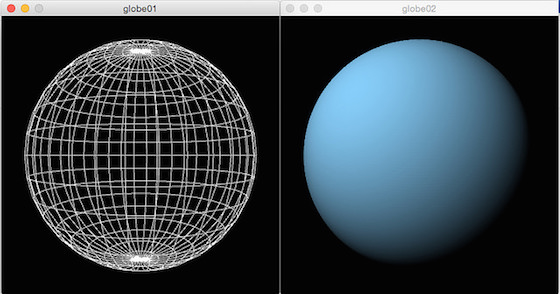

# Einen Globus basteln

## Quellcode Globe 01

~~~python
a = 0.0

def setup():
    global globe
    size(400, 400, P3D)
    globe = makeSphere(150, 10)

def draw():
    global globe, a
    background(0)
    translate(width/2, height/2)
    with pushMatrix():
        # rotateX(radians(0))
        rotateY(a)
        a += 0.01
        shape(globe)

def makeSphere(r, step):
    s = createShape()
    s.beginShape(QUAD_STRIP)
    s.noFill()
    s.stroke(255)
    s.strokeWeight(1)
    i = 0
    while i < 180:
        sini = sin(radians(i))
        cosi = cos(radians(i))
        sinip = sin(radians(i + step))
        cosip = cos(radians(i + step))
        j = 0
        while j <= 360:
            sinj = sin(radians(j))
            cosj = cos(radians(j))
            s.vertex(r*cosj*sini, r*-cosi, r*sinj*sini)
            s.vertex(r*cosj*sinip, r*-cosip, r*sinj*sinip)
            j += step
        i += step
    s.endShape()
    return s
~~~

## Quellcode Globe 02

~~~python
a = 0.0

def setup():
    global globe
    size(400, 400, P3D)
    globe = makeSphere(150, 1)

def draw():
    global globe, a
    background(0)
    translate(width/2, height/2)
    pointLight(255, 255, 255, -250, -250, 500)
    # lights()
    with pushMatrix():
        rotateX(radians(-30))
        rotateY(a)
        a += 0.01
        shape(globe)

def makeSphere(r, step):
    s = createShape()
    s.beginShape(QUAD_STRIP)
    s.fill(135,206,250)
    s.noStroke()
    s.strokeWeight(1)
    i = 0
    while i < 180:
        sini = sin(radians(i))
        cosi = cos(radians(i))
        sinip = sin(radians(i + step))
        cosip = cos(radians(i + step))
        j = 0
        while j <= 360:
            sinj = sin(radians(j))
            cosj = cos(radians(j))
            s.vertex(r*cosj*sini, r*-cosi, r*sinj*sini)
            s.vertex(r*cosj*sinip, r*-cosip, r*sinj*sinip)
            j += step
        i += step
    s.endShape()
    return s
~~~

## Quellcode Globe 03

~~~python
a = 0.0

def setup():
    global globe
    size(400, 400, P3D)
    world = loadImage("bluemarble01.jpg")
    globe = makeSphere(150, 1, world)
    frameRate(30)

def draw():
    global globe, a
    background(0)
    translate(width/2, height/2)
    lights()
    with pushMatrix():
        rotateX(radians(-25))
        rotateY(a)
        a += 0.01
        shape(globe)

def makeSphere(r, step, tex):
    s = createShape()
    s.beginShape(QUAD_STRIP)
    s.texture(tex)
    s.noStroke()
    i = 0
    while i < 180:
        sini = sin(radians(i))
        cosi = cos(radians(i))
        sinip = sin(radians(i + step))
        cosip = cos(radians(i + step))
        j = 0
        while j <= 360:
            sinj = sin(radians(j))
            cosj = cos(radians(j))
            s.vertex(r*cosj*sini, r*-cosi, r*sinj*sini,
                     tex.width-j*tex.width/360.0, i*tex.height/180.0)
            s.vertex(r*cosj*sinip, r*-cosip, r*sinj*sinip,
                     tex.width-j*tex.width/360.0, (i+step)*tex.height/180.0)
            j += step
        i += step
    s.endShape()
    return s
~~~

## Quellcode Globe 04

~~~python
a = 0.0

def setup():
    global globe
    size(400, 400, P3D)
    world = loadImage("world-map-1910.jpg")
    globe = makeSphere(150, 1, world)
    frameRate(30)

def draw():
    global globe, a
    background(0)
    translate(width/2, height/2)
    lights()
    with pushMatrix():
        rotateX(radians(5))
        rotateY(a)
        a += 0.01
        shape(globe)

def makeSphere(r, step, tex):
    s = createShape()
    s.beginShape(QUAD_STRIP)
    s.texture(tex)
    s.noStroke()
    i = 0
    while i < 180:
        sini = sin(radians(i))
        cosi = cos(radians(i))
        sinip = sin(radians(i + step))
        cosip = cos(radians(i + step))
        j = 0
        while j <= 360:
            sinj = sin(radians(j))
            cosj = cos(radians(j))
            s.vertex(r*cosj*sini, r*-cosi, r*sinj*sini,
                     tex.width-j*tex.width/360.0, i*tex.height/180.0)
            s.vertex(r*cosj*sinip, r*-cosip, r*sinj*sinip,
                     tex.width-j*tex.width/360.0, (i+step)*tex.height/180.0)
            j += step
        i += step
    s.endShape()
    return s
~~~
