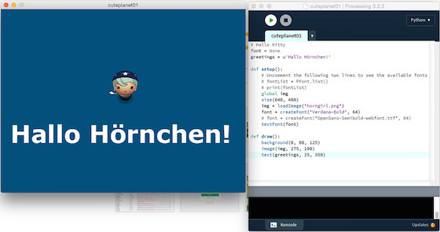

# Hallo Hörnchen – Hallo Kitty revisited

Nachdem ich am Wochenende mal wieder an [PyGame][1] verzweifelt bin (aus irgendwelchen Gründen funktionierte die Tastaturabfrage nicht), habe ich beschlossen, mich doch eher [Processing.py][2] zuzuwenden, dem Python-Mode für [Processing][3]. Ziel sollte es sein, mein vierteiliges PyGame-Tutorial vom Mai dieses Jahres in Processing.py zu implementieren. Erfreulich war, daß ich mir den [ersten Teil][4] gleich schenken konnte, denn

~~~{python}
def setup():
    size(640, 480)

def draw():
    background(0, 80, 125)
~~~

erzeugt bereits ein leeres, blaues Fenster. Also habe ich gleich den [zweiten Teil][5] in Angriff genommen und das *»Horn Girl«* aus dem von *Daniel Cook (Danc)* in seinem Blog *[Lost Garden][6]* unter einer [freien Lizenz][7] ([CC BY 3.0 US][8]) zu Verfügung gestellten Tileset [Planet Cute][9] in das Fenster gezaubert:

Zur Vorbereitung habe ich erst einmal das Bild der jungen Dame auf das Editorfenster der Processing-IDE geschoben. Falls noch nicht vorhanden, erzeugt Processing dann automatisch ein `data`-Verzeichnis und legt das Bild (aber auch Schriften oder andere Dateien) darin ab. Processing und damit auch Processing.py finden alles in diesem Verzeichnis ohne daß eine genauere Pfadangabe nötig ist. Und so ist auch das fertige Programm von erfrischender Kürze:

~~~{python}
font = None
greetings = u'Hallo Hörnchen!'

def setup():
    global img
    size(640, 480)
    img = loadImage("horngirl.png")
    font = createFont("Verdana-Bold", 64)
    textFont(font)

def draw():
    background(0, 80, 125)
    image(img, 275, 100)
    text(greetings, 25, 350)
~~~

Mehr ist nicht nötig, um obigen Screenshot zu bekommen. Vergleiche ich diese 14 Zeilen mit den 34 Zeilen der PyGame-Version, dann frage ich mich schon, warum ich nicht früher zu Processing.py gewechselt bin[^1].

[^1]: Ich will ehrlich sein: Die »Geschwätzigkeit« von PyGame ist nicht nur dem hohen Alter der Bibliothek geschuldet, sie erlaubt eine große Vielseitigkeit und erspart dem Programmierer dann wieder bei komplizierten Dingen viel Schreibarbeit. So ist zum Beispiel die eingebaute `Sprite`-Klasse und die Kollisionsprüfung etwas, was ich in Processing.py von Hand programmieren muß.

An der zweiten Zeile kann man es erkennen: Processing.py basiert auf [Jython][10] und ist damit kompatibel zu Python 2.7.5, aber nicht zu Python 3. Daher muß man Unicode-Strings (zum Beispiel mit deutschen Umlauten) explizit mit dem vorangestellten `u` markieren, sonst bekommt man seltsame Zeichen im Programmfenster angezeigt.

Processing(.py) kann mit Fonts im TrueType- (`.ttf`), OpenType- (`.otf`) und in einem eigenen Bitmap-Format, genannt VLW, umgehen. Natürlich findet es alle auf dem eigenen Rechner installierte Fonts, mit

~~~{python}
fontList = PFont.list()
print(fontList)
~~~

kann man sich diese in der Konsole anzeigen lassen. Wenn man den Sketch allerdings weitergeben will, ist es sinnvoll, einen Font mitzugeben[^2], da man nicht sicher sein kann, ob der gewählte Systemfont auf dem anderen Rechner vorhanden ist. Dafür schiebt man eine entsprechende Font-Datei einfach ebenfalls auf das Editorfenster der IDE, damit sie dem `data`-Ordner hinzugefügt wird. Ich habe testweise mal die Datei `OpenSans-Semibold-webfont.ttf` installiert, die entsprechende Zeile im Programm hieße dann:

[^2]: Natürlich sollte man sicherstellen, daß man diese Fonts auch verwerten darf, aber im Netz findet man viele Fonts zur freien Verwendung. Gute Anlaufstellen dafür sind zum Beispiel [Google Fonts][11], die [(Open) Font Library][12] oder [The League of Moveable Type][13].

~~~{python}
font = createFont("OpenSans-Semibold-webfont.ttf", 64)
~~~

Der zweite Parameter der Funktion `createFont()` benennt die gewünschte Größe des Fonts. Mehr ist zu diesem ersten Sketch in Processing.py eigentlich nciht zu sagen. Im nächsten Schritt wird es darum gehen, die junge Dame über das Fenster zu bewegen. Nach meinen Erfahrungen mit PyGame werde ich sie nicht nur mit der Maus, sondern auch mit der Tastatur steuern. *Still digging!*

[1]: http://cognitiones.kantel-chaos-team.de/multimedia/spieleprogrammierung/pygame.html
[2]: http://cognitiones.kantel-chaos-team.de/programmierung/creativecoding/processing/processingpy.html
[3]: http://cognitiones.kantel-chaos-team.de/programmierung/creativecoding/processing/processing.html
[4]: http://blog.schockwellenreiter.de/2016/05/2016052001.html
[5]: http://blog.schockwellenreiter.de/2016/05/2016052003.html
[6]: http://www.lostgarden.com/search/label/free%20game%20graphics
[7]: http://www.lostgarden.com/2007/03/lost-garden-license.html
[8]: http://creativecommons.org/licenses/by/3.0/us/
[9]: http://www.lostgarden.com/2007/05/dancs-miraculously-flexible-game.html
[10]: http://cognitiones.kantel-chaos-team.de/programmierung/python/jython.html
[11]: https://fonts.google.com/
[12]: https://fontlibrary.org/de/homepage
[13]: https://www.theleagueofmoveabletype.com/