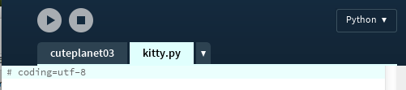

# Klasse Kitty!

Nach den [ersten][1] [beiden][2] Teilen meiner kleinen Erkundung von [Processing.py][3], dem [Python][4]-Mode von [Processing][5] und vermutlich die einzige, derzeit aktiv gepflegte Alternative zu [PyGame][6], möchte ich erst einmal ein wenig aufräumen und daran erinnern, daß Akteure eines Computerspiels programmiertechnisch am besten in Klassen aufgehoben sind. Daher habe ich auch *Kitty* eine eigene Klasse spendiert:

~~~{python}
# coding=utf-8

class Kitty(object):
    def __init__(self, tempX, tempY):
        self.x = tempX
        self.y = tempY
        self.radiusX = 50  # Bildbreite/2
        self.radiusY = 85  # Bildhöhe/2
        
    def loadPic(self):
        self.img = loadImage("horngirl.png")
    
    def move(self):
        self.x = mouseX - self.radiusX
        self.y = mouseY - self.radiusY
        
    def display(self):
        image(self.img, self.x, self.y)
~~~

Klassen kann man in Processing der Übersicht halber in separaten Dateien unterbringen, die in der IDE jeweils einen eigenen Reiter bekommen (siehe Screenshot).

Hierbei ist jedoch zu beachten, daß im Gegensatz zu Processing und [P5.js][7] (jeweils aus anderen Gründen) die Klasse nicht automatisch dem Quelltext der Applikation bei der Ausführung hinzugefügt wird. Sie ist wenn sie nicht im Quelltext der Applikation steht -- wie in Python üblich -- ein Modul und muß gesondert mit

~~~{python}
from kitty import Kitty
~~~

importiert werden. Und da sie ein reines Python2- (oder genauer [Jython][8]-) Modul ist, sollte man auch nicht vergessen `# coding=utf-8` in die erste Zeile der Datei schreiben, denn sonst bekommt man Probleme mit dem *ö* im Kommentar (*Bildhöhe*). 😜

Den Konventionen folgend, habe ich dem Objekt *Kitty* neben der eigentlichen Initialisierung drei Funktionen spendiert, nämlich `loadPic()`, `move()` und `display()`. Die beiden letzeren hätte man auch in einer Funktion zusammenfassen können (beispielsweise `update()` wie bei PyGame üblich), aber da die Philosophie sein sollte, jeder Aktivität eine eigene Funktion zu spendieren, bin ich der Konvention gefolgt[^1].

[^1]: Ein bei Processing.py durchgehend zu beobachtender Konventionsbruch macht mich allerdings wuschig. Während die [PEP8][8] für Variablennamen die Trennung durch Unterstriche empfiehlt (z.B. `mouse_x`) folgen die Programmierer der Beispielprogramme durchgehend der Java-Konvention des *camelCase* (`mouseX`). Ich habe mich erst einmal entschlossen, ebenfalls den *camelCase* zu nutzen, ob ich dabei aber bleiben werde, weiß ich noch nicht.

Ansonsten ist zu dem Programm nichts weiter zu sagen. Es zeigt einfach eine *Kitty* die der Maus hinterherrennt. Und dadruch, daß fast die gesamte Logik in die Klasse `Kitty` ausgelagert wurde, ist das Hauptprogramm von erfrischender Kürze:

~~~{python}
from kitty import Kitty

kitty = Kitty(275, 100)

def setup():
    size(640, 480)
    kitty.loadPic()

def draw():
    background(0, 80, 125)
    kitty.move()
    kitty.display()
~~~

So muß es ja auch sein.

*Kitty* alias *»Horn Girl«* stammt wieder aus dem von *Daniel Cook (Danc)* in seinem Blog *[Lost Garden][9]* unter einer [freien Lizenz][10] ([CC BY 3.0 US][11]) zu Verfügung gestellten Tileset [Planet Cute][12].

[1]: hallohoernchen.md
[2]: movingkitty.md
[3]: http://cognitiones.kantel-chaos-team.de/programmierung/creativecoding/processing/processingpy.html
[4]: http://cognitiones.kantel-chaos-team.de/programmierung/python/python.html
[5]: http://cognitiones.kantel-chaos-team.de/programmierung/creativecoding/processing/processing.html
[6]: http://cognitiones.kantel-chaos-team.de/multimedia/spieleprogrammierung/pygame.html
[7]: http://cognitiones.kantel-chaos-team.de/programmierung/creativecoding/processing/p5js.html
[8]: https://www.python.org/dev/peps/pep-0008/#descriptive-naming-styles
[9]: http://www.lostgarden.com/search/label/free%20game%20graphics
[10]: http://www.lostgarden.com/2007/03/lost-garden-license.html
[11]: http://creativecommons.org/licenses/by/3.0/us/
[12]: http://www.lostgarden.com/2007/05/dancs-miraculously-flexible-game.html
