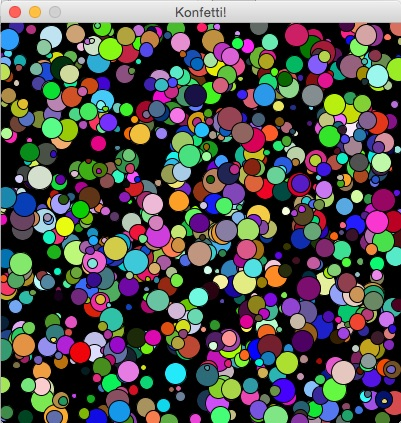

# Spaß mit Kreisen: Konfetti

Der folgende kleine Sketch ist nicht mehr als eine Fingerübung. Er soll Euch zeigen, wie man schon mit wenigen Zeilen Code und Processings-Zufallsfunktion `random()` viele bunte Konfetti-Schnipsel auf den Bildschirm zaubern kann:

Und hier der Quellcode des Sketches in Processing.py:

~~~python
def setup():
    size(400, 400)
    frame.setTitle("Konfetti!")
    background(0)

def draw():
    x = random(width)
    y = random(height)
    dia = random(5, 25)
    r = random(255)
    g = random(255)
    b = random(255)
    fill(r, g, b)
    ellipse(x, y, dia, dia)
~~~

Für so wenige Programmzeilen ist das Ergebnis doch recht ansprechend, oder?