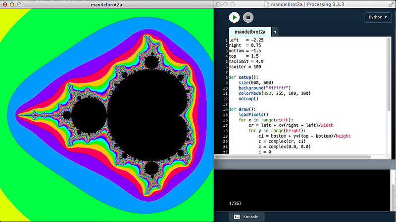

# Pixel-Array versus set()

Will man einzelne Pixel im Ausgabefenster oder in einem Bild manipulieren, bietet Processing(.py) grundsätzlich zwei Möglichkeiten: Zum einen kann man mit

~~~python
set(x, y, color)
~~~

direkt einen Farbpunkt an eine bestimmte Position `x, y` setzen, oder aber man lädt mit

~~~python
loadPixels()
~~~

das gesamte Ausgabe-Fenster in ein eindimensionales Pixel-Array, um dann mit

~~~python
pixels[x + y*width] = color()
~~~

die Farbe an die gewünschte Stelle `x, y` zu setzen. Anschließend darf man nicht vergessen, mit

~~~python
updatePixels()
~~~

Processing dazu zu bewegen, die geänderten Pixel auch anzuzeigen. Dadurch, daß das Pixel-Array eindimensional ist und so die gewünschte Position mit `x + y*width` angesprochen werden muß, ist die erste Version (für die es übrigens auch noch ein entsprechendes `get(x, y)` gibt, mit dem man die Farbe an der gewünschten Stelle abfragen kann) einfacher handzuhaben, aber die [Reference zu Processing](https://processing.org/reference/set_.html) zu bedenken:

>Setting the color of a single pixel with set(x, y) is easy, but not as fast as putting the data directly into pixels[].

Das gilt aber nicht immer, mit dem im [letzten Abschnitt gebackenen Mandelbrötchen](mandelbrot.md) habe ich die Probe aufs Exempel gemacht. Zwei nahezu identische Programme habe ich gegeneinander antreten lassen.

## Programm 1: Mandelbrot-Menge mit set()

~~~python
left   = -2.25
right  = 0.75
bottom = -1.5
top    = 1.5
maxlimit = 4.0
maxiter = 100

def setup():
    size(600, 600)
    background("#ffffff")
    colorMode(HSB, 255, 100, 100)
    noLoop()

def draw():
    for x in range(width):
        cr = left + x*(right - left)/width
        for y in range(height):
            ci = bottom + y*(top - bottom)/height
            c = complex(cr, ci)
            z = complex(0.0, 0.0)
            i = 0
            for i in range(maxiter):
                if abs(z) > maxlimit:
                    break
                z = (z**2) + c
                if i == (maxiter - 1):
                    set(x, y, color(0, 0, 0))
                else:
                    set(x, y, color((i*48)%255, 100, 100))
    println(millis())
~~~

## Programm 2: Mandelbrot-Menge mit Pixel-Array

~~~python
left   = -2.25
right  = 0.75
bottom = -1.5
top    = 1.5
maxlimit = 4.0
maxiter = 100

def setup():
    size(600, 600)
    background("#ffffff")
    colorMode(HSB, 255, 100, 100)
    noLoop()

def draw():
    loadPixels()
    for x in range(width):
        cr = left + x*(right - left)/width
        for y in range(height):
            ci = bottom + y*(top - bottom)/height
            c = complex(cr, ci)
            z = complex(0.0, 0.0)
            i = 0
            for i in range(maxiter):
                if abs(z) > maxlimit:
                    break
                z = (z**2) + c
                if i == (maxiter - 1):
                    pixels[x + y*width] = color(0, 0, 0)
                else:
                    pixels[x + y*width] = color((i*48)%255, 100, 100)
    updatePixels()
    println(millis())
~~~

Und -- Überraschung! -- das Programm mit `set()` war fast immer geringfügig schneller als das Programm mit den Pixel-Arrays. Auf meinem betagten MacBook Pro benötigte das erste Programm rund 15.000 bis 16.000 Millisekunden, während das zweite Programm um die 18.000 Millisekunden benötigte. Der Unterschied ist nicht groß, aber dennoch bemerkenswert. Es liegt zum einen sicher daran, daß die benötigte Zeit für die Berechnung des Apfelmännchens im Vergleich zu der benötigten Zeit, dieses zu zeichnen, riesig ist. Zum anderen wird die `draw()`-Schleife ja auch nur einmal durchlaufen und so kann das Pixel-Array seine Fähigkeit der schnellen Pixelmanipulation nicht richtig ausspielen.

Die Erkenntnis daraus: Es kann sich durchaus lohnen, auch mal das Handbuch zu hinterfragen. 😈

