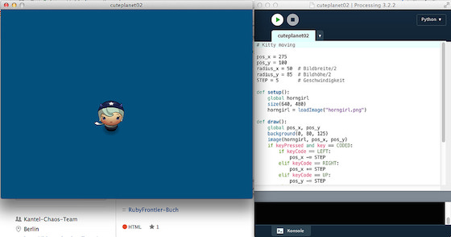

# Moving Kitty

Im zweiten Teil meiner kleinen Erkundung von [Processing.py][1], dem [Python][2]-Mode von [Processing][3], möchte ich die im [ersten Teil][4] auf den Monitor gezauberte *Kitty* mithilfe der Pfeiltasten der Tastatur sich über den Monitor bewegen lassen.

In Processing gehören die Pfeiltasten wie einige andere auch zu den `coded keys`, weil sie sich nicht einem Buchstaben zuordnen lassen und haben daher einen speziellen Namen. Die Pfeiltastten heißen `LEFT`, `RIGHT`, `UP` und `DOWN`, andere `coded keys` sind zum Beispiel `ALT`, `CONTROL` oder `SHIFT`. Diese müssen in Processing wie in Processing.py gesondert abgefragt werden, und zwar so:

~~~{python}
    if keyPressed and key == CODED:
        if keyCode == LEFT:
~~~

während die »normalen« Tasten so abgefragt werden können:

~~~{python}
    if keyPressed:
        if key == 'b' or key == 'B':
~~~

Das ist eigentlich alles, was man wissen muß, um das Progrämmchen zu verstehen. Wenn Kitty den linken Rand des Fensters erreicht hat, taucht sie am rechten Rand wieder auf und umgekehrt. Genauso habe ich mit oben unten verfahren. Die Variabeln `radius_x` und `radius_y` sorgen dafür, daß *Kitty* vollständig vom Bildschirm verschwunden ist, bevor sie am anderen Ende wieder auftaucht (ich mag keine halben Kittys 😜 ) und mit `STEP` bestimmt Ihr die Geschwindigkeit, mit der Kitty über den Bildschirm wuselt. Hier der vollständige Quellcode zum nachprogrammieren:

~~~{python}
pos_x = 275
pos_y = 100
radius_x = 50  # Bildbreite/2
radius_y = 85  # Bildhöhe/2
STEP = 5       # Geschwindigkeit

def setup():
    global horngirl
    size(640, 480)
    horngirl = loadImage("horngirl.png")

def draw():
    global pos_x, pos_y
    background(0, 80, 125)
    image(horngirl, pos_x, pos_y)
    if keyPressed and key == CODED:
        if keyCode == LEFT:
            pos_x -= STEP
        elif keyCode == RIGHT:
            pos_x += STEP
        elif keyCode == UP:
            pos_y -= STEP
        elif keyCode == DOWN:
            pos_y += STEP
        if pos_x > width + radius_x:
            pos_x = -radius_x
        elif pos_x < -2*radius_x:
            pos_x = width + radius_x
        if pos_y < -2*radius_y:
            pos_y = height
        elif pos_y > height:
            pos_y = -radius_y
~~~

*Kitty* alias *»Horn Girl«* stammt wieder aus dem von *Daniel Cook (Danc)* in seinem Blog *[Lost Garden][6]* unter einer [freien Lizenz][7] ([CC BY 3.0 US][8]) zu Verfügung gestellten Tileset [Planet Cute][9]. Aber Ihr könnt natürlich auch jedes andere Bild nehmen, das gerade auf Eurer Festplatte herumliegt.

[1]: http://cognitiones.kantel-chaos-team.de/programmierung/creativecoding/processing/processingpy.html
[2]: http://cognitiones.kantel-chaos-team.de/programmierung/python/python.html
[3]: http://cognitiones.kantel-chaos-team.de/programmierung/creativecoding/processing/processing.html
[4]: hallohoernchen.md
[6]: http://www.lostgarden.com/search/label/free%20game%20graphics
[7]: http://www.lostgarden.com/2007/03/lost-garden-license.html
[8]: http://creativecommons.org/licenses/by/3.0/us/
[9]: http://www.lostgarden.com/2007/05/dancs-miraculously-flexible-game.html

