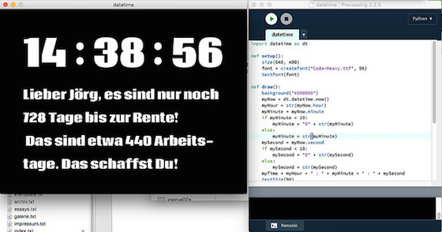

# Spaß mit Processing.py: Rentenuhr

Was für Gründe sprechen eigentlich dafür, Processing.py statt des »normalen« Processings zu nutzen? Nun, zum einen können es persönliche Gründe sein: Ich mag zum Beispiel keine Programmiersprachen, die Blöcke mit geschweiften Klammern (`{}`) trennen und vermeide sie, wo es nur geht. Zum anderen komme ich aus der [Pascal][3]-Ecke (Pascal und Algol 68 waren meine ersten Programmiersprachen überhaupt) und mag daher Programme, die so etwas sind wie »ausführbarer Pseudocode«. Aber der wichtigste Grund ist, Processing.py ist eben nicht nur Processing, sondern auch Python. Und Python kommt *»batteries included«*, es bringt eine große Anzahl von Standard-Bibliotheken mit, die man auch in Processing.py nutzen kann. Ich möchte das am Beispiel des Python-Moduls `datetime` einmal zeigen:

Als erstes habe ich den freien ([Open Font Licence][6]) Font [Coda Heavy][5] von Googles Seiten heruntergeladen, entpackt und ihn dem Skript zugänglich gemacht, indem ich die `.ttf`-Datei einfach auf das IDE-Fenster geschoben habe. Processing legt dann automatisch im Skriptordner ein `data`-Vertzeichnis an und kopiert die Datei -- wie auch alle Bild- oder Audio-Datein dorthin. Die Skripte finden sie dann, zum Beispiel mit

~~~python
	font = createFont("Coda-Heavy.ttf", 96)
~~~

ohne eine spezielle Pfadangabe. Der zweite Parameter gibt die maximale Fontgröße vor. Am Anfang des Skriptes habe ich mit

~~~python
	import datetime as dt
~~~

das Python-Modul `datetime` aus der Standardbibliothek geladen und dann als erstes eine einfache Uhr gebastelt

~~~python
	myNow = dt.datetime.now()
	myHour = str(myNow.hour)
	myMinute = str(myMinute)
	mySecond = str(mySecond)
~~~

und dann die `datetime`-Objekte in Strings verwandelt. Im eigentlichen Programm habe ich sie sogar noch ein wenig aufgehübscht und den einstelligen Sekunden und Minute eine führende Null verpaßt. Das könnt Ihr weiter unten im kompletten Quellcode nachlesen.

Jetzt kommt aber der eigentliche Gag: Mit den `datetime`-Objekten kann man nämlich rechnen! Und da ich am 31. Dezember 2018 in Rente gehe, wollte ich wissen, wieviele Tage ich noch ausharren muß

~~~python
    rente = dt.date(2018, 12, 31)
    heute = dt.date.today()
    differenz = rente - heute
    myDays = str(differenz)
    myDays = myDays[:3]
    workingDays = round(float(myDays)/7.0, 0) * 5
    workingDays = str(int(workingDays - 80))
~~~

und wieviele Tage davon Arbeitstage sind. Dazu habe ich einfach die Anzahl der Tage durch sieben geteilt und mit fünf multipliziert, was grob die Anzahl der Werktage ergibt. Und da ich noch 20 Tage Resturlaub in dieses Jahr mitgeschleppt habe und mir pro Jahr auch noch je 30 Tage regulärer Urlaub zusteht, habe ich diese 80 Tage auch noch abgezogen. Die Feiertage habe ich nicht berücksichtigt, mir reicht diese grobe Schätzung.

Da die Differenz zweier `datetime`-Objekte wieder ein `datetime`-Objekt ist, muß die Umwandlung in einen *String* explizit mittels *Typecasting* vorgenommen werden und bei der Division durch sieben ist zu beachten, daß das Processing.py zugrundelegende Jython ein Python 2.7 ist und deshalb bei einer Integer-Division alle Nachkommastellen abschneidet (zum Beispiel ergibt `13/7` eine `1`, dieses -- dokumentierte -- Verhalten wurde in Python 3 geändert). Um das zu vermeiden, habe ich durch `7.0` geteilt und so eine Float-Division erzwungen und durch ein anschließendes Runden das Ergebnis doch wieder in eine Integer-Zahl verwandelt.

Jetzt das komplette Skript zum Nachlesen und Nachprogrammieren:

~~~python
import datetime as dt

def setup():
    size(640, 480)
    font = createFont("Coda-Heavy.ttf", 96)
    textFont(font)

def draw():
    background("#000000")
    myNow = dt.datetime.now()
    myHour = str(myNow.hour)
    myMinute = myNow.minute
    if myMinute < 10:
        myMinute = "0" + str(myMinute)
    else:
        myMinute = str(myMinute)
    mySecond = myNow.second
    if mySecond < 10:
        mySecond = "0" + str(mySecond)
    else:
        mySecond = str(mySecond)
    myTime = myHour + " : " + myMinute + " : " + mySecond
    textSize(96)
    text(myTime, 60, 150)
    rente = dt.date(2018, 12, 31)
    heute = dt.date.today()
    differenz = rente - heute
    myDays = str(differenz)
    myDays = myDays[:3]
    workingDays = round(float(myDays)/7.0, 0) * 5
    workingDays = str(int(workingDays - 80))
    myText = u"Lieber Jörg, es sind nur noch " + myDays + \
    u" Tage bis zur Rente!\n Das sind etwa " + \
    workingDays + " Arbeits- tage. Das schaffst Du!"
    textSize(32)
    text(myText, 60, 200, 540, 300)
~~~

Wegen des Umlautes in meinem Vornamen, mußte ich mit `u"…"` die Umwandlung des Strings in einen UTF-8-String erzwingen (auch das ist Python 3 nicht mehr nötig), aber wie der obige Screenshot zeigt, wird dann der Umlaut auch brav angezeigt.

Die Funktion `text()` kann man in Processing einmal mit drei und einmal mit fünf Parametern aufrufen. Im ersten Fall übergibt man den Text und die x- und y-Koordinaten der linken Grundlinie des Textes. Im zweiten Fall kommen noch die Weite und die Höhe der Textbox hinzu. Damit erreicht man, daß ein langer String an den Textbox-Grenzen umgebrochen wird und der Text nicht aus dem Fenster herausläuft. Die Parameter habe ich durch einfaches Ausprobieren bekommen.

[3]: http://cognitiones.kantel-chaos-team.de/programmierung/pascal.html
[5]: https://fonts.google.com/specimen/Coda
[6]: http://scripts.sil.org/cms/scripts/page.php?site_id=nrsi&id=OFL_web
