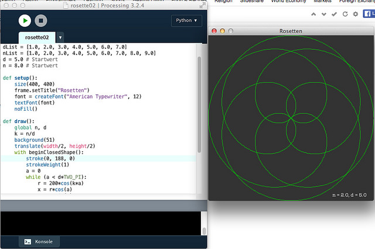

# Rosetten-Kurven

Die [Rosetten-Kurven](https://de.wikipedia.org/wiki/Rosette_(Kurve)), die *Daniel Shiffman* so munter in seiner [55. Code-Challenge](http://blog.schockwellenreiter.de/2017/02/2017021003.html) in [P5.js](http://cognitiones.kantel-chaos-team.de/programmierung/creativecoding/processing/p5js.html), dem JavaScript-Mode von Processing, programmiert hatte, haben mir keine Ruhe gelassen. Ich wollte so etwas auch unbedingt in Processing.py implementieren.

Der Anfang war einfach. Ich bin stur *Daniel Shiffman* gefolgt und hatte innerhalb kürzester Zeit seinen Code in einen Python-Code verwandelt:

~~~python
d = 8.0
n = 5.0

def setup():
    size(400, 400)
    frame.setTitle("Rosetten")
    noFill()

def draw():
    k = n/d
    background(51)
    translate(width/2, height/2)
    with beginClosedShape():
        stroke(255)
        strokeWeight(1)
        a = 0
        while (a < d*TWO_PI):
            r = 200*cos(k*a)
            x = r*cos(a)
            y = r*sin(a)
            vertex(x, y)
            a += 0.02
~~~

Die einzigen Änderungen sind einmal, daß ich das `with`-[Statement](with.md) ausgenutzt und daß ich statt der `for`-Schleife eine `while`-Schleife verwendet habe, da in Pythons `for`-Schleifen das Inkrement oder Dekrement ganzzahlig sein müssen.

Doch bin ich zwar durchaus ein Freund des Sketchens, aber jedesmal, wenn ich eine andere Rosette haben will, den Quelltext zu ändern, war dann doch nicht mein Ding. Daher habe ich dann die `d`- und `n`- Werte, wie sie in dem oben und im Literaturverzeichnis verlinkten Wikipedia-Artikel genannt sind, in eine Liste gepackt

~~~python
dList = [1.0, 2.0, 3.0, 4.0, 5.0, 6.0, 7.0]
nList = [1.0, 2.0, 3.0, 4.0, 5.0, 6.0, 7.0, 8.0, 9.0]
~~~

und aus dieser Liste dann bei jedem Mausklick zufällig je einen Wert für `d` und `n` auswählen lassen:

~~~python
def mousePressed():
    global n, d
    n = r.choice(nList)
    d = r.choice(dList)
~~~

Pythons [Random-Bibliothek](https://docs.python.org/2/library/random.html) stellt dafür dankenswerterweise den Befehl `choice()` zur Verfügung, der diese Listenmanipulation sehr einfach macht.

Der Rest war dann nur noch Kosmetik: In nostalgischer Erinnerung an meine frühen Computerjahre habe ich die Kurve in Grün zeichnen lassen und damit ich weiß, welche Werte der Zufallszahlengenerator mir für `d` und `n` ausgewählt hat, habe ich diese unten rechts ausgeben lassen.

## Der Quelltext

Für die, die diesen Sketch nachprogrammieren wollen, hier nun auch der vollständige Quelltext meines Experiments:

~~~python
import random as r

font = None
dList = [1.0, 2.0, 3.0, 4.0, 5.0, 6.0, 7.0]
nList = [1.0, 2.0, 3.0, 4.0, 5.0, 6.0, 7.0, 8.0, 9.0]
d = 5.0 # Startwert
n = 8.0 # Startwert

def setup():
    size(400, 400)
    frame.setTitle("Rosetten")
    font = createFont("American Typewriter", 12)
    textFont(font)
    noFill()

def draw():
    global n, d
    k = n/d
    background(51)
    translate(width/2, height/2)
    with beginClosedShape():
        stroke(0, 188, 0)
        strokeWeight(1)
        a = 0
        while (a < d*TWO_PI):
            r = 200*cos(k*a)
            x = r*cos(a)
            y = r*sin(a)
            vertex(x, y)
            a += 0.02
        text("n = " + str(n) + ", d = " + str(d), 100, 190)

def mousePressed():
    global n, d
    n = r.choice(nList)
    d = r.choice(dList)
~~~

## Caveat

Als Font für die Textausgabe habe ich mir den Systemfont *»American Typewriter«* ausgesucht (ich mag ihn einfach). Dieser steht sicher nicht auf allen Betriebssystemen zur Verfügung, Ihr müßt Euch daher gegebenenfalls einen anderen Systemfont aussuchen.

## Literatur

- [Rosettenkurven](https://de.wikipedia.org/wiki/Rosette_(Kurve)) in der deutschsprachigen Wikipedia