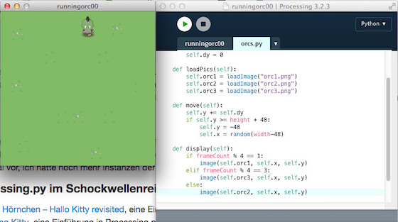

# Running Orc mit Processing.py

Nach den vier Tutorials mit den Figuren aus *Cute Planet* zu Processing.py, dem Python-Mode für Processing, wurde mir das allmählich zu niedlich und ich beschloß, endlich mal wieder einen Ork durch das Bildschirmfenster wuseln zu lassen.

Dafür habe ich erst einmal die Klasse `orc()` definiert und nach der Initialisierung -- wie in den anderen Tutorials auch schon -- die Methoden `loadPics()`, `move()` und `display()` implementiert:

~~~{python}
class Orc():

    def __init__(self, posX, posY):
        self.x = posX
        self.y = posY
        self.dy = 0

    def loadPics(self):
        self.orc1 = loadImage("orc1.png")
        self.orc2 = loadImage("orc2.png")
        self.orc3 = loadImage("orc3.png")
    
    def move(self):
        self.y += self.dy
        if self.y >= height + 48:
            self.y = -48
            self.x = random(width-48)
    
    def display(self):
        if frameCount % 4 == 1:
            image(self.orc1, self.x, self.y)
        elif frameCount % 4 == 3:
            image(self.orc3, self.x, self.y)
        else:
            image(self.orc2, self.x, self.y)
~~~

Die Figur des *Orcs* hatte ich ja schon häufiger verwendet, die Zeichnungen stammen aus dem freien ([CC-BY-SA][8]) [OpenPixels][9]-Projekt von [Silveira Neto][10]. Der Einfachheit halber und damit Ihr das nachprogrammieren könnt, habe ich die drei animierten Bildchen hier noch einmal eingebunden:

  

Das Hauptskript war dank des Klasse `Orc()` dann wieder von erfrischender Kürze:

~~~{python}
from orcs import Orc

orc = Orc(160, -48)

def setup():
    global bg
    bg = loadImage("field.png")
    frameRate(15)
    size(320, 320)
    orc.loadPics()
    orc.dy = 5
    
def draw():
    background(bg)
    orc.move()
    orc.display()
~~~

In `setup()` habe ich zuerst das Hintergrundbild eingebunden (es ist ebenfalls aus dem oben erwähnten OpenPixels-Projekt -- Ihr könnt alternativ aber auch einfach einen grünen Hintergrund zeichnen) und dann den Orc angewiesen, seine Bilder zu laden. Und wie in den vorhergegangenen Tutorials auch wird in `draw()` zuerst der Hintergrund gezeichnet, dann der Ork bewegt und schließlich an seiner neuen Position angezeigt. *That's all!*

Wie es damit weitergeht, weiß ich noch nicht so genau. Zum einen habe ich die Idee, ganz viele Instanzen der Orks über das Spielfeld zu bewegem, eine andere Idee ist es, den Ork mittels der Pfeiltasten in alle vier Himmelsrichtungen laufen und auf Hindernisse reagieren zu lassen. Schauen wir mal …

[8]: https://github.com/silveira/openpixels/blob/master/LICENSE
[9]: https://github.com/silveira/openpixels
[10]: http://silveiraneto.net/tag/pixelart/