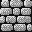
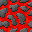
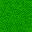

# Ein Ork im Labyrinth

Nachdem ich im letzten Abschnitt erfolgreich eine Kollisionserkennung implementiert hatte, wollte ich nun das alles auf die Spitze treiben und den kleinen Ork durch ein Labyrinth (genauer: einen Irrgarten) bewegen. Und natürlich sollte er nur dort laufen können, wo es keine Hindernisse gab. Im Endeffekt sollte das Ergebnis so aussehen:

Die einzelnen Klassen im zweiten Reiter (`sprites2.py`) blieben gegenüber dem letzten Abschnitt nahezu unverändert. Lediglich die Klasse `Tree` habe ich durch die Klasse `Lava` ersetzt und der Klasse `Wall` ein anderes Kachelbild verpaßt, was aber beides nur kosmetische Gründe hat. Hier die notwendigen Kacheln:

  

Das Labyrinth habe ich in [Tiled][2] entworfen und die Bilder dafür wieder dem freien ([CC BY 3.0][3]) Angband-Tilesets von [dieser Site][4] entnommen.

Die größten Änderungen gab es im Hauptprogramm. Zu den üblichen Vorbelegungen kam ein zweidimensionales Array `obstacles` hinzu. Dies habe ich mir zurechtgebastelt, in dem ich in *Tiled* das Tileset als CSV exportiert habe und dann in dem [Text-Editor meines Vertrauens][5] mit *Suchen und Ersetzen* die Zahlen ein wenig vereinfacht hatte:

~~~python
obstacles = [[9,9,9,9,9,9,9,9,0,9],
             [9,0,0,0,9,0,0,0,0,9],
             [9,9,0,0,0,0,0,0,0,9],
             [8,9,9,9,0,0,9,9,9,9],
             [9,9,0,0,0,0,0,0,0,9],
             [9,0,0,0,0,0,0,0,0,9],
             [9,0,9,9,9,0,0,9,9,9],
             [9,0,9,0,0,0,0,0,9,8],
             [9,9,9,9,0,9,0,0,9,8],
             [8,8,8,9,0,9,9,9,9,8]]
~~~

Wenn Ihr das mit dem Screenshot oben vergleicht, vermutet Ihr sicher sehr schnell, daß die 9 für ein Mauerstück und die 8 für Lava steht, während Null einfach der Fußboden ist. Dann habe ich den Ork und zwei leere Listen, die Mauer und Lava aufnehmen sollen, initialisiert:

~~~python
orc = Orc(8*tilesize, 0)
wall = []
lava = []
~~~

Die `setup()`-Funktion sieht nun so aus:

~~~python
def setup():
    global bg
    bg = loadImage("ground0.png")
    loadObstaclesData()
    for i in range(len(wall)):
        wall[i].loadPics()
    for i in range(len(lava)):
        lava[i].loadPics()
    frameRate(30)
    size(320, 320)
    orc.loadPics()
    orc.dx = 2
    orc.dy = 2
~~~

Sie ruft die Funktion `loadObstaclesData()` auf, die für die Belegung der beiden Listen `wall` und `lava` zuständig ist

~~~python
def loadObstaclesData():
    for y in range(10):
        for x in range(10):
            if obstacles[y][x] == 9:
                wall.append(Wall(x*tilesize, y*tilesize))
            elif obstacles[y][x] == 8:
                lava.append(Lava(x*tilesize, y*tilesize))
~~~

und lädt anschließend die entsprechenden Bilder für die Hindernisse.

In der `draw()`-Funktion wird erst das Hintergrundbild geladen, das nur aus einer grünen Grasfläche belegt und dann werden die einzelnen *Obstacles* eingezeichnet:

~~~python
def draw():
    background(bg)
    for i in range(len(wall)):
        wall[i].display()
    for i in range(len(lava)):
        lava[i].display()
    orc.move()
    for i in range(len(wall)):
        if orc.checkCollision(wall[i]):
            if orc.dir == 0:
                orc.x -= orc.dx
            elif orc.dir == 1:
                orc.y -= orc.dy
            elif orc.dir == 2:
                orc.x += orc.dx
            elif orc.dir == 3:
                orc.y += orc.dy
            orc.image1 = orc.image2                            
    orc.display()
~~~

Die Bewegung des Orcs wurde aus dem letzten Tutorial unverändert übernommen. Da der Ork niemals mit einem Lava-Feld kollidieren kann (er trifft immer vorher auf eine Mauer) reichte es, die Kollisionsüberprüfung auf die Mauerteile zu beschränken.

Damit ist das Prinzip erklärt, doch es geht noch einfacher. Denn man kann sich das Neuzeichnen der einzelnen Hindernisse bei jedem Durchlauf natürlich ersparen, wenn man sie in dem Hintergrundbild mit aufgenommen hat. Also habe ich das Hintergrundbild mit allen Mauern und dem Lava aus *Tiled* exportiert und als Hintergrund geladen. Dann sieht die Funktion `setup()` so aus:

~~~python
def setup():
    global bg
    bg = loadImage("ground.png")
    loadObstaclesData()
    frameRate(30)
    size(320, 320)
    orc.loadPics()
    orc.dx = 2
    orc.dy = 2
~~~

Statt `ground0.png` heißt das Hintergrundbild nun nur noch `ground.png` und enthält nicht nur den Rasen, sondern das gesamte Labyrinth. Auch die `draw()`-Funktion ist um vier Zeilen kürzer geworden:

~~~python
def draw():
    background(bg)
    orc.move()
    for i in range(len(wall)):
        if orc.checkCollision(wall[i]):
            if orc.dir == 0:
                orc.x -= orc.dx
            elif orc.dir == 1:
                orc.y -= orc.dy
            elif orc.dir == 2:
                orc.x += orc.dx
            elif orc.dir == 3:
                orc.y += orc.dy
            orc.image1 = orc.image2                            
    orc.display()
~~~

Man erspart sich so die `laodPics()` wie auch die `display()`-Aufrufe der *Obstacle Sprites*, was auch einiges an Rechenzeit spart.

Zum Abschluß das vollständige Programm. Zuerst das Paket `sprite2.py`, das ich in einem separaten Tab untergebracht habe:

~~~python
tw = 32
th = 32
tileSize = 32

class Sprite(object):

    def __init__(self, posX, posY):
        self.x = posX
        self.y = posY
        self.dir = 1
        self.dx = 0
        self.dy = 0
    
    def checkCollision(self, otherSprite):
        if (self.x < otherSprite.x + tw and otherSprite.x < self.x + tw
            and self.y < otherSprite.y + th and otherSprite.y < self.y + th):
            return True
        else:
            return False

class Orc(Sprite):

    def loadPics(self):
        self.orcrt1 = loadImage("orcrt1.gif")
        self.orcrt2 = loadImage("orcrt2.gif")
        self.orcfr1 = loadImage("orcfr1.gif")
        self.orcfr2 = loadImage("orcfr2.gif")
        self.orclf1 = loadImage("orclf1.gif")
        self.orclf2 = loadImage("orclf2.gif")
        self.orcbk1 = loadImage("orcbk1.gif")
        self.orcbk2 = loadImage("orcbk2.gif")
        
    def move(self):
        if self.dir == 0:
            if self.x >= width - tileSize:
                self.x = width - tileSize
                self.image1 = self.orcrt2
                self.image2 = self.orcrt2
            else:
                self.x += self.dx
                self.image1 = self.orcrt1
                self.image2 = self.orcrt2
        elif self.dir == 1:
            if self.y >= height - tileSize:
                self.y = height - tileSize
                self.image1 = self.orcfr2
                self.image2 = self.orcfr2
            else:
                self.y += self.dy
                self.image1 = self.orcfr1
                self.image2 = self.orcfr2
        elif self.dir == 2:
            if self.x <= 0:
                self.x = 0
                self.image1 = self.orclf2
                self.image2 = self.orclf2
            else:
                self.x -= self.dx
                self.image1 = self.orclf1
                self.image2 = self.orclf2
        elif self.dir == 3:
            if self.y <= 0:
                self.y = 0
                self.image1 = self.orcbk2
                self.image2 = self.orcbk2
            else:
                self.y -= self.dy
                self.image1 = self.orcbk1
                self.image2 = self.orcbk2
                
    def display(self):
        if frameCount % 8 >= 4:
            image(self.image1, self.x, self.y)
        else:
            image(self.image2, self.x, self.y)
            
class Wall(Sprite):
    
    def loadPics(self):
        self.pic = loadImage("wall2.png")
        
    def display(self):
        image(self.pic, self.x, self.y)

class Lava(Sprite):
    
    def loadPics(self):
        self.pic = loadImage("lava.png")
        
    def display(self):
        image(self.pic, self.x, self.y)
~~~

Es hat jetzt schon einiges an Länge angenommen, dafür ist aber das Hauptprogramm immer noch recht kurz:

~~~python
from sprite2 import Orc, Wall, Lava
tilesize = 32

obstacles = [[9,9,9,9,9,9,9,9,0,9],
             [9,0,0,0,9,0,0,0,0,9],
             [9,9,0,0,0,0,0,0,0,9],
             [8,9,9,9,0,0,9,9,9,9],
             [9,9,0,0,0,0,0,0,0,9],
             [9,0,0,0,0,0,0,0,0,9],
             [9,0,9,9,9,0,0,9,9,9],
             [9,0,9,0,0,0,0,0,9,8],
             [9,9,9,9,0,9,0,0,9,8],
             [8,8,8,9,0,9,9,9,9,8]]

orc = Orc(8*tilesize, 0)
wall = []
lava = []

def setup():
    global bg
    bg = loadImage("ground.png")
    loadObstaclesData()
    frameRate(30)
    size(320, 320)
    orc.loadPics()
    orc.dx = 2
    orc.dy = 2
    
def draw():
    background(bg)
    orc.move()
    for i in range(len(wall)):
        if orc.checkCollision(wall[i]):
            if orc.dir == 0:
                orc.x -= orc.dx
            elif orc.dir == 1:
                orc.y -= orc.dy
            elif orc.dir == 2:
                orc.x += orc.dx
            elif orc.dir == 3:
                orc.y += orc.dy
            orc.image1 = orc.image2
    orc.display()
    
def keyPressed():
    if keyPressed and key == CODED:
        if keyCode == RIGHT:
            orc.dir = 0
        elif keyCode == DOWN:
            orc.dir = 1
        elif keyCode == LEFT:
            orc.dir = 2
        elif keyCode == UP:
            orc.dir = 3
            
def loadObstaclesData():
    for y in range(10):
        for x in range(10):
            if obstacles[y][x] == 9:
                wall.append(Wall(x*tilesize, y*tilesize))
            elif obstacles[y][x] == 8:
                lava.append(Lava(x*tilesize, y*tilesize))
~~~

Wenn Ihr das Programm laufen laßt, werdet Ihr feststellen, daß ich kurz vor dem Ausgang unten eine kleine Gemeinheit eingebaut habe und es gar nicht so einfach ist, den Ork dorthin zu lotsen. Er will partout 32 Pixel breit sein und macht sich nicht schmaler, daher muß man die Drehung nach unten genau abpassen. Aber es ist nicht unmöglich, ich habe es probiert und geschafft. 😛

Die Bilder des Orks stammen aus der ebenfalls freien ([CC BY 3.0][6]) [Sprite-Sammlung von Philipp Lenssen][7] (über 700 animierte Avatare in der klassischen Größe von 32x32 Pixeln) und Ihr könnt sie in [diesem Tutorial][15] finden.

Alle Quelltexte und Bilder gibt es übrigens auch immer aktuell im [GitHub-Repo][8] zu dieser kleinen Tutorial-Reihe.

[2]: http://cognitiones.kantel-chaos-team.de/multimedia/spieleprogrammierung/tiled.html
[3]: https://creativecommons.org/licenses/by/3.0/
[4]: http://pousse.rapiere.free.fr/tome/
[5]: http://cognitiones.kantel-chaos-team.de/produktivitaet/textmate.html
[6]: https://creativecommons.org/licenses/by/3.0/
[7]: http://blogoscoped.com/archive/2006-08-08-n51.html
[8]: https://github.com/kantel/processingpy
