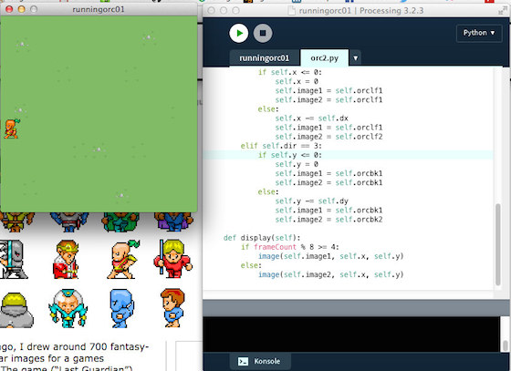

# Running Orc in vier Richtungen

Heute möchte ich meine kleine Einführung in Processing.py, dem Python-Mode für Processing, damit fortsetzen, daß ich einen kleinen Ork unter Benutzerführung und mit Hilfe der Pfeiltasten in allen vier Himmelsrichtungen über die Spielwiese wuseln lasse. Die Grundlagen hatte ich dafür ja schon im [hier][4]  gelegt, der Unterschied aber ist, daß der kleine Ork sich tatsächlich bewegt und auch in alle Richtungen dreht. Dafür brauchte ich erst einmal diese acht Bildchen des kleinen Monsters:

       

Im Gegensatz zu dem Ork aus dem letzten Tutorial stammen diese Bildchen (bis auf die Hintergrund-Wiese) nicht aus dem [OpenPixels][6]-Fundus von [Silveira Neto][7], sondern aus der ebenfalls freien ([CC BY 3.0][8]) [Sprite-Sammlung][9] von *Philipp Lenssen* (über 700 animierte Avatare in der klassischen Größe von 32x32 Pixeln). Und die Animationen setzen sich auch nur aus je zwei verschiedenen Bildchen zusammen, was zum einen Code und Speicher spart und zum anderen den Charakteren einen besonders wuseligen Eindruck verschafft, der an die Frühzeit der Computerspiele erinnert (aus der die Bilder auch stammen). 😇 Man benötigt so für jede der vier Himmelsrichtungen nur zwei Bilder, was dann zusammen obige acht Bildchen ergibt.

Als erstes habe ich dem Ork natürlich wieder eine eigene Klasse spendiert (in dem Tab/der Datei `orc2.py`), deren Quellcode nun schon bedeutend umfangreicher geworden ist:

~~~{python}
class Orc():

    def __init__(self, posX, posY):
        self.x = posX
        self.y = posY
        self.dir = 1
        self.dx = 0
        self.dy = 0

    def loadPics(self):
        self.orcrt1 = loadImage("orcrt1.gif")
        self.orcrt2 = loadImage("orcrt2.gif")
        self.orcfr1 = loadImage("orcfr1.gif")
        self.orcfr2 = loadImage("orcfr2.gif")
        self.orclf1 = loadImage("orclf1.gif")
        self.orclf2 = loadImage("orclf2.gif")
        self.orcbk1 = loadImage("orcbk1.gif")
        self.orcbk2 = loadImage("orcbk2.gif")
    
    def move(self):
        if self.dir == 0:
            if self.x >= width - 32:
                self.x = width - 32
                self.image1 = self.orcrt2
                self.image2 = self.orcrt2
            else:
                self.x += self.dx
                self.image1 = self.orcrt1
                self.image2 = self.orcrt2
        elif self.dir == 1:
            if self.y >= height - 32:
                self.y = height - 32
                self.image1 = self.orcfr2
                self.image2 = self.orcfr2
            else:
                self.y += self.dy
                self.image1 = self.orcfr1
                self.image2 = self.orcfr2
        elif self.dir == 2:
            if self.x <= 0:
                self.x = 0
                self.image1 = self.orclf2
                self.image2 = self.orclf2
            else:
                self.x -= self.dx
                self.image1 = self.orclf1
                self.image2 = self.orclf2
        elif self.dir == 3:
            if self.y <= 0:
                self.y = 0
                self.image1 = self.orcbk2
                self.image2 = self.orcbk2
            else:
                self.y -= self.dy
                self.image1 = self.orcbk1
                self.image2 = self.orcbk2
    
    def display(self):
        if frameCount % 8 >= 4:
            image(self.image1, self.x, self.y)
        else:
            image(self.image2, self.x, self.y)
~~~

Im Konstruktor werden nur die Startposition festgelegt und ein paar Variblen initialisiert und mit Default-Werten versehen. Danach werden die acht Bildchen geladen. Die eigentliche Logik liegt in der Funktion `move()`: Erreicht der Orc einer der Fensterränder, bleibt er einfach stehen. Der visuelle Eindruck wird dadurch erreicht, daß die beiden zu swappenden Bilder identisch sind. Ansonsten bewegt er sich in der angesagten Richtung weiter, indem `dx` oder `dy` zu der akutellen Position addiert oder abgezogen werden.

Die Funktion `display()` ist dann für die Darstellung zuständig: Ist der `frameCount % 8 >= 4`, dann wird das erste Bild gezeichnet, ansonsten das zweite Bild. Durch diesen Modulo-Trick bin ich noch einmal daran vorbeigekommen, einen Timer implementieren zu müssen, aber irgendwann wird kein Weg mehr daran vorbeiführen.

Das Hauptprogramm ist immer noch vergleichsweise kurz und übersichtlich geraten:

~~~{python}
from orc2 import Orc

orc = Orc(160, -32)

def setup():
    global bg
    bg = loadImage("field.png")
    frameRate(30)
    size(320, 320)
    orc.loadPics()
    orc.dx = 2
    orc.dy = 2
    
def draw():
    background(bg)
    orc.move()
    orc.display()
    
def keyPressed():
    if keyPressed and key == CODED:
        if keyCode == RIGHT:
            orc.dir = 0
        elif keyCode == DOWN:
            orc.dir = 1
        elif keyCode == LEFT:
            orc.dir = 2
        elif keyCode == UP:
            orc.dir = 3
~~~

Die Klasse `Orc` wird importiert und initialisiert. Danach wird das Hintergrundbild geladen (Ihr könnt auch hier wieder alternativ einfach einen grünen Hintergrund zeichnen) und die Fenstergröße festgelegt. Dann wird die Funktion `orc.loadPics()` aufgerufen und die horizontale und vertikale Geschwindigkeit auf je zwei Pixel pro Frame-Durchlauf bestimmt.

Die `draw()`-Routine ist immer noch einfach: Erst wird der Hintergrund gezeichnet, dann der Ork bewegt und danach ebenfalls in das Fenster gezeichnet.

Neu ist die Funktion `keyPressed()`, die während des gesamten Programmablaufs die Tastatur überwacht. Sie überprüft, welche der Pfeiltasten gedrückt wurden und weist ihnen dementsrpechend eine Himmelsrichtung zu. Per Konvention fängt man normalerweise im Osten an (`orc.dir = 0`), um dann über den Süden (`orc.dir = 1`) und den Westen (`orc.dir = 2`) zum Norden (`orc.dir = 3`) zu gelangen.

Beachtet bitte, daß die Abfrage der Tastatur erst greift, wenn das Programmfenster den Fokus besitzt. Leider passiert das bei Processing.py nicht automatisch beim Programmstart, Ihr müßt einmal mit der Maus in das Fenster klicken.

Das ist alles. Erfreut Euch auch an dem kleinen Gag, den *Philipp Lenssen* seinem Ork verpaßt hat: Das Haarschwänzchen wedelt fröhlich hin und her.

[4]: movingkitty.md
[6]: https://github.com/silveira/openpixels
[7]: http://silveiraneto.net/tag/pixelart/
[8]: https://creativecommons.org/licenses/by/3.0/
[9]: http://blogoscoped.com/archive/2006-08-08-n51.html
