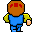

# Der autonome Ork

Nun sind Orks, wie ich sie in den letzten Beiträgen über den Bildschirm habe wuseln lassen, normalerweise nicht die Figuren, mit denen der Spieler spielt. Er leitet seinen Held, einen *Hero* durch die Spielewelt. Orks und andere Monster hingegen sind meist computergesteuerte Spielfiguren, sogenannte NPCs *(Non Player Characters)*. Daher habe ich in dieser Folge einen spielbaren Helden eingebaut und der Ork bewegt sich mehr oder weniger autonom durch das Spielfenster.

Dafür habe ich dann erst einmal die Klasse Hero in den zweiten Tab (den ich dieses Mal `sprite3.py` genannt habe) eingefügt:

~~~python
class Hero(Sprite):

    def loadPics(self):
        self.mnv1rt1 = loadImage("mnv1rt1.gif")
        self.mnv1rt2 = loadImage("mnv1rt2.gif")
        self.mnv1fr1 = loadImage("mnv1fr1.gif")
        self.mnv1fr2 = loadImage("mnv1fr2.gif")
        self.mnv1lf1 = loadImage("mnv1lf1.gif")
        self.mnv1lf2 = loadImage("mnv1lf2.gif")
        self.mnv1bk1 = loadImage("mnv1bk1.gif")
        self.mnv1bk2 = loadImage("mnv1bk2.gif")
    
    def move(self):
        if self.dir == 0:
            if self.x >= width - tileSize:
                self.x = width - tileSize
                self.image1 = self.mnv1rt2
                self.image2 = self.mnv1rt2
            else:
                self.x += self.dx
                self.image1 = self.mnv1rt1
                self.image2 = self.mnv1rt2
        elif self.dir == 1:
            if self.y >= height - tileSize:
                self.y = height - tileSize
                self.image1 = self.mnv1fr2
                self.image2 = self.mnv1fr2
            else:
                self.y += self.dy
                self.image1 = self.mnv1fr1
                self.image2 = self.mnv1fr2
        elif self.dir == 2:
            if self.x <= 0:
                self.x = 0
                self.image1 = self.mnv1lf2
                self.image2 = self.mnv1lf2
            else:
                self.x -= self.dx
                self.image1 = self.mnv1lf1
                self.image2 = self.mnv1lf2
        elif self.dir == 3:
            if self.y <= 0:
                self.y = 0
                self.image1 = self.mnv1bk2
                self.image2 = self.mnv1bk2
            else:
                self.y -= self.dy
                self.image1 = self.mnv1bk1
                self.image2 = self.mnv1bk2
                
    def display(self):
        if frameCount % 8 >= 4:
            image(self.image1, self.x, self.y)
        else:
            image(self.image2, self.x, self.y)
~~~

Sie unterscheidet sich -- bis auf die Bildchen -- kaum von der bisherigen `Orc`-Klasse. Auch diese Bildchen stammen aus der ebenfalls freien ([CC BY 3.0][2]) [Sprite-Sammlung von Philipp Lenssen][3] (über 700 animierte Avatare in der klassischen Größe von 32x32 Pixeln) und hier sind sie, damit Ihr sie herunterladen und verwenden könnt:

       

Den Hintergrund habe ich wieder mit Tiled erstellt und die Bilder dafür wieder dem ebenfalls freien ([CC BY 3.0][2]) Angband-Tilesets von [dieser Site][5] entnommen. Nach einem Export als CSV-Datei und ein wenig *Suchen und Ersetzen* kamm dann dieses Terrain zustande:

~~~python
terrain = [[0,0,0,0,0,0,8,0,0,0,0,0,0,0,0,0,0,0,0,7],
           [0,0,0,0,0,0,0,0,0,0,0,0,0,0,0,0,0,0,7,7],
           [0,0,0,0,0,8,0,0,0,0,0,0,0,0,0,0,0,0,0,7],
           [0,0,0,0,0,8,8,0,0,0,0,0,0,0,0,0,0,0,0,0],
           [0,0,0,0,0,0,0,0,0,0,0,0,0,0,0,0,0,0,6,6],
           [0,0,0,0,0,0,0,0,0,0,0,0,0,0,0,0,0,6,6,0],
           [0,0,0,0,0,0,0,0,0,0,8,0,0,0,0,6,6,6,0,0],
           [6,9,0,9,9,0,0,0,0,0,0,0,8,0,0,0,0,0,0,0],
           [9,6,9,0,0,0,0,0,0,0,0,0,0,0,0,0,0,0,0,0],
           [6,6,6,6,0,0,0,0,0,0,0,0,0,0,0,0,0,0,0,0]]
~~~

Wie man leicht sieht, haben alle Hindernisse einen Wert `> 5`, wodurch man sie recht einfach in einer Liste zusammenfassen kann, was im Anschluß auch die Kollisionserkennung erleichtert:

~~~python
def loadObstaclesData():
    for y in range(10):
        for x in range(20):
            if terrain[y][x] > 5:
                obstacles.append(Obstacle(x*tilesize, y*tilesize))
~~~

Und da alle Hindernisse ja schon im Hintergrundbild eingezeichnet sind, braucht man sie auch nicht mehr einzeln zu zeichnen und zu lokalisieren. Es reicht, wenn man die Position eines Hindernisses kennt, egal ob es ein Sumpf, ein Fels, ein Baum, eine Tanne oder eine Mauer ist.

Die Funktion `keyPressed()` ändert jetzt nicht mehr die Laufrichtung des Orks, sondern die unseres Helden. Der Ork bewegt sich selbstständig und ändert die Richtung, sobald er auf ein Hindernis trifft

~~~python
    orc.move()
    for i in range(len(obstacles)):
        if orc.checkCollision(obstacles[i]):
            if orc.dir == 0:
                orc.x -= orc.dx
                orc.dir = int(random(4))
            elif hero.dir == 1:
                orc.y -= orc.dy
                orc.dir = int(random(4))
            elif hero.dir == 2:
                orc.x += orc.dx
                orc.dir = int(random(4))
            elif hero.dir == 3:
                orc.y += orc.dy
                orc.dir = int(random(4))
            orc.image1 = orc.image2
~~~

oder eines der Fensterränder erreicht hat.

Jetzt der Vollständigkeit halber das ganze Skript. Erst einmal alles, was ich in dem Reiter `sprites3.py` eingetippt habe:

~~~python
tw = 32
th = 32
tileSize = 32

class Sprite(object):

    def __init__(self, posX, posY):
        self.x = posX
        self.y = posY
        self.dir = 1
        self.dx = 0
        self.dy = 0
    
    def checkCollision(self, otherSprite):
        if (self.x < otherSprite.x + tw and otherSprite.x < self.x + tw
            and self.y < otherSprite.y + th and otherSprite.y < self.y + th):
            return True
        else:
            return False
class Hero(Sprite):

    def loadPics(self):
        self.mnv1rt1 = loadImage("mnv1rt1.gif")
        self.mnv1rt2 = loadImage("mnv1rt2.gif")
        self.mnv1fr1 = loadImage("mnv1fr1.gif")
        self.mnv1fr2 = loadImage("mnv1fr2.gif")
        self.mnv1lf1 = loadImage("mnv1lf1.gif")
        self.mnv1lf2 = loadImage("mnv1lf2.gif")
        self.mnv1bk1 = loadImage("mnv1bk1.gif")
        self.mnv1bk2 = loadImage("mnv1bk2.gif")
    
    def move(self):
        if self.dir == 0:
            if self.x >= width - tileSize:
                self.x = width - tileSize
                self.image1 = self.mnv1rt2
                self.image2 = self.mnv1rt2
            else:
                self.x += self.dx
                self.image1 = self.mnv1rt1
                self.image2 = self.mnv1rt2
        elif self.dir == 1:
            if self.y >= height - tileSize:
                self.y = height - tileSize
                self.image1 = self.mnv1fr2
                self.image2 = self.mnv1fr2
            else:
                self.y += self.dy
                self.image1 = self.mnv1fr1
                self.image2 = self.mnv1fr2
        elif self.dir == 2:
            if self.x <= 0:
                self.x = 0
                self.image1 = self.mnv1lf2
                self.image2 = self.mnv1lf2
            else:
                self.x -= self.dx
                self.image1 = self.mnv1lf1
                self.image2 = self.mnv1lf2
        elif self.dir == 3:
            if self.y <= 0:
                self.y = 0
                self.image1 = self.mnv1bk2
                self.image2 = self.mnv1bk2
            else:
                self.y -= self.dy
                self.image1 = self.mnv1bk1
                self.image2 = self.mnv1bk2
                
    def display(self):
        if frameCount % 8 >= 4:
            image(self.image1, self.x, self.y)
        else:
            image(self.image2, self.x, self.y)
            
class Orc(Sprite):

    def loadPics(self):
        self.orcrt1 = loadImage("orcrt1.gif")
        self.orcrt2 = loadImage("orcrt2.gif")
        self.orcfr1 = loadImage("orcfr1.gif")
        self.orcfr2 = loadImage("orcfr2.gif")
        self.orclf1 = loadImage("orclf1.gif")
        self.orclf2 = loadImage("orclf2.gif")
        self.orcbk1 = loadImage("orcbk1.gif")
        self.orcbk2 = loadImage("orcbk2.gif")
        
    def move(self):
        if self.dir == 0:
            if self.x >= width - tileSize:
                self.x = width - tileSize
                self.dir = int(random(4))
            else:
                self.x += self.dx
                self.image1 = self.orcrt1
                self.image2 = self.orcrt2
        elif self.dir == 1:
            if self.y >= height - tileSize:
                self.y = height - tileSize
                self.y -= self.dy
                self.dir = int(random(4))
            else:
                self.y += self.dy
                self.image1 = self.orcfr1
                self.image2 = self.orcfr2
        elif self.dir == 2:
            if self.x <= 0:
                self.x = 0
                self.dir = int(random(4))
            else:
                self.x -= self.dx
                self.image1 = self.orclf1
                self.image2 = self.orclf2
        elif self.dir == 3:
            if self.y <= 0:
                self.y = 0
                self.dir = int(random(4))
            else:
                self.y -= self.dy
                self.image1 = self.orcbk1
                self.image2 = self.orcbk2
                
    def display(self):
        if frameCount % 8 >= 4:
            image(self.image1, self.x, self.y)
        else:
            image(self.image2, self.x, self.y)

class Obstacle(Sprite):
    
    def loadPics(self):
        self.pic = loadImage("wall.png")
        
    def display(self):
        image(self.pic, self.x, self.y)
~~~

Es ist noch umfangreicher geworden, aber eigentlich ist alles aus den vorherigen Tutorials bekannt. Die Klasse `Obstacle()` ist eigentlich überflüssig, da ihre Methoden nicht benötigt werden, man könnte stattdessen direkt die Klasse `Sprite()` nutzen. Sie schafft in meinen Augen aber mehr Klarheit und daher habe ich sie dennoch -- mit Dummy-Methoden -- stehen lassen.

Auch das Hauptprogramm wird langsam umfangreicher, ist aber immer noch übersichtlich. Es sieht nun so aus:

~~~python
# Hero 01
from sprites3 import Hero, Orc, Obstacle
tilesize = 32

terrain = [[0,0,0,0,0,0,8,0,0,0,0,0,0,0,0,0,0,0,0,7],
           [0,0,0,0,0,0,0,0,0,0,0,0,0,0,0,0,0,0,7,7],
           [0,0,0,0,0,8,0,0,0,0,0,0,0,0,0,0,0,0,0,7],
           [0,0,0,0,0,8,8,0,0,0,0,0,0,0,0,0,0,0,0,0],
           [0,0,0,0,0,0,0,0,0,0,0,0,0,0,0,0,0,0,6,6],
           [0,0,0,0,0,0,0,0,0,0,0,0,0,0,0,0,0,6,6,0],
           [0,0,0,0,0,0,0,0,0,0,8,0,0,0,0,6,6,6,0,0],
           [6,9,0,9,9,0,0,0,0,0,0,0,8,0,0,0,0,0,0,0],
           [9,6,9,0,0,0,0,0,0,0,0,0,0,0,0,0,0,0,0,0],
           [6,6,6,6,0,0,0,0,0,0,0,0,0,0,0,0,0,0,0,0]]

hero = Hero(16*tilesize, 0)
orc  = Orc(4*tilesize, 0)
obstacles = []           

def setup():
    global bg
    bg = loadImage("terrain.png")
    loadObstaclesData()
    frameRate(30)
    size(640, 320)
    hero.loadPics()
    orc.loadPics()
    hero.dx = 2
    hero.dy = 2
    orc.dx = 2
    orc.dy = 2

def draw():
    background(bg)
    hero.move()
    for i in range(len(obstacles)):
        if hero.checkCollision(obstacles[i]):
            if hero.dir == 0:
                hero.x -= hero.dx
            elif hero.dir == 1:
                hero.y -= hero.dy
            elif hero.dir == 2:
                hero.x += hero.dx
            elif hero.dir == 3:
                hero.y += hero.dy
            hero.image1 = hero.image2
    hero.display()
    orc.move()
    for i in range(len(obstacles)):
        if orc.checkCollision(obstacles[i]):
            if orc.dir == 0:
                orc.x -= orc.dx
                orc.dir = int(random(4))
            elif hero.dir == 1:
                orc.y -= orc.dy
                orc.dir = int(random(4))
            elif hero.dir == 2:
                orc.x += orc.dx
                orc.dir = int(random(4))
            elif hero.dir == 3:
                orc.y += orc.dy
                orc.dir = int(random(4))
            orc.image1 = orc.image2
    orc.display()

def keyPressed():
    if keyPressed and key == CODED:
        if keyCode == RIGHT:
            hero.dir = 0
        elif keyCode == DOWN:
            hero.dir = 1
        elif keyCode == LEFT:
            hero.dir = 2
        elif keyCode == UP:
            hero.dir = 3

def loadObstaclesData():
    for y in range(10):
        for x in range(20):
            if terrain[y][x] > 5:
                obstacles.append(Obstacle(x*tilesize, y*tilesize)
~~~

## Caveat

Wenn Ihr das Programm laufen laßt, werdet Ihr feststellen, daß der Ork manchmal kleine Tänzchen veranstaltet oder sogar durch Mauern gehen kann. Und aus der linken, oberen Ecke findet er auch manchmal schwer wieder heraus. Das erste liegt daran, daß ich nicht verhindert habe, daß er nach einer Kollisionserkennung zufällig die gleiche Richtung noch einmal auswählt. Das kann man zum Beispiel verhindern, in dem man bei jeder Kollisionserkennung jeweils eine Liste der »zulässigen« Richtungen erstellt und nur daraus die neue Richtung heraussuchen läßt.

Für das zweite Problem bräuchte der Ork einfach mehr »Intelligenz«. Bisher wechselt er die Richtung nur, wenn er auf einer Hindernis trifft. Anders sähe es aus, wenn man zufallsgeseteuert nach etwa jedem 20. Schritt eine Richtungsänderung vornimmt. Die Laufrichtungen des Ork würden dann noch unvorhersehbarer.

[2]: https://creativecommons.org/licenses/by/3.0/
[3]: http://blogoscoped.com/archive/2006-08-08-n51.html
[5]: http://pousse.rapiere.free.fr/tome/
