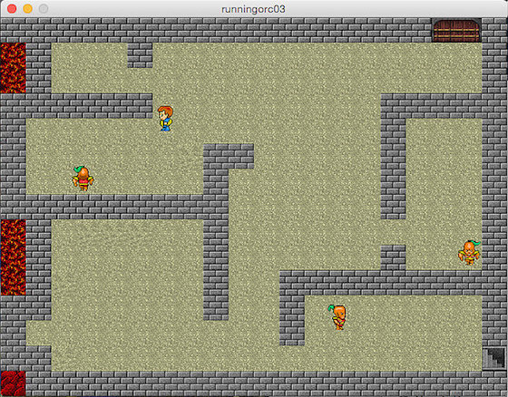

# Drei Orks und ein Held

In diesem Tutorial, in dem erstmalig auch mehrere Orks auftreten, habe ich die Unstimmigkeiten aus dem [letzten Teil dieser Reihe][1] beseitigt. Die Ränder-Behandlung habe ich dadurch vereinfacht, daß nun die ganze Spielwelt eingezäunt ist[^1] und die Tänzchen vor Hindernissen habe ich dadurch eliminiert, daß ich Listen der zulässigen Richtungsänderungen angelegt habe und nur diese per Zufall auswählen lasse:

[^1]: Das ist keine Einschränkung, denn der Fensterrand ist ja im Grunde auch nichts anderes als eine undurchdringliche Mauer und im Zweifelsfall macht man das Spielfeld einfach um die Mauerdicke größer.

~~~{python}
for i in range(len(orc)):
        orc[i].move()
        for j in range(len(wall)):
            if orc[i].checkCollision(wall[j]):
                if orc[i].dir == 0:
                    orc[i].x -= orc[i].dx
                    legalMove = [1, 2, 3]
                    orc[i].dir = legalMove[int(random(3))]
                elif orc[i].dir == 1:
                    orc[i].y -= orc[i].dy
                    legalMove = [0, 2, 3]
                    orc[i].dir = legalMove[int(random(3))]
                elif orc[i].dir == 2:
                    orc[i].x += orc[i].dx
                    legalMove = [0, 1, 3]
                    orc[i].dir = legalMove[int(random(3))]
                elif orc[i].dir == 3:
                    orc[i].y += orc[i].dy
                    legalMove = [0, 1, 2]
                    orc[i].dir = legalMove[int(random(3))
        orc[i].display()
~~~

Außerdem habe ich in der Klasse `Orc` (im Modul `sprite2.py`) den Orks einen zufälligen Richtungswechsel verpaßt, damit sie nicht nur bei einer Kollision mit Hindernissen ihre Richtung ändern und so ihre Bewegungen unvorhersehbarer werden.

~~~{python}
    def move(self):
        if frameCount % int(random(30, 120)) == 0:
            if self.dir == 0:
                legalMove = [1, 2, 3]
                self.dir = legalMove[int(random(3))]
            elif self.dir == 1:
                legalMove = [0, 2, 3]
                self.dir = legalMove[int(random(3))]
            elif self.dir == 2:
                legalMove = [0, 1, 3]
                self.dir = legalMove[int(random(3))]
            elif self.dir == 3:
                legalMove = [0, 1, 2]
                self.dir = legalMove[int(random(3))]
~~~

Fragt mich nicht, wie ich auf die Werte `30, 120` gekommen bin. Ich habe einfach ein wenig experimentiert und diese brachten in meinen Augen das ansprechendste Ergebnis.

Das einzige sonstige neue ist, daß ich die drei Orks in einer Liste zusammengefaßt habe, so daß sie -- wie das Code-Fragment ganz oben zeigt -- in einer Schleife abgehandelt werden können.

## Der Quellcode

Daher erst einmal der vollständige Quellcode, damit Ihr das Beispiel auch nachvollziehen und -programmieren könnt. Erst einmal das Modul `sprite2.py`, das ich wieder in einem separaten Tab in der Processing-IDE untergebracht habe:

~~~{python}
tw = 32
th = 32
tileSize = 32

class Sprite(object):

    def __init__(self, posX, posY):
        self.x = posX
        self.y = posY
        self.dir = 1
        self.dx = 0
        self.dy = 0
    
    def checkCollision(self, otherSprite):
        if (self.x < otherSprite.x + tw and otherSprite.x < self.x + tw
            and self.y < otherSprite.y + th and otherSprite.y < self.y + th):
            return True
        else:
            return False

class Hero(Sprite):

    def loadPics(self):
        self.mnv1rt1 = loadImage("mnv1rt1.gif")
        self.mnv1rt2 = loadImage("mnv1rt2.gif")
        self.mnv1fr1 = loadImage("mnv1fr1.gif")
        self.mnv1fr2 = loadImage("mnv1fr2.gif")
        self.mnv1lf1 = loadImage("mnv1lf1.gif")
        self.mnv1lf2 = loadImage("mnv1lf2.gif")
        self.mnv1bk1 = loadImage("mnv1bk1.gif")
        self.mnv1bk2 = loadImage("mnv1bk2.gif")
    
    def move(self):
        if self.dir == 0:
            self.x += self.dx
            self.image1 = self.mnv1rt1
            self.image2 = self.mnv1rt2
        elif self.dir == 1:
            self.y += self.dy
            self.image1 = self.mnv1fr1
            self.image2 = self.mnv1fr2
        elif self.dir == 2:
            self.x -= self.dx
            self.image1 = self.mnv1lf1
            self.image2 = self.mnv1lf2
        elif self.dir == 3:
            self.y -= self.dy
            self.image1 = self.mnv1bk1
            self.image2 = self.mnv1bk2
                
    def display(self):
        if frameCount % 8 >= 4:
            image(self.image1, self.x, self.y)
        else:
            image(self.image2, self.x, self.y)

class Orc(Sprite):

    def loadPics(self):
        self.orcrt1 = loadImage("orcrt1.gif")
        self.orcrt2 = loadImage("orcrt2.gif")
        self.orcfr1 = loadImage("orcfr1.gif")
        self.orcfr2 = loadImage("orcfr2.gif")
        self.orclf1 = loadImage("orclf1.gif")
        self.orclf2 = loadImage("orclf2.gif")
        self.orcbk1 = loadImage("orcbk1.gif")
        self.orcbk2 = loadImage("orcbk2.gif")
        
    def move(self):
        if frameCount % int(random(30, 120)) == 0:
            if self.dir == 0:
                legalMove = [1, 2, 3]
                self.dir = legalMove[int(random(3))]
            elif self.dir == 1:
                legalMove = [0, 2, 3]
                self.dir = legalMove[int(random(3))]
            elif self.dir == 2:
                legalMove = [0, 1, 3]
                self.dir = legalMove[int(random(3))]
            elif self.dir == 3:
                legalMove = [0, 1, 2]
                self.dir = legalMove[int(random(3))]
        if self.dir == 0:
            self.x += self.dx
            self.image1 = self.orcrt1
            self.image2 = self.orcrt2
        elif self.dir == 1:
            self.y += self.dy
            self.image1 = self.orcfr1
            self.image2 = self.orcfr2
        elif self.dir == 2:
            self.x -= self.dx
            self.image1 = self.orclf1
            self.image2 = self.orclf2
        elif self.dir == 3:
            self.y -= self.dy
            self.image1 = self.orcbk1
            self.image2 = self.orcbk2
                
    def display(self):
        if frameCount % 8 >= 4:
            image(self.image1, self.x, self.y)
        else:
            image(self.image2, self.x, self.y)
            
class Wall(Sprite):
    
    def loadPics(self):
        self.pic = loadImage("wall.png")
        
    def display(self):
        image(self.pic, self.x, self.y)
~~~

Es ist gegenüber dem letzten Mal ein wenig einfacher geworden, weil die Ränderbehandlung entfallen ist. Das Hauptprogramm hat allerdings an Komplexität deutlich zugenommen:

~~~{python}
from sprite2 import Hero, Orc, Wall
tilesize = 32

dungeon = [[9,9,9,9,9,9,9,9,9,9,9,9,9,9,9,9,9,7,7,9],
           [8,9,0,0,0,9,0,0,0,0,0,0,0,0,0,0,0,0,0,9],
           [8,9,0,0,0,0,0,0,0,0,0,0,0,0,0,0,0,0,0,9],
           [9,9,9,9,9,9,0,0,0,0,0,0,0,0,0,9,9,9,9,9],
           [9,0,0,0,0,0,0,0,0,0,0,0,0,0,0,9,0,0,0,9],
           [9,0,0,0,0,0,0,0,9,9,0,0,0,0,0,9,0,0,0,9],
           [9,0,0,0,0,0,0,0,9,0,0,0,0,0,0,9,0,0,0,9],
           [9,9,9,9,9,9,9,9,9,0,0,0,0,0,0,9,0,0,0,9],
           [8,9,0,0,0,0,0,0,9,0,0,0,0,0,0,0,0,0,0,9],
           [8,9,0,0,0,0,0,0,9,0,0,0,0,0,0,9,0,0,0,9],
           [8,9,0,0,0,0,0,0,9,0,0,9,9,9,9,9,9,9,9,9],
           [9,9,0,0,0,0,0,0,9,0,0,9,0,0,0,0,0,0,0,9],
           [9,0,0,0,0,0,0,0,0,0,0,9,0,0,0,0,0,0,0,9],
           [9,9,0,0,0,0,0,0,0,0,0,0,0,0,0,0,0,0,0,5],
           [8,9,9,9,9,9,9,9,9,9,9,9,9,9,9,9,9,9,9,9]]

wall = []
hero = Hero(18*tilesize, 13*tilesize)
orc  = []
orc.append(Orc(2*tilesize, 12*tilesize))
orc.append(Orc(3*tilesize, 2*tilesize))
orc.append(Orc(16*tilesize, 4*tilesize))

def setup():
    global bg
    bg = loadImage("dungeon.png")
    loadDungeonData()
    frameRate(30)
    size(640, 480)
    hero.loadPics()
    hero.dx = 2
    hero.dy = 2
    hero.dir = 2
    for i in range(len(orc)):
        orc[i].loadPics()
        orc[i].dx = 2
        orc[i].dy = 2
        orc[i].dir = 0
    

def draw():
    background(bg)
    hero.move()
    for j in range(len(wall)):
        if hero.checkCollision(wall[j]):
            if hero.dir == 0:
                hero.x -= hero.dx
            elif hero.dir == 1:
                hero.y -= hero.dy
            elif hero.dir == 2:
                hero.x += hero.dx
            elif hero.dir == 3:
                hero.y += hero.dy
            hero.image1 = hero.image2
    hero.display()

    for i in range(len(orc)):
        orc[i].move()
        for j in range(len(wall)):
            if orc[i].checkCollision(wall[j]):
                if orc[i].dir == 0:
                    orc[i].x -= orc[i].dx
                    legalMove = [1, 2, 3]
                    orc[i].dir = legalMove[int(random(3))]
                elif orc[i].dir == 1:
                    orc[i].y -= orc[i].dy
                    legalMove = [0, 2, 3]
                    orc[i].dir = legalMove[int(random(3))]
                elif orc[i].dir == 2:
                    orc[i].x += orc[i].dx
                    legalMove = [0, 1, 3]
                    orc[i].dir = legalMove[int(random(3))]
                elif orc[i].dir == 3:
                    orc[i].y += orc[i].dy
                    legalMove = [0, 1, 2]
                    orc[i].dir = legalMove[int(random(3))]
        orc[i].display()

def loadDungeonData():
    for y in range(15):
        for x in range(20):
            if dungeon[y][x] >= 5:
                wall.append(Wall(x*tilesize, y*tilesize))

def keyPressed():
    if keyPressed and key == CODED:
        if keyCode == RIGHT:
            hero.dir = 0
        elif keyCode == DOWN:
            hero.dir = 1
        elif keyCode == LEFT:
            hero.dir = 2
        elif keyCode == UP:
            hero.dir = 3
~~~

Den Raum habe ich wieder in [Tiled][2] erstellt und einmal als Bild und einmal als CSV-Datei exportiert. Aus dieser CSV-Datei habe ich dann obiges Array gebastelt, aus dem man die Struktur des *Dungeon* ziemlich gut ablesen kann. Damit das mit dem Ablesen aber auch wirklich funktioniert, mußte ich gegenüber dem gewohnten Brauch `x` und `y` vertauschen (weil man sonst den Kopf immer schräg legen müßte). 😇

## Meditieren mit den Orks

Ich habe mir bei der Platzierung der Orks beim Programmstart etwas gedacht. Läßt man das Progrämmchen nämlich eine Weile laufen, dann werdet Ihr feststellen, daß die beiden Orks unten kaum Probleme haben, ihrem ursprünglichen Raum zu entkommen, während der Ork in dem kleinen Zimmerchen rechts wie ein im Zoo eingesperrter Tiger meist ziemlich lange dort auf und ab tigert, bis er endlich entkommen kann (irgendwann entkommt aber jeder). Um mir das anzuschauen, manövriere ich den Helden gerne in das kleine Räumchen oben links und lasse ihn dort einfach stehen (noch passiert ja nichts, wenn er von einem Ork entdeckt wird).

Wenn man den Sketch dann lange genug laufen läßt, verirrt sich hin und wieder auch ein Ork zurück in das Gefängniszimmer und braucht natürlich ebenfalls seine Zeit, bis er wieder entkommt. Ein chinesisches Restaurant in der Nähe meines Arbeitsplatzes hat kleine Aquarien mit Guppies im Gastraum. Wenn ich dort essen gehe, setze ich mich gerne in die Nähe der Aquarien und schaue den Fischen beim Umherwieseln zu. Ihre Bewegungen sind denen der Orks in diesem Skript ziemlich ähnlich und daher wirkt dieser Sketch ähnlich meditativ auf mich. Glaubt mir, ich habe gestern abend fast eine Stunde vor dem Rechner gesessen und den Orks ganz entspannt beim Wuseln zugesehen.

## Credits

Die Bilder des Helden und der Orks entstammen wieder der freien ([CC BY 3.0][3]) [Sprite-Sammlung von Philipp Lenssen][4] (über 700 animierte Avatare in der klassischen Größe von 32x32 Pixeln). Den Hintergrund habe ich wie bei den anderen Beispielen auch mit [Tiled][2] erstellt und die Tiles dem ebenfalls freien ([CC0][5]) [Dungeon Crawl Tileset][6] entnommen.

Alle Skripte und Assets zu dieser kleinen [Processing.py-Serie][7] könnt Ihr natürlich [auf GitHub][8] finden. Also habt Spaß damit.

[1]: runningorc5.md
[2]: http://cognitiones.kantel-chaos-team.de/multimedia/spieleprogrammierung/tiled.html
[3]: https://creativecommons.org/licenses/by/3.0/
[4]: http://blogoscoped.com/archive/2006-08-08-n51.html
[5]: http://creativecommons.org/publicdomain/zero/1.0/
[6]: http://opengameart.org/content/dungeon-crawl-32x32-tiles
[7]: http://py.kantel-chaos-team.de/
[8]: https://github.com/kantel/processingpy