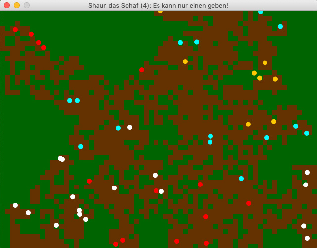

## Shaun das Schaf und seine Spießgesellen

Ich hatte – angeregt durch die Lektüre von *Peter Farrells* wunderbarem Buch »Math Adventures with Python« mal wieder Lust, mit Processing.py etwas völlig Sinnbefreites zu programmieren, das im Endeffekt dann aber doch nicht so sinnbefreit ist, sondern sogar eine wichtige und vielleicht auch überraschende Erkenntnis hervorbringt. Dafür schien mir das im Kapitel 9 vorgestellte »Crazy Sheep Programm« ein durchaus geeigneter Kandidat zu sein, denn – auch wenn *Peter Farrell* das nicht anspricht – so *grazy* ist das Programm gar nicht.

Doch fangen wir klein an. Zuerst einmal geht es um nicht mehr, als ein Schaf (ich habe es [Shaun](https://de.wikipedia.org/wiki/Shaun_das_Schaf) genannt) über eine grüne Wiese zu schicken, die es abweiden soll. Natürlich geht es auch um objektorientierte Programmierung und daher bekommt das Schaf erst einmal eine eigene Klasse `Sheep` spendiert:

~~~python
# coding=utf-8

from random import randint

class Sheep():
    
    def __init__(self, x, y):
        self.x = x
        self.y = y
        self.sz = 10
        self.move = 10
    
    def update(self):
        self.x += randint(-self.move, self.move)
        self.y += randint(-self.move, self.move)
        if self.x > width:
            self.x %= width
        if self.y > height:
            self.y %= height
        if self.x < 0:
            self.x += width
        if self.y < 0:
            self.y += height
        circle(self.x, self.y, self.sz)
~~~

Diese habe ich in der Datei `shaun.py` abgesichert und da ich dazu neige, in den Kommentaren Umlaute zu verwenden und Processing.py (da Jython, also Python 2.7) darauf allergisch reagiert, mußte in der ersten Zeile die Direktive `# coding=utf-8`untergebracht werden.

Die `update()`-Methode ist erst einmal sehr einfach gehalten: Das Schaf (eigentlich ein Kreis) bewegt sich bei jedem Zeitschritt zufällig zwischen -10 und 10 Pixeln in x- und y-Richtung weiter und wenn es auf den Rand des Bildschirms trifft, taucht es auf der anderen Seite wieder auf ([Torus-Welt](https://www.spektrum.de/magazin/ist-das-universum-ein-torus/974631)).

Da ich schon dabei war, habe ich in der gleichen Datei auch noch eine Klasse `Settings` untergebracht, die ein paar nützliche Konstanten enthält:

~~~python
class Settings():
    
    def __init__(self):
        
        # Einige nützliche Konstanten:
        self.WIDTH = 640
        self.HEIGHT = 480
        self.FPS = 5
        
        # Ein paar Farbdefinitionen
        self.WHITE = color(255, 255, 255)
        self.BLACK = color(0, 0, 0)
        self.GREEN = color(0, 100, 0)
~~~

Die Simulationsgeschwindigkeit wird durch die Framerate gesteuert und da ich es nicht so hektisch mag, habe ich sie mit `self.FPS = 5` auf fünf Zeitschritte je Sekunde heruntergesetzt.

Das Hauptprogramm macht ja noch nicht viel und ist daher sehr kurz geraten:

~~~python
from shaun import Sheep, Settings

shaun = Sheep(300, 200)
s = Settings()

def setup():
    size(s.WIDTH, s.HEIGHT)
    this.surface.setTitle("Shaun das Schaf (1)")
    frameRate(s.FPS)
    
def draw():
    background(s.GREEN)
    shaun.update()
~~~

Wenn Ihr es laufen laßt, werden Ihr sehen, was ich mit »es macht nicht viel« meinte: Ein weißer Kreis irrt ziellos über ein grüne Ebene. Das ist alles.

### Vom Schaf zur Schafherde

Das ändert sich jedoch massiv mit der zweiten Version des Programms. Zum einen habe ich ein *Refaktoring* vorgenommen und jeder Klasse eine eigene Datei (einen eigenen *Tab*) spendiert. Das heißt, die `Settings` besitzen nun eine eigene Datei (`config.py`) und haben auch noch die Konstante `PATCHSIZE` (dazu später mehr) und die Farbe *Braun* spendiert bekommen:

~~~python
# coding=utf-8

class Settings():
    
    def __init__(self):
        
        # Einige nützliche Konstanten:
        self.WIDTH = 640
        self.HEIGHT = 480
        self.FPS = 5
        self.PATCHSIZE = 10
        
        # Ein paar Farbdefinitionen
        self.WHITE = color(255, 255, 255)
        self.BLACK = color(0, 0, 0)
        self.GREEN = color(0, 100, 0)
        self.BROWN = color(100, 50, 0)
~~~

Neu ist auch die Klasse `Grass`, denn die Schafe sollen es abweiden können und hinterlassen dann eine abgeweidete, also braune Schafweide. Jedes mal, wenn ein Schaf einen »Patch« Gras abfrißt, bekommt es fünf Enegiepunkte spendiert. Daher sieht die Datei `grass.py` so aus:

~~~python
# coding=utf-8
from config import Settings

s = Settings()

class Grass():
    
    def __init__(self, x, y, sz):
        self.x = x
        self.y = y
        self.energy = 5
        self.eaten = False
        self.sz = sz
    
    def update(self):
        if self.eaten:
            fill(s.BROWN)
        else:
            fill(s.GREEN)
        rect(self.x, self.y, self.sz, self.sz)
~~~

Die meisten Änderungen gibt es in der Klasse `Sheep`, die ja nun eine ganze Schafherde hervorbringen soll:

~~~python
# coding=utf-8
from random import randint
from config import Settings

s = Settings()

class Sheep():
    
    def __init__(self, x, y):
        self.x = x
        self.y = y
        self.sz = s.PATCHSIZE     # Shapesize
        self.move = 10
        self.energy = 20
        self.rows = height/self.sz

    
    def update(self, lawn):
        self.energy -= 1
        self.x += randint(-self.move, self.move)
        self.y += randint(-self.move, self.move)
        if self.x >= width - self.sz:
            self.x = width - self.sz
        if self.y >= height - self.sz:
            self.y = height - self.sz
        if self.x <= 0:
            self.x = 0
        if self.y <= 0:
            self.y = 0
        xscl = int(self.x/self.sz)
        yscl = int(self.y/self.sz)
        grass = lawn[xscl*self.rows + yscl]
        if not grass.eaten:
            self.energy += grass.energy
            grass.eaten = True
        fill(s.WHITE)
        circle(self.x, self.y, self.sz)
~~~

Zum einen bekommt jedes Schaf mit `self.energy = 20` eine Startenergie von 20 Punkten zugewiesen. Zum anderen habe ich die Randbedingungen geändert. Da es sher unwahrscheinlich ist, daß eine Schafherde eine ganze (Torus-) Welt bevölkert, habe ich sie auf die rechtecke Weide der Fenstergröße eingekesselt. Sobald sie auf den Rand des Fensters stoßen, müssen sie dort verharren, bis der Zufallszahlengenerator ihnen eine neue Bewegung in eine andere Richtung zuweist, die sie auf ein anderes Feld innerhalb der Weide (des Fensters) führt.

Außerdem bekommt jedes Schaf bei jedem Zeitschritt einen Energiepunkt abgezogen. Energie auftanken kann es nur, wenn es Gras frißt, denn Gras fressen soll sich schließlich wieder lohnen.

Aber es gilt noch ein anderes Problem zu berücksichtigen: Der Zufallszahlengenerator führt die Schafe nicht eindeutig auf ein Patchfeld mit Gras, da mußte ich dann ein wenig runden: Zum einen ist die Weide in einem eindimensionalen Array abgespeichert, daher habe ich im Konstruktor mit

~~~python
        self.rows = height/self.sz
~~~

erst einmal die Reihen des Feldes ermittelt. (Ihr erinnert Euch? In Python 2.7 erkennt Pythons *Duck Typing* eine Integer-Division, wenn Zähler und Nenner eines Bruches Integer-Werte sind. Da dies sowohl bei der Fensterhöhe wie auch bei `PATCHSIZE` immer der Fall ist, kommt hier immer ein Ganzzahl-Ergebnis heraus (das heißt, die Nachkommastellen werden gnadenlos abgeschnitten), daß man natürlich im Zweifelsfall auch mit

~~~python
        self.rows = int(height/self.sz)
~~~

erzwingen kann.) Und dann habe ich mit

~~~python
        xscl = int(self.x/self.sz)
        yscl = int(self.y/self.sz)
        grass = lawn[xscl*self.rows + yscl]
~~~

dafür gesorgt, daß jedem Schaf immer der am nächsten gelegene Graspatch zum Abweiden zugewiesen wird. (Erfahrenen Processing-Programmierern wird dies aus der Bildverarbeitung bekannt vorkommen, da Processing auch Bilder immer als eindimensionale Arrays abspeichert und man so mit der gleichen Methode die x- und y-Koordinaten eines Bildes berechnen muß.)

Ja, was noch? Wenn der Rasenpatch abgeweidet ist, bekommt das Schaf fünf Energiepunkte spendiert und der Weidepatch eine braune Farbe zugewiesen.

(Patches als eigene Objekte (und Agenten) hat meines Wissens als erster *Mitchel Resnick* 1994 in StarLogo implementiert und in seinem Buch »Turtles, Termites, and Traffic Jams« vorgestellt.) 

Das Hauptprogramm ist immer noch kurz geraten:

~~~python
from config import Settings
from shaun import Sheep
from grass import Grass
from random import randint

s = Settings()
sz = s.PATCHSIZE
sheeps = []
lawn = []

def setup():
    size(s.WIDTH, s.HEIGHT)
    this.surface.setTitle("Shaun das Schaf (2): Vom Schaf zur Schafherde")
    frameRate(s.FPS)
    for _ in range(20):
        sheeps.append(Sheep(randint(50, width - 50), random(50, height - 50)))
    for x in range(0, width, sz):
        for y in range(0, height, sz):
            lawn.append(Grass(x, y, sz))
    
def draw():
    background(s.WHITE)
    for grass in lawn:
        grass.update()
    for sheep in sheeps:
        sheep.update(lawn)
        if sheep.energy <= 0:
            sheeps.remove(sheep)
~~~

Neu sind hier eigentlich nur die beiden Listen für die Schafe und den Rasen (`lawn`), die in der `setup()`-Funktion in zwei Schleifen jeweils gefüllt werden und die Tatsache, daß ein Schaf mit der Anweisung

~~~python
        if sheep.energy <= 0:
            sheeps.remove(sheep)
~~~

»stirbt«, sobald es keine Energie mehr besitzt. Wenn Ihr das Programm so laufen laßt, werdet Ihr es merken. Da kein Rasen nachwächst, wird irgendwann Eure stolze Herde verhungert sein. Darum möchte ich in der nächsten Version dieses Programmes nicht nur das Nachwachsen des Grases simulieren, sondern energiegeladene Schafe sollen sich auch reproduzieren, also vermehren können.

### Geburt und Tod

Diesen Abschnitt kann ich erst einmal mit einer guten Nachricht einleiten: Die Klassen `Settings`, und `Sheep` bleiben unverändert, es gibt Änderungen im Hauptprogramm

~~~python
from config import Settings
from shaun import Sheep
from grass import Grass
from random import randint

s = Settings()
sz = s.PATCHSIZE
sheeps = []
lawn = []

def setup():
    size(s.WIDTH, s.HEIGHT)
    this.surface.setTitle("Shaun das Schaf (3): Geburt und Tod")
    frameRate(s.FPS)
    for _ in range(20):
        sheeps.append(Sheep(randint(50, width - 50), random(50, height - 50)))
    for x in range(0, width, sz):
        for y in range(0, height, sz):
            lawn.append(Grass(x, y, sz))
    
def draw():
    background(s.WHITE)
    for grass in lawn:
        grass.update()
    for sheep in sheeps:
        sheep.update(lawn)
        if sheep.energy <= 0:
            sheeps.remove(sheep)
        if sheep.energy >= 50:
            sheep.energy -= 30
            sheeps.append(Sheep(sheep.x, sheep.y))
    print(len(sheeps))
~~~

und da auch eigentlich nur in der `draw()`-Funktion. Dort wird mit den Zeilen

~~~python
        if sheep.energy >= 50:
            sheep.energy -= 30
            sheeps.append(Sheep(sheep.x, sheep.y))
~~~

festgelegt, daß ein Schaf, das einen Energielevel von 50 Punkten besitzt, sich vermehren soll. Dieser Vorgang kostet dem Tier zwar 30 Energiepunkte, aber dafür hat es sich quasi verdoppelt. Das neue Schaf wird zwar auf der gleichen Position geboren, auf der sein Elternschaf sitzt, aber der Zufallszahlengenerator sorgt schnell dafür, daß beide Tiere bald getrennte Wege gehen.

Die zweite Änderung betrifft die `update()`-Methode der Klasse `Grass`:

~~~python
    def update(self):
        if self.eaten:
            if random(1000) < 5:
                self.eaten = False
            else:
                fill(s.BROWN)
        else:
            fill(s.GREEN)
        rect(self.x, self.y, self.sz, self.sz)
~~~

Hier wird mit einer Wahrscheinlichkeit von 5 Promille dem Gras die Chance gegeben, wieder zu wachsen, das heißt einen Patch wieder grün und abweidbar werden zu lassen.

Diese geringe Wahrscheinlichkeit reicht aus. Wenn Ihr die Simulation über einen längeren Zeitraum laufen laßt, werdet Ihr feststellen, daß die Schafspopulation stabil bleibt. Sie kann zwar mal – vornehmlich zu Beginn, wenn alles noch grün ist – sehr groß werden oder im weiteren Verlauf auch sehr klein (unter zehn Schafe), aber sie stirbt nicht mehr aus, sondern die Population pendelt immer um einen Mittelwert herum.

Dieses Verhalten ist aus ähnlichen [Räuber- und Beute-Simulationen](https://de.wikipedia.org/wiki/R%C3%A4uber-Beute-Beziehung) bekannt (ich ernenne die Schafe jetzt einfach mal zu gefährlichen Raubtieren ehrenhalber und das Gras zu ihrer Beute) und wird nach ihren Entdeckern [Lotka-Volterra-Regeln](https://de.wikipedia.org/wiki/Lotka-Volterra-Regeln), beziehungsweise mathematisch präzise [Lotka-Volterra-Gleichungen](https://de.wikipedia.org/wiki/Lotka-Volterra-Gleichungen) genannt.

### Es kann nur einen geben!

Als abschließende Änderung habe ich die Schafe in vier unterschiedlich farbige Varianten aufgeteilt, während das sonstige Verhalten unverändert geblieben ist. Daher sind in der Klasse `Settings` auch nur noch ein paar weitere Farbdefinitionen hinzugekommen:

~~~python
        # Ein paar Farbdefinitionen
        self.WHITE = color(255, 255, 255)
        self.YELLOW = color(255, 200, 0)
        self.RED = color(255, 0, 0)
        self.BLUE = color(0, 255, 255)
        self.ORANGE = color(255, 140, 0)
        self.BLACK = color(0, 0, 0)
        self.GREEN = color(0, 100, 0)
        self.BROWN = color(100, 50, 0)
~~~
 und die Klasse `Sheep` bekommt im Konstruktor eine Farbe mit übergeben
 
~~~python
     def __init__(self, x, y, c):
         # snip
         self.col = c
~~~

und in der Methode `update()` als vorletzte Anweisung den Befehl:

~~~python
        fill(self.col)
~~~

bevor sie das Schaf als Kreis zeichnen soll.

Die Klasse `Grass` bleibt bis auf eine Kleinigkeit unverändert. Mit der Zeile

~~~python
        noStroke()
~~~

als erste Anweisung der `update()`-Methode habe ich das Gitterraster abgeschaltet.

Nur das Hauptprogramm mußte ein paar wesentlichere Änderungen bekommen:

~~~python
from config import Settings
from shaun import Sheep
from grass import Grass
from random import randint, choice

s = Settings()
sz = s.PATCHSIZE
sheeps = []
lawn = []
colors = [s.WHITE, s.RED, s.BLUE, s.YELLOW]

def setup():
    size(s.WIDTH, s.HEIGHT)
    this.surface.setTitle("Shaun das Schaf (4): Es kann nur einen geben!")
    frameRate(s.FPS)
    for _ in range(20):
        c = choice(colors)
        sheeps.append(Sheep(randint(50, width - 50), random(50, height - 50), c))
    for x in range(0, width, sz):
        for y in range(0, height, sz):
            lawn.append(Grass(x, y, sz))
~~~

Hier wird also zusätzlich von `random` noch die Methode `choice()` importiert, die dazu dient, aus der Liste `colors` zufällig, aber gleichverteilt die Farben herauszusuchen und an die einzelnen Schafe zu verteilen. Die `draw()`-Funktion habe ich nicht noch einmal abgeschrieben, da sich in ihr nichts geändert hat.

Was glaubt Ihr, was nun passiert? Zu Beginn der Simulation tummeln sich fröhlich vier Gruppen verschieden farbiger Schafe auf der Weide. Im weiteren Verlauf stirbt jedoch eine Farbe nach der anderen aus, bis nur noch eine Farbe übrigbleibt. Welche Farbe jedoch übrigbleibt, ist nicht vorhersehbar und rein zufällig. (Um nicht so lange auf das Aussterben der Populationen warten zu müssen – das kann sich manchmal lange hinziehen –, habe ich die `FrameRate` auf 60 FPS erhöht.)

Auch dieses Verhalten ist bekannt und wurde 1975 unter anderem von *Manfred Eigen* und *Ruthild Winkler* in ihrem Buch »Das Spiel – Naturgesetze steuern den Zufall« im Kapitel über Selektion beschrieben:

>Es kann mit Sicherheit bei jedem Spiel die *Tatsache* der Selektion vorausgesagt werden, nicht dagegen das *Detailergebnis*, nämlich *welche* Kugelfarbe selektiert wird.

Denn mit Ausnahme der Farbe verhalten sich alle Kreise identisch, das heißt, sie sind mit dem exakt gleichen genetischen Material ausgestattet. Man kann, um die Sache nicht zu kompliziert zu machen, auch einfach annehemen, daß die Farben Markierungen sind, die vom Beobachter auf die ansonsten genetisch identischen Schafe angebracht wurden.

Zu einem ähnlichen Ergebnis, kam ja schon das [Demokratie-Spiel](http://blog.schockwellenreiter.de/2017/06/2017060301.html), das *Alexander K. Dewdney* in der *Scientific American* beschrieben hat: Wenn man lange genug Demokratie spielt, dann gewinnt zum Schluß eine Partei alle Sitze. Nur weiß man im Voraus nicht, welche.

Und in einem Ökosystem, in dem zwei oder mehr exakt gleiche Räuberpopulationen um die gleiche Beute konkurrieren, stirbt über kurz oder lang eine der beiden Populationen aus. Jede Population kann nur getrennt überleben, wenn sie sich ihre eigene, ökologische Nische sucht.

Wenn man jedoch, und auch das haben *Eigen* und *Winkler* beschrieben, einer Population auch nur einen winzigen Vorteil verschafft, dann überlebt diese Population. Wenn Ihr nämlich in der Klasse `Sheep` in der `update()`-Methode diese Anweisung einfügt,

~~~python
        if self.col == s.RED and randint(0, 1000) < 5:
            self.move = 25
~~~

dann überlebt **immer** (und zwar ziemlich schnell) die rote Population (im Quellcode habe ich diese Zeilen auskommentiert, Ihr könnt sie ja für Eure eigenen Experimente wieder einsetzen.

Der Vollständigkeit halber hier also jetzt der komplette Quellcode in der endgültigen Fassung. Zuerst die Datei `config.py`:

~~~python
# coding=utf-8

class Settings():
    
    def __init__(self):
        
        # Einige nützliche Konstanten:
        self.WIDTH = 640
        self.HEIGHT = 480
        self.FPS = 5
        self.PATCHSIZE = 10
        
        # Ein paar Farbdefinitionen
        self.WHITE = color(255, 255, 255)
        self.YELLOW = color(255, 200, 0)
        self.RED = color(255, 0, 0)
        self.BLUE = color(0, 255, 255)
        self.ORANGE = color(255, 140, 0)
        self.BLACK = color(0, 0, 0)
        self.GREEN = color(0, 100, 0)
        self.BROWN = color(100, 50, 0)
~~~

Dann der Rasen (`grass.py`):

~~~python
# coding=utf-8
from config import Settings

s = Settings()

class Grass():
    
    def __init__(self, x, y, sz):
        self.x = x
        self.y = y
        self.energy = 5
        self.eaten = False
        self.sz = sz
    
    def update(self):
        noStroke()
        if self.eaten:
            if random(1000) < 5:
                self.eaten = False
            else:
                fill(s.BROWN)
        else:
            fill(s.GREEN)
        rect(self.x, self.y, self.sz, self.sz)
~~~

Dann das Schaf (`shaun.py`):

~~~python
# coding=utf-8
from random import randint
from config import Settings

s = Settings()

class Sheep():
    
    def __init__(self, x, y, c):
        self.x = x
        self.y = y
        self.sz = 10     # Shapesize
        self.move = 10
        self.energy = 20
        self.rows = height/self.sz
        self.col = c

    
    def update(self, lawn):
        self.energy -= 1
        # if self.col == s.RED and randint(0, 1000) < 5:
        #     self.move = 25
        self.x += randint(-self.move, self.move)
        self.y += randint(-self.move, self.move)
        if self.x >= width - self.sz:
            self.x = width - self.sz
        if self.y >= height - self.sz:
            self.y = height - self.sz
        if self.x <= 0:
            self.x = 0
        if self.y <= 0:
            self.y = 0
        xscl = int(self.x/self.sz)
        yscl = int(self.y/self.sz)
        grass = lawn[xscl*self.rows + yscl]
        if not grass.eaten:
            self.energy += grass.energy
            grass.eaten = True
        fill(self.col)
        circle(self.x, self.y, self.sz)
~~~

Und zu guter Letzt das Hauptprogramm, das ich `shaunsim` genannt habe:

~~~python
from config import Settings
from shaun import Sheep
from grass import Grass
from random import randint, choice

s = Settings()
sz = s.PATCHSIZE
sheeps = []
lawn = []
colors = [s.WHITE, s.RED, s.BLUE, s.YELLOW]

def setup():
    size(s.WIDTH, s.HEIGHT)
    this.surface.setTitle("Shaun das Schaf (4): Es kann nur einen geben!")
    frameRate(s.FPS)
    for _ in range(20):
        c = choice(colors)
        sheeps.append(Sheep(randint(50, width - 50), random(50, height - 50), c))
    for x in range(0, width, sz):
        for y in range(0, height, sz):
            lawn.append(Grass(x, y, sz))
    
def draw():
    background(s.WHITE)
    for grass in lawn:
        grass.update()
    for sheep in sheeps:
        sheep.update(lawn)
        if sheep.energy <= 0:
            sheeps.remove(sheep)
        if sheep.energy >= 50:
            sheep.energy -= 30
            sheeps.append(Sheep(sheep.x, sheep.y, sheep.col))
    # print(len(sheeps))
~~~

Ihr könnt natürlich noch weiter an den Parametern schrauben (genau darum habe ich sie ja auch in der Datei `config.py` ausgelagert), um vielleicht noch weitere Einsichten aus dieser einfachen Simulation zu gewinnen. Eine Möglichkeit wäre, die Lebenszeit der Schafe zu begrenzen. Sie könnten mit 255 Lebenspunkten anfangen und bei jedem Durchlauf wird ihnen davon etwas abgezogen. Sie »sterben«, wenn Ihre Lebenspunkte auf Null gefallen sind.

Interessant wäre dann, herauszufinden ob und wie sich unterschiedliche Lebensspannen auf die Überlebenschancen der Populationen auswirken. Ihr seht, selbst so eine einfache und kleine Simulation kann einen lange beschäftigen.

### Literatur

- A.K. Dewdney: *Wie man π erschießt. Fünf leichte Stücke für WHILE-Schleifen und Zufallsgenerator, oder: lebensechte Simulationen von Zombies, Wählern und Warteschlangen*, in: Immo Diener (Hg.): *Computer-Kurzweil*, Heidelberg (Spektrum der Wissenschaft, Reihe: Verständliche Forschung) 1988
- Manfred Eigen, Ruthild Winkler: *Das Spiel. Naturgesetze steuern den Zufall*, München (Piper), 1975 (unveränderte Taschenbuchausgabe 1985)
- Peter Farrell: *Math Adventures with Python. An Illustrated Guide to Exploring Math with Code*, San Francisco CA (No Starch Press) 2019
- Mitchel Resnick: *Turtles, Termites, and Traffic Jams – Explorations in Massively Parallel Microworlds*, Cambridge MA (MIT Press) 1994 (unveränderte Paperback-Ausgabe 1997)