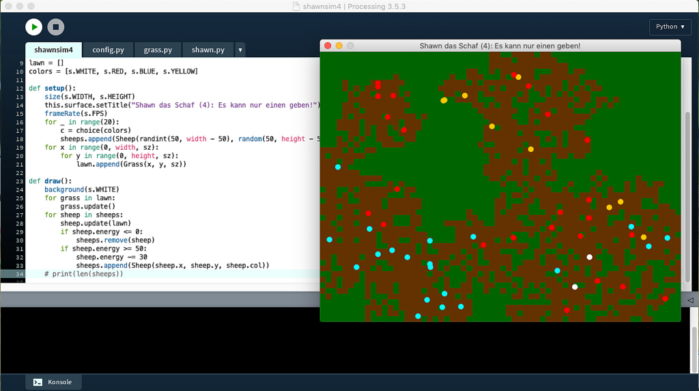

## Shaun das Schaf und seine Spießgesellen

Ich hatte – angeregt durch die Lektüre von *Peter Farrells* wunderbarem Buch »Math Adventures with Python« mal wieder Lust, mi Processing.py etwas völlig Sinnbefreites zu programmieren, das im Endeffekt dann doch nicht so sinnbefreit ist, sondern sogar eine wichtige und vielleicht auch überraschnede Erkenntnis hervorbringt. Dafür schien mir das im Kapitel 9 vorgestellte »Crazing Sheep Programm« ein durchaus geeigneter Kandidat zu sein, denn – auch wenn *Peter Farrell* das nicht anspricht – so *grazy* ist das Programm gar nicht.

Doch fangen wir klein an. Zuerst einmal geht es nicht mehr als um ein Schaf (ich habe es [Shaun](https://de.wikipedia.org/wiki/Shaun_das_Schaf) genannt) über eine grüne Wiese zu schicken, die es abweiden soll. Natürlich geht es auch um objektorientierte Programmierung und daher bekommt das Schaf erst einmal eine eigene Klasse `Sheep` spendiert:

~~~python
# coding=utf-8

from random import randint

class Sheep():
    
    def __init__(self, x, y):
        self.x = x
        self.y = y
        self.sz = 10
        self.move = 10
    
    def update(self):
        self.x += randint(-self.move, self.move)
        self.y += randint(-self.move, self.move)
        if self.x > width:
            self.x %= width
        if self.y > height:
            self.y %= height
        if self.x < 0:
            self.x += width
        if self.y < 0:
            self.y += height
        circle(self.x, self.y, self.sz)
~~~

Diese habe ich in der Datei `shaun.py` abgeseichert und da ich dazu neige, in den Kommentaren Umlaute zu verwenden und Processing.py (da Jython, also Python 2.7) darauf allergisch reagiert, mußte in der ersten Zeile die Direktive `# coding=utf-8`untergebracht werden.

Die `update()`-Methode ist erst einmal sehr einfach gehalten: Das Schaf (eigentlich ein Kreis) bewegt sich bei jedem Zeitschritt zufällig zwischen -10 und 10 Pixeln in x- und y-Richtung weiter und wenn es auf den Rand des Bildschirms trifft, taucht es auf der anderen Seite wieder auf ([Torus-Welt](https://www.spektrum.de/magazin/ist-das-universum-ein-torus/974631)).

Da ich schon dabei war, habe ich in der gleichen Datei auch noch eine Klasse `Settings` untergebracht, die ein paar nützliche Konstanten enthält:

~~~python
class Settings():
    
    def __init__(self):
        
        # Einige nützliche Konstanten:
        self.WIDTH = 640
        self.HEIGHT = 480
        self.FPS = 5
        
        # Ein paar Farbdefinitionen
        self.WHITE = color(255, 255, 255)
        self.BLACK = color(0, 0, 0)
        self.GREEN = color(0, 100, 0)
~~~

Die Simulationsgeschwindigkeit wird durch die Framerate gesteuert und da ich es nicht so hektisch mag, habe ich sie mit `self.FPS = 5` auf fünf Zeitschritte je Sekunde gesetzt.

Das Hauptprogramm macht ja noch nicht viel und ist daher sehr kurz geraten:

~~~python
from shaun import Sheep, Settings

shaun = Sheep(300, 200)
s = Settings()

def setup():
    size(s.WIDTH, s.HEIGHT)
    this.surface.setTitle("Shaun das Schaf (1)")
    frameRate(s.FPS)
    
def draw():
    background(s.GREEN)
    shaun.update()
~~~

Wenn Ihr es laufen laßt, werden Ihr sehen, was ich mit »es macht nicht viel« meinte: Ein weißer Kreis irrt ziellos über ein grüne Ebene. Das ist alles.

### Vom Schaf zur Schafherde

Das ändert isch jedoch massiv mit der zweiten Version des Programms. Zum einen habe ich ein *Refaktoring* vorgenommen und jeder Klasse eine eigene Datei (einen eigenen *Tab*) spendiert. Das heißt, ide `Settings` besitzen nun eine eigene Datei (`config.py`) und haben auch noch die Konstante `PATCHSIZE` (dazu später mehr) und die Farbe braun spendiert bekommen:

~~~python
# coding=utf-8

class Settings():
    
    def __init__(self):
        
        # Einige nützliche Konstanten:
        self.WIDTH = 640
        self.HEIGHT = 480
        self.FPS = 5
        self.PATCHSIZE = 10
        
        # Ein paar Farbdefinitionen
        self.WHITE = color(255, 255, 255)
        self.BLACK = color(0, 0, 0)
        self.GREEN = color(0, 100, 0)
        self.BROWN = color(100, 50, 0)
~~~

Neu ist auch die Klasse `Grass`, denn die Schafe sollen es abweiden können und hinterlassen dann eine abgeweidete, also braune Schafweide. Jedes mal, wenn ein Schaf einen »Patch« Gras abfrißt, bekommt es fünf Enegiepunkte spendiert. Daher sieht die Datei `grass.py` so aus:

~~~python
# coding=utf-8
from config import Settings

s = Settings()

class Grass():
    
    def __init__(self, x, y, sz):
        self.x = x
        self.y = y
        self.energy = 5
        self.eaten = False
        self.sz = sz
    
    def update(self):
        if self.eaten:
            fill(s.BROWN)
        else:
            fill(s.GREEN)
        rect(self.x, self.y, self.sz, self.sz)
~~~

Die meisten Änderungen gibt es in der Klasse `Sheep`, die ja nun eine ganze Schafherde hervorbringen soll:

~~~python
# coding=utf-8
from random import randint
from config import Settings

s = Settings()

class Sheep():
    
    def __init__(self, x, y):
        self.x = x
        self.y = y
        self.sz = s.PATCHSIZE     # Shapesize
        self.move = 10
        self.energy = 20
        self.rows = height/self.sz

    
    def update(self, lawn):
        self.energy -= 1
        self.x += randint(-self.move, self.move)
        self.y += randint(-self.move, self.move)
        if self.x >= width - self.sz:
            self.x = width - self.sz
        if self.y >= height - self.sz:
            self.y = height - self.sz
        if self.x <= 0:
            self.x = 0
        if self.y <= 0:
            self.y = 0
        xscl = int(self.x/self.sz)
        yscl = int(self.y/self.sz)
        grass = lawn[xscl*self.rows + yscl]
        if not grass.eaten:
            self.energy += grass.energy
            grass.eaten = True
        fill(s.WHITE)
        circle(self.x, self.y, self.sz)
~~~

Zum einen bekommt jedes Schaf mi `self.energy = 20` eine Startenergie von 20 Punkten zugewiesen. Zum anderen habe ich die Randbedingungen geändert. Da es sher unwahrscheinlich ist, daß eine Schafherde eine ganze (Torus-) Welt bevölkert, habe ich sie auf die rechtecke Weide der Fenstergröße eingekesselt, So bald sie auf den Rand des Fensters stoßen, müssen sie dort so lange verharren, bsi der Zufallszahlengenerator ihnen eine neue Bewegung zuweist, die sie auf ein anderes Feld innherhalb der Weide (des Fensters) führt.

Außerdem wird jedem Schaf bei jedem Zeitschritt ein Energiepunkt abgezogen, Gras fressen soll sich schließlich lohnen.

Aber es gilt noch ein anderes Problem zu berücksichtigen: Der Zufallszahlengenerator führt die Schafe nicht eindeutig auf ein Patchfeld mit Gras, da mußte ich dann ein wenig runden: Zum einen ist die Weide in einem eindimensionalen Array abgespeichert, daher habe ich im Konstruktor mit

~~~python
        self.rows = height/self.sz
~~~

erst einmal die Reihen des Feldes ermittelt. (Ihr erinnert Euch? In Python 2.7 erkennt Pythons *Duck Typing* eine Integer-Division, wenn Zähler und Nenner eines Bruches Integer-Werte sind. Da dies sowohl bei der Fensterhöhe wie auch bei `PATCHSIZE` immer der Fall ist, kommt hier immer das Ergebnis heraus, daß man natürlich im Zweifelsfall auch mit

~~~python
        self.rows = int(height/self.sz)
~~~

erzwingen kann.) Und dann habe ich mit

~~~python
        xscl = int(self.x/self.sz)
        yscl = int(self.y/self.sz)
        grass = lawn[xscl*self.rows + yscl]
~~~

dafür gesorgt, daß jedem Schaf immer der am nächsten gelegene Graspatch zum Abweiden zugewiesen wird. (Erfahrenen Processing-Programmierern wird dies aus der Bildverarbeitung bekannt vorkommen, da Processing auch Bilder immer als eindiemnsionalle Arrays abspeichert und man so mit der gleichen Methode die x- und y-Koordinaten eines Bildes berechnen muß.

Ja, was noch? Wenn der Rasenpatch abgeweidet ist, bekommt das Schaf füfn Energiepunkte spendiert und der Weidepatch eine braune Farbe zugeiesen.

Das Hauptprogramm ist immer noch kurz geraten:

~~~python
from config import Settings
from shaun import Sheep
from grass import Grass
from random import randint

s = Settings()
sz = s.PATCHSIZE
sheeps = []
lawn = []

def setup():
    size(s.WIDTH, s.HEIGHT)
    this.surface.setTitle("Shaun das Schaf (2): Vom Schaf zur Schafherde")
    frameRate(s.FPS)
    for _ in range(20):
        sheeps.append(Sheep(randint(50, width - 50), random(50, height - 50)))
    for x in range(0, width, sz):
        for y in range(0, height, sz):
            lawn.append(Grass(x, y, sz))
    
def draw():
    background(s.WHITE)
    for grass in lawn:
        grass.update()
    for sheep in sheeps:
        sheep.update(lawn)
        if sheep.energy <= 0:
            sheeps.remove(sheep)
~~~

Neu sind hier eigntlich nur die beiden Listen für die Schafe und den Rasen (`lawn`), die in der `setup()`-Funktion in zwei Schleifen jeweils gefüllt werden und die Tatsache, daß ein Schaf mit der Anweisung

~~~python
        if sheep.energy <= 0:
            sheeps.remove(sheep)
~~~

stirbt, sobald es keine Energie mehr besitzt. Wenn Ihr das Programm so laufen laßt, werdet Ihr es merken. Da kein Rasen nachwächst, wird irgendwann Eure stolze Herde verhungert sein. Darum möchte ich in der nächsten Version dieses Programmes nicht nur das Nachwachsen des Grases simulieren, sondern energiegeladene Schafe sollen sich auch reproduzieren können.

### Geburt und Tod

Diesen Abschnitt kann ich erst einmal mit einer guten Nachricht einleiten: Die Klassen `Settings`, und `Sheep` bleiben unverändert, es gibt Änderungen im Hauptprogramm

~~~python
from config import Settings
from shaun import Sheep
from grass import Grass
from random import randint

s = Settings()
sz = s.PATCHSIZE
sheeps = []
lawn = []

def setup():
    size(s.WIDTH, s.HEIGHT)
    this.surface.setTitle("Shaun das Schaf (3): Geburt und Tod")
    frameRate(s.FPS)
    for _ in range(20):
        sheeps.append(Sheep(randint(50, width - 50), random(50, height - 50)))
    for x in range(0, width, sz):
        for y in range(0, height, sz):
            lawn.append(Grass(x, y, sz))
    
def draw():
    background(s.WHITE)
    for grass in lawn:
        grass.update()
    for sheep in sheeps:
        sheep.update(lawn)
        if sheep.energy <= 0:
            sheeps.remove(sheep)
        if sheep.energy >= 50:
            sheep.energy -= 30
            sheeps.append(Sheep(sheep.x, sheep.y))
    print(len(sheeps))
~~~

und da auch eigentlich nur in der `draw()`-Funktion. Dort wird mit den Zeilen

~~~python
        if sheep.energy >= 50:
            sheep.energy -= 30
            sheeps.append(Sheep(sheep.x, sheep.y))
~~~

festgelegt, daß ein Schaf, das einen Energielevel von 50 Punkten besitzt, sich vermehren kann. Dieser Vorgang kostet dem Tier zwar 30 Energiepunkte, aber dafür hat es sich quai verdoppelt. Das neue Schaf wird zwar auf der gleichen Position geboren, auf dem sein Elternschaf sitzt, aber der Zufallszahlengenerator sorgt schon dafür, daß beide Tiere bald getrennte Wege gehen.

Die zweite Änderung betrifft die `update()`-Methode der Klasse `Grass`:

~~~python
    def update(self):
        if self.eaten:
            if random(1000) < 5:
                self.eaten = False
            else:
                fill(s.BROWN)
        else:
            fill(s.GREEN)
        rect(self.x, self.y, self.sz, self.sz)
~~~

Hier wird mit einer Wahrscheinlichkeit von 5 Promille dem Gras die Chance gegeben, wieder zu wachsen, das heißt einen Patch wieder grün und abweidbar werden zu lassen.

Diese geringe Wahrscheinlichkeit reicht aus. Wenn Ihr die Simulation über einen längeren Zeitraum laufen laßt, werdet Ihr feststellen, daß die Schafspopulation stabil bleibt. Sie kann zwar mal – vornehmlich zu Beginn, wenn alles noch grün ist – sehr groß werden oder auch sehr klein (unter zehn Schafen), aber sie stirbt nicht mehr aus, sondern pendelt immer um einen Optimalwert herum.
