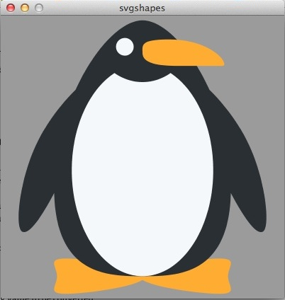

# Spaß mit (SVG-) Shapes: Pinguine im Eismeer

Neben Bildern kann Processing (und damit auch Processing.py) auch SVG-Dateien laden und darstellen. Wie alle anderen Assets auch, müssen diese sich im `data`-Verzeichnis des Sketches befinden, damit Processing sie auch finden kann. Doch woher soll solch ein absoluter Kunstbanause wie ich SVG-Dateien finden, wenn er sie nicht stehlen will? Hier haben mir wieder die [Twemojis](https://github.com/twitter/twemoji) geholfen, der vollständige Emoji-Bilder-Satz von Twitter, der nicht nur in diversen Auflösungen, sondern auch als SVG-Dateien unter der unter der [CC-BY-4.0 Lizenz](https://creativecommons.org/licenses/by/4.0/) zur Verfügung steht und frei verwendet werden kann. Eines dieser Emojis ist ein Pinguin und mit dem werde ich nun ein wenig herumspielen.

SVG-Dateien sind Vektorgraphiken und sie können verlustlos vergrößert und verkleinert werden. Das möchte ich im ersten Sketch vorführen:

~~~python
def setup():
    global penguin
    size(400, 400)
    penguin = loadShape("1f427.svg")
    shapeMode(CENTER)

def draw():
    background(155)
    shape(penguin, width/2, height/2,
          map(mouseX, 0, width, 0, 800),
          map(mouseX, 0, width, 0, 800))
~~~

Die Größe des Pinguins ist nun von der Mauskoordinate-x abhängig und variiert von winzig klein bis riesengroß. Zu beachten ist, daß auch ein SVG-Shape diverse `shapeModes()` besitzen kann, der Default ist `CORNER`, bei dem die linke obere Ecke der Ankerpunkt ist, aber es gibt, wie bei anderen Shapes auch, die Modes `CENTER` und `CORNERS`.

Ein SVG-Shape wird mit `loadShape("dateiname.svg")` geladen und mit

~~~python
shape(dateihandle, x, y)
~~~

oder

~~~python
shape(dateihandle, x, y, w, h)
~~~

in das Sketch-Fenster gezeichnet. Im ersten Fall wird das SVG-Shape an den Punkten `x, y` in der Originalgröße gezeichnet, im zweiten Fall wird das SVG-Shape mit den Paramtern für die Weite und Höhe verkleinert oder vergrößert dargestellt.

Wenn Ihr diesen Sketch laufen lasst, seht Ihr, daß die Verkleinerung oder Vergrößerung tatsächlich absolut verlustfrei erfolgt.

## Und nun das Eismeer

Wenn man den obige Sketch ein wenig erweitert, kann man etwas mehr Aktion in die Angelegenheit bringen. Ich habe dazu drei Pinguine in ein Eismeer gestellt, die, je nach Interpretation, ein wenig die Gegend erkunden oder sich einfach nur die Füße vertreten.

~~~python
easing = 0.05
offset = 0

def setup():
    global penguin, landscape
    size(640, 400)
    penguin = loadShape("1f427.svg")
    landscape = loadImage("eismeer.jpg")
    

def draw():
    global offset
    background(landscape)
    
    targetOffset = map(mouseX, 0, width, -100, 100)
    offset += (targetOffset - offset)*easing
    smallerOffset = offset*0.7
    smallestOffset = smallerOffset * -0.5
    shape(penguin, 60 + offset, 160, 160, 160)
    shape(penguin, 260 + smallerOffset, 130, 80, 80)
    shape(penguin, 520 + smallestOffset, 220, 120, 120)
~~~

Es passiert eigentlich immer noch nicht viel, aber wenn man etwas mehr Aktion wünscht, dann kommt man wohl nicht darum herum, eine Pinguin-Klasse anzulegen und die einzelnen Pinguin-Objekte in einer Liste zu verwalten, so wie ich es zum Beispiel im letzten Tutorial mit den Ballons gemacht hatte.

## Wartet, da ist noch mehr

Die Funktion `shape()` kann nicht nur SVG-Dateien darstellen, sondern auch dreidimensionale OBJ-Dateien. Dafür muß natürlich der Sketch im `P3D`-Mode laufen.

## Credits

Das Hintergrundbild des zweiten Sketches ist ein Gemälde des deutschen, romantischen Malers [Caspar David Friedrich](https://de.wikipedia.org/wiki/Caspar_David_Friedrich). Dieser ist 1840 gestorben, also hinreichend lange tot, so daß das Bild gemeinfrei ist und ohne Lizenzkosten verwendet werden kann.