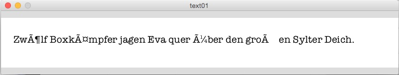
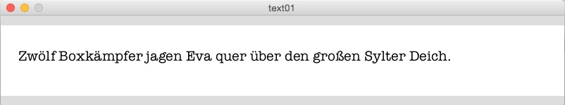
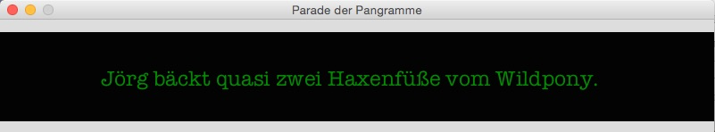
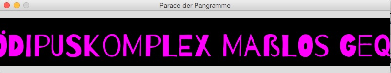

# Text(verarbeitung) in Processing.py

Mit `print()` oder `println()` kann man in Processing.py jede Ausgabe in das Konsolenfenster bringen, aber was ist, wenn der Text im Graphikfenster ausgegeben werden soll? Ich gehe erst einmal ganz naiv daran:

~~~python
font = None
tt = "Zwölf Boxkämpfer jagen Eva quer über den großen Sylter Deich."

def setup():
    size(800, 100)
    font = createFont("American Typewriter", 20)
    textFont(font)

def draw():
    background(255)
    fill(0)
    text(tt, 25, 50)
~~~

In der ersten Zeile teile ich Processing.py mit, daß ich die Variable `font` verwenden will und belege sie erst einmal mit dem Wert `none`. Das erspart mir ein oder sogar zwei Global-Statements. Die Stringvariable `tt` bekommt meinen Text zugewiesen. In `setup()` mache ich ein langes, schamles Fenster auf (mein Text ist ja ziemlich lang) und dann teile ich mit `createFont()` Processing.py mit, daß ich den Font *American Typewriter* in der Größe von 20 Pixeln verwenden will und weise ihn der Variablen `font` zu. Zu guter Letzt lege ich noch fest, daß eben mein textFont `font` ist.

In `draw()` lege ich einen weißen Hintergrund und eine schwarze Füllfarbe fest und lasse dann mit der Funktion `text()` den Text in das Fenster zeichnen. `text()` besitzt drei Parameter, zuerst den zu schreibenden (oder besser: zeichnenden) Text, dann die x- und die y-Koordinate des Textbeginns.

Das sieht eigentlich alles ganz einfach aus, aber wenn Ihr den Sketch ausführen lasst, erlebt Ihr Euer blaues Wunder:

So verstümmelt habt Ihr Euch das sicher nicht vorgestellt. Die Ursache ist einfach und ärgerlich. Das Processing.py zugrundeliegende Python ist ein Jython (also die Java-Version von Python) und entspricht der Python-Version 2.7. Diese ist leider nicht *out of the box* UTF-8 fähig, ein Umstand, der in der (meist englischsprachigen) Literatur geflissentlich verschwiegen wird[^1]. Dabei ist er so leicht zu beheben. Ein vor einem String vorangestelltes `u` teilt Python 2.7 mit, daß dieser String ein UTF-8-String ist. Im Sketch ist also lediglich die Zeile

~~~python
tt = "Zwölf Boxkämpfer jagen Eva quer über den großen Sylter Deich."
~~~

in

~~~python
tt = u"Zwölf Boxkämpfer jagen Eva quer über den großen Sylter Deich."
~~~

und schon wird der Text wie gewünscht ausgegeben:

Es gibt eine weitere, kleine Ungereimtheit im Umgang mit UTF-8 in Processing.py Im Haupt-Tab, in dem das ausführbare Programm steht (das ist der Tab, der die Endung `.pyde` bekommt), kann man -- wie gezeigt -- ohne große Probleme im Programmtext Umlaute unterbringen, während der Code in den anderen Tabs (die unter `.py` gespeichert werden) strenger mit dem Programmierer umgeht: Wenn nicht in der ersten Zeile

~~~python
# coding=utf-8
~~~

steht, meckert die IDE gnadenlos, selbst wenn Umlaute nur in den Kommentaren vorkommen.

[^1]: Ich weiß nicht, ob je und wann Jython den Sprung auf Python 3 wagt. Dort ist jedenfalls von Hause aus (per Default) jeder String ein UTF-8-String, in meinen Augen ein wichtiger, aber auch der einzige Grund, auf Python 3 umzusteigen.

!!! tip "Pangramm"
	Der Text mit den zwölf Boxern ist übrigens ein [Pangramm](https://de.wikipedia.org/wiki/Pangramm), ein Satz, der alle Buchstaben des (in diesem Falle deutschen) Alphabets enthält. Früher wurden sie benutzt, um zum Beispiel Schreibmaschinen nach einer Reparatur zu testen. Heute nutze ich ihn, um festzustellen, ob ein Font auch alle Umlaute des deutschen Alphabets enthält. Das bekannteste englische Pangramm ist der Satz »The quick brown fox jumps over the lazy dog«.

## Als die Pangramme laufen lernten

Während in der Funktion `text()` die y-Koordinate immer die Grundlinie des Textes ist, kann man mit `textAlign()` festlegen, ob die x-Koordinate die rechte Kante (`RIGHT`), die linke Kante (`LEFT`) oder die Mitte (`CENTER`) des Textes betrifft. Das möchte ich ausnutzen, um eine Parade der Pangramme zu programmieren. Als erstes lege ich eine Liste mit Pangrammen an (der oben verlinkte Wikipedia-Artikel ist voll von ihnen). Und damit es auch ein wenig bunt wird, habe ich eine gleichlange Liste mit Farben zusammengestellt. Im Endeffekt soll das dann so aussehen:

Der Sketch selber ist dadurch ein wenig länger geworden, aber das betrifft in der Hauptsache nur die beiden Listen:

~~~python
font = None
pangramme = [u"Zwölf Boxkämpfer jagen Eva quer über den großen Sylter Deich.",
             u"Jörg bäckt quasi zwei Haxenfüße vom Wildpony.",
             u"Falsches Üben von Xylophonmusik quält jeden größeren Zwerg.",
             u"Schweißgequält zündet Typograph Jakob verflixt öde Pangramme an.",
             u"Vom Ödipuskomplex maßlos gequält, übt Wilfried zyklisches Jodeln.",
             u"Asynchrone Bassklänge vom Jazzquintett sind nix für spießige Löwen."]
             
colors = ["#cd0000", "#008b00", "#ffff00", "#a52a2a", "#ff00ff", "#00ffff"]

def setup():
    global x, index
    frame.setTitle("Parade der Pangramme")
    size(800, 100)
    font = createFont("American Typewriter", 24)
    textFont(font)
    x = width
    index = 0

def draw():
    global x, index
    background(0)
    fill(colors[index])
    textAlign(LEFT)
    text(pangramme[index], x, 60)
    x -= 3
    w = textWidth(pangramme[index])
    if (x < -w):
        x = width
        index = (index+1) % len(pangramme)
~~~

Mit `textAlign(LEFT)` und `x = width` habe ich festgelegt, daß der Text im ersten Schritt am rechten Fensterrand beginnt und quasi ins Leere geschrieben wird. Bei jedem Durchlauf wird `x` umd drei dekrementiert und so beginnt das erste Pangramm von rechts nach links durch das Fenster zu scrollen. Ist der Text aus dem sichtbaren Bereich des Fenster verschwunden (`x < -w`), dann wird `index` um einen erhöht und das nächste Pangramm beginnt seine Parade. Damit der Index nicht irgendwann überläuft wird er Modulo der Länge der Liste der Pangramme berechnet. Und da ich in weiser Voraussicht die Länge der Farbliste gleich der Länge der Liste der Pangramme entworfen habe, passiert auch bei den Farben nichts.

## Font, Font, Font

Jetzt bleibt nur noch eins zu tun. Auf meinem Rechner läuft der Sketch ohne Probleme, da ich weiß, daß auf meinen Rechner der Font *American Typewriter* vorhanden ist. Dies muß aber nicht auf jedem anderen Rechner der Fall sein (falls also bei Euch die Sketche nicht laufen, tauscht einfach *American Typewriter* mit einem anderen Font, der auf Eurem Rechner vorhanden ist, aus). Wenn ich die `.ttf`-Datei des Fonts in den `data`-Ordner des Sketches kopiere (das geht am einfachsten, wenn ich die Datei auf das Editor-Fenster der IDE schiebe), würde der Sketch -- wenn ich ihn weitergebe -- überall funktionieren. Aber *American Typewriter* unterliegt mit Sicherheit dem Urheberrecht und eine Weitergabe ist vermutlich verboten oder mit hohen Kosten verbunden.

Aber es gibt ja eine Menge freier Fonts im Web und die größte Quelle dieser freien Fonts ist [Google Fonts](https://fonts.google.com/). Dort habe ich mir den Font [Barrio](https://fonts.google.com/specimen/Barrio) heruntergeladen, der unter der [Open Font Licence](http://scripts.sil.org/cms/scripts/page.php?site_id=nrsi&id=OFL_web) zu nutzen ist.

Selbstverständlich habe ich mich vorher vergewissert, daß der Font auch die von mir gewünschten deutschen Umlaute enthält. Nachdem ich die Fontdatei dem Sketch hinzugefügt hatte, war eigentlich nur noch eine Zeile im Programm zu ändern:

~~~python
    font = createFont("Barrio-Regular.ttf", 64)
~~~

*Barrio* ist ein Display-Font, der nur ab einer gewissen Größe wirkt. Daher habe ich ihn auf `64` gesetzt und dann die y-Koordinate etwas weiter nach unten geschoben. Der vollständige und endgültige Sketch der Pangramm-Parade sieht daher nun so aus:

~~~python
font = None
pangramme = [u"Zwölf Boxkämpfer jagen Eva quer über den großen Sylter Deich.",
             u"Jörg bäckt quasi zwei Haxenfüße vom Wildpony.",
             u"Falsches Üben von Xylophonmusik quält jeden größeren Zwerg.",
             u"Schweißgequält zündet Typograph Jakob verflixt öde Pangramme an.",
             u"Vom Ödipuskomplex maßlos gequält, übt Wilfried zyklisches Jodeln.",
             u"Asynchrone Bassklänge vom Jazzquintett sind nix für spießige Löwen."]
             
colors = ["#cd0000", "#008b00", "#ffff00", "#a52a2a", "#ff00ff", "#00ffff"]

def setup():
    global x, index
    frame.setTitle("Parade der Pangramme")
    size(800, 100)
    font = createFont("Barrio-Regular.ttf", 64)
    textFont(font)
    x = width
    index = 0

def draw():
    global x, index
    background(0)
    fill(colors[index])
    textAlign(LEFT)
    text(pangramme[index], x, 80)
    x -= 3
    w = textWidth(pangramme[index])
    if (x < -w):
        x = width
        index = (index+1) % len(pangramme)
~~~

Wenn Ihr noch mehr über Strings, Text und Fonts in Processing.py wissen wollt, *Daniel Shiffman* hat dazu ein [nettes Tutorial](http://py.processing.org/tutorials/text/) verfaßt, daß auch mir bei meinen Erkundungen sehr geholfen hat.