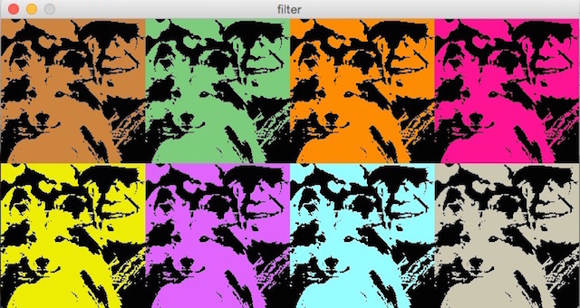

# Bildmanipulation mit Processing.py: Jeder sein kleiner Warhol

Processing und damit auch Processing.py besitzt ein ganzes Arsenal von Filtern zur Bildmanipulation. Davon möchte ich zu Beginn zwei heraussuchen und damit ein kleines Programm erstellen, dessen Ergebnis ein wenig an die berühmten Siebdrucke des Pop-Art-Künstlers [Andy Warhol](https://de.wikipedia.org/wiki/Andy_Warhol) erinnern soll.

Ich habe dazu ein Photo von unserem Sheltie Joey und mir genommen, das *Stefanie Radon* vor etwa vier Jahren von uns geschossen hatte, und das mein Facebook-Profil ziert und mit dem `filter(THRESHOLD, 0.55)` in eine reine schwarz-weiß-Zeichnung umgewandelt. `THRESHOLD` akzeptiert Parameter zwischen `0.0` und `1.0` -- je kleiner der Wert, desto weniger wird angezeigt. Nach einigen Experimenten habe ich mich dann auf `0.55` festgelegt, das brachte in meinen Augen das brauchbarste Ergebnis für dieses Photo.

In der `draw()`-Funktion habe ich dann das Bild acht mal hintereinander in zwei Reihen gezeichnet und mit dem filter `tint(color)` jeweils in einer anderen Farbe eingefärbt. Ich habe einige Zeit mit den Farben experimentieren müssen, bis ich das oben angezeigt Ergebnis bekam, mit dem ich nun zufrieden bin.

## Der Quellcode

Der Quellcode ist einfach und leicht zu verstehen. Im `setup()` habe ich das Bild geladen und in eine schwarz-weiß-Version umgewandelt, in `draw()` habe ich dann die acht unterschiedlich eingefärbten Versionen erstellt. Dabei habe ich eine Schleife über die Liste `palette[]` der von mir ausgewählten Farben laufen lassen:

~~~python
palette = [color(205, 133, 63), color(124, 205, 124),
           color(255, 140, 0), color(255, 20, 147),
           color(238, 238, 0), color(224, 102, 255),
           color(151, 255, 255), color(205, 200, 177)]

def setup():
    global jojo
    size(640, 320)
    jojo = loadImage("jojo.jpg")
    jojo.filter(THRESHOLD, 0.55)
    noLoop()

def draw():
    global jojo
    background(51)
    for i in range(len(palette)):
        if (i < 4):
            row = 0
            j = i
        else:
            row = 160
            j = i - 4
        tint(palette[i])
        image(jojo, j*160, row)
~~~

## Ressourcen

Natürlich könnt Ihr für Eure eigenen Experimente auch das Photo von [Joey und mir](https://www.flickr.com/photos/schockwellenreiter/7780799276/) nutzen -- es steht schließlich auf Flickr und im Fratzenbuch, aber es wäre sicher mehr im Sinne von Andy Warhol, wenn Ihr Euch Eure eigene Bilder (aus-) sucht, die Ihr einfärben und serialisieren wollt.
