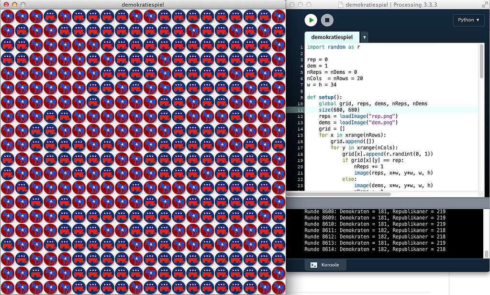

# Das Demokratie-Spiel

Spätestens seit der Wahl von Donald Trump zum Präsidenten der USA fragen sich ja einige, wie es dort mit der Demokratie bestellt sei. Dazu passend ein Spiel, das *Peter Donelly* vom *University College of Swansea* in Wales und *Domenic Welsh* von der *Oxford University* schon in den 80er Jahren des letzten Jahrhunderts untersucht hatten. Populär wurde es dann durch eine Veröffentlichung von *Alexander K. Dewdney* in der *Scientific American* und in der deutschen Schwesterzeitschrift *Spektrum der Wissenschaft*. Er nannte das Spiel »WAEHLER«:

In diesem Spiel werden die Felder eines rechteckigen Feldes (hier 20 x 20 Felder) zuerst wahllos mit den Symbolen der Republikaner (Elephant) oder der Demokraten (Esel) besetzt. Das widerspiegelt die politische Einstellung der »Einwohner« dieses »Planeten«. Bei jedem Spielzug wird nun ein Einwohner in seiner politischen Meinung schwankend und nimmt die Einstellung eines seiner zufällig herausgegriffenen Nachbarn an (falls er nicht sowieso schon dessen Meinung ist).

Als Nachbarschaft gilt hier die Moore-Nachbarschaft, also alle 8 Nachbarfelder. Die Randbedingungen sind periodisch, das heißt jeder Spieler auf einem Randfeld hat »Nachbarn« auf der gegenüberliegenden Seite, die Spieler in den Eckfeldern sogar auf beiden gegenüberliegenden Seiten. Unser Spielfeld nimmt daher die Form eines Reifens oder eines Torus an, wie zum Beispiel auch in der populären Simulation WATOR.

Nun passiert Folgendes: Aus der anfänglich wüsten Verteilung bilden sich im Laufe des Spiels feste Inseln einer Meinung heraus. Und im Endeffekt gewinnt eine Partei die alleinige Herrschaft. Das geschieht manchmal sehr schnell, manchmal dauert es länger, weil sich einige Inseln des Widerstands hartnäckig halten, aber das Endergebnis ist immer gleich: Der Planet wird entweder komplett von Eseln oder komplett von Elephanten regiert. Ob das der Sinn einer Demokratie ist?

Das Spiel ist verwandt mit dem Selektions-Spiel, das *Ruthild Winkler* und *Manfred Eigen* schon 1975 in ihrem Buch »Das Spiel« vorgestellt hatten. Auch wenn die Regeln leicht abgewandelt sind, das Ergebnis ist stets das gleiche. Es überlebt immer nur eine Partei. Das ändert sich übrigens auch nicht, wenn man das Feld mit mehr als zwei Parteien beim Start füllt. Also ist nicht das amerikanische Wahlsystem die alleinige Ursache des Übels.

## Der Code

Der Processing.py-Code ist *straight forward*. Lediglich die Behandlung der Randbedingungen ist allgemeiner gehalten, als unbedingt nötig. Damit sind bei Abwandlungen auch andere Nachbarschaften als die Moore-Umgebung möglich. Er folgt einem [Processing- (Java-) Code](http://cognitiones.kantel-chaos-team.de/programmierung/creativecoding/processing/demokratiespiel.html), den ich vor Jahren schon einmal programmiert hatte.

~~~python
import random as r

rep = 0
dem = 1
nReps = nDems = 0
nCols  = nRows = 20
w = h = 34

def setup():
    global grid, reps, dems, nReps, nDems
    size(680, 680)
    reps = loadImage("rep.png")
    dems = loadImage("dem.png")
    grid = []
    for x in xrange(nRows):
        grid.append([])
        for y in xrange(nCols):
            grid[x].append(r.randint(0, 1))
            if grid[x][y] == rep:
                nReps += 1
                image(reps, x*w, y*w, w, h)
            else:
                image(dems, x*w, y*w, w, h)
                nDems += 1
    println("Start: Demokraten = " + str(nDems) + ", Republikaner = " + str(nReps))

def draw():
    global reps, dems, nReps, nDems
    actorX = r.randint(0, nRows - 1)
    actorY = r.randint(0, nCols - 1)
    selection = r.randint(0, 7)
    if selection == 0:
        neighboorX = actorX
        neighboorY = actorY - 1
    elif selection == 1:
        neighboorX = actorX + 1
        neighboorY = actorY - 1
    elif selection == 2:
        neighboorX = actorX + 1
        neighboorY = actorY
    elif selection == 3:
        neighboorX = actorX + 1
        neighboorY = actorY + 1
    elif selection == 4:
        neighboorX = actorX
        neighboorY = actorY + 1
    elif selection == 5:
        neighboorX = actorX - 1
        neighboorY = actorY + 1
    elif selection == 6:
        neighboorX = actorX - 1
        neighboorY = actorY
    elif selection == 7:
        neighboorX = actorX - 1
        neighboorY = actorY - 1
    else:
        println("Irgend etwas ist gewaltig schiefgelaufen!")
    
    # Prüfung der Ränder:
    if neighboorX < 0:
        neighboorX = nRows + neighboorX
    neighboorX = neighboorX % nRows
    if neighboorY < 0:
        neighboorY = nCols + neighboorY
    neighboorY = neighboorY % nCols
    
    # Neuzeichnen des Spielfelds:
    if grid[neighboorX][neighboorY] == dem:
        if grid[actorX][actorY] != dem:
            nDems += 1
            nReps -= 1
        grid[actorX][actorY] = dem
        image(dems, actorX*w, actorY*w, w, h)
    else:
        if grid[actorX][actorY] != rep:
            nReps += 1
            nDems -= 1
        grid[actorX][actorY] = rep
        image(reps, actorX*w, actorY*w, w, h)
    println("Runde " + str(frameCount) + ": Demokraten = " + str(nDems) + ", Republikaner = " + str(nReps))
    
    if nDems == 0:
        println("Die Republikaner haben nach " + str(frameCount) + u" Runden die Macht übernommen!")
        noLoop()
    if nReps == 0:
        println("Die Demokraten haben nach " + str(frameCount) + u" Runden die Macht übernommen!")
        noLoop()
~~~

Wer das Spiel selber nachprogrammieren möchte, hier gibt es auch noch die beiden Icons für die Republikaner (Elephant) und Demokraten (Esel):

 

## Caveat

Ungeduldige sollten ert einmal mit einem 10x10-Gitter beginnen (`size(340, 340)`). Dann hat man in der Regel spätestens nach 20.000 Runden ein Ergebnis. Oder es kann sehr schnell gehen: Ich hatte auf diesem kleinen Gitter auch schon nach unter 2.000 Runden die absolute Herrschaft einer Partei erreicht. Auf einem 20x20-Gitter wie hier kann es durchaus 200.000 Runden und mehr dauern, bis die Diktatur kommt. Aber auf so einem großen Spielfeld erkennt man natürlich die stabilen »Inseln gleicher Meinung« sehr viel besser.

Es gibt sicher einen Schwellwert, der -- wenn unterschritten -- kein Zurück zur Macht mehr erlaubt. Aber er ist sehr klein: Ich habe es schon erlebt, daß sich Populationen, die unter die 10-Prozent-Marke gerutscht waren, sich wieder berappelten und im Endeffekt die Macht ergriffen.

Das ist das erste aus einer Reihe von (geplanten) Processing.py-Programmen, die sich mit Simulationen auf einem Gitter (aka »zelluläre Automaten«) beschäftigen.

## Literatur

- A.K. Dewdney: *Wie man π erschießt. Fünf leichte Stücke für WHILE-Schleifen und Zufallsgenerator, oder: lebensechte Simulationen von Zombies, Wählern und Warteschlangen*, in: Immo Diener (Hg.): *[Computer-Kurzweil][amazon1]*, Heidelberg (Spektrum der Wissenschaft, Reihe: Verständliche Forschung) 1988

- Manfred Eigen, Ruthild Winkler: *[Das Spiel. Naturgesetze steuern den Zufall][amazon2]*, München (Piper), 1975 (unveränderte Taschenbuchausgabe 1985)

[amazon1]: https://www.amazon.de/gp/product/3922508502/ref=as_li_ss_tl?ie=UTF8&linkCode=ll1&tag=derschockwell-21&linkId=70d2a1ad2291abd09c8579f1b3652042
[amazon2]: https://www.amazon.de/gp/product/3492204104/ref=as_li_ss_tl?ie=UTF8&linkCode=ll1&tag=derschockwell-21&linkId=d8a0345a29710b35b7e75ebe8565574d