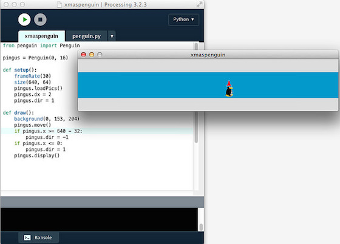

# Walking Pingus

Die älteren unter Euch können sich sicher noch an das Computerspiel [Lemminge][1] von 1991 erinnern, in dem man eine Horde kleiner, aber dummer Geschöpfe mit grünen Haaren und blauem Anzug, die immer stur geradeaus liefen, davon abhalten mußte, ins Verderben zu rennen und sie zum rettenden Ausgang führen. *Ingo Runke* hatte einen freien (GPL) Klon gebastelt, den er in Anspielung auf das Linus-Maskottchen *Tux* [Pingus][2] nannte und in dem man -- statt der Lemming -- kleine Pinguine retten mußte. Die Pinguine bewegten sich in jede Richtung mit 8 Bildern und da ich mal etwas anderes als zappelige Orks mit [Processing.py][7] auf den Bildschirm bringen wollte, habe ich mich mal an den Pinguinen versucht.

Nach den bisherigen Helden- und Orks-Tutorials ist es nur eine Fingerübung. Auf eine Oberklasse `Sprites` habe ich dieses Mal verzichtet, der Pingus muß ja nur mit den Fensterrändern kommunizieren. Wie schon bisher existieren neben der Initialisierung drei Methoden, nämlich `loadPics()`, `move()` und `display()`. Die ersten beiden Methoden sind eigentlich trivial und nur deswegen so umfangreich, weil sie jeweils mit 16 Bildchen umgehen müssen. Lediglich bei der `display()`-Methode muß man aufpassen und rückwärts zählen, da andersherum die Schleife nach dem ersten Male immer sofort verlassen wird:

~~~python
    def display(self):
        if frameCount % 32 >= 28:
            image(self.image1, self.x, self.y)
        elif frameCount % 32 >= 24:
            image(self.image2, self.x, self.y)
        elif frameCount % 32 >= 20:
            image(self.image3, self.x, self.y)
        elif frameCount % 32 >= 16:
            image(self.image4, self.x, self.y)
        elif frameCount % 32 >= 12:
                image(self.image5, self.x, self.y)
        elif frameCount % 32 >= 8:
            image(self.image6, self.x, self.y)
        elif frameCount % 32 >= 4:
            image(self.image7, self.x, self.y)
        else:
            image(self.image8, self.x, self.y)
~~~

Die einzelnen Bilder habe ich wieder mit [Tiled][3] aus dem Spritesheet ausgeschnitten. Dabei ist zu beachten, daß die einzelnen Pinguine eine Tilegröße von 32x44 Pixeln besitzen.

## Der Quellcode

Wie gesagt, es ist nur eine kleine Fingerübung. Hier erst einmal das Modul `penguin.py`, das nur die Klasse `Penguin` enthält:

~~~python
class Penguin(object):
    
    def __init__(self, posX, posY):
        self.x = posX
        self.y = posY
        self.dir = 0
        self.dx = 0
        
    def loadPics(self):
        # nach rechts laufen
        self.pingrt1 = loadImage("pingrt1.png")
        self.pingrt2 = loadImage("pingrt2.png")
        self.pingrt3 = loadImage("pingrt3.png")
        self.pingrt4 = loadImage("pingrt4.png")
        self.pingrt5 = loadImage("pingrt5.png")
        self.pingrt6 = loadImage("pingrt6.png")
        self.pingrt7 = loadImage("pingrt7.png")
        self.pingrt8 = loadImage("pingrt8.png")
        # nach links laufen
        self.pinglft1 = loadImage("pinglft1.png")
        self.pinglft2 = loadImage("pinglft2.png")
        self.pinglft3 = loadImage("pinglft3.png")
        self.pinglft4 = loadImage("pinglft4.png")
        self.pinglft5 = loadImage("pinglft5.png")
        self.pinglft6 = loadImage("pinglft6.png")
        self.pinglft7 = loadImage("pinglft7.png")
        self.pinglft8 = loadImage("pinglft8.png")
        
    def move(self):
        if self.dir == 1:
            self.x += self.dx
            self.image1 = self.pingrt1
            self.image2 = self.pingrt2
            self.image3 = self.pingrt3
            self.image4 = self.pingrt4
            self.image5 = self.pingrt5
            self.image6 = self.pingrt6
            self.image7 = self.pingrt7
            self.image8 = self.pingrt8
        elif self.dir == -1:
            self.x -= self.dx
            self.image1 = self.pinglft1
            self.image2 = self.pinglft2
            self.image3 = self.pinglft3
            self.image4 = self.pinglft4
            self.image5 = self.pinglft5
            self.image6 = self.pinglft6
            self.image7 = self.pinglft7
            self.image8 = self.pinglft8
        
    def display(self):
        if frameCount % 32 >= 28:
            image(self.image1, self.x, self.y)
        elif frameCount % 32 >= 24:
            image(self.image2, self.x, self.y)
        elif frameCount % 32 >= 20:
            image(self.image3, self.x, self.y)
        elif frameCount % 32 >= 16:
            image(self.image4, self.x, self.y)
        elif frameCount % 32 >= 12:
                image(self.image5, self.x, self.y)
        elif frameCount % 32 >= 8:
            image(self.image6, self.x, self.y)
        elif frameCount % 32 >= 4:
            image(self.image7, self.x, self.y)
        else:
            image(self.image8, self.x, self.y)
~~~

Das Hauptprogramm ist extrem kurz, aber der Pinguin watschelt ja auch nur von links nach rechts und wieder zurück:

~~~python
from penguin import Penguin

pingus = Penguin(0, 16)

def setup():
    frameRate(30)
    size(640, 64)
    pingus.loadPics()
    pingus.dx = 1
    pingus.dir = 1

def draw():
    background(0, 153, 204)
    pingus.move()
    if pingus.x >= 640 - 32:
        pingus.dir = -1
    if pingus.x <= 0:
        pingus.dir = 1
    pingus.display()
~~~

Im Gegensatz zu den Orks aus den vorherigen Programmen bewegt sich Pingus mit jedem Frame nur einen Pixel weiter. Denn durch die vielen Bilder ist die Bewegung doch so exakt, daß es bei schnellerem Vorangehen aussieht, als ob Pingus auf Eis schlittert (bei Pinguinen sicher nicht unüblich, aber in diesem Fall nicht gewollt). Es ist eben kein *Running Ork* sondern nur ein *Walking Pingus*.

Wenn Ihr das nachprogrammiert und laufen laßt, werdet Ihr sehen, daß das schon sehr nett aussieht, besonders auch wie die Zipfelmütze des kleinen Pinguins im Takt hin und her wippt.

## Pingus Links

Wenn Ihr Pingus spielen wollt, das Spiel gibt es trotz seines Alters immer noch [hier für Windows, Mac und Linux zum freien Download][4]. Auf meinen Macs läuft es auch noch, macht Spaß und die [Quellen könnt Ihr auf GitHub][5] finden.

[1]: https://de.wikipedia.org/wiki/Lemmings
[2]: https://de.wikipedia.org/wiki/Pingus
[3]: http://cognitiones.kantel-chaos-team.de/multimedia/spieleprogrammierung/tiled.html
[4]: https://pingus.seul.org/download.html
[5]: https://github.com/Pingus/pingus
[6]: http://py.kantel-chaos-team.de/
