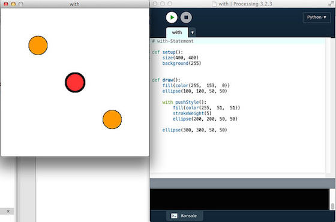

# Syntaktischer Zucker: »with« in Processing.py

Wenn man in Processing.py irgendetwas zum Beispiel zwischen `beginShape()` und `endShape()` klammert, fühlt sich das nicht sehr »pythonisch« an. Ich denke dann die ganze Zeit: Das gehört doch eingerückt! In Processings Java-Mode kann man das auch machen, weil man in Java Leerzeichen einsetzen kann, wie man will -- sie haben dort keine Bedeutung. Doch Python reagiert ja sehr sensibel auf Einrückungen, da hier Leerzeichen Teil der Syntax sind. Aber die Macher von Processing.py haben dies bedacht und uns einen Ausweg aus diesem Dilemma geboten: Das `with`-Statement.

In seiner einfachsten Form sieht das so aus. Statt zum Beispiel

~~~python
def setup():
    size(400, 400)
    background(255)

def draw():
    fill(color(255,  153,  0))
    strokeWeight(1)
    ellipse(100, 100, 50, 50)
    fill(color(255,  51,  51))
    strokeWeight(5)
    ellipse(200, 200, 50, 50)
    fill(color(255,  153,  0))
    strokeWeight(1)
    ellipse(300, 300, 50, 50)
~~~

zu schreiben, schreibt man einfach:

~~~python
def setup():
    size(400, 400)
    background(255)
    

def draw():
    fill(color(255,  153,  0))
    ellipse(100, 100, 50, 50)
    
    with pushStyle():
        fill(color(255,  51,  51))
        strokeWeight(5)
        ellipse(200, 200, 50, 50)
    ellipse(300, 300, 50, 50)
~~~

Die Ausgabe ist in beiden Fällen identisch, aber der zweite Sketch ist in meinen Augen bedeutend eleganter und fühlt sich viel pythonischer an. Außerdem erspart man sich viel Tipparbeit. 😜

Da ich die Verwendung des `with`-Statements auch erst durch eines der mitgelieferten Beispielprogramme herausbekommen habe, hier eine (hoffentlich) komplette Liste der Möglichkeiten:

~~~python
    with pushMatrix():          pushMatrix()
        translate(10, 10)       translate(10, 10)
        rotate(PI/3)            rotate(PI/3)
        rect(0, 0, 10, 10)      rect(0, 0, 10, 10)
    rect(0, 0, 10, 10)          popMatrix()
                                rect(0, 0, 10, 10)

with beginContour():             beginContour()
    doSomething()                doSomething()
                                 endContour()

with beginCamera():              beginCamera()
    doSomething()                doSomething()
                                 endCamera()

with beginPGL():                 beginPGL()
    doSomething()                doSomething()
                                 endPGL()

with beginShape():               beginShape()
    vertex(x, y)                 vertex(x, y)
    vertex(j, k)                 vertex(j,k)
                                 endShape()
    
    
with beginShape(TRIANGLES):      beginShape(TRIANGLES)
    vertex(x, y)                 vertex(x, y)
    vertex(j, k)                 vertex(x, y)
                                 endShape()

with beginClosedShape():         beginShape()
    vertex(x, y)                 vertex(x, y)
    vertex(j, k)                 vertex(j, k)
                                 endShape(CLOSED)
~~~

Links steht die Schreibweise mit dem `with()-Statement`, rechts die traditionelle Form. Abgesehen davon, daß die `with`-Schreibweise immer mindestens eine Zeile kürzer ist, sorgt sie durch die Einrückungen auch für eine bessere Übersicht und eine bessere Lesbarkeit.

