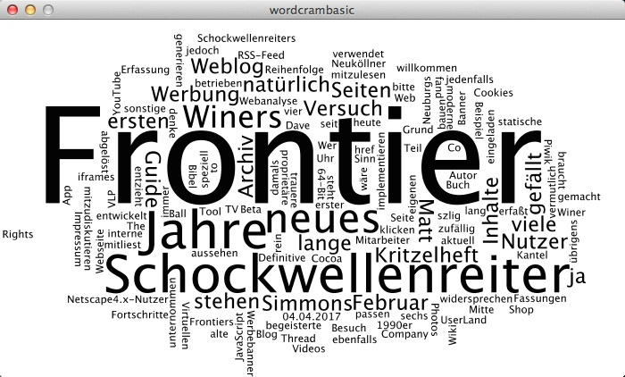
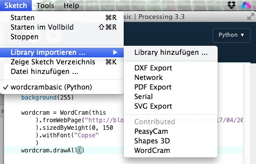

# WordCram: Processing.py und eine Processing (Java) Bibliothek

Wie man eine Python-Bibliothek in Processing.py nutzt, [hatte ich ja schon gezeigt](weather.md). Das geht so einfach, wie man es auch von »normalen« Python-Programmen gewohnt ist -- solange die Pakete *pure Python* sind. Doch wie sieht es aus, wenn man eine Bibliothek nutzen will, die für den Java-Mode von Processing in Java geschrieben wurde? Um dies zu testen, hatte ich mir die Bibliothek [WordCram](http://wordcram.org/), die die beliebten Wortwolken *(Word Clouds)* erzeugt, ausgesucht und heruntergeladen. Bevor man damit irgendetwas anstellen kann, muß man die Bibliothek entpacken und in den `libraries`-Ordner im Processing-Verzeichnis ablegen. Falls Ihr nicht mehr wißt, wo Euer Processing-Verzeichnis liegt, findet Ihr es im Processing-Menü unter `Einstellungen -> Sketchbook Pfad`.

Da ich von mehreren Rechnern an mehreren Standorten meine Processing.py-Sketche bearbeite, liegt dieser Ordner bei mir in der Dropbox. Das ist nicht unbedingt immer eine gute Idee, manche Libraries bestehen aus Tausenden von Dateien und da kann das Synchronisieren schon mal eine gewisse Zeit in Anspruch nehmen.

Wenn Ihr dies erledigt habt, findet die Processing-IDE unter `Sketch -> Library importieren` die Bibliothek und sie kann mit einem Klick in Euren Sketch eingefügt werden:

~~~python
add_library('WordCram')
~~~

Natürlich könnt Ihr diese Zeile auch einfach selber eintippen.

Um das Teil zu testen, habe ich diesen kleinen Sketch geschrieben:

~~~python
add_library('WordCram')

def setup():
    size(700, 400)
    background(255)
    
    wordcram = WordCram(this
        ).fromWebPage("http://blog.schockwellenreiter.de/2017/04/2017040404.html"
        ).sizedByWeight(0, 150
        ).withFont("Copse"
        )
    wordcram.drawAll()
~~~

Der ruft [diese Seite](http://blog.schockwellenreiter.de/2017/04/2017040404.html) auf und stellt ihren Inhalt -- wie obiger Screenshot zeigt -- als Wortwolke dar.

Zwei Dinge sind noch zu beachten: Erstens verlangen viele Processing (Java) Bibliotheken eine Referenz auf das aktuelle PApplet-Objekt -- so auch WordCram. Im Java-Mode für Processing wird dafür das eingebaute `this`-Keyword verwendet. Python allerdings kennt kein `this`-Schlüsselwort, aber Processing.py stellt automatisch eine globale Variable namens `this` zur Verfügung, die für diese Zwecke verwendet werden kann.

Zweitens kann man in Python wegen der besonderen Bedeutung der Einrückung nicht so, wie es in Java üblich ist, die fortlaufende Punkt-Notierung an dem Punkt umbrechen, wenn Ihr es so versucht

~~~python
    wordcram = WordCram(this)
        .fromWebPage("http://blog.schockwellenreiter.de/2017/04/2017040404.html")
        .sizedByWeight(0, 150)
        .withFont("Copse")
~~~

bekommt Ihr eine Fehlermeldung. Ich habe daher überall die schließende Klammer aus der darüberliegenden Zeile weggenommen und vor den Punkt gestellt. Das ist nicht wirklich eine schöne Lösung, funktioniert aber und hält den Code einigermaßen leserlich. Vielleicht fällt mir dafür noch eine schönere Lösung ein.

Die WordCram-Bibliothek ist ziemlich mächtig, aber leider nicht besonders gut dokumentiert. Sie erkennt zum Beispiel selbstständig, daß mein Text auf Deutsch geschrieben ist und ist auch UTF-8-fest. Zudem scheint sie für viele Sprachen schon eine eingebaute Liste von Stopwörtern mitzubringen. Und man kann auch irgendwie die Wörter der Cloud einfärben, aber das ist nicht sehr intuitiv und die bisher erzielten Ergebnisse hatten mir nicht gefallen, so daß ich es bei der schwarz-weiß-Darstellung belassen habe. *Still digging!*
